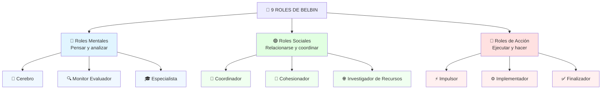

# 🟪 Test de Belbin — Roles de Equipo

## 🎯 Introducción

> [!info]- 💡 ¿Qué es el Test de Belbin?
>
> El **Test de Roles de Equipo Belbin** es una herramienta científica desarrollada por el Dr. **Meredith Belbin** en los años 70-80, tras una investigación de casi una década en el Henley Management College (Inglaterra). Su objetivo es identificar cómo contribuye cada persona dentro de un equipo de trabajo.
>
> **Analogía práctica:** Un equipo es como un rompecabezas — no importa qué tan buenas sean las piezas individualmente, si todas tienen la misma forma, el rompecabezas no encaja. Belbin identificó las 9 "formas de pieza" que necesita todo equipo para funcionar bien.
>
> | Aspecto | Detalle |
> |---|---|
> | **Creador** | Dr. Meredith Belbin (1926–) |
> | **Origen** | Henley Management College, Inglaterra, años 70 |
> | **Base** | Investigación con simulaciones de negocios durante ~10 años |
> | **Informes generados** | Más de 3 millones en todo el mundo |
> | **Duración del test** | ~20–30 minutos |
> | **Número de roles** | 9 roles agrupados en 3 categorías |
>
> **Importante:** Los roles de Belbin **no son tipos de personalidad fijos**. Son *comportamientos observables* que una persona tiende a mostrar en equipo. Una misma persona puede tener 2 o 3 roles predominantes y puede aprender otros con el tiempo.

---

## 🗂️ Las 3 Categorías de Roles



---

## 🔵 Roles Mentales

> [!note]- 🧠 Cerebro *(Plant)*
>
> **¿Quién es?** El gran generador de ideas del equipo. Creativo, imaginativo e independiente. Prefiere trabajar solo y resuelve problemas complejos de formas originales e inesperadas.
>
> | | |
> |---|---|
> | **Palabras clave** | Creativo · Imaginativo · Original · Independiente |
> | **Fortalezas** | Genera ideas nuevas, resuelve problemas difíciles, pensamiento innovador |
> | **Debilidades** | Descuida los detalles prácticos, tiende a imponer sus ideas, difícil de comunicar |
> | **Trabaja mejor** | En las fases iniciales del proyecto, cuando se necesitan ideas frescas |
> | **Riesgo** | Si hay dos Cerebros en el equipo, pueden entrar en conflicto de ideas |
>
> ```
> Ejemplo real: El inventor del equipo, el que aparece en una reunión
> con una solución completamente inesperada al problema.
> ```

> [!note]- 🔍 Monitor Evaluador *(Monitor Evaluator)*
>
> **¿Quién es?** El analista crítico del equipo. Evalúa opciones con objetividad, detecta fallos en los planes y sopesa los pros y contras antes de tomar decisiones.
>
> | | |
> |---|---|
> | **Palabras clave** | Analítico · Objetivo · Prudente · Crítico |
> | **Fortalezas** | Buen juicio, ve todas las opciones, no se deja llevar por el entusiasmo |
> | **Debilidades** | Falta de energía e inspiración, puede percibirse como hipercrítico o frío |
> | **Trabaja mejor** | Cuando hay que tomar decisiones importantes o evaluar propuestas |
> | **Riesgo** | Puede ralentizar al equipo con análisis excesivo *(parálisis por análisis)* |
>
> ```
> Ejemplo real: El que en una reunión dice "espera, ¿consideramos
> este riesgo?" antes de que el equipo se lance sin pensar.
> ```

> [!note]- 🎓 Especialista *(Specialist)*
>
> **¿Quién es?** El experto técnico del equipo. Aporta conocimientos profundos en un área específica. Muy dedicado a su campo, aunque su visión puede ser estrecha.
>
> | | |
> |---|---|
> | **Palabras clave** | Experto · Dedicado · Enfocado · Autónomo |
> | **Fortalezas** | Conocimiento técnico profundo, aporta datos y expertise que otros no tienen |
> | **Debilidades** | Solo contribuye en su área específica, puede perderse en detalles técnicos |
> | **Trabaja mejor** | Cuando el proyecto requiere conocimiento técnico especializado |
> | **Riesgo** | Puede desconectarse del equipo si el tema no es de su área |
>
> ```
> Ejemplo real: El desarrollador que sabe exactamente cómo
> implementar algo técnicamente, pero no le interesa el marketing.
> ```

---

## 🟢 Roles Sociales

> [!note]- 🎯 Coordinador *(Coordinator)*
>
> **¿Quién es?** El líder natural del equipo. Maduro, tranquilo y seguro de sí mismo. Su habilidad principal es identificar el talento de cada miembro y asignar tareas de forma que todos contribuyan con sus fortalezas.
>
> | | |
> |---|---|
> | **Palabras clave** | Maduro · Confiado · Delegador · Integrador |
> | **Fortalezas** | Clarifica objetivos, fomenta la participación, mantiene el enfoque en la meta |
> | **Debilidades** | No necesariamente el más inteligente o creativo; puede percibirse como manipulador |
> | **Trabaja mejor** | Liderando equipos diversos donde cada miembro tiene fortalezas diferentes |
> | **Riesgo** | Puede depender demasiado de otros si no actúa directamente |
>
> ```
> Ejemplo real: El que al inicio de un proyecto dice "tú haces esto,
> tú aquello, yo coordino" y logra que todos trabajen juntos.
> ```

> [!note]- 🤝 Cohesionador *(Teamworker)*
>
> **¿Quién es?** El corazón del equipo. Suave, diplomático y sensible. Su función es mantener la armonía, resolver conflictos interpersonales y asegurarse de que nadie se sienta excluido.
>
> | | |
> |---|---|
> | **Palabras clave** | Diplomático · Empático · Flexible · Conciliador |
> | **Fortalezas** | Construye buen ambiente, escucha bien, promueve el espíritu de equipo |
> | **Debilidades** | Indecisión en momentos de tensión, puede evitar tomar postura para no generar conflicto |
> | **Trabaja mejor** | Cuando hay tensiones interpersonales o el equipo necesita motivación |
> | **Riesgo** | En situaciones de crisis puede no dar la dirección firme que se necesita |
>
> ```
> Ejemplo real: El que después de una discusión difícil habla
> con ambas partes y logra que el equipo siga funcionando.
> ```

> [!note]- 🌐 Investigador de Recursos *(Resource Investigator)*
>
> **¿Quién es?** El conector externo del equipo. Extrovertido, entusiasta y curioso. Busca oportunidades, contactos y recursos fuera del equipo, trayendo ideas y conexiones del exterior.
>
> | | |
> |---|---|
> | **Palabras clave** | Extrovertido · Curioso · Comunicativo · Networker |
> | **Fortalezas** | Desarrolla contactos externos, explora oportunidades, aporta energía y dinamismo |
> | **Debilidades** | Puede perder interés después de la fase inicial, optimista en exceso |
> | **Trabaja mejor** | En fases de búsqueda de recursos, alianzas o información externa |
> | **Riesgo** | Sin seguimiento puede dejar cosas a medias cuando aparece algo nuevo |
>
> ```
> Ejemplo real: El que conoce a alguien que puede ayudar con el
> proyecto y trae conexiones que nadie más tenía.
> ```

---

## 🔴 Roles de Acción

> [!note]- ⚡ Impulsor *(Shaper)*
>
> **¿Quién es?** El motor del equipo. Dinámico, desafiante y orientado a resultados. Empuja al grupo cuando se estanca y no tiene miedo de tomar decisiones difíciles.
>
> | | |
> |---|---|
> | **Palabras clave** | Dinámico · Desafiante · Proactivo · Presionador |
> | **Fortalezas** | Mantiene al equipo en movimiento, supera obstáculos, trabaja bien bajo presión |
> | **Debilidades** | Puede ser provocador, impaciente e impulsivo; genera tensión |
> | **Trabaja mejor** | Cuando el equipo está estancado o necesita urgencia para cumplir plazos |
> | **Riesgo** | Se recomienda no tener más de un Impulsor por equipo — pueden chocar |
>
> ```
> Ejemplo real: El que dice "dejemos de hablar y actuemos" cuando
> el equipo lleva horas en una reunión sin decidir nada.
> ```

> [!note]- ⚙️ Implementador *(Implementer)*
>
> **¿Quién es?** El ejecutor práctico del equipo. Disciplinado, sistemático y confiable. Convierte las ideas y planes en acciones concretas y organizadas.
>
> | | |
> |---|---|
> | **Palabras clave** | Disciplinado · Sistemático · Confiable · Práctico |
> | **Fortalezas** | Organiza eficientemente, convierte ideas en tareas concretas, muy eficiente |
> | **Debilidades** | Resistencia a ideas no probadas, puede ser inflexible ante cambios |
> | **Trabaja mejor** | En la ejecución y planificación operativa del proyecto |
> | **Riesgo** | Puede ralentizar la innovación por preferir métodos probados |
>
> ```
> Ejemplo real: El que toma el plan del Cerebro y dice "bien,
> esto lo hacemos en pasos: primero X, luego Y, luego Z."
> ```

> [!note]- ✅ Finalizador *(Completer Finisher)*
>
> **¿Quién es?** El perfeccionista del equipo. Concienzudo, detallista y puntual. Se asegura de que todo esté terminado correctamente, sin errores y dentro de los plazos.
>
> | | |
> |---|---|
> | **Palabras clave** | Perfeccionista · Detallista · Puntual · Riguroso |
> | **Fortalezas** | Alta calidad en los entregables, detecta errores, garantiza el cierre del proyecto |
> | **Debilidades** | Puede ser ansioso, resistente a delegar, tiende al perfeccionismo excesivo |
> | **Trabaja mejor** | En las fases finales del proyecto, revisión y entrega |
> | **Riesgo** | Puede retrasar la entrega buscando la perfección cuando "bueno" es suficiente |
>
> ```
> Ejemplo real: El que revisa el trabajo final tres veces antes
> de entregarlo y encuentra el error que todos pasaron por alto.
> ```

---

## 🗂️ Tabla Resumen — Los 9 Roles

| Rol | Categoría | Contribución principal | Fortaleza clave | Debilidad clave |
|---|---|---|---|---|
| 🧠 **Cerebro** | Mental | Genera ideas originales | Creatividad e innovación | Descuida lo práctico |
| 🔍 **Monitor Evaluador** | Mental | Analiza opciones objetivamente | Juicio crítico y objetivo | Puede ser frío y lento |
| 🎓 **Especialista** | Mental | Aporta conocimiento técnico | Expertise profundo | Visión muy estrecha |
| 🎯 **Coordinador** | Social | Lidera y delega según talentos | Integra al equipo | Puede no actuar directamente |
| 🤝 **Cohesionador** | Social | Mantiene la armonía del equipo | Empatía y diplomacia | Indeciso bajo presión |
| 🌐 **Investigador de Recursos** | Social | Conecta con el exterior | Red de contactos y energía | Pierde interés tras inicio |
| ⚡ **Impulsor** | Acción | Empuja al equipo hacia adelante | Dinamismo bajo presión | Provocador e impaciente |
| ⚙️ **Implementador** | Acción | Convierte ideas en planes | Organización y eficiencia | Rígido ante cambios |
| ✅ **Finalizador** | Acción | Asegura calidad y plazos | Perfeccionismo y detalle | Delegar le cuesta |

---

## 🌐 ¿Dónde hacer el test online?

> [!tip]- 🔗 Opciones para realizarlo
>
> **Opción oficial (de pago):**
> - 🌐 [belbin.com](https://www.belbin.com) — Test oficial con informe completo (~25€)
> - Incluye autopercepción + evaluación de observadores
>
> **Opciones gratuitas (aproximadas):**
>
> | Plataforma | Link | Idioma | Duración |
> |---|---|---|---|
> | Assessment Training | [assessment-training.com](https://www.assessment-training.com) | ES / EN | ~20 min |
> | 123test | [123test.es](https://www.123test.es) | ES | ~15 min |
> | Talent Q (adaptación) | Búscalo como "test Belbin gratuito" | ES | ~20 min |
>
> **Consejo:** Las versiones gratuitas son aproximaciones útiles para conocer tu perfil. Para un resultado más preciso, el test oficial incluye la evaluación de personas que te conocen (observadores).
>
> **Al hacer el test, anota:**
> - Tu rol principal (el de mayor puntuación)
> - Tu rol secundario (el segundo más alto)
> - Tu rol menos dominante (el más bajo)

---

## 📝 Mis Resultados

> [!example]- ✏️ Espacio para completar tras hacer el test
>
> *Completa esta sección después de realizar el test online.*
>
> **Fecha del test:** `Miercoles 13 de mayo 2026`
> **Plataforma usada:** `123test y excel personal`
>
> ---
>
> **Mis roles por puntuación:**
>
> | Posición | Rol | Puntuación | Categoría |
> |---|---|---|---|
> | 🥇 Principal | Implementador / Investigador | 20 pts | Acción / Social |
> | 🥈 Secundario | Finalizador | 10 pts | Accion |
> | 🥉 Terciario | Monitor-evaluador | 10 pts | Reflexión |
> | ... | Coordinador | 10 pts | Social |
> | Menos dominante | Impulsor / Cerebro / Cohesionador / Especialista | 0 | NA |
>
> ---
>
> **Mi rol principal es: `Implementador`**
>
> **¿Me identifico con este resultado?**
> Me identifico bastante con el Implementador: soy muy organizado, disciplinado y orientado a logros (Responsabilidad 96 en Big Five). El Investigador también encaja porque aunque no soy muy extrovertido socialmente, cuando tengo energía soy activo y positivo (Actividad 100, Emociones positivas 100). Me sorprendió no puntuar en Cerebro ni Impulsor, aunque tiene sentido porque prefiero ejecutar planes ya definidos antes que generar ideas radicales
>
> Fortalezas que reconozco en mí:
> - Alta disciplina y capacidad de organización
> - Muy orientado al logro y al cumplimiento de objetivos
> - Empático, altruista y buen compañero de equipo
> - Pensamiento planificado antes de actuar
> - Debilidades que debo trabajar:
> - Ansiedad social elevada (90) — me cuesta la exposición en grupo
> - Baja fantasía/creatividad — tiendo a lo práctico, menos innovador
> - Modestia baja — puedo parecer arrogante sin pretenderlo

---

## 🔗 Aplicación en Computación y Sociedad

> [!success]- 💻 ¿Por qué importa esto en la carrera?
>
> En el campo de la computación, los proyectos casi siempre son trabajo en equipo: equipos de desarrollo, grupos de investigación, startups tecnológicas. Conocer tu rol Belbin te ayuda a:
>
> | Situación | Cómo ayuda Belbin |
> |---|---|
> | **Proyectos en clase** | Asignar roles naturalmente según las fortalezas de cada integrante |
> | **Trabajo en empresa** | Identificar qué rol te falta al equipo antes de contratar |
> | **Conflictos de equipo** | Entender que el Impulsor y el Finalizador chocan por naturaleza, no por mala voluntad |
> | **Liderazgo** | Saber si eres mejor Coordinador (guiar) o Impulsor (ejecutar) |
>
> **Combinaciones comunes en equipos de tecnología:**
>
> ```
> Equipo de desarrollo de software ideal:
> ┌─────────────────────────────────────────────┐
> │  🧠 Cerebro        → arquitectura e ideas   │
> │  ⚙️ Implementador  → código y ejecución     │
> │  🔍 Monitor Eval.  → testing y revisión     │
> │  🎯 Coordinador    → gestión del proyecto   │
> │  ✅ Finalizador    → QA y entrega final     │
> └─────────────────────────────────────────────┘
> ```

---

## 📚 Referencias (Formato IEEE)

> [!quote]- 📖 Fuentes Consultadas
>
> [1] M. Belbin, *Management Teams: Why They Succeed or Fail*, 3rd ed. Oxford: Butterworth-Heinemann, 2010.
>
> [2] Belbin Associates, "Los nueve Roles de Equipo Belbin", *belbin.es*, 2024. [En línea]. Disponible en: https://www.belbin.es/acerca-de-belbin/roles-de-equipo-belbin
>
> [3] A. García, "Roles de equipo para conseguir el equilibrio: la teoría de Belbin", *TalentÁrea*, sept. 2024. [En línea]. Disponible en: https://talentarea.es/roles-de-equipo-equilibrado-teoria-de-belbin/
>
> [4] R. Martínez, "9 roles de Belbin y su importancia en la gestión de equipos", *Structuralia Blog*, dic. 2024. [En línea]. Disponible en: https://blog.structuralia.com/9-roles-de-belbin

---

**Tags:** #computacion #sociedad #belbin #roles-equipo #trabajo-en-equipo #personalidad #autoconocimiento
