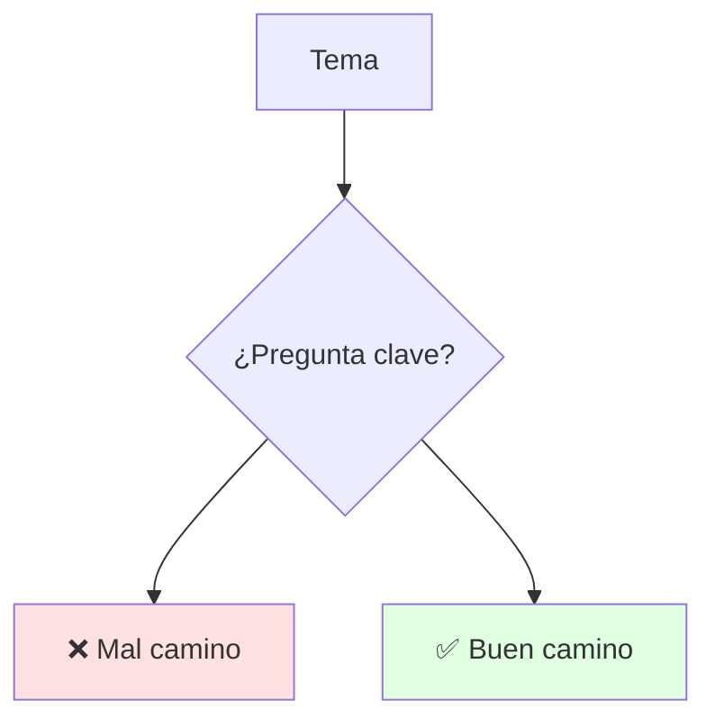
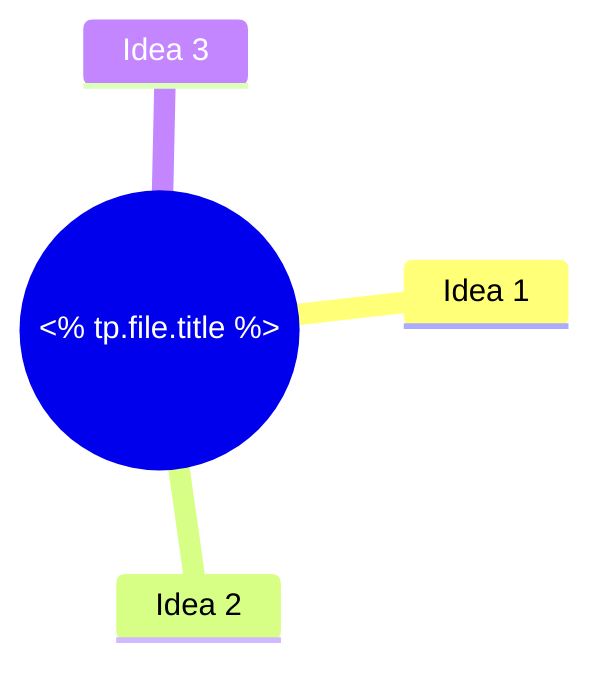

# <% tp.file.title %>

## 🎯 Introducción

> [!info] 💡 ¿Por Qué Importa?
>
> (Qué problema resuelve + dónde se evalúa/aplica. No adelantar definiciones.)
>
> **Analogía del mundo real:** (compara con algo cotidiano)
>
> | Sin Esto | Con Esto |
> |---|---|
> | (costo) | (beneficio) |
> | (costo) | (beneficio) |

---

## 📋 Definiciones Formales

> [!note] 📋 Definición 1 — (Nombre)
>
> (Enunciado preciso con notación. Numerar para poder citarla desde otras notas.)
>
> [!note] 📋 Definición 2 — (Nombre)
>
> (Enunciado preciso. Solo numerar en notas teóricas; en aplicadas basta 1-2.)

---

## 🧵 Desarrollo

### 🎭 (Subtema 1)

> [!note] 🎨 (Idea central)
>
> (Explicación + tabla si aplica.)
>
> | Aspecto | Detalle |
> |---|---|
> | (fila) | (valor) |

---

## 🛠️ Método / Procedimiento

> [!note] 📋 Procedimiento General
>
> 1. (Paso verificable)
> 2. (Paso verificable)
> 3. (Criterio de salida: ¿cómo sé que quedó bien?)
>
> **Principio clave:** (1 frase que resume el método.)

---

## 🎨 Ejemplos Trabajados

> [!example] 🟢 Ejemplo 1 — (Caso con datos concretos)
>
> | Paso | Acción |
> |---|---|
> | (paso) | (resultado) |
>
> (Demostración completa paso a paso SOLO si el curso la exige; si no, resultado + 1 ejemplo.)

---

## 📋 Tablas Comparativas

> [!note] 📋 (Nombre de la comparación)
>
> | Aspecto | Opción A | Opción B |
> |---|---|---|
> | (criterio) | (valor) | (valor) |

---

## ⚠️ Errores Comunes y Principios Lógicos

> [!warning] ⚠️ Errores Frecuentes
>
> - **(Nombre del error):** síntoma → solución en 1 línea.
> - **(Nombre del error):** síntoma → solución en 1 línea.

---

## 🎯 Metas de Aprendizaje

> [!note] 📋 Nivel Básico
>
> - [ ] (Puedo definir / identificar sin mirar.)
> - [ ] (Reconozco el concepto en un ejemplo.)

> [!note] 📋 Nivel Intermedio
>
> - [ ] (Aplico el método a un caso nuevo.)
> - [ ] (Comparo variantes y elijo bien.)

> [!note] 📋 Nivel Avanzado
>
> - [ ] (Justifico decisiones / detecto errores en casos ajenos.)

---

## 📊 Resumen Visual

> [!success] 🔍 Comparación Final
>
> | Aspecto | Sin Esto | Con Esto |
> |---|---|---|
> | (criterio) | ❌ | ✅ |

---

## 🚀 Próximos Pasos

> [!quote] 🌟 Continuando
>
> **Has aprendido:**
>
> ✅ (punto 1)
> ✅ (punto 2)
>
> **Próximo tema:**
>
> | Tema | Qué verás | Por qué importa |
> |---|---|---|
> | (siguiente) | (contenido) | (motivo) |

---

## 🔗 Seguir estudiando

> [!info] 📚 Seguir estudiando
>
> - Mapa de contenido: [[<% tp.system.prompt("Nota mapa de contenido") %>]]
> - Índice: [[<% tp.system.prompt("Nota índice de unidad") %>]]
> - Anterior: [[<% tp.system.prompt("Nota anterior (vacío si es la 1)") %>]]
> - Siguiente: [[<% tp.system.prompt("Nota siguiente (vacío si es la última)") %>]]
> - Syllabus: [[<% tp.system.prompt("Nota bienvenida/syllabus") %>]]
> - Base MOOC (si aplica): [[<% tp.system.prompt("Nota MOOC base (vacío si no aplica)") %>]]

## 📚 Referencias

> [!quote] 📖 Fuentes Consultadas
>
> - (Libro, cap. X §Y / diapositiva docente / URL verificada — citar exacto, no de memoria)

---

**Tags:** #<% tp.system.prompt("Tag materia") %>
