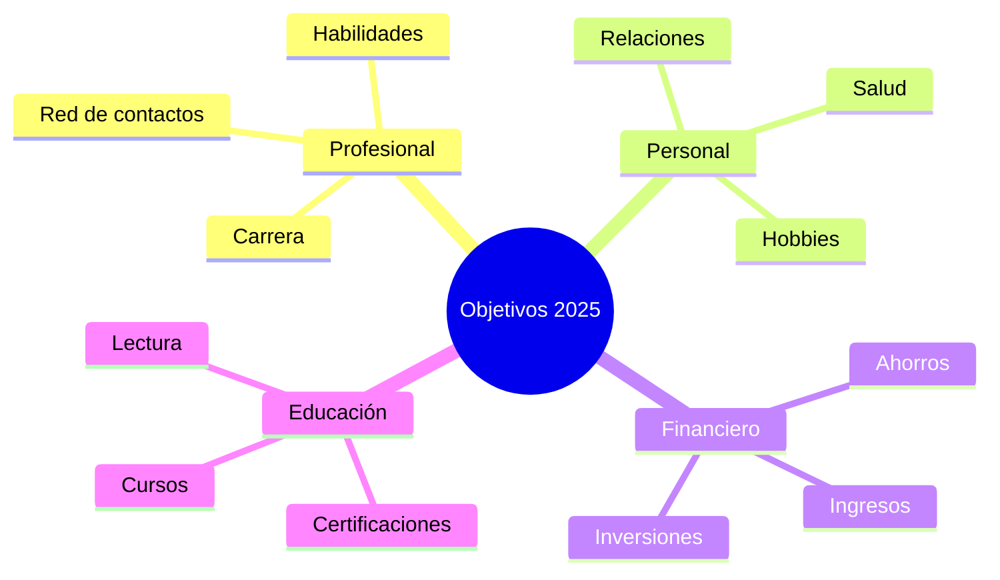
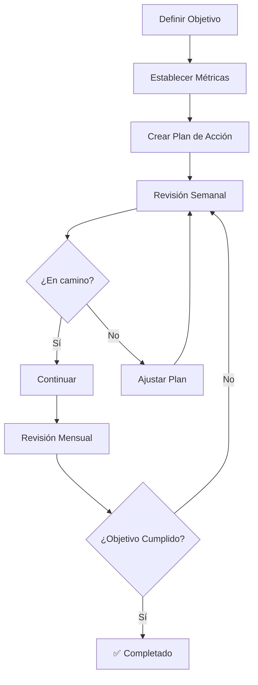

# 🎯 Objetivos 2025

> [!tip] 💡 Propósito de esta nota Esta nota te ayudará a definir, organizar y hacer seguimiento de tus objetivos para el año 2025, utilizando metodologías probadas para maximizar tu probabilidad de éxito.

## 📋 Estructura de Objetivos

> [!info] 🎪 Metodología SMART Cada objetivo debe ser:
> 
> - **S**pecífico (Específico)
> - **M**easurable (Medible)
> - **A**chievable (Alcanzable)
> - **R**elevant (Relevante)
> - **T**ime-bound (Con límite de tiempo)

## 🎯 Categorías de Objetivos

### 💼 Objetivos Profesionales

> [!warning] ⚠️ Recuerda Los objetivos profesionales deben alinearse con tu visión de carrera a largo plazo. Usa [[Deep Work]] para tareas complejas y [[Gestión del Tiempo]] para optimizar tu productividad.

- [ ] **Objetivo 1:** _[Escribe tu objetivo específico]_
    - **Fecha límite:**
    - **Métricas de éxito:**
    - **Pasos necesarios:**
    - **Herramientas:** [[Bullet Journal Method (BuJo)]] para tracking diario
- [ ] **Objetivo 2:** _[Escribe tu objetivo específico]_
    - **Fecha límite:**
    - **Métricas de éxito:**
    - **Pasos necesarios:**
    - **Herramientas:** [[Apps de Productividad]] para automatización

### 🏃‍♂️ Objetivos de Salud y Bienestar

> [!tip] 💪 Enfoque integral Considera objetivos físicos, mentales y emocionales para un bienestar completo. Integra Ejercicio, Nutrición, Sueño y Mindfulness.

- [ ] **Objetivo 1:** _[Escribe tu objetivo específico]_
    - **Fecha límite:**
    - **Métricas de éxito:**
    - **Pasos necesarios:**
    - **Apoyo:** [[Hábitos y Rutinas Saludables]] + [[Gestión del Estrés]]

### 💰 Objetivos Financieros

> [!info] 📊 Planificación financiera Establece metas claras para ingresos, gastos, ahorros e inversiones. Usa [[Productividad Digital]] para automatizar seguimiento.

- [ ] **Objetivo 1:** _[Escribe tu objetivo específico]_
    - **Fecha límite:**
    - **Métricas de éxito:**
    - **Pasos necesarios:**
    - **Tracking:** [[Dashboard Semanal]] para revisiones periódicas

### 📚 Objetivos de Aprendizaje

> [!tip] 🧠 Crecimiento continuo El aprendizaje constante es clave para el desarrollo personal y profesional. Combina [[Método 1 - Pomodoro]], [[Método 2 - Feynman]] y [[Técnicas de Concentración]].

- [ ] **Objetivo 1:** _[Escribe tu objetivo específico]_
    - **Fecha límite:**
    - **Métricas de éxito:**
    - **Pasos necesarios:**
    - **Métodos:** [[Neurociencia del Aprendizaje]] + [[Metacognición]] para optimizar retención

## 📈 Sistema de Seguimiento

> [!warning] 📅 Calendario de revisiones
> 
> - **Revisión semanal:** Cada domingo
> - **Revisión mensual:** Último día del mes
> - **Revisión trimestral:** Marzo, junio, septiembre, diciembre

## 🏅 Recompensas y Motivación

> [!tip] 🎉 Sistema de recompensas Establece recompensas para mantener la motivación a lo largo del año.

|Milestone|Recompensa|
|---|---|
|25% completado|_[Tu recompensa]_|
|50% completado|_[Tu recompensa]_|
|75% completado|_[Tu recompensa]_|
|100% completado|_[Tu recompensa]_|

## 🔄 Revisión y Ajustes

> [!info] 🔧 Flexibilidad necesaria Los objetivos pueden necesitar ajustes durante el año. Esto es normal y saludable. Usa [[Dashboard Semanal]] para revisiones regulares y [[Metacognición]] para autoevaluación.

**Preguntas para la revisión:**

- ¿Sigue siendo relevante este objetivo?
- ¿Las circunstancias han cambiado?
- ¿Necesito ajustar el plazo o las métricas?
- ¿Qué obstáculos he encontrado?
- ¿Qué estrategias de [[Gestión del Estrés]] puedo aplicar?

**Herramientas de apoyo:**

- [[Bullet Journal Method (BuJo)]] para tracking diario
- [[Mindfulness]] para mantener claridad mental
- [[Organización Física del Espacio]] para crear ambiente propicio

## 📚 Referencias

> [!quote] Enlaces a otras notas
> 
> - [[Dashboard Semanal]] - Para hacer seguimiento semanal de objetivos
> - [[Enlaces Rápidos]] - Para acceso rápido desde el hub principal
> - [[Hábitos y Rutinas Saludables]] - Para objetivos de bienestar y consistencia
> - [[Gestión del Tiempo]] - Para optimizar la ejecución de objetivos
> - [[Bullet Journal Method (BuJo)]] - Para tracking diario de progreso

## 📖 Notas Recomendadas

### 🎯 Productividad y Ejecución
> [!Success] Revisa estas notas:
> - [[Dashboard Semanal]] _(seguimiento periódico de objetivos)_
> - [[Tracking de Hábitos]] _(hábitos que apoyan objetivos)_
> - [[Motivación Académica]] _(impulso para lograr metas)_
> - [[Matriz de Eisenhower]] _(priorización de objetivos)_
> - [[Bullet Journal Method (BuJo)]] _(registro y seguimiento de metas)_

### 🧠 Aprendizaje y Crecimiento
> [!notes] Para fortalecer tu estudio
> - [[Método 1 - Pomodoro]] - Para objetivos de estudio estructurado
> - [[Método 2 - Feynman]] - Para objetivos de comprensión profunda
> - [[Método 5 - Mapas Mentales]] - Para visualizar objetivos complejos
> - [[Neurociencia del Aprendizaje]] - Base científica para objetivos educativos
> - [[Metacognición]] - Para autoevaluación del progreso

### 💪 Bienestar y Balance
> [!tip] En calma contigo mismo 
> - [[Mindfulness]] - Para objetivos de bienestar mental
> - [[Gestión del Estrés]] - Para mantener equilibrio durante la ejecución
> - [[Técnicas de Relajación]] - Para objetivos de desarrollo personal
> - [[Ejercicio y Cognición]] - Para objetivos de salud física
> - [[Nutrición para el cerebro]] - Para objetivos de bienestar integral
> - [[Higiene de Sueño]] - Para optimizar el rendimiento en todos los objetivos

### 🏠 Organización y Ambiente
> [!quote] Mejora tu organización 
> - [[Organización Física del Espacio]] - Para crear ambientes que apoyen tus objetivos
> - [[Feng Shui para Espacios Pequeños]] - Para optimizar espacios de trabajo
> - [[Minimalismo Digital]] - Para reducir distracciones digitales
> - Carpeta organización KonMari - Para mantener orden que facilite el enfoque

### 💻 Tecnología y Automatización
> [!warning] Ten en cuenta para productividad 
> - [[Productividad Digital]] - Para objetivos que involucran herramientas digitales
> - Carpeta Apps Productividad - Para automatizar el seguimiento de objetivos
> - Carpeta Automatizaciones - Para optimizar procesos repetitivos
> - [[Detox Digital]] - Para mantener balance con la tecnología

---

**Tags:** #objetivos #2025 #planificación #metas #productividad #desarrollo-personal #smart-goals #seguimiento