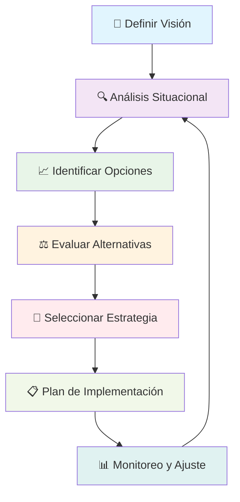

# Pensamiento Estratégico 🧠

> [!info] Definición El **pensamiento estratégico** es la capacidad de analizar situaciones complejas, anticipar escenarios futuros y desarrollar planes de acción que maximicen las oportunidades mientras minimizan los riesgos. Es un proceso mental que combina análisis, creatividad y visión a largo plazo.

## 🎯 Componentes Clave del Pensamiento Estratégico

> [!tip] Elementos Fundamentales
> 
> ### 1. Visión Sistémica 🔍
> 
> - **Perspectiva holística**: Ver el panorama completo
> - **Interconexiones**: Entender cómo se relacionan las partes
> - **Causa-efecto**: Identificar relaciones de causalidad
> 
> ### 2. Análisis del Entorno 🌍
> 
> - **Factores externos**: Oportunidades y amenazas
> - **Factores internos**: Fortalezas y debilidades
> - **Tendencias**: Cambios emergentes en el mercado/contexto
> 
> ### 3. Pensamiento a Largo Plazo ⏳
> 
> - **Proyección temporal**: 3-5 años mínimo
> - **Escenarios múltiples**: Preparación para diferentes futuros
> - **Sostenibilidad**: Soluciones duraderas

## 📊 Metodologías y Herramientas

> [!warning] Herramientas Esenciales
> 
> |Herramienta|Propósito|Aplicación|
> |---|---|---|
> |**FODA/SWOT**|Análisis situacional|Evaluación integral|
> |**Matriz BCG**|Portfolio de productos|Asignación de recursos|
> |**5 Fuerzas de Porter**|Análisis competitivo|Estrategia de mercado|
> |**Océano Azul**|Innovación estratégica|Nuevos mercados|
> |**Balanced Scorecard**|Control estratégico|Medición integral|

## 🔄 Proceso del Pensamiento Estratégico

## 💡 Características del Pensador Estratégico

> [!tip] Habilidades Clave
> 
> ### Cognitivas 🧠
> 
> - **Pensamiento crítico**: Cuestionar supuestos
> - **Síntesis**: Integrar información dispersa
> - **Paciencia**: Resistir presiones de corto plazo
> 
> ### Emocionales ❤️
> 
> - **Intuición**: Complementar análisis con instinto
> - **Flexibilidad**: Adaptarse a cambios
> - **Perseverancia**: Mantener enfoque a largo plazo
> 
> ### Sociales 👥
> 
> - **Comunicación**: Transmitir la visión
> - **Influencia**: Movilizar recursos
> - **Colaboración**: Construir consensos

## ⚡ Barreras Comunes

> [!warning] Obstáculos del Pensamiento Estratégico
> 
> ### Cognitivas 🚫
> 
> - **Sesgo de confirmación**: Buscar solo información que confirme creencias
> - **Pensamiento grupal**: Conformidad excesiva
> - **Parálisis por análisis**: Exceso de planificación
> 
> ### Organizacionales 🏢
> 
> - **Presión de resultados inmediatos**: Enfoque en el corto plazo
> - **Cultura reactiva**: Responder solo a crisis
> - **Silos organizacionales**: Falta de comunicación entre áreas

## 🚀 Aplicaciones Prácticas

> [!info] Contextos de Aplicación
> 
> ### Empresarial 💼
> 
> - Planificación estratégica corporativa
> - Desarrollo de nuevos productos
> - Expansión a mercados internacionales
> 
> ### Personal 👤
> 
> - Planificación de carrera profesional
> - Decisiones de inversión
> - Desarrollo de habilidades
> 
> ### Social 🌍
> 
> - Políticas públicas
> - Proyectos de desarrollo comunitario
> - Iniciativas de sostenibilidad

## 📚 Referencias

> [!quote] Enlaces a Notas Relacionadas
> 
> - [[Toma de Decisiones]]
> - [[El Arte de Decir No]]
> - [[Objetivos 2025]]
> - [[Planificación Estratégica]]
> - [[Clarificación de Valores]]
> - [[Gestión de Reuniones Efectivas]]

## 📖 Notas Recomendadas para Complementar

> [!tip] Prerrequisitos y Temas Relacionados
> 
> ### Prerrequisitos 📋
> 
> - [[Clarificación de Valores]] - Base para decisiones estratégicas
> - [[Objetivos SMART]] - Formulación de metas claras
> - [[Análisis Costo-Beneficio]] - Evaluación de alternativas
> 
> ### Metodologías Complementarias 🔗
> 
> - [[Matriz de Eisenhower]] - Priorización estratégica
> - [[Deep Work]] - Concentración para pensamiento profundo
> - [[Time Blocking]] - Planificación temporal estratégica
> - [[Bullet Journal Method (BuJo)]] - Organización de ideas estratégicas
> - [[Curva del Olvido]] - Retención de conocimiento estratégico
> 
> ### Técnicas de Apoyo 🧠
> 
> - [[Técnicas de Concentración]] - Para análisis profundo
> - Carpeta Métodos de Estudio - Desarrollo de habilidades estratégicas
> - [[Metacognición]] - Reflexión sobre el proceso de pensamiento

## 🧠 Técnica de Estudio: Mnemotecnia ESTRATEGIA

> [!tip] Método Mnemotécnico para Recordar el Proceso **E** - Evalúa la situación actual **S** - Sintetiza la información relevante  
> **T** - Traza objetivos claros **R** - Reconoce oportunidades y amenazas **A** - Analiza múltiples alternativas **T** - Toma decisiones informadas **E** - Ejecuta con disciplina **G** - Gestiona el seguimiento **I** - Innova continuamente **A** - Ajusta según resultados
> 
> **Frase memorable**: _"El Sabio Timonel Reconoce Aguas Turbulentas, Ejecuta Grandes Ideas Audaces"_

## 📝 Ejercicio Práctico

> [!warning] Actividad de Aplicación
> 
> ### Caso de Estudio Personal 💭
> 
> 1. **Situación**: Elige una decisión importante que debas tomar
> 2. **Análisis**: Aplica FODA personal
> 3. **Opciones**: Lista 3-5 alternativas posibles
> 4. **Evaluación**: Usa criterios de largo plazo
> 5. **Selección**: Elige la opción más estratégica
> 6. **Plan**: Define pasos concretos de implementación

---

**Tags**: #pensamiento-estrategico #estrategia #planificacion #liderazgo #toma-decisiones #analisis-situacional #vision-sistemica #largo-plazo #metodologias-estrategicas #desarrollo-profesional