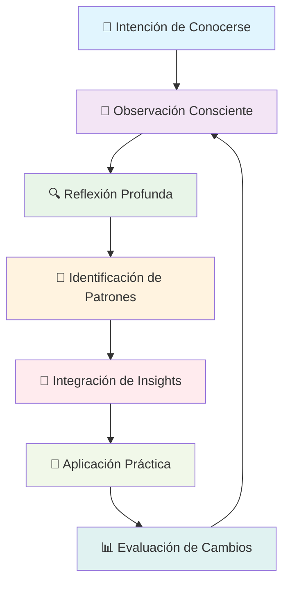

# Autoconocimiento 🪞

> [!info] Definición El **autoconocimiento** es la capacidad de comprender profundamente tus pensamientos, emociones, motivaciones, fortalezas, debilidades y patrones de comportamiento. Es la base fundamental para tomar decisiones conscientes y desarrollar tu potencial máximo.

## 🧭 Dimensiones del Autoconocimiento

> [!tip] Áreas Clave de Exploración
> 
> ### 1. Autoconciencia Emocional 💭
> 
> - **Identificación emocional**: Reconocer qué sientes en cada momento
> - **Triggers emocionales**: Situaciones que despiertan reacciones intensas
> - **Patrones emocionales**: Tendencias recurrentes en tus respuestas
> - **Regulación emocional**: Capacidad de gestionar estados emocionales
> 
> ### 2. Autoconciencia Cognitiva 🧠
> 
> - **Estilo de pensamiento**: Cómo procesas información
> - **Sesgos cognitivos**: Tendencias sistemáticas de pensamiento
> - **Formas de aprender**: Modalidades preferidas de adquisición de conocimiento
> - **Procesos de toma de decisiones**: Cómo eliges entre alternativas
> 
> ### 3. Autoconciencia Conductual 🎯
> 
> - **Hábitos automáticos**: Comportamientos inconscientes repetitivos
> - **Reacciones típicas**: Respuestas habituales a situaciones
> - **Patrones relacionales**: Cómo te comportas con diferentes personas
> - **Zona de confort**: Límites de tu área de comodidad

## 🔍 Herramientas de Autoexploración

> [!warning] Instrumentos de Diagnóstico
> 
> |Herramienta|Propósito|Aplicación|
> |---|---|---|
> |**Journaling**|Reflexión diaria|Registro de pensamientos y emociones|
> |**Feedback 360°**|Perspectiva externa|Evaluación de comportamientos por otros|
> |**Tests de Personalidad**|Perfiles psicológicos|MBTI, Big Five, Eneagrama|
> |**Análisis de Fortalezas**|Talentos naturales|CliftonStrengths, VIA Character|
> |**Rueda de la Vida**|Balance vital|Evaluación de satisfacción por áreas|
> |**Valores en Acción**|Principios rectores|Identificación de valores fundamentales|

## 🌱 Proceso de Desarrollo del Autoconocimiento



## 💡 Áreas de Autoexploración

> [!info] Dimensiones Fundamentales
> 
> ### Fortalezas y Talentos 💪
> 
> - **Habilidades innatas**: Capacidades que surgen naturalmente
> - **Competencias desarrolladas**: Skills adquiridos a través de la práctica
> - **Momentos de flujo**: Actividades donde pierdes la noción del tiempo
> - **Reconocimientos recibidos**: Áreas donde otros valoran tu contribución
> 
> ### Limitaciones y Áreas de Mejora ⚠️
> 
> - **Puntos ciegos**: Aspectos que no percibes sobre ti
> - **Debilidades reconocidas**: Limitaciones conscientes
> - **Miedos e inseguridades**: Barreras emocionales internas
> - **Saboteadores internos**: Voces críticas que limitan tu potencial
> 
> ### Sistema de Valores 💎
> 
> - **Valores fundamentales**: Principios no negociables
> - **Valores en conflicto**: Tensiones entre diferentes principios
> - **Evolución de valores**: Cómo han cambiado a lo largo del tiempo
> - **Alineación valores-acciones**: Coherencia entre creencias y comportamientos

## 🔄 Ejercicios Prácticos de Autoconocimiento

> [!tip] Actividades de Desarrollo
> 
> ### Ejercicio 1: Análisis de Momentos Peak 🏔️
> 
> 1. **Identifica**: 5 momentos donde te sentiste en tu mejor versión
> 2. **Analiza**: Qué elementos comunes tienen estos momentos
> 3. **Extrae**: Qué fortalezas y condiciones se manifestaron
> 4. **Aplica**: Cómo recrear más momentos similares
> 
> ### Ejercicio 2: Mapa de Emociones 🗺️
> 
> 5. **Registra**: Emociones durante 7 días (cada 3 horas)
> 6. **Identifica**: Patrones emocionales y triggers
> 7. **Conecta**: Emociones con situaciones específicas
> 8. **Estrategias**: Desarrolla planes para gestionar emociones difíciles
> 
> ### Ejercicio 3: Feedback Estructurado 🎯
> 
> 9. **Selecciona**: 5 personas de diferentes contextos
> 10. **Pregunta**: "¿Cuáles son mis 3 mayores fortalezas y 3 áreas de mejora?"
> 11. **Compara**: Percepciones externas vs autopercepciones
> 12. **Integra**: Insights en tu plan de desarrollo personal

## 📊 Framework de Autoevaluación Personal

> [!warning] Herramienta de Diagnóstico Integral
> 
> ### Evaluación 360° Personal 🔄
> 
> #### Área Profesional 💼
> 
> - **Fortalezas técnicas**: Habilidades específicas del campo
> - **Competencias blandas**: Comunicación, liderazgo, trabajo en equipo
> - **Estilo de liderazgo**: Cómo influyes e inspiras a otros
> - **Gestión de conflictos**: Cómo manejas situaciones difíciles
> 
> #### Área Personal 🌱
> 
> - **Inteligencia emocional**: Autoconciencia, autorregulación, empatía
> - **Relaciones interpersonales**: Calidad de vínculos familiares y sociales
> - **Gestión del estrés**: Mecanismos de afrontamiento
> - **Balance vida-trabajo**: Integración de diferentes roles
> 
> #### Área Física y Mental 🏃‍♂️
> 
> - **Energía y vitalidad**: Niveles de energía durante el día
> - **Hábitos de salud**: Alimentación, ejercicio, descanso
> - **Claridad mental**: Capacidad de concentración y enfoque
> - **Resiliencia**: Capacidad de recuperación ante adversidades

## 🚧 Obstáculos Comunes en el Autoconocimiento

> [!warning] Barreras Internas y Externas
> 
> ### Resistencias Psicológicas 🛡️
> 
> - **Negación**: Rechazo a reconocer aspectos negativos
> - **Autoengaño**: Distorsión de la realidad personal
> - **Miedo al cambio**: Resistencia a transformar aspectos conocidos
> - **Sesgo de confirmación**: Buscar solo información que confirma creencias
> 
> ### Obstáculos Externos 🌪️
> 
> - **Presión social**: Expectativas de otros que limitan la autenticidad
> - **Falta de tiempo**: Ritmo acelerado que impide la reflexión
> - **Feedback limitado**: Entornos que no proporcionan retroalimentación honesta
> - **Cambios constantes**: Contextos inestables que dificultan la introspección

## 🧠 Modelo de Inteligencia Emocional

> [!info] Componentes Clave según Goleman
> 
> ### 1. Autoconciencia 🪞
> 
> - **Conciencia emocional**: Reconocer emociones y sus efectos
> - **Autoevaluación precisa**: Conocer fortalezas y limitaciones
> - **Autoconfianza**: Sentido fuerte de autoestima y capacidades
> 
> ### 2. Autorregulación 🎛️
> 
> - **Autocontrol**: Gestión de emociones e impulsos disruptivos
> - **Adaptabilidad**: Flexibilidad ante el cambio
> - **Orientación al logro**: Estándares de excelencia personal
> 
> ### 3. Motivación 🔥
> 
> - **Motivación de logro**: Impulso por mejorar performance
> - **Compromiso**: Alineación con objetivos del grupo
> - **Iniciativa**: Disposición para actuar ante oportunidades
> 
> ### 4. Empatía 🤝
> 
> - **Comprensión de otros**: Entender emociones ajenas
> - **Desarrollo de otros**: Reconocer y cultivar habilidades ajenas
> - **Orientación al servicio**: Anticipar y satisfacer necesidades
> 
> ### 5. Habilidades Sociales 👥
> 
> - **Influencia**: Tácticas de persuasión efectiva
> - **Comunicación**: Escucha activa y mensajes convincentes
> - **Liderazgo**: Inspirar y guiar individuos y grupos

## 📚 Referencias

> [!quote] Enlaces a Notas Relacionadas
> 
> - [[Clarificación de Valores]]
> - [[Definición de Propósito]]
> - [[Pensamiento Estratégico]]
> - [[Planificación Estratégica]]
> - [[Toma de Decisiones]]
> - [[Metacognición]]

## 📖 Notas Recomendadas para Complementar

> [!tip] Prerrequisitos y Temas Relacionados
> 
> ### Prerrequisitos 📋
> 
> - [[Técnicas de Concentración]] - Para sesiones de introspección profunda
> - Carpeta Métodos de Estudio - Para procesar insights sobre ti mismo
> - [[Motivación Académica]] - Para mantener constancia en el autoconocimiento
> 
> ### Herramientas de Apoyo 🔗
> 
> - [[Bullet Journal Method (BuJo)]] - Registro sistemático de reflexiones
> - [[Deep Work]] - Concentración para autoanálisis profundo
> - [[Técnicas de Enfoque]] - Mantener atención en la exploración interna
> - [[Hábitos de Estudio]] - Desarrollar rutinas de autoexploración
> 
> ### Aplicación Práctica 📊
> 
> - [[Dashboard Semanal]] - Monitoreo de patrones personales
> - [[Tracking de Hábitos]] - Seguimiento de comportamientos
> - [[Sistemas de Revisión]] - Evaluación periódica del crecimiento personal

## 🧠 Técnica de Estudio: Método CONÓCETE

> [!tip] Mnemotécnica para la Autoexploración **C** - Contempla tus reacciones diarias **O** - Observa patrones de comportamiento **N** - Nota emociones y triggers **Ó** - Organiza insights en categorías **C** - Contrasta con feedback externo **E** - Evalúa fortalezas y debilidades **T** - Toma decisiones basadas en autoconocimiento **E** - Evoluciona continuamente tu comprensión
> 
> **Frase memorable**: _"Conocer Oportunidades Nuevas Ópticas Clarifica Emociones, Transforma Existencia"_

## 📋 Plan de Desarrollo del Autoconocimiento

> [!warning] Programa de 90 Días
> 
> ### Mes 1: Fundamentos 🌱
> 
> **Semana 1-2**: Establecer rutina de journaling diario **Semana 3-4**: Completar tests de personalidad y fortalezas
> 
> ### Mes 2: Profundización 🔍
> 
> **Semana 5-6**: Solicitar feedback 360° estructurado **Semana 7-8**: Análizar patrones emocionales y conductuales
> 
> ### Mes 3: Integración 🧩
> 
> **Semana 9-10**: Crear mapa personal de fortalezas y valores **Semana 11-12**: Diseñar plan de acción basado en insights

## 📝 Template de Journal de Autoconocimiento

> [!info] Estructura Diaria de Reflexión
> 
> ```markdown
> ## Reflexión Diaria - [Fecha]
> 
> ### 🌅 Estado Matutino
> - Energía (1-10): 
> - Estado emocional:
> - Intención del día:
> 
> ### 📊 Observaciones del Día
> - Situación más desafiante:
> - Reacción emocional:
> - ¿Cómo manejé el estrés?
> 
> ### 💡 Insights Personales
> - ¿Qué descubrí sobre mí hoy?
> - ¿Qué patrón se repite?
> - ¿Qué fortaleza utilicé?
> 
> ### 🎯 Aplicación Futura
> - ¿Qué haré diferente mañana?
> - ¿Qué quiero desarrollar?
> 
> ### ⭐ Gratitud
> - 3 cosas por las que estoy agradecido:
> ```

---

**Tags**: #autoconocimiento #desarrollo-personal #inteligencia-emocional #autoconciencia #reflexion-personal #fortalezas-personales #patrones-comportamiento #valores-personales #crecimiento-interno #autoevaluacion #mindfulness #introspección