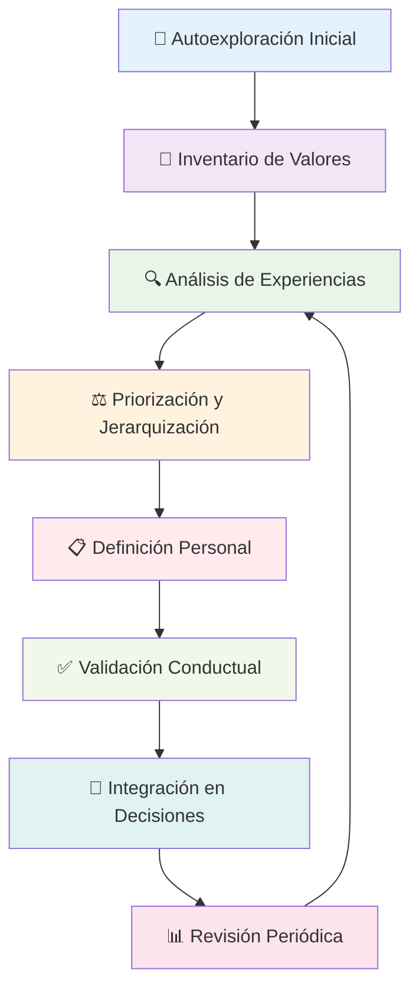

# Clarificación de Valores 💎

> [!info] Definición La **clarificación de valores** es el proceso de identificar, definir y priorizar los principios fundamentales que guían tus decisiones y comportamientos. Los valores son las creencias profundas sobre lo que es importante, correcto y deseable en la vida, actuando como brújula moral y emocional.

## 🧭 ¿Qué son los Valores?

> [!tip] Características de los Valores Auténticos
> 
> ### 1. Naturaleza de los Valores 🌟
> 
> - **Principios rectores**: Guían decisiones cuando hay incertidumbre
> - **Motivadores intrínsecos**: Generan energía y satisfacción interna
> - **Estables pero evolutivos**: Permanecen relativamente constantes pero pueden refinarse
> - **Personales y únicos**: Tu jerarquía de valores es individual
> 
> ### 2. Funciones de los Valores 🎯
> 
> - **Filtro de decisiones**: Ayudan a elegir entre alternativas
> - **Fuente de motivación**: Impulsan acción y perseverancia
> - **Criterio de evaluación**: Estándar para juzgar experiencias
> - **Base de identidad**: Definen quién eres en esencia

## 📊 Categorías Universales de Valores

> [!warning] Dimensiones Fundamentales
> 
> |Categoría|Valores Típicos|Descripción|
> |---|---|---|
> |**Logro** 🏆|Éxito, Excelencia, Competencia|Alcanzar metas y superar estándares|
> |**Relaciones** 🤝|Amor, Familia, Amistad, Conexión|Vínculos humanos significativos|
> |**Crecimiento** 🌱|Aprendizaje, Desarrollo, Sabiduría|Evolución personal continua|
> |**Contribución** 🌍|Servicio, Ayuda, Impacto Social|Hacer diferencia en el mundo|
> |**Seguridad** 🛡️|Estabilidad, Orden, Tradición|Predictibilidad y protección|
> |**Autonomía** 🦅|Libertad, Independencia, Elección|Autodeterminación y control|
> |**Creatividad** 🎨|Innovación, Expresión, Originalidad|Creación y manifestación única|
> |**Espiritualidad** ✨|Trascendencia, Propósito, Conexión|Búsqueda de significado profundo|
> |**Placer** 😊|Disfrute, Diversión, Bienestar|Experiencias gratificantes|
> |**Justicia** ⚖️|Equidad, Honestidad, Integridad|Principios éticos y morales|

## 🔍 Proceso de Clarificación de Valores



## 🎯 Técnicas de Identificación de Valores

> [!info] Métodos de Descubrimiento
> 
> ### 1. Análisis de Experiencias Peak 🏔️
> 
> - **Momentos de mayor satisfacción**: ¿Qué valores se manifestaron?
> - **Logros más significativos**: ¿Qué principios guiaron esos éxitos?
> - **Experiencias de flujo**: ¿Qué valores estaban presentes?
> 
> ### 2. Análisis de Frustraciones 🌋
> 
> - **Situaciones más molestas**: ¿Qué valores fueron violados?
> - **Conflictos interpersonales**: ¿Qué principios estaban en juego?
> - **Decisiones que lamentas**: ¿Qué valores no consideraste?
> 
> ### 3. Ejercicio de Modelos a Seguir 👥
> 
> - **Personas que admiras**: ¿Qué valores demuestran?
> - **Líderes inspiradores**: ¿Qué principios encarnan?
> - **Personajes ficticios**: ¿Qué cualidades te atraen?

## 📋 Ejercicios Prácticos de Clarificación

> [!tip] Actividades de Exploración
> 
> ### Ejercicio 1: Lista de Valores Personalizada 📝
> 
> **Paso 1**: Revisa lista de 100 valores universales **Paso 2**: Selecciona 20 que resuenen contigo **Paso 3**: Reduce a 10 valores más importantes **Paso 4**: Prioriza los 5 valores fundamentales **Paso 5**: Define cada valor con tus propias palabras
> 
> ### Ejercicio 2: Análisis de Decisiones Pasadas 🔍
> 
> **Paso 1**: Lista 5 decisiones importantes de tu vida **Paso 2**: Identifica qué valores influyeron en cada decisión **Paso 3**: Reconoce patrones en los valores recurrentes **Paso 4**: Evalúa si tus decisiones reflejan tus valores actuales
> 
> ### Ejercicio 3: Test de Conflicto de Valores ⚖️
> 
> **Paso 1**: Crea escenarios donde dos valores entren en conflicto **Paso 2**: Elige cuál valor priorizarías en cada escenario **Paso 3**: Analiza tu jerarquía de valores basada en elecciones **Paso 4**: Refina tu lista de valores prioritarios

## 🌟 Los 5 Valores Fundamentales - Framework

> [!warning] Metodología de Priorización
> 
> ### Regla del Top 5 🔝
> 
> **Principio**: Enfócate solo en tus 5 valores más importantes para evitar dispersión y clarificar decisiones.
> 
> ### Proceso de Selección:
> 
> 1. **Lista amplia** → Identifica 15-20 valores importantes
> 2. **Primera reducción** → Selecciona 10 valores clave
> 3. **Segunda reducción** → Elige 5 valores fundamentales
> 4. **Jerarquización** → Ordena del 1 al 5 por importancia
> 5. **Definición personal** → Describe qué significa cada uno para ti
> 
> ### Criterios de Validación:
> 
> - **Energía**: ¿Te energiza vivir este valor?
> - **Autenticidad**: ¿Es genuinamente tuyo o impuesto?
> - **Constancia**: ¿Ha sido importante a lo largo del tiempo?
> - **Sacrificio**: ¿Estarías dispuesto a hacer sacrificios por él?

## 🔄 Valores en Conflicto y Resolución

> [!info] Gestión de Dilemas Éticos
> 
> ### Tipos Comunes de Conflictos 🤝⚔️
> 
> #### Éxito vs. Familia 💼👨‍👩‍👧‍👦
> 
> - **Dilema**: Oportunidad laboral vs. tiempo familiar
> - **Estrategia**: Definir qué significa cada valor específicamente
> - **Solución**: Buscar alternativas creativas que honren ambos
> 
> #### Honestidad vs. Armonía 🤐🕊️
> 
> - **Dilema**: Decir verdad incómoda vs. mantener paz
> - **Estrategia**: Evaluar impacto a largo plazo de cada opción
> - **Solución**: Encontrar formas constructivas de comunicar verdad
> 
> #### Libertad vs. Seguridad 🦅🛡️
> 
> - **Dilema**: Tomar riesgos vs. mantener estabilidad
> - **Estrategia**: Calcular riesgos y beneficios objetivamente
> - **Solución**: Buscar opciones que maximicen ambos valores
> 
> ### Marco de Resolución VALOR 🎯
> 
> **V** - Visualiza las opciones claramente **A** - Analiza qué valores están en juego **L** - Lista consecuencias de cada alternativa **O** - Optimiza para honrar valores más importantes **R** - Revisa la decisión tras implementarla

## 📊 Herramientas de Evaluación de Valores

> [!warning] Instrumentos de Medición
> 
> ### 1. Rueda de Valores 🎡
> 
> **Estructura**: Círculo dividido en sectores por valor **Evaluación**: Colorea nivel de satisfacción actual (1-10) **Análisis**: Identifica brechas entre importancia y satisfacción
> 
> ### 2. Matriz de Valores en Acción 📋
> 
> |Valor|Importancia (1-10)|Satisfacción Actual (1-10)|Brecha|Acciones Necesarias|
> |---|---|---|---|---|
> |Familia|10|7|-3|Más tiempo de calidad|
> |Crecimiento|9|8|-1|Curso especialización|
> |Creatividad|8|5|-3|Proyecto personal|
> |Salud|9|6|-3|Rutina ejercicio|
> |Contribución|8|7|-1|Voluntariado|
> 
> ### 3. Diario de Valores 📔
> 
> **Frecuencia**: Registro semanal **Contenido**:
> 
> - Momentos donde valores fueron honrados
> - Situaciones donde valores fueron comprometidos
> - Emociones asociadas a alineación/desalineación
> - Ajustes necesarios en comportamiento

## ⚡ Señales de Desalineación con Valores

> [!warning] Indicadores de Incongruencia
> 
> ### Señales Emocionales 😔
> 
> - **Insatisfacción crónica**: Sensación persistente de vacío
> - **Ansiedad frecuente**: Estrés sin causa aparente
> - **Irritabilidad aumentada**: Baja tolerancia a frustraciones
> - **Pérdida de motivación**: Falta de energía para actividades
> 
> ### Señales Conductuales 🎭
> 
> - **Procrastinación sistemática**: Postergar tareas importantes
> - **Decisiones contradictorias**: Cambios frecuentes de dirección
> - **Relaciones tensas**: Conflictos recurrentes con otros
> - **Búsqueda de escape**: Tendencia a evitar responsabilidades
> 
> ### Señales Físicas 🏥
> 
> - **Fatiga crónica**: Agotamiento sin causa física
> - **Problemas de sueño**: Insomnio o pesadillas frecuentes
> - **Síntomas psicosomáticos**: Dolores sin causa médica
> - **Cambios en apetito**: Comer por estrés o pérdida de apetito

## 🎨 Valores y Toma de Decisiones

> [!tip] Framework de Decisión Basada en Valores
> 
> ### Proceso DECIDE con Valores 🤔
> 
> **D** - Define el problema claramente **E** - Establece qué valores están involucrados **C** - Considera alternativas que honren esos valores **I** - Identifica la mejor alternativa por valores **D** - Desarrolla plan de acción **E** - Evalúa resultados contra valores
> 
> ### Preguntas Guía para Decisiones 💭
> 
> 1. **Alineación**: ¿Esta opción honra mis valores fundamentales?
> 2. **Integridad**: ¿Podré vivir en paz con esta decisión?
> 3. **Consecuencias**: ¿Cómo afectará esta decisión a lo que más valoro?
> 4. **Autenticidad**: ¿Esta decisión refleja quién realmente soy?
> 5. **Legado**: ¿Estaré orgulloso de esta decisión en 10 años?

## 🌱 Evolución de Valores a lo Largo de la Vida

> [!info] Cambios Naturales por Etapas
> 
> ### Juventud (15-25 años) 🌅
> 
> **Valores típicos**: Aventura, libertad, experiencias, identidad **Enfoque**: Exploración y autodescubrimiento **Cambios**: Alta flexibilidad y experimentación
> 
> ### Adultez Temprana (25-35 años) 🚀
> 
> **Valores típicos**: Logro, relaciones, establecimiento, crecimiento **Enfoque**: Construcción de carrera y relaciones **Cambios**: Estabilización gradual de prioridades
> 
> ### Adultez Media (35-55 años) ⚖️
> 
> **Valores típicos**: Familia, contribución, equilibrio, significado **Enfoque**: Balance entre diferentes roles de vida **Cambios**: Refinamiento y profundización
> 
> ### Madurez (55+ años) 🌳
> 
> **Valores típicos**: Legado, sabiduría, espiritualidad, simplicidad **Enfoque**: Transmisión y trascendencia **Cambios**: Síntesis y esencia

## 📚 Referencias

> [!quote] Enlaces a Notas Relacionadas
> 
> - [[Autoconocimiento]]
> - [[Definición de Propósito]]
> - [[Pensamiento Estratégico]]
> - [[Planificación Estratégica]]
> - [[Toma de Decisiones]]
> - [[El Arte de Decir No]]

## 📖 Notas Recomendadas para Complementar

> [!tip] Prerrequisitos y Temas Relacionados
> 
> ### Prerrequisitos 📋
> 
> - [[Autoconocimiento]] - Base para identificar valores auténticos
> - [[Técnicas de Concentración]] - Para sesiones profundas de reflexión
> - Carpeta Métodos de Estudio - Para procesar insights sobre valores personales
> 
> ### Metodologías de Apoyo 🔗
> 
> - [[Deep Work]] - Concentración para exploración profunda de valores
> - [[Metacognición]] - Reflexión sobre proceso de clarificación
> - [[Bullet Journal Method (BuJo)]] - Registro del journey de clarificación
> - [[Hábitos de Estudio]] - Desarrollar rutinas de autoreflexión
> 
> ### Aplicación Práctica 📊
> 
> - [[Matriz de Eisenhower]] - Priorización basada en valores
> - [[Objetivos 2025]] - Alineación de metas con valores
> - [[Dashboard Semanal]] - Monitoreo de coherencia valores-acciones
> - [[Sistemas de Revisión]] - Evaluación periódica de alineación

## 🧠 Técnica de Estudio: Método VALORES

> [!tip] Mnemotécnica para la Clarificación **V** - Visualiza experiencias más significativas **A** - Analiza qué principios guiaron esas experiencias **L** - Lista valores que emergen del análisis **O** - Organiza por orden de importancia personal **R** - Refina definiciones con tus propias palabras **E** - Evalúa coherencia entre valores y acciones actuales **S** - Sintetiza en tu conjunto de 5 valores fundamentales
> 
> **Frase memorable**: _"Vivir Auténticamente Libera Oportunidades Reales, Enriquece Significativamente"_

## 📋 Template de Perfil de Valores Personal

> [!warning] Estructura para tus Valores Fundamentales
> 
> ```markdown
> ## Mi Perfil de Valores Fundamentales
> 
> ### 🏆 Valor #1: [Nombre del Valor]
> **Mi Definición**: [Qué significa específicamente para ti]
> **¿Cómo se manifiesta?**: [Comportamientos concretos]
> **¿Cuándo lo honro?**: [Situaciones donde lo vives]
> **¿Cuándo lo comprometo?**: [Situaciones donde lo abandonas]
> **Acciones para fortalecerlo**: [Qué harás para vivirlo más]
> 
> ### 🥈 Valor #2: [Nombre del Valor]
> [Repetir estructura]
> 
> ### 🥉 Valor #3: [Nombre del Valor]
> [Repetir estructura]
> 
> ### 🏅 Valor #4: [Nombre del Valor]
> [Repetir estructura]
> 
> ### 🎖️ Valor #5: [Nombre del Valor]
> [Repetir estructura]
> 
> ## Conflictos de Valores Identificados
> ### Tensión Principal: [Valor A] vs [Valor B]
> **Situaciones típicas**: [Cuándo surge este conflicto]
> **Estrategia de resolución**: [Cómo decides en estos casos]
> 
> ## Plan de Alineación
> ### Próximos 30 días:
> - [ ] [Acción específica para honrar valor 1]
> - [ ] [Acción específica para honrar valor 2]
> - [ ] [Acción específica para honrar valor 3]
> 
> ### Decisiones pendientes que evaluar con estos valores:
> 1. [Decisión pendiente y valores involucrados]
> 2. [Decisión pendiente y valores involucrados]
> 
> ## Recordatorios Diarios
> - **Pregunta matutina**: "¿Cómo honraré mis valores hoy?"
> - **Pregunta nocturna**: "¿Mis acciones de hoy reflejaron mis valores?"
> ```

## 🎯 Ejercicio de Clarificación: Workshop Personal de 4 Horas

> [!info] Sesión Intensiva de Clarificación
> 
> ### Materiales Necesarios 📦
> 
> - Lista de 100 valores universales
> - Papel y bolígrafos de colores
> - Cronómetro
> - Espacio silencioso sin interrupciones
> 
> ### Fase 1: Exploración (60 min) 🔍
> 
> **Actividad 1 (20 min)**: Revisar lista de valores y marcar resonantes **Actividad 2 (20 min)**: Análisis de 3 mejores momentos de vida **Actividad 3 (20 min)**: Análisis de 3 peores momentos de vida
> 
> ### Fase 2: Identificación (60 min) 📝
> 
> **Actividad 4 (20 min)**: Seleccionar 20 valores más importantes **Actividad 5 (20 min)**: Reducir a 10 valores esenciales **Actividad 6 (20 min)**: Elegir los 5 valores fundamentales
> 
> ### Descanso (30 min) ☕
> 
> ### Fase 3: Definición (90 min) 🎯
> 
> **Actividad 7 (60 min)**: Definir cada valor con propias palabras **Actividad 8 (30 min)**: Crear ejemplos de cada valor en acción
> 
> ### Fase 4: Validación (60 min) ✅
> 
> **Actividad 9 (30 min)**: Test de coherencia con decisiones pasadas **Actividad 10 (30 min)**: Plan de acción para mayor alineación
> 
> ### Fase 5: Integración (30 min) 🌟
> 
> **Actividad 11 (30 min)**: Crear tarjeta de valores para cartera

---

**Tags**: #valores-personales #clarificacion-valores #principios-fundamentales #toma-decisiones #autoconocimiento #desarrollo-personal #integridad-personal #brujula-moral #coherencia-valores #jerarquia-valores #dilemas-eticos #autenticidad