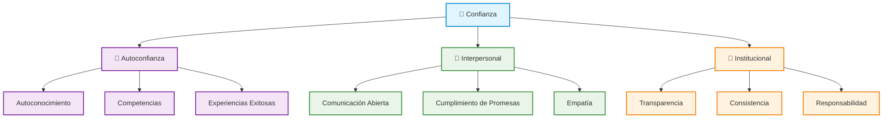
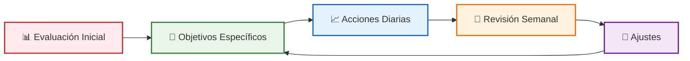

# Construcción de Confianza

> [!info] 🎯 **Objetivo de la Nota** Desarrollar una comprensión profunda de los mecanismos para construir confianza personal y interpersonal, estableciendo bases sólidas para el crecimiento personal y profesional.

## 🧠 Fundamentos Teóricos

> [!tip] 💡 **Definición de Confianza** La confianza es la creencia firme en las propias capacidades, decisiones y valor personal, así como la disposición a ser vulnerable y abierto en las relaciones con otros.

### Tipos de Confianza

> [!note] 📋 **Clasificación Principal**
> 
> |Tipo|Descripción|Características|
> |---|---|---|
> |**Autoconfianza**|Creencia en las propias capacidades|- Autoeficacia - Autoaceptación - Resiliencia|
> |**Confianza Interpersonal**|Fe en otros y sus intenciones|- Vulnerabilidad - Reciprocidad - Comunicación|
> |**Confianza Institucional**|Fe en sistemas y organizaciones|- Credibilidad - Transparencia - Consistencia|

## 🏗️ Pilares de la Construcción de Confianza

> [!tip] 🏛️ **Los 5 Pilares Fundamentales**

### 1. Autoconocimiento

> [!info] 🪞 **Pilar del Autoconocimiento**
> 
> - **Fortalezas y debilidades**: Identificación honesta de capacidades
> - **Valores personales**: Claridad sobre principios fundamentales
> - **Patrones de comportamiento**: Reconocimiento de tendencias personales
> - **Emociones**: Comprensión del mundo emocional interno

### 2. Competencia y Habilidades

> [!success] 💪 **Desarrollo de Competencias**
> 
> - **Aprendizaje continuo**: Actualización constante de conocimientos
> - **Práctica deliberada**: Mejora sistemática de habilidades
> - **Zona de confort expandida**: Asumir desafíos progresivos
> - **Feedback constructivo**: Apertura a la retroalimentación

### 3. Integridad y Coherencia

> [!warning] ⚖️ **Consistencia Personal**
> 
> - **Alineación valores-acciones**: Coherencia entre lo que se dice y hace
> - **Honestidad**: Transparencia en comunicación y relaciones
> - **Cumplimiento de compromisos**: Confiabilidad en promesas
> - **Autenticidad**: Ser genuino en todas las interacciones

### 4. Resiliencia

> [!note] 🌱 **Capacidad de Recuperación**
> 
> - **Gestión del fracaso**: Aprender de los errores
> - **Adaptabilidad**: Flexibilidad ante cambios
> - **Persistencia**: Mantener esfuerzo a pesar de obstáculos
> - **Optimismo realista**: Perspectiva equilibrada del futuro

### 5. Relaciones de Calidad

> [!tip] 🤝 **Construcción de Vínculos**
> 
> - **Comunicación efectiva**: Expresión clara y escucha activa
> - **Empatía**: Comprensión de perspectivas ajenas
> - **Apoyo mutuo**: Reciprocidad en las relaciones
> - **Resolución de conflictos**: Manejo constructivo de desacuerdos

## 📈 Estrategias de Desarrollo

> [!success] 🎯 **Plan de Acción para Construir Confianza**

### Estrategias de Autoconfianza

> [!info] 🔧 **Herramientas Prácticas**
> 
> #### 📊 Técnica SMART para Objetivos de Confianza
> 
> |Componente|Aplicación|Ejemplo|
> |---|---|---|
> |**S**pecífico|Define comportamientos concretos|"Hablar en reuniones semanales"|
> |**M**edible|Establece métricas claras|"Participar 3 veces por reunión"|
> |**A**lcanzable|Metas realistas|"Aumentar participación gradualmente"|
> |**R**elevante|Conecta con valores|"Mejorar liderazgo profesional"|
> |**T**emporal|Establece plazos|"En próximos 30 días"|

### Ejercicios Prácticos

> [!tip] 🏃‍♂️ **Rutinas de Fortalecimiento**
> 
> #### 🌅 Rutina Matutina de Confianza (15 min)
> 
> 1. **Afirmaciones positivas** (3 min)
> 2. **Visualización de éxito** (5 min)
> 3. **Revisión de logros previos** (4 min)
> 4. **Establecimiento de intención diaria** (3 min)
> 
> #### 📝 Diario de Confianza
> 
> - ✅ **3 logros del día** (por pequeños que sean)
> - 💪 **1 desafío superado**
> - 🎯 **1 área de mejora identificada**
> - 🙏 **1 acto de autocompasión**

## 🧠 Técnica de Estudio: Método CONFIDENCE

> [!success] 📚 **Mnemotecnia para Recordar los Elementos Clave**

**C** - **C**onocimiento (de uno mismo) **O** - **O**bjetivos claros **N** - **N**ueva mentalidad de crecimiento **F** - **F**ortalezas identificadas **I** - **I**ntegridad en acciones **D** - **D**esafíos como oportunidades **E** - **E**mpoderamento personal **N** - **N**etworking de calidad **C** - **C**elebración de logros **E** - **E**valuación continua

> [!info] 🎨 **Visualización del Método** Imagina la confianza como un **edificio sólido**: cada letra representa un piso que construyes día a día, desde los cimientos (Conocimiento) hasta la cúspide (Evaluación continua).

## ⚠️ Obstáculos Comunes

> [!warning] 🚧 **Barreras para la Construcción de Confianza**

### Enemigos Internos

> [!danger] 🧠 **Patrones Mentales Limitantes**
> 
> |Obstáculo|Manifestación|Estrategia de Superación|
> |---|---|---|
> |**Síndrome del Impostor**|"No merezco estar aquí"|Documentar logros y competencias|
> |**Perfeccionismo**|"Debe ser perfecto o no vale"|Aceptar la excelencia sobre perfección|
> |**Comparación Social**|"Otros son mejores que yo"|Enfoque en progreso personal|
> |**Miedo al Fracaso**|Evitar riesgos y desafíos|Reencuadrar fracasos como aprendizaje|

### Factores Externos

> [!warning] 🌍 **Influencias del Entorno**
> 
> - **Críticas destructivas**: Filtrar feedback negativo no constructivo
> - **Entornos tóxicos**: Identificar y minimizar exposición
> - **Expectativas irreales**: Establecer estándares propios realistas
> - **Falta de apoyo**: Buscar redes de apoyo positivas

## 📊 Medición del Progreso

> [!note] 📈 **Sistema de Evaluación**

### Indicadores de Confianza

> [!success] 🎯 **Métricas de Seguimiento**
> 
> #### Escala de Autoevaluación (1-10)
> 
> |Área|Pregunta de Evaluación|Puntuación|
> |---|---|---|
> |**Autodeterminación**|"Tomo decisiones sin depender excesivamente de otros"|_/10|
> |**Asertividad**|"Expreso mis opiniones de manera respetuosa"|_/10|
> |**Resiliencia**|"Me recupero rápidamente de los contratiempos"|_/10|
> |**Relaciones**|"Confío en otros y otros confían en mí"|_/10|
> |**Autoeficacia**|"Creo en mi capacidad para lograr objetivos"|_/10|

## 🔗 Referencias

> [!quote] 📚 **Enlaces a Notas Relacionadas**
> 
> - [[Autoconocimiento]] - Base fundamental para construcción de confianza
> - [[Clarificación de Valores]] - Alineación de acciones con principios
> - [[Definición de Propósito]] - Dirección clara para desarrollo personal
> - [[Gestión del Estrés]] - Manejo de presiones que afectan confianza
> - [[Comunicación Efectiva]] - Herramientas para expresar confianza
> - [[Inteligencia Emocional]] - Comprensión emocional para relaciones
> - [[Pensamiento Crítico]] - Evaluación objetiva de capacidades

## 📖 Notas Recomendadas para Complementar

> [!info] 📋 **Prerrequisitos y Temas Complementarios**

### Prerrequisitos Esenciales

- [[Motivación Académica]] - Impulso interno para crecimiento
- [[Hábitos y Rutinas Saludables]] - Base física y mental sólida
- [[Mindfulness]] - Conciencia presente para autoconocimiento

### Temas Complementarios Avanzados

- [[Liderazgo Situacional]] - Aplicación de confianza en liderazgo
- [[Influencia sin Autoridad]] - Usar confianza para influir positivamente
- [[Desarrollo de Equipos]] - Construir confianza grupal
- [[Gestión de Conflictos]] - Mantener confianza en situaciones difíciles

### Aplicación Práctica

- [[Toma de Decisiones]] - Usar confianza para decidir efectivamente
- [[Comunicación Intercultural]] - Confianza en contextos diversos
- [[Feedback y Coaching]] - Dar y recibir retroalimentación con confianza

---

> [!tip] 🎯 **Recordatorio Final** La confianza no es un destino, sino un viaje continuo de crecimiento personal. Cada pequeño paso cuenta hacia la construcción de una versión más segura y auténtica de ti mismo.

**Tags:** #confianza #desarrollo-personal #autoconocimiento #liderazgo #fundamentos #bienestar-emocional #habilidades-interpersonales #crecimiento-personal #autoeficacia #resiliencia