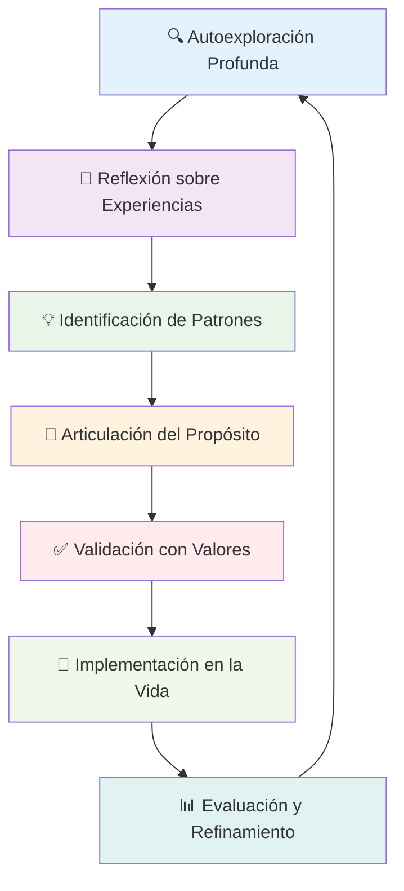

# Definición de Propósito 🌟

> [!info] Definición La **definición de propósito** es el proceso de descubrir y articular tu razón fundamental de existir, tu contribución única al mundo y el significado profundo que guía tus decisiones y acciones. Es el "por qué" que trasciende metas específicas y conecta con tu esencia más auténtica.

## 🎯 Componentes del Propósito Personal

> [!tip] Elementos Fundamentales
> 
> ### 1. Misión Personal 🚀
> 
> - **Declaración de propósito**: Frase que resume tu razón de ser
> - **Contribución única**: Valor específico que aportas al mundo
> - **Impacto deseado**: Cambio positivo que quieres generar
> 
> ### 2. Visión Trascendente 🔭
> 
> - **Futuro aspiracional**: Mundo ideal al que contribuyes
> - **Legado personal**: Cómo quieres ser recordado
> - **Transformación**: Cambio que generas en otros y en ti mismo
> 
> ### 3. Valores Fundamentales 💎
> 
> - **Principios rectores**: Valores no negociables que guían decisiones
> - **Creencias profundas**: Convicciones sobre lo que es importante
> - **Código ético personal**: Estándares morales que defines para ti

## 🧭 Dimensiones del Propósito

> [!warning] Niveles de Significado
> 
> |Dimensión|Enfoque|Preguntas Clave|
> |---|---|---|
> |**Personal** 🌱|Crecimiento interno|¿Quién quiero llegar a ser?<br/>¿Cómo quiero evolucionar?|
> |**Relacional** 🤝|Conexiones humanas|¿Cómo impacto a otros?<br/>¿Qué relaciones construyo?|
> |**Profesional** 💼|Contribución laboral|¿Cómo sirvo a través de mi trabajo?<br/>¿Qué problemas resuelvo?|
> |**Social** 🌍|Impacto comunitario|¿Cómo contribuyo a la sociedad?<br/>¿Qué cambio genero?|
> |**Espiritual** ✨|Conexión trascendente|¿Cuál es mi lugar en algo mayor?<br/>¿Qué trasciende mi existencia?|

## 🔍 Proceso de Descubrimiento del Propósito



## 💡 Herramientas de Exploración del Propósito

> [!info] Técnicas de Descubrimiento
> 
> ### 1. Análisis de Experiencias Peak 🏔️
> 
> - **Momentos de flujo**: Cuándo te sientes más auténtico y energizado
> - **Logros significativos**: Qué te ha dado mayor satisfacción
> - **Momentos de impacto**: Cuándo has generado diferencia en otros
> 
> ### 2. Exploración de Valores en Acción 🎯
> 
> - **Decisiones importantes**: Qué principios guiaron tus elecciones clave
> - **Indignación moral**: Qué injusticias no puedes tolerar
> - **Admiración**: Qué cualidades admiras en otros
> 
> ### 3. Visión del Legado 👴
> 
> - **Ejercicio del funeral**: Cómo quieres ser recordado
> - **Carta desde el futuro**: Mensaje de tu yo de 80 años
> - **Epitafio personal**: Frase que resuma tu vida

## 🌱 Ejercicios Prácticos para Definir Propósito

> [!tip] Actividades de Clarificación
> 
> ### Ejercicio 1: Los 7 Niveles del ¿Por Qué? 🤔
> 
> 1. **Nivel 1**: ¿Por qué haces lo que haces?
> 2. **Nivel 2**: ¿Por qué eso es importante para ti?
> 3. **Nivel 3**: ¿Por qué eso te importa?
> 4. **Nivel 4**: ¿Por qué eso tiene significado?
> 5. **Nivel 5**: ¿Por qué eso es fundamental?
> 6. **Nivel 6**: ¿Por qué eso trasciende lo personal?
> 7. **Nivel 7**: ¿Cuál es la esencia más profunda?
> 
> ### Ejercicio 2: Análisis de Momentos de Significado 📝
> 
> 8. **Identifica**: 10 momentos más significativos de tu vida
> 9. **Analiza**: Qué tenían en común estos momentos
> 10. **Extrae**: Qué valores y principios se manifestaron
> 11. **Conecta**: Cómo estos elementos forman tu propósito
> 
> ### Ejercicio 3: La Declaración de Impacto 🎯
> 
> 12. **Completa**: "Mi vida tiene sentido cuando..."
> 13. **Completa**: "Contribuyo al mundo mediante..."
> 14. **Completa**: "La diferencia que quiero hacer es..."
> 15. **Integra**: Combina las respuestas en una declaración coherente

## 🎭 Arquetipos de Propósito Personal

> [!warning] Patrones Comunes de Propósito
> 
> ### El Sanador 🩺
> 
> - **Propósito**: Aliviar sufrimiento y promover bienestar
> - **Manifestación**: Medicina, terapia, cuidado, wellness
> - **Valor central**: Compasión y servicio
> 
> ### El Creador 🎨
> 
> - **Propósito**: Generar belleza, arte y nuevas posibilidades
> - **Manifestación**: Arte, diseño, innovación, entretenimiento
> - **Valor central**: Creatividad y expresión
> 
> ### El Maestro 📚
> 
> - **Propósito**: Transmitir conocimiento y desarrollar potencial
> - **Manifestación**: Educación, coaching, mentoría, escritura
> - **Valor central**: Crecimiento y aprendizaje
> 
> ### El Constructor 🏗️
> 
> - **Propósito**: Edificar sistemas y estructuras duraderas
> - **Manifestación**: Empresa, tecnología, organizaciones, infraestructura
> - **Valor central**: Progreso y eficiencia
> 
> ### El Protector 🛡️
> 
> - **Propósito**: Defender y preservar lo valioso
> - **Manifestación**: Justicia, seguridad, conservación, derechos
> - **Valor central**: Justicia y protección
> 
> ### El Conector 🌉
> 
> - **Propósito**: Unir personas y crear comunidad
> - **Manifestación**: Relaciones públicas, networking, diplomacia, eventos
> - **Valor central**: Unidad y pertenencia

## 📋 Framework de Validación del Propósito

> [!info] Criterios de Autenticidad
> 
> ### Test de Resonancia Emocional 💓
> 
> - **Energía**: ¿Te energiza pensar en tu propósito?
> - **Emoción**: ¿Sientes pasión al articularlo?
> - **Autenticidad**: ¿Se siente genuinamente tuyo?
> 
> ### Test de Coherencia 🧩
> 
> - **Valores**: ¿Alinea con tus valores fundamentales?
> - **Fortalezas**: ¿Utiliza tus talentos naturales?
> - **Historia**: ¿Es consistente con tu trayectoria de vida?
> 
> ### Test de Trascendencia 🚀
> 
> - **Servicio**: ¿Beneficia a otros además de ti?
> - **Significado**: ¿Trasciende beneficios materiales?
> - **Duración**: ¿Es relevante a largo plazo?

## ⚡ Obstáculos en la Definición del Propósito

> [!warning] Desafíos Comunes
> 
> ### Bloqueos Internos 🚧
> 
> - **Perfeccionismo**: Buscar el propósito "perfecto"
> - **Comparación**: Sentir que tu propósito debe ser como el de otros
> - **Miedo al juicio**: Preocupación por la opinión ajena
> - **Imposter syndrome**: Dudar de tu derecho a tener un propósito "grande"
> 
> ### Presiones Externas 🌪️
> 
> - **Expectativas familiares**: Presión por cumplir expectativas heredadas
> - **Presión social**: Seguir caminos socialmente aceptables
> - **Limitaciones económicas**: Priorizar supervivencia sobre propósito
> - **Cambios constantes**: Vivir en supervivencia sin tiempo para reflexión

## 🧠 Niveles de Claridad del Propósito

> [!tip] Evolución del Propósito
> 
> ### Nivel 1: Búsqueda 🔍
> 
> - **Estado**: "No sé cuál es mi propósito"
> - **Acción**: Exploración activa, experimentación
> - **Herramientas**: Tests, coaching, nuevas experiencias
> 
> ### Nivel 2: Exploración 🗺️
> 
> - **Estado**: "Tengo algunas ideas pero no claridad"
> - **Acción**: Probar diferentes direcciones, validar hipótesis
> - **Herramientas**: Proyectos piloto, voluntariado, cursos
> 
> ### Nivel 3: Definición 🎯
> 
> - **Estado**: "Puedo articular mi propósito"
> - **Acción**: Refinar y validar la declaración
> - **Herramientas**: Mentores, feedback, autoreflexión
> 
> ### Nivel 4: Integración 🌊
> 
> - **Estado**: "Vivo alineado con mi propósito"
> - **Acción**: Tomar decisiones basadas en propósito
> - **Herramientas**: Sistemas de decisión, revisiones regulares
> 
> ### Nivel 5: Impacto 🌟
> 
> - **Estado**: "Mi propósito genera impacto medible"
> - **Acción**: Escalar impacto y ayudar a otros
> - **Herramientas**: Liderazgo, mentoría, plataformas de influencia

## 📚 Referencias

> [!quote] Enlaces a Notas Relacionadas
> 
> - [[Autoconocimiento]]
> - [[Clarificación de Valores]]
> - [[Planificación Estratégica]]
> - [[Pensamiento Estratégico]]
> - [[Toma de Decisiones]]
> - [[El Arte de Decir No]]

## 📖 Notas Recomendadas para Complementar

> [!tip] Prerrequisitos y Temas Relacionados
> 
> ### Prerrequisitos 📋
> 
> - [[Autoconocimiento]] - Base para descubrir propósito auténtico
> - [[Clarificación de Valores]] - Principios que sustentan el propósito
> - [[Técnicas de Concentración]] - Para sesiones profundas de reflexión
> 
> ### Herramientas de Desarrollo 🔗
> 
> - [[Deep Work]] - Concentración para exploración profunda del propósito
> - [[Metacognición]] - Reflexión sobre el proceso de descubrimiento
> - [[Bullet Journal Method (BuJo)]] - Registro del journey de descubrimiento
> - Carpeta Métodos de Estudio - Para procesar insights sobre propósito
> 
> ### Aplicación Práctica 📊
> 
> - [[Objetivos 2025]] - Alineación de metas con propósito
> - [[Sistemas de Revisión]] - Evaluación periódica de alineación
> - [[Tracking de Hábitos]] - Desarrollo de comportamientos coherentes con propósito

## 🧠 Técnica de Estudio: Método PROPÓSITO

> [!tip] Mnemotécnica para el Descubrimiento **P** - Profundiza en tu historia personal **R** - Reconoce tus valores fundamentales **O** - Observa patrones de satisfacción y energía **P** - Pregúntate el "por qué" siete veces **Ó** - Óptica externa: solicita feedback **S** - Sintetiza insights en declaración clara **I** - Integra propósito en decisiones diarias **T** - Testa alineación con acciones **O** - Optimiza y refina continuamente
> 
> **Frase memorable**: _"Para Realizar Obras Profundas Ópticas Sabias, Inspira Transformación Orientada"_

## 📋 Declaración de Propósito Personal - Template

> [!warning] Estructura para tu Propósito
> 
> ```markdown
> ## Mi Propósito de Vida
> 
> ### 🌟 Declaración Principal
> "Mi propósito es [acción] para [beneficiarios] mediante [método/don] 
> con el fin de [impacto/transformación deseada]."
> 
> ### 💎 Valores Fundamentales
> 1. [Valor 1]: [Definición personal]
> 2. [Valor 2]: [Definición personal]
> 3. [Valor 3]: [Definición personal]
> 
> ### 🎯 Manifestaciones Concretas
> #### En mi trabajo:
> - [Cómo se expresa tu propósito profesionalmente]
> 
> #### En mis relaciones:
> - [Cómo impactas a otros a través de vínculos]
> 
> #### En mi comunidad:
> - [Cómo contribuyes al bien común]
> 
> ### 🌱 Evolución del Propósito
> - **Origen**: ¿Cuándo/cómo descubriste este propósito?
> - **Refinamiento**: ¿Cómo ha evolucionado?
> - **Futuro**: ¿Cómo esperas que se profundice?
> 
> ### 📊 Indicadores de Alineación
> - [ ] Mis decisiones reflejan mi propósito
> - [ ] Siento energía al vivir mi propósito
> - [ ] Otros reconocen mi propósito en mis acciones
> - [ ] Mi trabajo expresa mi propósito
> - [ ] Mi tiempo se invierte coherentemente
> ```

## 🎯 Ejercicio Intensivo: Retiro Personal de Propósito

> [!info] Sesión de 6 Horas para Clarificar Propósito
> 
> ### Preparación (30 min) 🧘‍♂️
> 
> - Elimina distracciones (teléfono en modo avión)
> - Prepara materiales: papel, colores, música inspiradora
> - Establece intención clara para la sesión
> 
> ### Fase 1: Exploración del Pasado (90 min) 🔍
> 
> **Actividad 1 (30 min)**: Timeline de vida con momentos significativos **Actividad 2 (30 min)**: Análisis de experiencias peak y de flujo **Actividad 3 (30 min)**: Identificación de patrones y temas recurrentes
> 
> ### Fase 2: Análisis del Presente (60 min) 📊
> 
> **Actividad 4 (30 min)**: Evaluación de valores en acción actual **Actividad 5 (30 min)**: Identificación de fortalezas y dones únicos
> 
> ### Descanso (30 min) ☕
> 
> ### Fase 3: Visión del Futuro (90 min) 🔮
> 
> **Actividad 6 (30 min)**: Ejercicio del legado - ¿Cómo quieres ser recordado? **Actividad 7 (30 min)**: Visualización del impacto ideal en el mundo **Actividad 8 (30 min)**: Carta desde tu yo futuro de 80 años
> 
> ### Fase 4: Síntesis y Articulación (120 min) 🎯
> 
> **Actividad 9 (60 min)**: Los 7 niveles del ¿Por qué? **Actividad 10 (60 min)**: Redacción de declaración de propósito
> 
> ### Fase 5: Validación y Compromiso (30 min) ✅
> 
> **Actividad 11 (15 min)**: Test de resonancia emocional **Actividad 12 (15 min)**: Plan de integración en la vida diaria

## 💫 Señales de un Propósito Auténtico

> [!tip] Indicadores de Autenticidad
> 
> ### Señales Internas ✨
> 
> - **Energía sostenida**: Te energiza en lugar de agotarte
> - **Naturalidad**: Se siente como "ser tú mismo"
> - **Resistencia**: Persistes a pesar de obstáculos
> - **Crecimiento**: Te impulsa a evolucionar constantemente
> 
> ### Señales Externas 🌟
> 
> - **Reconocimiento**: Otros identifican tu propósito en tus acciones
> - **Atracción**: Atraes oportunidades alineadas
> - **Impacto**: Generas cambio positivo medible
> - **Coherencia**: Tu vida tiene un hilo conductor claro

## 🔄 Evolución del Propósito a lo Largo de la Vida

> [!warning] Ciclos Naturales del Propósito
> 
> ### Etapa de Descubrimiento (20-30 años) 🌱
> 
> - **Enfoque**: Exploración y experimentación
> - **Pregunta clave**: "¿Qué me apasiona?"
> - **Desafío**: Presión social y expectativas externas
> 
> ### Etapa de Definición (30-40 años) 🎯
> 
> - **Enfoque**: Clarificación y compromiso
> - **Pregunta clave**: "¿Cómo puedo contribuir?"
> - **Desafío**: Balance entre propósito y responsabilidades
> 
> ### Etapa de Impacto (40-60 años) 🚀
> 
> - **Enfoque**: Maximización del impacto
> - **Pregunta clave**: "¿Cómo escalo mi contribución?"
> - **Desafío**: Mantener relevancia en mundo cambiante
> 
> ### Etapa de Legado (60+ años) 👴
> 
> - **Enfoque**: Transmisión y mentoría
> - **Pregunta clave**: "¿Cómo aseguro continuidad?"
> - **Desafío**: Soltar control y empoderar a otros

---

**Tags**: #proposito-de-vida #mision-personal #vision-personal #significado #valores-fundamentales #impacto-personal #legado #autoconocimiento #desarrollo-personal #clarificacion-existencial #razon-de-ser #contribucion-unica