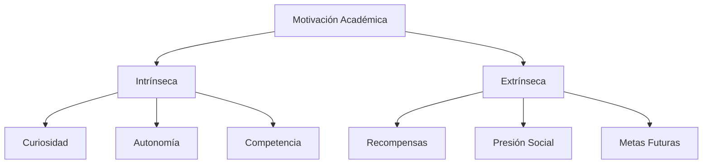
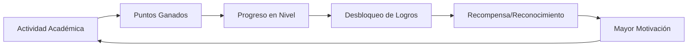
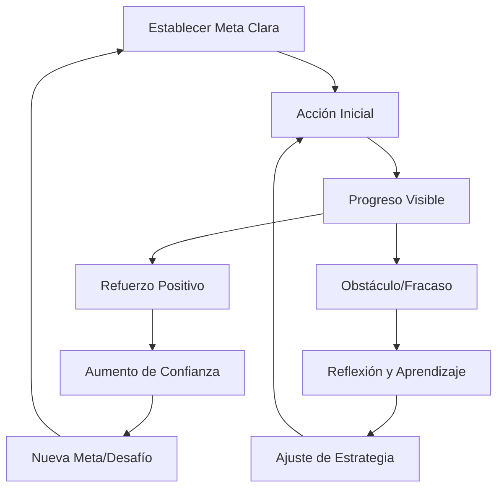

# Motivación Académica 🎓✨

> [!quote] "La motivación es lo que te pone en marcha, el hábito es lo que te mantiene en movimiento" - Jim Ryun

## Fundamentos de la Motivación Académica 📚

> [!info] Definición La motivación académica es el conjunto de factores internos y externos que impulsan, dirigen y sostienen el comportamiento de aprendizaje hacia el logro de objetivos educativos específicos.

### Tipos de Motivación 🧠

> [!tip] Clasificación Fundamental **Motivación Intrínseca** 💎
> 
> - Satisfacción personal por aprender
> - Curiosidad genuina por el conocimiento
> - Placer en el proceso de descubrimiento
> - Sensación de autonomía y competencia
> 
> **Motivación Extrínseca** 🏆
> 
> - Recompensas externas (calificaciones, reconocimiento)
> - Evitación de consecuencias negativas
> - Presión social o familiar
> - Beneficios futuros (carrera, dinero)

## Teorías Psicológicas 🧭

### Teoría de la Autodeterminación

> [!info] Necesidades Básicas **Autonomía** 🎯: Sentir control sobre el propio aprendizaje **Competencia** 💪: Experimentar eficacia y dominio **Relación** 🤝: Conexión social y pertenencia

### Teoría de Metas de Logro

> [!tip] Orientaciones Motivacionales **Metas de Maestría** 📈
> 
> - Enfoque en aprender y comprender
> - Búsqueda de desafíos apropiados
> - Persistencia ante dificultades
> 
> **Metas de Rendimiento** 🏅
> 
> - Enfoque en demostrar habilidad
> - Comparación con otros estudiantes
> - Puede limitar el aprendizaje profundo

### Teoría de la Expectativa-Valor

> [!info] Componentes Clave **Expectativa** = "¿Puedo hacerlo?" **Valor** = "¿Vale la pena?" **Motivación** = Expectativa × Valor

## Estrategias para Incrementar la Motivación 🚀

### 1. Establecimiento de Metas Efectivas

> [!tip] Metodología SMART-ER
> 
> - **S**pecific (Específicas)
> - **M**easurable (Medibles)
> - **A**chievable (Alcanzables)
> - **R**elevant (Relevantes)
> - **T**ime-bound (Temporales)
> - **E**valuate (Evaluar progreso)
> - **R**eadjust (Reajustar según necesidad)

> [!warning] Evitar Metas Contraproducentes
> 
> - Metas demasiado ambiciosas que generen frustración
> - Objetivos vagos sin criterios de éxito claros
> - Enfoque exclusivo en calificaciones vs aprendizaje
> - Metas impuestas externamente sin conexión personal

### 2. Técnicas de Gamificación 🎮

> [!tip] Elementos de Juego en el Estudio **Sistema de Puntos** 📊
> 
> - Asignar puntos a diferentes actividades académicas
> - Crear niveles de progreso por materia
> - Establecer recompensas por hitos alcanzados
> 
> **Desafíos y Logros** 🏆
> 
> - "Streak" de días estudiando consecutivamente
> - Completar módulos sin consultar ayuda
> - Dominar conceptos difíciles en tiempo récord

### 3. Técnica del "¿Por Qué?" Profundo

> [!info] Ejercicio de Reflexión
> 
> 1. **¿Por qué estudio esta carrera?** → Para ser [profesión]
> 2. **¿Por qué quiero ser [profesión]?** → Para ayudar a las personas
> 3. **¿Por qué quiero ayudar a las personas?** → Para tener impacto positivo
> 4. **¿Por qué es importante tener impacto positivo?** → Para encontrar sentido
> 5. **¿Por qué necesito sentido en mi vida?** → Para ser genuinamente feliz

### 4. Visualización y Conexión Emocional

> [!tip] Técnica de Visualización del Futuro
> 
> - **Visualización detallada** de tu yo profesional exitoso
> - **Conexión emocional** con los beneficios del estudio
> - **Story telling** personal: tu narrativa de crecimiento
> - **Vision board** académico y profesional

## Manejo de Obstáculos Motivacionales 🛡️

### Procrastinación Académica

> [!warning] Causas Comunes
> 
> - **Perfeccionismo**: Miedo al fracaso o resultado imperfecto
> - **Sobrecarga**: Sensación de abrumamiento por la cantidad de trabajo
> - **Falta de claridad**: No saber por dónde empezar
> - **Baja autoeficacia**: Dudas sobre las propias capacidades

> [!tip] Estrategias Anti-Procrastinación **Técnica de los 2 Minutos** ⏱️: Si toma menos de 2 minutos, hazlo ahora **Método Swiss Cheese** 🧀: Hacer "agujeros" aleatorios en tareas grandes **Regla del 25%** 📊: Comprometerse solo con 25% del tiempo total disponible **Pomodoro Micro** 🍅: Sesiones de 10-15 minutos para empezar

### Síndrome del Impostor Académico

> [!info] Identificación del Problema
> 
> - Sensación de no merecer estar en el programa
> - Atribución del éxito a la suerte vs habilidad
> - Miedo constante a ser "descubierto" como fraude
> - Comparación constante con compañeros "más inteligentes"

> [!tip] Estrategias de Manejo
> 
> - **Documentar logros**: Lista de éxitos y aprendizajes
> - **Reframe cognitivo**: "Estoy aprendiendo" vs "No sé nada"
> - **Mentoría**: Buscar guía de estudiantes avanzados/profesores
> - **Comunidad**: Conectar con pares que enfrentan desafíos similares

### Burnout Académico

> [!warning] Señales de Alerta
> 
> - **Agotamiento emocional**: Sensación de vacío y fatiga
> - **Despersonalización**: Actitud cínica hacia los estudios
> - **Reducción de logro**: Sensación de incompetencia
> - **Síntomas físicos**: Problemas de sueño, dolores de cabeza

> [!tip] Estrategias de Prevención y Recuperación
> 
> - **Equilibrio vida-estudio**: Tiempo para hobbies y relaciones
> - **Mindfulness**: Práticas de atención plena y meditación
> - **Ejercicio regular**: Actividad física como liberador de estrés
> - **Apoyo profesional**: Counseling o terapia cuando sea necesario

## Ciclos Motivacionales y Autorregulación 🔄

### El Ciclo de la Motivación Sostenible

### Técnicas de Autorregulación

> [!info] Metacognición Académica **Planificación** 🎯
> 
> - Análisis de la tarea y recursos necesarios
> - Establecimiento de estrategias apropiadas
> - Estimación realista de tiempo y esfuerzo
> 
> **Monitoreo** 👁️
> 
> - Seguimiento del progreso hacia las metas
> - Identificación de dificultades emergentes
> - Ajuste de estrategias según necesidad
> 
> **Evaluación** 📊
> 
> - Reflexión sobre efectividad de estrategias
> - Análisis de factores de éxito/fracaso
> - Planificación de mejoras futuras

## Herramientas y Resources Prácticos 🛠️

### Apps y Plataformas Motivacionales

> [!tip] Tecnología para la Motivación **Seguimiento de Hábitos** 📱
> 
> - Habitica (gamificación completa)
> - Streaks (seguimiento de cadenas)
> - Way of Life (tracking de actividades)
> 
> **Gestión de Metas** 🎯
> 
> - Todoist (proyectos y metas)
> - Notion (dashboard personalizado)
> - Trello (kanban visual de progreso)
> 
> **Comunidad y Accountability** 👥
> 
> - StudyTogether (sesiones grupales virtuales)
> - Forest (estudio colaborativo)
> - Discord study servers

### Técnicas de Reward System

> [!tip] Sistema de Recompensas Balanceado **Micro-recompensas** (diarias) 🍬
> 
> - Snack favorito después de sesión de estudio
> - Episodio de serie tras completar tarea
> - 15 minutos de redes sociales por hora estudiada
> 
> **Meso-recompensas** (semanales) 🎁
> 
> - Salida con amigos por cumplir metas semanales
> - Compra pequeña por completar todos los assignments
> - Actividad especial por mantener rutina de estudio
> 
> **Macro-recompensas** (por trimestre/semestre) 🏆
> 
> - Viaje o experiencia especial
> - Inversión en equipment/tools de estudio
> - Celebración significativa por logros importantes

## Contextos Específicos 🎯

### Motivación en Diferentes Niveles Académicos

> [!info] Bachillerato/Preparatoria
> 
> - **Enfoque**: Exploración de intereses y habilidades
> - **Desafíos**: Presión social, incertidumbre sobre el futuro
> - **Estrategias**: Conexión entre materias y vida real, mentores

> [!info] Universidad/Pregrado
> 
> - **Enfoque**: Desarrollo de expertise y pensamiento crítico
> - **Desafíos**: Mayor autonomía, carga de trabajo intensa
> - **Estrategias**: Networking profesional, proyectos aplicados

> [!info] Posgrado/Investigación
> 
> - **Enfoque**: Contribución original al conocimiento
> - **Desafíos**: Aislamiento, síndrome del impostor, incertidumbre
> - **Estrategias**: Comunidades académicas, propósito trascendente

### Motivación según Estilos de Aprendizaje

> [!tip] Adaptación Motivacional **Learners Visuales** 👁️
> 
> - Vision boards y mapas mentales
> - Gráficos de progreso visualmente atractivos
> - Videos y diagramas como recompensas
> 
> **Learners Auditivos** 👂
> 
> - Podcasts educativos como premio
> - Música motivacional para estudiar
> - Discusiones grupales como actividad social
> 
> **Learners Kinestésicos** 🤲
> 
> - Breaks activos entre sesiones de estudio
> - Espacios de estudio variados
> - Manipulables y experimentos hands-on

## Medición y Evaluación Motivacional 📊

### Métricas de Motivación Académica

> [!info] Indicadores Cuantitativos
> 
> - **Tiempo de estudio diario/semanal**
> - **Consistencia** (días consecutivos estudiando)
> - **Completion rate** de tareas y assignments
> - **Participación** en clases/foros/grupos de estudio
> - **Búsqueda activa** de recursos adicionales

> [!info] Indicadores Cualitativos
> 
> - **Nivel de disfrute** durante el estudio (escala 1-10)
> - **Sensación de progreso** y crecimiento personal
> - **Conexión emocional** con el material de estudio
> - **Confianza** en las propias capacidades académicas

### Auto-evaluación Motivacional Semanal

> [!tip] Preguntas de Reflexión
> 
> 1. **¿Qué me motivó más esta semana en mis estudios?**
> 2. **¿En qué momentos sentí mayor resistencia o desmotivación?**
> 3. **¿Cómo puedo ajustar mi enfoque para la próxima semana?**
> 4. **¿Qué logro académico me generó más satisfacción?**
> 5. **¿Qué apoyo adicional necesito para mantener mi motivación?**

## Troubleshooting Motivacional 🔧

### Crisis Motivacionales Comunes

> [!warning] "He perdido el sentido de por qué estudio esto" **Síntomas**: Desconexión emocional, rutina mecánica, cuestionamiento constante **Solución**: Ejercicio del "¿Por qué?" profundo, conexión con valores personales, exploración de aplicaciones prácticas

> [!warning] "Siento que no soy lo suficientemente inteligente" **Síntomas**: Comparación constante, evitación de desafíos, autodiálogo negativo **Solución**: Growth mindset, celebración de progreso vs perfección, mentoría y support groups

> [!warning] "La carga de trabajo me abruma completamente" **Síntomas**: Parálisis por análisis, procrastinación extrema, ansiedad **Solución**: Priorización ruthless, técnica del Swiss Cheese, búsqueda de ayuda profesional

### Plan de Emergencia Motivacional

> [!tip] Kit de Rescate Motivacional (aplicar en orden)
> 
> 1. **Pausa y respiración** (5 minutos de mindfulness)
> 2. **Revisión de metas** (¿siguen siendo relevantes?)
> 3. **Conexión con el ¿por qué?** (revisar propósito profundo)
> 4. **Micro-acción** (tarea de 2 minutos para generar momentum)
> 5. **Conexión social** (hablar con mentor/amigo/familia)
> 6. **Celebración de progreso** (reconocer lo ya logrado)
> 7. **Ajuste de estrategia** (¿qué necesita cambiar?)

## Referencias y Conexiones 🔗

> [!quote] Enlaces a Otras Notas
> 
> - [[Método 1 - Pomodoro]] - Técnica para mantener Momentum motivacional
> - [[Método 9 - Metodología GTD (Getting Things Done)]] - Sistema de productividad que reduce la ansiedad
> - [[Deep Work]] - Filosofía que conecta con la motivación intrínseca
> - [[Mindfulness]] - Herramienta para la autorregulación emocional
> - [[Hábitos de Estudio]] - Estructuras que sostienen la motivación a largo plazo
> - [[Hábitos y Rutinas Saludables]] - Base fisiológica para la energía motivacional
> - [[Técnicas de Concentración]] - Herramientas para el logro de metas académicas
> - [[Bullet Journal Method (BuJo)]] - Sistema de tracking motivacional
> - [[Gestión del Tiempo]] - Estrategias para evitar la sobrecarga digital

## Recursos Adicionales 📖

> [!info] Lecturas Recomendadas **Libros Fundamentales**
> 
> - "Drive" - Daniel H. Pink
> - "Mindset: The New Psychology of Success" - Carol S. Dweck
> - "Grit" - Angela Duckworth
> - "The Motivation Myth" - Jeff Haden
> 
> **Investigación Académica**
> 
> - Self-Determination Theory (Deci & Ryan)
> - Achievement Goal Theory (Dweck & Leggett)
> - Social Cognitive Theory (Bandura)

> [!tip] Podcasts y Videos
> 
> - "The Tim Ferriss Show" (episodios sobre aprendizaje)
> - "Huberman Lab" (neurociencia de la motivación)
> - TED Talks sobre educación y motivación
> - "Study With Me" videos para modeling social

---

#motivación-académica #psicología-educativa #metas-académicas #autorregulación #aprendizaje #productividad-estudiantil #mindset #gamificación #estrategias-de-estudio #bienestar-académico #desarrollo-personal