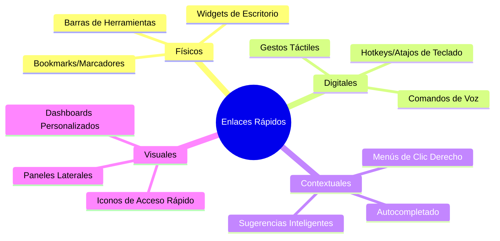
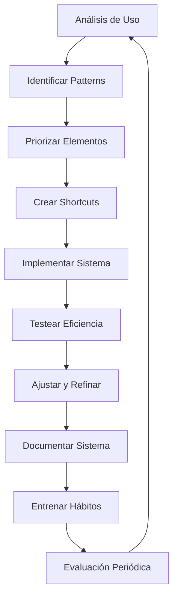

# 🔗 Enlaces Rápidos - Sistema de Navegación Eficiente

## 📋 Definición

> [!info] ¿Qué son los Enlaces Rápidos? Los enlaces rápidos son un sistema de navegación que permite acceder instantáneamente a contenido frecuentemente utilizado mediante combinaciones de teclas, comandos o elementos de interfaz personalizados. Funcionan como atajos directos que eliminan la necesidad de navegar manualmente a través de múltiples menús o carpetas.

## 🎯 Beneficios Principales

> [!tip] Ventajas de Implementar Enlaces Rápidos
> 
> - **⚡ Velocidad**: Acceso instantáneo a recursos importantes
> - **🎯 Eficiencia**: Reducción del tiempo de búsqueda y navegación
> - **🧠 Carga Mental**: Menor esfuerzo cognitivo para encontrar información
> - **⚙️ Personalización**: Adaptación a flujos de trabajo específicos
> - **🔄 Consistencia**: Patrones de navegación predecibles

## 🏗️ Tipos de Enlaces Rápidos

## ⚙️ Implementación en Diferentes Sistemas

### 🖥️ Sistemas Operativos

> [!tip] Windows
> 
> - **Win + R**: Ejecutar comandos rápidos
> - **Win + Número**: Acceso directo a aplicaciones en la barra de tareas
> - **Ctrl + Shift + Esc**: Administrador de tareas instantáneo
> - **Win + E**: Explorador de archivos

> [!tip] macOS
> 
> - **Cmd + Space**: Spotlight para búsqueda universal
> - **Cmd + Tab**: Alternador de aplicaciones
> - **Cmd + ` **: Cambiar entre ventanas de la misma app
> - **Control + ↑**: Mission Control

> [!tip] Linux
> 
> - **Alt + F2**: Lanzador de aplicaciones
> - **Ctrl + Alt + T**: Terminal rápido
> - **Super + D**: Mostrar escritorio
> - Configuración personalizada con herramientas como Rofi o Ulauncher

### 📱 Aplicaciones Móviles

> [!info] Estrategias Móviles
> 
> - **Widgets en pantalla principal**: Información y acciones rápidas
> - **3D Touch/Haptic Touch**: Menús contextuales en iOS
> - **Gestos personalizados**: Deslizamientos y toques específicos
> - **Shortcuts de Siri**: Comandos de voz personalizados

### 🌐 Navegadores Web

> [!tip] Optimización Web
> 
> - **Bookmarks Toolbar**: Enlaces visibles permanentemente
> - **Speed Dial**: Páginas de inicio personalizadas
> - **Extensiones de marcadores**: Gestión avanzada
> - **Búsquedas personalizadas**: Keywords para sitios específicos

## 🔧 Herramientas Especializadas

### 📝 Obsidian

> [!warning] Configuración en Obsidian
> 
> - **Hotkeys personalizados**: Asignación de teclas a comandos frecuentes
> - **Templates con shortcuts**: Plantillas de acceso rápido
> - **Plugin Quick Switcher**: Navegación ultra-rápida entre notas
> - **Starred notes**: Marcado de notas importantes
> - **Graph view shortcuts**: Navegación visual del knowledge graph

### 💼 Productividad General

> [!info] Herramientas Recomendadas
> 
> - **Alfred (macOS)**: Launcher avanzado con workflows
> - **PowerToys (Windows)**: Suite de utilidades incluyendo PowerToys Run
> - **Launchy**: Launcher multiplataforma
> - **Cerebro**: Alternativa de código abierto a Alfred
> - **Wox**: Launcher para Windows inspirado en Alfred

## 📊 Estrategias de Optimización

### 🎯 Principios de Diseño

> [!tip] Mejores Prácticas
> 
> - **Consistencia**: Patrones similares en diferentes contextos
> - **Memorabilidad**: Combinaciones lógicas y fáciles de recordar
> - **Contexto**: Enlaces relevantes según la situación actual
> - **Jerarquía**: Los elementos más usados deben ser más accesibles
> - **Flexibilidad**: Capacidad de personalización según necesidades

## 🧠 Impacto Psicológico

> [!info] Beneficios Cognitivos
> 
> - **Reducción de Fricción Mental**: Menos decisiones micro para navegar
> - **Flow State**: Mantenimiento del estado de concentración
> - **Automatización**: Conversión de acciones conscientes en hábitos
> - **Confianza**: Sensación de control sobre el entorno digital

## ⚠️ Consideraciones y Limitaciones

> [!warning] Potenciales Problemas
> 
> - **Sobrecarga inicial**: Tiempo de configuración y aprendizaje
> - **Dependencia**: Dificultad para trabajar sin los shortcuts habituales
> - **Conflictos**: Interferencia entre diferentes sistemas de atajos
> - **Mantenimiento**: Necesidad de actualizar y ajustar regularmente

## 📈 Métricas de Efectividad

> [!tip] Indicadores de Éxito
> 
> - **Tiempo de acceso**: Segundos ahorrados por tarea
> - **Frecuencia de uso**: Qué shortcuts se usan más
> - **Tasa de abandono**: Cuántos shortcuts dejan de usarse
> - **Satisfacción del usuario**: Percepción de mejora en productividad

---

## 📎 Referencias

> [!quote] Enlaces a Otras Notas
> 
> - [[Gestión del Tiempo]] - Optimización temporal mediante shortcuts
> - [[Dashboard Semanal]] Navegación rápida al control semanal
> - [[Bullet Journal Method (BuJo)]] - Método de organización diaria
> - [[Apps de Productividad]] Aplicaciones de uso frecuente 

## 📚 Notas Recomendadas

> [!info] Lecturas Complementarias
> 
> - [[Atajos de Teclado Universales]] - Guía completa de combinaciones útiles
> - [[Organización Física del Espacio]] - Optimización del entorno de trabajo

---

_Tags: #productividad #shortcuts #navegación #eficiencia #automatización #workspace #hotkeys #optimización #herramientas #ux_