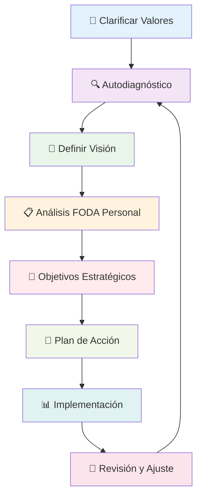

# Planificación Estratégica

> [!info] 🎯 **Objetivo de la Nota** Dominar el arte de la planificación estratégica para crear un roadmap claro hacia el logro de objetivos a largo plazo, alineando recursos, tiempo y energía de manera efectiva.

## 🧠 Fundamentos Teóricos

> [!tip] 💡 **Definición de Planificación Estratégica** La planificación estratégica es un proceso sistemático de definición de objetivos a largo plazo, análisis del entorno, identificación de recursos y diseño de estrategias para alcanzar una visión específica de futuro.

### Niveles de Planificación

> [!note] 📋 **Jerarquía Estratégica**
> 
> |Nivel|Horizonte Temporal|Enfoque|Características|
> |---|---|---|---|
> |**Estratégico**|3-10 años|Visión y dirección|- Definición de misión<br>- Objetivos macro<br>- Ventajas competitivas|
> |**Táctico**|1-3 años|Planes de acción|- Programas específicos<br>- Asignación de recursos<br>- Métricas intermedias|
> |**Operativo**|3-12 meses|Ejecución diaria|- Tareas concretas<br>- Cronogramas detallados<br>- KPIs específicos|



```mermaid
graph TD
    A[🎯 Planificación Estratégica] --> B[📊 Análisis Situacional]
    A --> C[🔮 Visión y Misión]
    A --> D[🎯 Objetivos Estratégicos]
    A --> E[💡 Estrategias]
    A --> F[📈 Implementación]
    A --> G[🔄 Evaluación y Control]
    
    B --> H[FODA/SWOT]
    B --> I[Análisis del Entorno]
    
    C --> J[Valores]
    C --> K[Propósito]
    
    D --> L[Objetivos SMART]
    D --> M[KPIs]
    
    E --> N[Estrategias Competitivas]
    E --> O[Allocation de Recursos]
    
    F --> P[Planes de Acción]
    F --> Q[Cronogramas]
    
    G --> R[Monitoreo]
    G --> S[Ajustes]
    
    classDef estrategico fill:#e8f5e8,stroke:#2e7d32,stroke-width:3px
    classDef analisis fill:#e3f2fd,stroke:#1565c0,stroke-width:2px
    classDef vision fill:#f3e5f5,stroke:#6a1b9a,stroke-width:2px
    classDef objetivos fill:#fff3e0,stroke:#ef6c00,stroke-width:2px
    classDef estrategias fill:#ffebee,stroke:#c62828,stroke-width:2px
    classDef implementacion fill:#f1f8e9,stroke:#558b2f,stroke-width:2px
    classDef evaluacion fill:#fce4ec,stroke:#ad1457,stroke-width:2px
    
    class A estrategico
    class B,H,I analisis
    class C,J,K vision
    class D,L,M objetivos
    class E,N,O estrategias
    class F,P,Q implementacion
    class G,R,S evaluacion
```

## 🔍 Proceso de Planificación Estratégica

> [!success] 🗺️ **Framework Integral: Metodología ASPIRE**

### Fase 1: Análisis Situacional

> [!info] 📊 **A - Análisis del Estado Actual**
> 
> #### Matriz FODA Personal/Organizacional
> 
> |Interno|Fortalezas (S)|Debilidades (W)|
> |---|---|---|
> |**Factores Controlables**|- Habilidades únicas<br>- Recursos disponibles<br>- Experiencia acumulada|- Áreas de mejora<br>- Limitaciones actuales<br>- Recursos faltantes|
> 
> |Externo|Oportunidades (O)|Amenazas (T)|
> |---|---|---|
> |**Factores del Entorno**|- Tendencias favorables<br>- Nuevos mercados<br>- Tecnologías emergentes|- Competencia<br>- Cambios regulatorios<br>- Riesgos económicos|

> [!tip] 🎯 **Herramientas de Análisis**
> 
> - **Análisis PESTEL**: Político, Económico, Social, Tecnológico, Ecológico, Legal
> - **5 Fuerzas de Porter**: Para análisis competitivo
> - **Análisis de Stakeholders**: Identificación de partes interesadas
> - **Benchmarking**: Comparación con mejores prácticas

### Fase 2: Definición de Aspiraciones

> [!note] 🌟 **S - Statement de Visión, Misión y Valores**
> 
> #### Elementos Fundamentales
> 
> |Componente|Pregunta Clave|Ejemplo Personal|
> |---|---|---|
> |**Visión**|¿Qué quiero lograr a largo plazo?|"Ser reconocido como experto en mi campo"|
> |**Misión**|¿Cuál es mi propósito actual?|"Desarrollar soluciones innovadoras"|
> |**Valores**|¿Qué principios me guían?|"Integridad, excelencia, colaboración"|

### Fase 3: Priorización Estratégica

> [!success] 🎯 **P - Priorización de Objetivos Estratégicos**
> 
> #### Matriz de Priorización (Impacto vs Esfuerzo)
> 
> ```mermaid
> graph LR
>     A[📊 Alto Impacto<br>Bajo Esfuerzo] --> B[⭐ PRIORIDAD MÁXIMA]
>     C[📈 Alto Impacto<br>Alto Esfuerzo] --> D[🎯 PROYECTOS ESTRATÉGICOS]
>     E[📉 Bajo Impacto<br>Bajo Esfuerzo] --> F[🔧 MEJORAS RÁPIDAS]
>     G[❌ Bajo Impacto<br>Alto Esfuerzo] --> H[🚫 EVITAR]
>     
>     style B fill:#c8e6c9,stroke:#2e7d32,stroke-width:3px
>     style D fill:#fff3e0,stroke:#ef6c00,stroke-width:2px
>     style F fill:#e3f2fd,stroke:#1565c0,stroke-width:2px
>     style H fill:#ffebee,stroke:#c62828,stroke-width:2px
> ```

### Fase 4: Desarrollo de Iniciativas

> [!info] 💡 **I - Iniciativas y Estrategias**
> 
> #### Tipos de Estrategias
> 
> |Estrategia|Descripción|Cuándo Usar|
> |---|---|---|
> |**Crecimiento**|Expansión de capacidades|Mercados/oportunidades en crecimiento|
> |**Estabilidad**|Mantener posición actual|Entornos estables y maduros|
> |**Renovación**|Transformación profunda|Crisis o cambios disruptivos|
> |**Cosecha**|Maximizar retorno actual|Declive o salida planificada|

### Fase 5: Asignación de Recursos

> [!warning] 📊 **R - Resource Allocation (Asignación de Recursos)**
> 
> #### Framework de Distribución
> 
> - **Tiempo**: 40% Estratégico | 35% Táctico | 25% Operativo
> - **Energía**: Enfoque en actividades de alto impacto
> - **Recursos Financieros**: Inversión balanceada corto/largo plazo
> - **Capital Humano**: Desarrollo de competencias clave

### Fase 6: Evaluación Continua

> [!success] 🔄 **E - Evaluation & Control (Evaluación y Control)**
> 
> #### Dashboard Estratégico
> 
> |KPI|Métrica|Frecuencia|Objetivo|
> |---|---|---|---|
> |**Progreso Objetivos**|% Completitud|Mensual|>80%|
> |**ROI Estratégico**|Valor/Inversión|Trimestral|>15%|
> |**Adaptabilidad**|Tiempo respuesta cambios|Semestral|<30 días|
> |**Satisfacción Stakeholders**|Escala 1-10|Anual|>8.0|

## 🧠 Técnica de Estudio: Método STRATEGIC

> [!tip] 📚 **Mnemotecnia para el Proceso de Planificación**

**S** - **S**ituación actual (Análisis FODA) **T** - **T**argets y objetivos (Metas específicas) **R** - **R**ecursos disponibles (Inventario de activos) **A** - **A**lternativas estratégicas (Opciones de acción) **T** - **T** áctical planning (Planes tácticos) **E** - **E**jecución disciplinada (Implementación) **G** - **G**overnance y control (Seguimiento) **I** - **I**nnovación continua (Adaptación) **C** - **C**omunicación efectiva (Alineación)

> [!info] 🎨 **Visualización del Método** Imagina la planificación estratégica como un **viaje en barco**: necesitas conocer tu posición actual (S), establecer el destino (T), verificar recursos (R), considerar rutas alternativas (A), planificar la navegación (T), zarpar con disciplina (E), mantener el rumbo (G), adaptar la ruta (I) y comunicar con la tripulación (C).

## 🛠️ Herramientas y Templates

> [!note] 🔧 **Kit de Herramientas Estratégicas**

### Template de Plan Estratégico

> [!success] 📋 **Estructura Base**
> 
> #### 1. Resumen Ejecutivo
> 
> - Visión en una página
> - Objetivos principales (3-5)
> - Estrategias clave
> - Recursos requeridos
> - Timeline general
> 
> #### 2. Análisis Situacional
> 
> - FODA completo
> - Análisis del entorno
> - Identificación de tendencias
> - Evaluación de competidores
> 
> #### 3. Direccionamiento Estratégico
> 
> - Misión actualizada
> - Visión a 3-5 años
> - Valores fundamentales
> - Objetivos SMART
> 
> #### 4. Estrategias y Tácticas
> 
> - Iniciativas prioritarias
> - Planes de acción detallados
> - Cronograma de implementación
> - Asignación de responsables
> 
> #### 5. Control y Seguimiento
> 
> - KPIs y métricas
> - Frecuencia de revisión
> - Mecanismos de ajuste
> - Plan de contingencias

### Herramientas Digitales Recomendadas

> [!tip] 💻 **Tecnologías de Soporte**
> 
> |Categoría|Herramientas|Uso Principal|
> |---|---|---|
> |**Análisis**|SWOT Matrix, Porter's 5 Forces|Análisis estratégico|
> |**Planificación**|Gantt Charts, Roadmaps|Cronogramas y timelines|
> |**Colaboración**|Miro, Mural, Obsidian|Mapas mentales y documentación|
> |**Seguimiento**|OKR tools, Balanced Scorecard|KPIs y métricas|

## ⚠️ Errores Comunes y Cómo Evitarlos

> [!warning] 🚫 **Trampas de la Planificación Estratégica**

### Errores Frecuentes

> [!danger] ❌ **Problemas Típicos**
> 
> |Error|Consecuencia|Solución|
> |---|---|---|
> |**Análisis Superficial**|Estrategias desalineadas|Inversión adecuada en investigación|
> |**Objetivos Vagos**|Falta de dirección clara|Aplicar metodología SMART|
> |**Sobrecarga de Iniciativas**|Dispersión de recursos|Priorización rigurosa (máximo 3-5)|
> |**Falta de Flexibilidad**|Inadaptabilidad a cambios|Revisiones periódicas programadas|
> |**Comunicación Deficiente**|Desalineación de equipos|Plan de comunicación estructurado|

### Señales de Alerta

> [!warning] 🔔 **Indicadores de Problemas**
> 
> - Objetivos sin propietarios claros
> - Métricas que no se revisan regularmente
> - Planes que no se actualizan por >6 meses
> - Desconexión entre estrategia y actividades diarias
> - Resistencia generalizada al cambio

## 📊 Sistema de Medición y Control

> [!info] 📈 **Balanced Scorecard Personal/Organizacional**

### Perspectivas de Evaluación

> [!note] 🎯 **Cuatro Perspectivas Clave**
> 
> ```mermaid
> graph TD
>     A[⚖️ Balanced Scorecard] --> B[💰 Financiera]
>     A --> C[👥 Stakeholders]
>     A --> D[🔄 Procesos Internos]
>     A --> E[📚 Aprendizaje y Crecimiento]
>     
>     B --> F[ROI, Ingresos, Costos]
>     C --> G[Satisfacción, Retención, Nuevos]
>     D --> H[Eficiencia, Calidad, Innovación]
>     E --> I[Competencias, Cultura, Tecnología]
>     
>     style A fill:#e8f5e8,stroke:#2e7d32,stroke-width:3px
>     style B fill:#fff3e0,stroke:#ef6c00,stroke-width:2px
>     style C fill:#e3f2fd,stroke:#1565c0,stroke-width:2px
>     style D fill:#f3e5f5,stroke:#6a1b9a,stroke-width:2px
>     style E fill:#ffebee,stroke:#c62828,stroke-width:2px
> ```

### Ciclo de Revisión Estratégica

> [!success] 🔄 **Frecuencias de Evaluación**
> 
> |Período|Actividades|Enfoque|
> |---|---|---|
> |**Diario**|Check-in de actividades clave|Ejecución táctica|
> |**Semanal**|Revisión de métricas operativas|Ajustes menores|
> |**Mensual**|Análisis de KPIs estratégicos|Progreso hacia objetivos|
> |**Trimestral**|Evaluación integral de estrategia|Ajustes tácticos|
> |**Semestral**|Revisión de entorno y competencia|Validación de supuestos|
> |**Anual**|Planificación estratégica completa|Redefinición de rumbo|

## 🎯 Casos de Aplicación

> [!tip] 💼 **Ejemplos Prácticos**

### Planificación Estratégica Personal

> [!info] 🧑‍💼 **Desarrollo Profesional**
> 
> #### Ejemplo: Transición de Carrera
> 
> - **Situación**: Profesional en ingeniería buscando migrar a gestión
> - **Visión**: Líder de equipos técnicos en empresa tecnológica
> - **Estrategias**:
>     - Obtener MBA o certificación en gestión
>     - Asumir proyectos con componente de liderazgo
>     - Desarrollar network en área objetivo
>     - Mentoring con líderes exitosos
> - **Timeline**: 24 meses
> - **Métricas**: Certificaciones obtenidas, proyectos liderados, conexiones establecidas

### Planificación Académica

> [!success] 🎓 **Estrategia de Estudios**
> 
> #### Ejemplo: Maximización del Rendimiento Académico
> 
> - **Análisis**: Fortalezas en matemáticas, debilidad en escritura
> - **Objetivo**: Promedio >9.0 y desarrollo de habilidades integrales
> - **Estrategias**:
>     - Técnica Pomodoro para materias difíciles
>     - Grupos de estudio para escritura
>     - Proyectos interdisciplinarios
>     - Sistema de recompensas por logros
> - **Control**: Evaluaciones semanales, ajuste de métodos según resultados

## 🔗 Referencias

> [!quote] 📚 **Enlaces a Notas Relacionadas**
> 
> - [[Objetivos 2025]] - Aplicación práctica de planificación anual
> - [[Pensamiento Estratégico]] - Desarrollo del mindset estratégico
> - [[Planificación Estratégica]] - Enfoque individual
> - [[Objetivos SMART]] - Metodología específica para metas
> - [[Matriz de Eisenhower]] - Priorización de actividades
> - [[Gestión de Proyectos]] - Implementación táctica
> - [[Toma de Decisiones]] - Proceso de decisión estratégica
> - [[Análisis Costo-Beneficio]] - Evaluación de alternativas
> - [[Sistemas de Revisión]] - Mecanismos de control

## 📖 Notas Recomendadas para Complementar

> [!info] 📋 **Prerrequisitos y Temas Complementarios**

### Prerrequisitos Esenciales

- [[Definición de Propósito]] - Claridad de dirección personal
- [[Clarificación de Valores]] - Base para decisiones estratégicas
- [[Autoconocimiento]] - Comprensión de fortalezas y limitaciones
- [[Gestión del Tiempo]] - Habilidades de organización básicas

### Temas Complementarios Avanzados

- [[Liderazgo Situacional]] - Implementación a través de liderazgo
- [[Creatividad y Innovación]] - Generación de ventajas competitivas
- [[Comunicación Efectiva]] - Socialización de estrategias
- [[Cultura Organizacional]] - Alineación cultural con estrategia

### Herramientas de Soporte

- [[Time Blocking]] - Implementación táctica de planes
- [[Dashboard Semanal]] - Seguimiento operativo
- [[Tracking de Hábitos]] - Construcción de disciplinas estratégicas
- [[Sistemas de Productividad]] - Optimización de ejecución

### Aplicaciones Especializadas

- [[Gestión de Reuniones Efectivas]] - Alineación de equipos
- [[Delegación Efectiva]] - Escalabilidad de estrategias
- [[Gestión de Proyectos]] - Ejecución de iniciativas estratégicas

---

> [!tip] 🎯 **Recordatorio Final** La planificación estratégica no es un evento único, sino un proceso continuo de adaptación inteligente. El plan perfecto que no se ejecuta vale menos que un plan bueno que se implementa consistentemente.

**Tags:** #planificacion-estrategica #estrategia #objetivos #liderazgo #gestion #productividad #desarrollo-personal #toma-decisiones #vision #mision #analisis-swot #kpis #balanced-scorecard #metodologia-aspire

# Planificación Estratégica Personal 🎯

> [!info] Definición La **planificación estratégica personal** es el proceso sistemático de definir tu dirección de vida a largo plazo, establecer metas significativas y crear un plan de acción para lograrlas. Es la aplicación de principios estratégicos empresariales a tu desarrollo personal y profesional.

## 🧭 Componentes Fundamentales

> [!tip] Elementos Esenciales
> 
> ### 1. Autoconocimiento Profundo 🔍
> 
> - **Valores personales**: Principios que guían tus decisiones
> - **Fortalezas y talentos**: Habilidades naturales y desarrolladas
> - **Propósito de vida**: Razón de ser y contribución al mundo
> 
> ### 2. Visión Personal 🌟
> 
> - **Imagen del futuro deseado**: Cómo quieres vivir en 5-10 años
> - **Roles importantes**: Profesional, familiar, social, personal
> - **Legado**: Impacto que deseas dejar
> 
> ### 3. Análisis Situacional 📊
> 
> - **Posición actual**: Dónde te encuentras hoy
> - **Brechas**: Diferencia entre situación actual y visión
> - **Recursos disponibles**: Tiempo, dinero, habilidades, red de contactos

## 🔄 Proceso de Planificación Estratégica Personal



## 📋 Marco de Análisis FODA Personal

> [!warning] Herramienta de Autoevaluación
> 
> |Categoría|Factores Internos|Factores Externos|
> |---|---|---|
> |**Positivos**|💪 **Fortalezas**<br/>- Habilidades únicas<br/>- Experiencia relevante<br/>- Red de contactos<br/>- Recursos disponibles|🌟 **Oportunidades**<br/>- Tendencias del mercado<br/>- Nuevas tecnologías<br/>- Cambios sociales<br/>- Nichos emergentes|
> |**Negativos**|⚠️ **Debilidades**<br/>- Áreas de mejora<br/>- Limitaciones actuales<br/>- Hábitos negativos<br/>- Recursos escasos|🚨 **Amenazas**<br/>- Competencia creciente<br/>- Cambios tecnológicos<br/>- Crisis económicas<br/>- Obsolescencia de habilidades|

## 🎯 Áreas Clave de Planificación

> [!info] Dimensiones de la Vida
> 
> ### Profesional 💼
> 
> - **Carrera**: Progresión y desarrollo profesional
> - **Ingresos**: Objetivos financieros y fuentes de ingreso
> - **Habilidades**: Competencias a desarrollar
> - **Red profesional**: Relaciones estratégicas
> 
> ### Personal 🌱
> 
> - **Salud**: Física, mental y emocional
> - **Relaciones**: Familia, pareja, amistades
> - **Crecimiento**: Aprendizaje continuo y hobbies
> - **Espiritualidad**: Búsqueda de sentido y trascendencia
> 
> ### Financiera 💰
> 
> - **Presupuesto**: Control de gastos e ingresos
> - **Ahorro**: Fondos de emergencia y objetivos
> - **Inversión**: Crecimiento patrimonial
> - **Jubilación**: Planificación a largo plazo

## 📊 Metodología de Objetivos Estratégicos

> [!tip] Framework de Objetivos Escalonados
> 
> ### Nivel 1: Visión (10-20 años) 🔭
> 
> - Imagen aspiracional del futuro
> - Propósito de vida clarificado
> - Legado personal deseado
> 
> ### Nivel 2: Objetivos Estratégicos (3-5 años) 🎯
> 
> - Metas principales por área de vida
> - Hitos importantes de progreso
> - Cambios fundamentales requeridos
> 
> ### Nivel 3: Metas Anuales (1 año) 📅
> 
> - Objetivos SMART específicos
> - Proyectos concretos a realizar
> - Hábitos a desarrollar o cambiar
> 
> ### Nivel 4: Acciones Trimestrales (3 meses) ⚡
> 
> - Iniciativas específicas
> - Hitos de seguimiento
> - Ajustes tácticos

## 🔧 Herramientas de Implementación

> [!warning] Instrumentos Prácticos
> 
> ### Planificación 📋
> 
> - **Mapa de vida**: Visualización de áreas y objetivos
> - **Cronograma maestro**: Timeline de objetivos principales
> - **Dashboard personal**: Métricas clave de seguimiento
> 
> ### Organización 🗂️
> 
> - **Sistema GTD**: Getting Things Done para tareas
> - **Time blocking**: Asignación temporal estratégica
> - **Revisiones periódicas**: Semanal, mensual, trimestral
> 
> ### Seguimiento 📈
> 
> - **Journal reflexivo**: Registro de avances y aprendizajes
> - **Métricas personales**: KPIs de progreso
> - **Accountability partner**: Compañero de rendición de cuentas

## ⚡ Obstáculos Comunes y Soluciones

> [!warning] Desafíos Frecuentes
> 
> ### Procrastinación 😴
> 
> - **Problema**: Postergar acciones importantes
> - **Solución**: Técnica de los 2 minutos + time blocking
> 
> ### Falta de Claridad 🌫️
> 
> - **Problema**: Objetivos vagos o conflictivos
> - **Solución**: Ejercicios de clarificación de valores + coaching
> 
> ### Sobrecarga 🌪️
> 
> - **Problema**: Demasiados objetivos simultáneos
> - **Solución**: Priorización con Matriz de Eisenhower + Enfoque 80/20
> 
> ### Pérdida de Motivación 📉
> 
> - **Problema**: Desánimo por falta de progreso visible
> - **Solución**: Celebración de pequeños logros + revisión de propósito

## 🎨 Técnicas de Visualización

> [!info] Herramientas Creativas
> 
> ### Vision Board 🖼️
> 
> - Collage visual de objetivos y sueños
> - Imágenes inspiradoras y motivacionales
> - Ubicación visible para recordatorio diario
> 
> ### Mapa Mental Personal 🧠
> 
> - Centro: Tu identidad/propósito
> - Ramas: Áreas principales de vida
> - Sub-ramas: Objetivos específicos
> 
> ### Timeline de Vida 📈
> 
> - Línea temporal con hitos importantes
> - Pasado, presente y futuro proyectado
> - Identificación de patrones y tendencias

## 📚 Referencias

> [!quote] Enlaces a Notas Relacionadas
> 
> - [[Pensamiento Estratégico]]
> - [[Clarificación de Valores]]
> - [[Objetivos 2025]]
> - [[Objetivos SMART]]
> - [[Toma de Decisiones]]
> - [[El Arte de Decir No]]
> - [[Análisis Costo-Beneficio]]

## 📖 Notas Recomendadas para Complementar

> [!tip] Prerrequisitos y Temas Relacionados
> 
> ### Prerrequisitos 📋
> 
> - [[Clarificación de Valores]] - Base para todas las decisiones
> - [[Autoconocimiento]] - Comprensión profunda de fortalezas y limitaciones
> - [[Definición de Propósito]] - Razón de ser y dirección vital
> 
> ### Metodologías de Apoyo 🔗
> 
> - [[Matriz de Eisenhower]] - Priorización de objetivos
> - [[Time Blocking]] - Asignación temporal estratégica
> - [[Deep Work]] - Concentración para planificación profunda
> - [[Bullet Journal Method (BuJo)]] - Sistema de organización personal
> - [[Técnicas de Concentración]] - Para sesiones de planificación
> 
> ### Seguimiento y Control 📊
> 
> - [[Dashboard Semanal]] - Monitoreo de progreso
> - [[Tracking de Hábitos]] - Desarrollo de comportamientos clave
> - [[Enlaces Rápidos]] - Acceso eficiente a herramientas
> - [[Sistemas de Revisión]] - Evaluación periódica de avances

## 🧠 Técnica de Estudio: Método PLANIFICA

> [!tip] Mnemotécnica para el Proceso **P** - Propósito: Define tu razón de ser **L** - Localiza tu posición actual (diagnóstico) **A** - Analiza fortalezas, debilidades, oportunidades y amenazas **N** - Navega hacia tu visión ideal (define el destino) **I** - Identifica objetivos estratégicos clave **F** - Formula planes de acción específicos **I** - Implementa con disciplina y constancia **C** - Controla el progreso con métricas **A** - Ajusta la estrategia según resultados
> 
> **Frase memorable**: _"Para Lograr Algo Notable, Imagina Futuro Increíble, Construye Ahora"_

## 🎯 Ejercicio Práctico: Tu Plan Estratégico Personal

> [!warning] Actividad de Desarrollo
> 
> ### Sesión de Planificación Intensiva (4 horas) ⏱️
> 
> #### Fase 1: Reflexión (60 min)
> 
> 1. **Valores fundamentales**: Lista tus 5 valores más importantes
> 2. **Rueda de la vida**: Evalúa satisfacción en 8 áreas (1-10)
> 3. **Logros pasados**: Identifica patrones de éxito
> 
> #### Fase 2: Visión (60 min)
> 
> 4. **Ejercicio del funeral**: ¿Qué dirían de ti en 50 años?
> 5. **Día ideal**: Describe un día perfecto en tu vida futura
> 6. **Roles principales**: Define tus identidades clave
> 
> #### Fase 3: Estrategia (90 min)
> 
> 7. **FODA personal**: Completa la matriz de análisis
> 8. **Objetivos 3-5 años**: 3-5 metas por área principal
> 9. **Indicadores**: Define cómo medirás el progreso
> 
> #### Fase 4: Acción (30 min)
> 
> 10. **Próximos 90 días**: 3 acciones prioritarias
> 11. **Sistema de seguimiento**: Elige herramientas
> 12. **Fecha de revisión**: Agenda próxima evaluación

## 📋 Plantilla de Plan Estratégico Personal

> [!info] Estructura Sugerida
> 
> ```markdown
> ## Mi Plan Estratégico Personal 2025-2030
> 
> ### 🎯 Propósito de Vida
> - [Escribe tu misión personal]
> 
> ### 🌟 Visión (2030)
> - [Describe cómo quieres vivir en 5 años]
> 
> ### 💎 Valores Fundamentales
> 1. [Valor 1]
> 2. [Valor 2]
> 3. [Valor 3]
> 
> ### 📊 Análisis Situacional
> #### Fortalezas:
> - [Lista 3-5 fortalezas clave]
> 
> #### Oportunidades:
> - [Lista 3-5 oportunidades principales]
> 
> ### 🎯 Objetivos Estratégicos (2025-2027)
> #### Profesional:
> - [Objetivo 1]
> - [Objetivo 2]
> 
> #### Personal:
> - [Objetivo 1]
> - [Objetivo 2]
> 
> #### Financiero:
> - [Objetivo 1]
> - [Objetivo 2]
> 
> ### ⚡ Acciones Próximos 90 Días
> 1. [Acción prioritaria 1]
> 2. [Acción prioritaria 2]
> 3. [Acción prioritaria 3]
> ```

---

**Tags**: #planificacion-estrategica #desarrollo-personal #objetivos-personales #vision-personal #proposito-de-vida #autoconocimiento #planificacion-vida #metas-largo-plazo #estrategia-personal #crecimiento-personal #clarificacion-valores #analisis-foda-personal