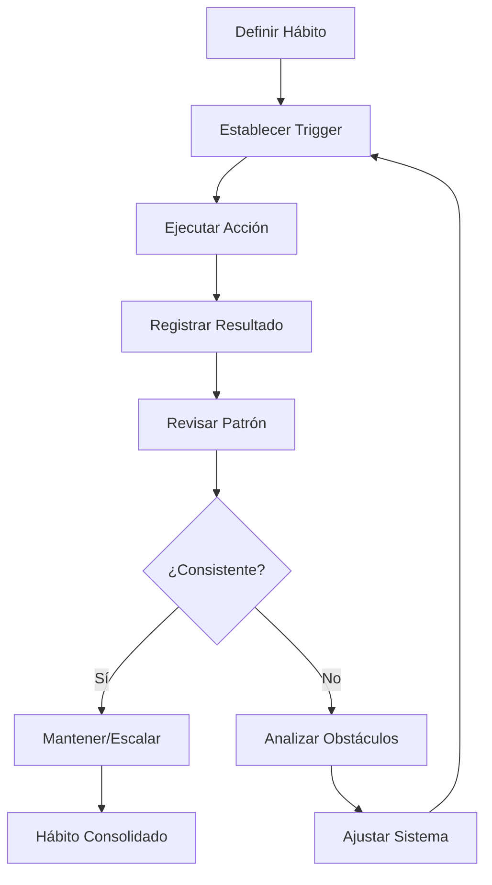
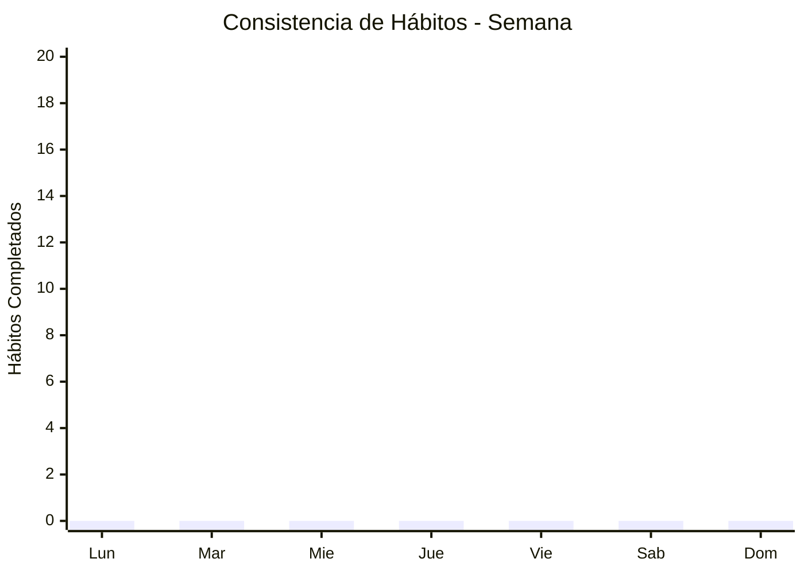
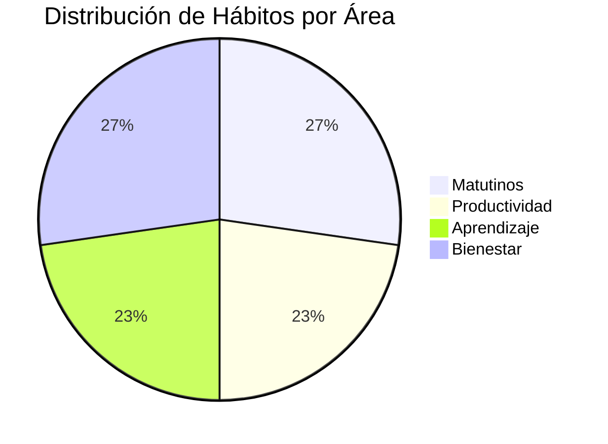
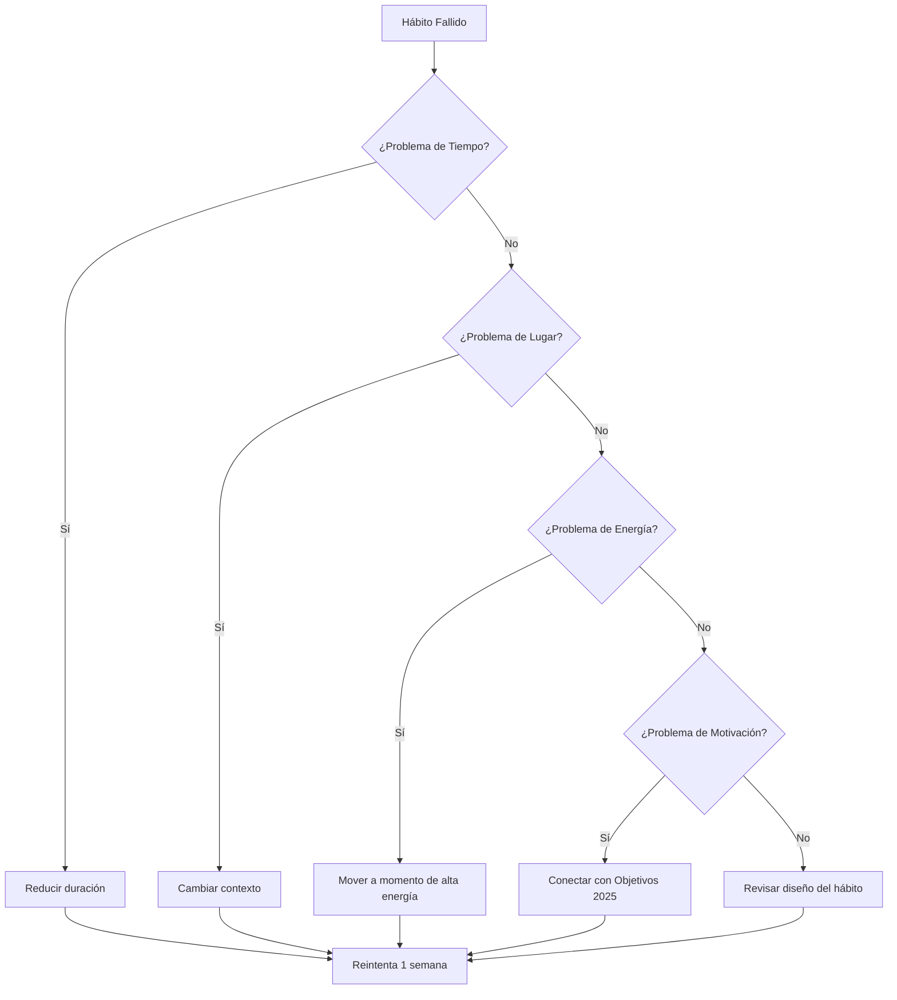

# 📈 Tracking de Hábitos

> [!tip] 🎯 Propósito del Sistema Este sistema te permite monitorear, analizar y optimizar tus hábitos diarios para crear una vida más intencional y productiva. La consistencia pequeña genera transformaciones masivas.

## 🏗️ Arquitectura del Sistema

> [!info] 🔄 Filosofía del Tracking "Lo que se mide, se mejora" - Cada hábito trackeado es un paso hacia la versión mejorada de ti mismo.

## 📋 Template de Hábitos Diarios

> [!warning] 📅 Uso Diario Copia este template cada día en tu [[Dashboard Semanal]] o [[Bullet Journal Method (BuJo)]] para tracking consistente.

### 🌅 **Hábitos Matutinos**

> [!tip] ☀️ Power Morning Los hábitos matutinos establecen el tono del día. Referencia [[Hábitos y Rutinas Saludables]] para optimizar tu rutina.

| Hábito                        | Target       | ✅ Hecho | 📊 Calidad (1-5) | 📝 Notas |
| ----------------------------- | ------------ | ------- | ---------------- | -------- |
| 🛏️ Levantarse temprano       | 6:00 AM      | [ ]     | _                |          |
| 🥤 Vaso de agua               | 500ml        | [ ]     | _                |          |
| 🧘 [[Técnicas de Relajación]] | 10 min       | [ ]     | _                |          |
| 📖 Lectura                    | 15 min       | [ ]     | _                |          |
| 🏃 [[Ejercicio y Cognición]]  | 30 min       | [ ]     | _                |          |
| 📱 No revisar teléfono        | Primera hora | [ ]     | _                |          |

### 💪 **Hábitos de Productividad**

> [!info] 🎯 Deep Work Zone Integra con [[Deep Work]] y [[Técnicas de Concentración]] para máximo rendimiento.

|Hábito|Target|✅ Hecho|📊 Calidad (1-5)|📝 Notas|
|---|---|---|---|---|
|🍅 [[Método 1 - Pomodoro]]|4 sesiones|[ ]|_||
|📝 Planificar día|10 min|[ ]|_||
|🚫 [[Detox Digital]]|2h focus|[ ]|_||
|📊 Revisar [[Objetivos 2025]]|5 min|[ ]|_||
|🧹 [[Organización Física del Espacio]]|15 min|[ ]|_||

### 🧠 **Hábitos de Aprendizaje**

> [!tip] 📚 Growth Mindset Conecta con [[Neurociencia del Aprendizaje]] y [[Metacognición]] para aprendizaje efectivo.

|Hábito|Target|✅ Hecho|📊 Calidad (1-5)|📝 Notas|
|---|---|---|---|---|
|📖 Estudio activo|45 min|[ ]|_||
|🗣️ [[Método 2 - Feynman]]|1 concepto|[ ]|_||
|🧠 [[Curva del Olvido]] review|20 min|[ ]|_||
|📝 Crear 1 nota nueva|1 nota|[ ]|_||
|🎧 Podcast educativo|20 min|[ ]|_||

### 💚 **Hábitos de Bienestar**

> [!warning] ⚖️ Balance Esencial Usa [[Gestión del Estrés]] y [[Mindfulness]] para mantener equilibrio sostenible.

| Hábito                                      | Target     | ✅ Hecho | 📊 Calidad (1-5) | 📝 Notas |
| ------------------------------------------- | ---------- | ------- | ---------------- | -------- |
| 💧 Hidratación                              | 2L agua    | [ ]     | _                |          |
| 🥗 [[Nutrición para el cerebro]] consciente | 3 comidas  | [ ]     | _                |          |
| 🚶 Caminar                                  | 8000 pasos | [ ]     | _                |          |
| 😴 [[Higiene de Sueño]] Realizado           | 22:30      | [ ]     | _                |          |
| 🙏 Gratitud                                 | 3 cosas    | [ ]     | _                |          |
| 📵 Sin pantallas 1h antes dormir            | 21:30      | [ ]     | _                |          |

## 📊 Dashboard de Análisis Semanal

> [!info] 📈 Métricas de Progreso Revisa cada domingo en tu [[Dashboard Semanal]] para identificar patrones y optimizar.

> [!tip] 🏆 Scorecard Semanal Completa esta tabla cada domingo para visualizar tu progreso y identificar áreas de mejora.

|Categoría|Lun|Mar|Mie|Jue|Vie|Sab|Dom|Total|%|
|---|---|---|---|---|---|---|---|---|---|
|🌅 Matutinos|_/6|_/6|_/6|_/6|_/6|_/6|_/6|_/42|_%|
|💪 Productividad|_/5|_/5|_/5|_/5|_/5|_/5|_/5|_/35|_%|
|🧠 Aprendizaje|_/5|_/5|_/5|_/5|_/5|_/5|_/5|_/35|_%|
|💚 Bienestar|_/6|_/6|_/6|_/6|_/6|_/6|_/6|_/42|_%|
|**TOTAL**|**_/22**|**_/22**|**_/22**|**_/22**|**_/22**|**_/22**|**_/22**|**_/154**|**_%**|

> [!success] 🎯 Hábitos por Dominio Esta distribución te ayuda a mantener balance entre todas las áreas de tu vida.

## 🔥 Sistema de Streaks

> [!tip] 🏃‍♂️ Momentum Building Los streaks crean momentum psicológico. ¡No rompas la cadena!

> [!warning] 🌟 Streaks Actuales Actualiza estos datos diariamente para mantener visibilidad de tu progreso.

|Hábito|🔥 Streak|🏆 Record|📅 Última vez|🎯 Meta|
|---|---|---|---|---|
|🧘 Meditación|0 días|0 días|__ / __ / __|21 días|
|🏃 Ejercicio|0 días|0 días|__ / __ / __|30 días|
|📖 Lectura|0 días|0 días|__ / __ / __|100 días|
|🥤 Agua temprano|0 días|0 días|__ / __ / __|14 días|
|📱 Sin teléfono AM|0 días|0 días|__ / __ / __|7 días|

> [!success] 🎉 Hábitos Consolidados (21+ días) Estos hábitos ya están integrados en tu rutina. ¡Celebra tus logros!

- [ ] _Agrega aquí los hábitos que ya dominas_

## 🛠️ Herramientas de Optimización

> [!warning] 🔍 Análisis de Obstáculos Cuando un hábito falla consistentemente, usa este framework para identificar la causa raíz.

### 📋 **Checklist de Diseño de Hábitos**

> [!info] 🎨 Habit Design Framework Usa este checklist antes de agregar un nuevo hábito al sistema.

- [ ] **Específico:** ¿Qué, cuándo, dónde exactamente?
- [ ] **Pequeño:** ¿Puedo hacerlo en 2 minutos?
- [ ] **Obvio:** ¿El trigger es claro y visible?
- [ ] **Atractivo:** ¿Tengo una recompensa inmediata?
- [ ] **Fácil:** ¿He reducido la fricción al mínimo?
- [ ] **Satisfactorio:** ¿Siento logro al completarlo?
- [ ] **Alineado:** ¿Conecta con mis [[Objetivos 2025]]?

> [!tip] 🎮 Gamificación Personal Convierte tus hábitos en un juego personal para mantener motivación.

> [!success] 🏅 Sistema de Puntos Cada acción completada suma a tu progreso general hacia la maestría.

- ✅ Hábito completado = **1 punto**
- 🔥 Streak de 7 días = **5 puntos bonus**
- 🏆 Streak de 30 días = **20 puntos bonus**
- 💎 Mes perfecto (95%+) = **50 puntos bonus**

> [!warning] 🎯 Niveles de Maestría Progresa a través de estos niveles para mantener motivación a largo plazo.

- **Novato** (0-100 puntos): Estableciendo rutinas
- **Aprendiz** (101-300 puntos): Construyendo consistencia
- **Experto** (301-600 puntos): Optimizando sistemas
- **Maestro** (601-1000 puntos): Viviendo intencionalmente
- **Leyenda** (1000+ puntos): Inspiring others

## 📱 Herramientas Digitales Recomendadas

> [!info] 🔧 Tech Stack para Hábitos Integra estas herramientas con tu sistema analógico para máxima efectividad.

> [!tip] 📊 Apps de Tracking Estas aplicaciones complementan tu sistema Obsidian con tracking móvil y notificaciones.

- **Streaks** (iOS) - Para tracking visual simple
- **Habitica** - Gamificación completa
- **Way of Life** - Color coding rápido
- **Productive** - Diseño minimalista

> [!success] 🔗 Integraciones con [[Productividad Digital]] Automatiza el logging y análisis para reducir fricción en el tracking.

- **Apple Shortcuts** - Automatizar logging
- **IFTTT** - Conectar con otros servicios
- **Notion/Obsidian** - Análisis profundo de datos

## 🔄 Rutina de Revisión y Mejora

> [!warning] 📅 Schedule de Revisiones Sin revisión regular, el sistema se degrada. Agenda estas sesiones.

- **🌅 Diario (5 min):** Completar template del día
- **📊 Semanal (15 min):** Analizar scorecard y ajustar
- **🔍 Mensual (30 min):** Revisar hábitos, eliminar/agregar
- **🎯 Trimestral (60 min):** Alineación con [[Objetivos 2025]]

### 🔧 **Preguntas de Mejora Continua**

> [!tip] 🤔 Deep Reflection Estas preguntas guían la evolución de tu sistema de hábitos.

**Análisis semanal:**

- ¿Qué hábito fue más fácil de mantener esta semana?
- ¿Cuál fue el más difícil y por qué?
- ¿Qué patrón observo en mis días más exitosos?
- ¿Cómo puedo simplificar un hábito problemático?

> [!warning] 🔍 Optimización mensual Al final de cada mes, dedica tiempo a estas reflexiones estratégicas.

- ¿Algún hábito ya se siente automático?
- ¿Qué hábito agregaría más valor a mi vida?
- ¿Cuál debería eliminar por falta de alineación?
- ¿Cómo está conectando esto con mis objetivos mayores?

## 📚 Referencias

> [!quote] Enlaces a otras notas
> 
> - [[Dashboard Semanal]] - Para revisiones y métricas semanales
> 
> - [[Objetivos 2025]] - Alineación estratégica de hábitos
> - [[Hábitos de Estudio]] _(rutinas académicas específicas)_
>- [[Hábitos y Rutinas Saludables]] _(integración con bienestar)_
>- [[Gamificación Personal]] _(motivación mediante juegos)_

## 📖 Notas Recomendadas

> [!info] 🧠 Fundamentos Científicos Estas notas te ayudan a entender la ciencia detrás de la formación de hábitos.
> 
> - [[Neurociencia del Aprendizaje]] - Cómo el cerebro forma hábitos
> - [[Metacognición]] - Autoconciencia en el cambio de comportamiento
> - [[Gestión del Estrés]] - Mantener hábitos bajo presión
> - [[Mindfulness]] - Conciencia presente en la ejecución

> [!tip] 🎯 Productividad y Ejecución Integra estos métodos con tus hábitos para maximizar efectividad.
> 
> - [[Deep Work]] - Hábitos para trabajo profundo
> - [[Gestión del Tiempo]] - Integrar hábitos en horarios
> - [[Técnicas de Concentración]] - Hábitos de enfoque
> - [[Productividad en la Vida Real]] - Implementación práctica

> [!success] 💪 Bienestar Integral Construye una base sólida de salud física y mental.
> 
> - [[Ejercicio y Cognición]] - Hábitos de movimiento y fitness
> - [[Nutrición para el cerebro]] - Hábitos alimentarios saludables
> - [[Higiene de Sueño]] - Rutinas de descanso reparador
> - [[Técnicas de Relajación]] - Práctica contemplativa diaria

> [!warning] 🏠 Ambiente y Contexto Tu entorno determina el éxito de tus hábitos. Optimízalo estratégicamente.
> 
> - [[Organización Física del Espacio]] - Diseñar ambiente que apoye hábitos
> - [[Feng Shui para Espacios Pequeños]] - Optimizar flujo energético
> - [[Minimalismo Digital]] - Hábitos digitales saludables
> - [[Detox Digital]] - Boundaries con tecnología

> [!info] 🛠️ Herramientas y Métodos Complementa tu sistema con estas herramientas específicas.
> 
> - Carpeta Apps Productividad - Herramientas digitales para tracking
> - Carpeta Automatizaciones - Simplificar el proceso de seguimiento
> - [[Método 1 - Pomodoro]] - Estructura temporal para hábitos de estudio
> - [[Productividad Digital]] - Integración con sistemas digitales

---

**Tags:** #hábitos #tracking #rutinas #consistencia #bienestar #productividad #desarrollo-personal #seguimiento #objetivos #sistema