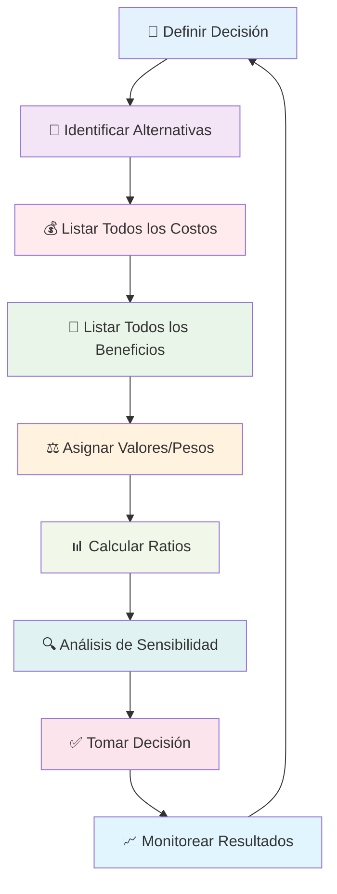

# Análisis Costo-Beneficio 📊

> [!info] Definición El **análisis costo-beneficio** es una técnica sistemática para evaluar decisiones comparando todos los costos (recursos invertidos, oportunidades perdidas, riesgos) con todos los beneficios (ganancias, valor creado, oportunidades generadas) de una acción o proyecto. Es fundamental para optimizar recursos y maximizar valor en cualquier ámbito de la vida.

## 🧮 Componentes del Análisis Costo-Beneficio

> [!tip] Elementos Fundamentales
> 
> ### 1. Identificación de Costos 💰
> 
> - **Costos directos**: Inversión monetaria inmediata
> - **Costos de oportunidad**: Valor de la mejor alternativa sacrificada
> - **Costos ocultos**: Gastos no evidentes inicialmente
> - **Costos de tiempo**: Valor del tiempo invertido
> - **Costos emocionales**: Estrés, ansiedad, energía mental
> 
> ### 2. Identificación de Beneficios 🎯
> 
> - **Beneficios tangibles**: Ganancias cuantificables
> - **Beneficios intangibles**: Satisfacción, aprendizaje, relaciones
> - **Beneficios directos**: Resultados inmediatos de la acción
> - **Beneficios indirectos**: Efectos secundarios positivos
> - **Beneficios a largo plazo**: Valor acumulado en el tiempo

## 📋 Tipos de Análisis Costo-Beneficio

> [!warning] Modalidades de Evaluación
> 
> |Tipo|Aplicación|Características|Ejemplo|
> |---|---|---|---|
> |**Cuantitativo** 📈|Decisiones financieras|Valores numéricos precisos|Inversión en acciones|
> |**Cualitativo** 🎨|Decisiones personales|Valores subjetivos|Cambio de carrera|
> |**Mixto** 🔄|Decisiones complejas|Combina ambos enfoques|Mudanza a otra ciudad|
> |**Multicriterio** 🎯|Decisiones estratégicas|Múltiples factores pesados|Elección de universidad|

## 🔍 Proceso de Análisis Costo-Beneficio



## 📊 Framework de Evaluación Sistemática

> [!info] Metodología Estructurada
> 
> ### Matriz de Evaluación Integral 🗂️
> 
> #### Para Decisión: [Nombre de la Decisión]
> 
> |Factor|Peso (1-5)|Opción A|Opción B|Opción C|
> |---|---|---|---|---|
> |**COSTOS**|||||
> |Inversión Inicial|5|$10,000|$5,000|$15,000|
> |Tiempo Requerido|4|6 meses|3 meses|12 meses|
> |Costo de Oportunidad|4|Alto|Medio|Bajo|
> |Riesgo/Incertidumbre|3|Medio|Bajo|Alto|
> |**BENEFICIOS**|||||
> |ROI Esperado|5|25%|15%|35%|
> |Aprendizaje/Crecimiento|4|Alto|Medio|Muy Alto|
> |Impacto en Red|3|Medio|Alto|Medio|
> |Satisfacción Personal|4|Alto|Medio|Muy Alto|
> |**TOTAL PONDERADO**||**X**|**Y**|**Z**|

## 💡 Técnicas de Cuantificación

> [!tip] Métodos para Valorar Intangibles
> 
> ### 1. Escala de Puntuación (1-10) 📊
> 
> ```
> Beneficio: "Satisfacción en el trabajo"
> - Trabajo actual: 4/10
> - Nueva oportunidad: 8/10
> - Mejora: +4 puntos
> - Valor monetario equivalente: $4,000/año
> ```
> 
> ### 2. Método de Comparación Pareada ⚖️
> 
> - Compara cada factor con todos los demás
> - Asigna importancia relativa
> - Crea jerarquía de prioridades
> 
> ### 3. Análisis de Valor Presente Neto (VPN) 💰
> 
> ```
> VPN = Σ(Beneficios - Costos) / (1 + r)^t
> Donde: r = tasa de descuento, t = tiempo
> ```
> 
> ### 4. Tiempo de Recuperación de Inversión ⏱️
> 
> ```
> Payback = Inversión Inicial / Beneficio Neto Anual
> ```

## 🎯 Análisis Costo-Beneficio Personal

> [!warning] Aplicación a Decisiones de Vida
> 
> ### Áreas de Aplicación Personal 🌱
> 
> #### Educación 🎓
> 
> - **Costos**: Matrícula, tiempo, costo de oportunidad laboral
> - **Beneficios**: Conocimiento, credenciales, red de contactos, salario futuro
> - **Consideraciones**: ROI de diferentes programas, modalidades de estudio
> 
> #### Carrera Profesional 💼
> 
> - **Costos**: Tiempo de transición, reducción salarial inicial, incertidumbre
> - **Beneficios**: Crecimiento profesional, satisfacción, potencial de ingresos
> - **Consideraciones**: Alineación con valores y propósito de vida
> 
> #### Relaciones 💕
> 
> - **Costos**: Tiempo, energía emocional, compromiso, sacrificios
> - **Beneficios**: Compañía, apoyo, crecimiento mutuo, felicidad
> - **Consideraciones**: Reciprocidad, compatibilidad, crecimiento conjunto
> 
> #### Salud y Bienestar 🏃‍♂️
> 
> - **Costos**: Tiempo de ejercicio, costo de alimentación saludable, disciplina
> - **Beneficios**: Energía, longevidad, autoestima, productividad
> - **Consideraciones**: Impacto a largo plazo, calidad de vida

## 🧠 Análisis de Decisiones Cognitivas

> [!info] Factores Psicológicos a Considerar
> 
> ### Sesgos Cognitivos Comunes 🧩
> 
> #### Sesgo de Confirmación 🔍
> 
> - **Problema**: Sobrevalorar beneficios de opción preferida
> - **Solución**: Buscar activamente evidencia contraria
> 
> #### Aversión a la Pérdida 😰
> 
> - **Problema**: Sobrevalorar costos vs. beneficios equivalentes
> - **Solución**: Reformular en términos de ganancias
> 
> #### Sesgo del Presente 📅
> 
> - **Problema**: Subestimar beneficios futuros
> - **Solución**: Usar técnicas de visualización del futuro
> 
> #### Efecto Marco 🖼️
> 
> - **Problema**: Decisión influida por cómo se presenta
> - **Solución**: Analizar desde múltiples perspectivas

## 🔢 Herramientas de Cálculo

> [!warning] Instrumentos de Evaluación Cuantitativa
> 
> ### 1. Ratio Costo-Beneficio Simple 📊
> 
> ```
> Ratio C/B = Beneficios Totales / Costos Totales
> 
> Interpretación:
> - Ratio > 1.0 = Beneficio neto positivo
> - Ratio < 1.0 = Beneficio neto negativo  
> - Ratio = 1.0 = Punto de equilibrio
> ```
> 
> ### 2. Análisis de Punto de Equilibrio 📈
> 
> ```
> Punto de Equilibrio = Costos Fijos / (Precio - Costos Variables)
> ```
> 
> ### 3. Análisis de Sensibilidad 🎚️
> 
> - **Variables clave**: Identifica factores más impactantes
> - **Escenarios**: Mejor caso, caso base, peor caso
> - **Punto de cambio**: Cuándo cambia la decisión óptima
> 
> ### 4. Árbol de Decisión 🌳
> 
> ```
> Valor Esperado = Σ(Probabilidad × Resultado)
> ```

## 🎨 Template de Análisis Personal

> [!tip] Formato Estructurado para Decisiones Personales
> 
> ### Análisis Costo-Beneficio: [Decisión Específica]
> 
> #### 📋 Descripción de la Decisión
> 
> - **Contexto**: [Situación actual y necesidad de decidir]
> - **Alternativas**: [Opciones disponibles]
> - **Timeline**: [Cuándo debe tomarse la decisión]
> 
> #### 💰 Análisis de Costos
> 
> |Tipo de Costo|Descripción|Valor/Impacto|
> |---|---|---|
> |Financiero|[Inversión monetaria]|$X|
> |Tiempo|[Horas/días invertidos]|X horas|
> |Oportunidad|[Qué sacrificas]|[Descripción]|
> |Emocional|[Estrés/ansiedad]|[Escala 1-10]|
> |Riesgo|[Incertidumbres]|[Probabilidad]|
> 
> #### 🎁 Análisis de Beneficios
> 
> |Tipo de Beneficio|Descripción|Valor/Impacto|
> |---|---|---|
> |Financiero|[Ganancias esperadas]|$Y|
> |Profesional|[Crecimiento carrera]|[Descripción]|
> |Personal|[Satisfacción/felicidad]|[Escala 1-10]|
> |Aprendizaje|[Conocimientos/habilidades]|[Descripción]|
> |Red|[Conexiones/relaciones]|[Descripción]|
> 
> #### 📊 Evaluación Final
> 
> - **Ratio Costo-Beneficio**: [Cálculo]
> - **Alineación con valores**: [¿Coherente con valores fundamentales?]
> - **Impacto en propósito**: [¿Contribuye a tu propósito de vida?]
> - **Decisión recomendada**: [Sí/No y por qué]

## 🚀 Casos de Estudio Prácticos

> [!info] Ejemplos de Aplicación Real
> 
> ### Caso 1: Cambio de Carrera Profesional 💼
> 
> **Situación**: Ingeniero considerando MBA
> 
> **Costos**:
> 
> - Financiero: $80,000 (matrícula + gastos)
> - Tiempo: 2 años fuera del mercado laboral
> - Oportunidad: $120,000 en salarios perdidos
> - Emocional: Estrés de estudios + incertidumbre
> 
> **Beneficios**:
> 
> - Financiero: +$30,000/año en salario (10 años = $300,000)
> - Profesional: Acceso a roles de liderazgo
> - Red: Compañeros MBA de alto nivel
> - Personal: Satisfacción de crecimiento
> 
> **Análisis**: Ratio 1.5:1 favorable en 5 años
> 
> ### Caso 2: Compra vs. Renta de Vivienda 🏠
> 
> **Situación**: Pareja joven decidiendo sobre vivienda
> 
> **Comprar**:
> 
> - Costos: Enganche $50,000, mantenimiento, impuestos
> - Beneficios: Equity building, estabilidad, control
> 
> **Rentar**:
> 
> - Costos: Renta mensual, falta de equity
> - Beneficios: Flexibilidad, menos responsabilidad, liquidez
> 
> **Análisis**: Depende de duración planeada en la ubicación

## 🔄 Revisión y Monitoreo Post-Decisión

> [!warning] Seguimiento de Resultados
> 
> ### Sistema de Evaluación Continua 📈
> 
> #### Métricas de Seguimiento (Revisar cada 3 meses)
> 
> 1. **Costos reales vs. estimados**: ¿Se cumplieron las proyecciones?
> 2. **Beneficios reales vs. estimados**: ¿Se materializaron como esperaba?
> 3. **Factores no considerados**: ¿Qué elementos no anticipaste?
> 4. **Satisfacción general**: ¿Te sientes bien con la decisión?
> 
> #### Criterios para Ajuste de Curso 🎯
> 
> - **Desviación >30%** en costos o beneficios principales
> - **Cambio fundamental** en circunstancias externas
> - **Nueva información** que altera la ecuación original
> - **Misalignment** persistente con valores personales

## 📚 Referencias

> [!quote] Enlaces a Notas Relacionadas
> 
> - [[Toma de Decisiones]]
> - [[Pensamiento Estratégico]]
> - [[Planificación Estratégica]]
> - [[El Arte de Decir No]]
> - [[Clarificación de Valores]]
> - [[Matriz de Eisenhower]]

## 📖 Notas Recomendadas para Complementar

> [!tip] Prerrequisitos y Temas Relacionados
> 
> ### Prerrequisitos 📋
> 
> - [[Pensamiento Estratégico]] - Marco conceptual para decisiones complejas
> - [[Clarificación de Valores]] - Criterios no monetarios de evaluación
> - [[Técnicas de Concentración]] - Para análisis profundos y objetivos
> 
> ### Herramientas Complementarias 🔗
> 
> - [[Deep Work]] - Concentración para análisis detallados
> - [[Matriz de Eisenhower]] - Priorización de decisiones por urgencia/importancia
> - [[Bullet Journal Method (BuJo)]] - Registro y seguimiento de decisiones
> - [[Sistemas de Revisión]] - Evaluación periódica de resultados
> 
> ### Aplicación Práctica 📊
> 
> - [[Objetivos 2025]] - Alineación de decisiones con metas
> - [[Dashboard Semanal]] - Monitoreo de progreso en decisiones
> - [[Tracking de Hábitos]] - Seguimiento de cambios implementados

## 🧠 Técnica de Estudio: Método EVALÚA

> [!tip] Mnemotécnica para el Análisis **E** - Establece el problema y alternativas claramente **V** - Valora todos los costos (directos, indirectos, oportunidad) **A** - Analiza todos los beneficios (tangibles e intangibles) **L** - Lista factores de riesgo e incertidumbre **Ú** - Unifica todo en matriz de evaluación ponderada **A** - Aplica ratios y métricas de decisión
> 
> **Frase memorable**: _"Evaluar Verdaderamente Alternativas Libera Únicas Alternativas"_

## 📊 Plantilla de Decisión Rápida (15 minutos)

> [!warning] Análisis Express para Decisiones Cotidianas
> 
> ```markdown
> ## Decisión: [Nombre]
> ### ⚡ Análisis Rápido
> 
> **Opción A**: [Descripción]
> - Costo principal: [1 factor más importante]
> - Beneficio principal: [1 factor más importante]  
> - Riesgo principal: [1 riesgo clave]
> - Alineación valores (1-10): [Puntuación]
> 
> **Opción B**: [Descripción]
> - Costo principal: [1 factor más importante]
> - Beneficio principal: [1 factor más importante]
> - Riesgo principal: [1 riesgo clave] 
> - Alineación valores (1-10): [Puntuación]
> 
> ### ✅ Decisión
> **Elegida**: [Opción] 
> **Razón principal**: [1 frase]
> **Fecha de revisión**: [3-6 meses]
> ```

## 🎯 Ejercicio Práctico: Análisis de una Decisión Personal

> [!info] Workshop de 2 Horas
> 
> ### Preparación (15 min) 🎯
> 
> - Elige una decisión importante pendiente
> - Reúne información básica disponible
> - Silencia distracciones
> 
> ### Fase 1: Definición (30 min) 📝
> 
> **Actividad 1 (15 min)**: Define claramente el problema y contexto **Actividad 2 (15 min)**: Lista todas las alternativas posibles
> 
> ### Fase 2: Identificación (45 min) 🔍
> 
> **Actividad 3 (20 min)**: Brainstorm completo de costos (todos los tipos) **Actividad 4 (20 min)**: Brainstorm completo de beneficios (todos los tipos)  
> **Actividad 5 (5 min)**: Revisar que no falta nada importante
> 
> ### Descanso (15 min) ☕
> 
> ### Fase 3: Evaluación (45 min) 📊
> 
> **Actividad 6 (20 min)**: Asignar valores/pesos a cada factor **Actividad 7 (15 min)**: Calcular ratios y métricas **Actividad 8 (10 min)**: Análisis de sensibilidad básico
> 
> ### Fase 4: Decisión (30 min) ✅
> 
> **Actividad 9 (15 min)**: Verificar alineación con valores y propósito **Actividad 10 (10 min)**: Tomar decisión final **Actividad 11 (5 min)**: Programar fecha de revisión

---

**Tags**: #analisis-costo-beneficio #toma-decisiones #evaluacion-alternativas #decision-analysis #roi-personal #costo-oportunidad #beneficio-neto #evaluacion-opciones #decision-framework #optimizacion-recursos #analisis-cuantitativo #decision-making