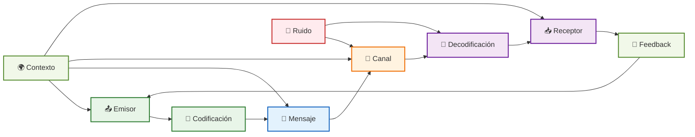

# Comunicación Efectiva

> [!info] 🎯 **Objetivo de la Nota** Dominar las habilidades de comunicación efectiva para establecer conexiones significativas, transmitir ideas con claridad y construir relaciones sólidas tanto en contextos personales como profesionales.

## 🧠 Fundamentos Teóricos

> [!tip] 💡 **Definición de Comunicación Efectiva** La comunicación efectiva es el arte de transmitir información, ideas y emociones de manera clara, precisa y persuasiva, asegurando que el mensaje sea comprendido por el receptor de la forma pretendida por el emisor.

### Elementos del Proceso de Comunicación

> [!note] 📋 **Modelo de Comunicación Integral**
> 
> |Elemento|Función|Consideraciones Clave|
> |---|---|---|
> |**Emisor**|Origina y codifica el mensaje|- Credibilidad<br>- Intención clara<br>- Conocimiento del tema|
> |**Mensaje**|Contenido a transmitir|- Claridad<br>- Relevancia<br>- Estructura lógica|
> |**Canal**|Medio de transmisión|- Adecuado al contexto<br>- Accesible al receptor<br>- Sin interferencias|
> |**Receptor**|Decodifica y comprende|- Atención activa<br>- Marco de referencia<br>- Feedback|
> |**Contexto**|Ambiente de la comunicación|- Físico<br>- Cultural<br>- Emocional|
> |**Feedback**|Respuesta del receptor|- Confirma comprensión<br>- Permite ajustes<br>- Cierra el ciclo|



### Tipos de Comunicación

> [!success] 🗣️ **Clasificación por Modalidades**
> 
> #### Por Canal de Transmisión
> 
> |Tipo|Características|Ventajas|Desafíos|
> |---|---|---|---|
> |**Verbal**|Palabras habladas/escritas|- Precisión<br>- Complejidad|- Malinterpretación<br>- Limitación cultural|
> |**No Verbal**|Gestos, postura, tono|- Impacto emocional<br>- Autenticidad|- Inconsciencia<br>- Ambigüedad|
> |**Paraverbal**|Tono, ritmo, volumen|- Refuerza mensaje<br>- Transmite emociones|- Difícil control<br>- Variabilidad cultural|

## 🎯 Habilidades Fundamentales

> [!tip] 🏗️ **Los 7 Pilares de la Comunicación Efectiva**

### 1. Escucha Activa

> [!info] 👂 **Fundamento de la Comunicación**
> 
> #### Técnicas de Escucha Activa
> 
> - **Atención plena**: Concentración total en el interlocutor
> - **Parafraseo**: "Lo que entiendo es que..."
> - **Preguntas clarificadoras**: "¿Podrías explicar más sobre...?"
> - **Reflejo emocional**: "Percibo que te sientes..."
> - **Síntesis**: "En resumen, los puntos principales son..."
> 
> #### Señales No Verbales de Escucha Activa
> 
> |Comportamiento|Mensaje Transmitido|
> |---|---|
> |Contacto visual|Atención e interés|
> |Asentir|Comprensión y acuerdo|
> |Inclinarse hacia adelante|Engagement activo|
> |Evitar distracciones|Respeto y prioridad|

### 2. Claridad y Concisión

> [!success] ✨ **Mensaje Cristalino**
> 
> #### Principios de Claridad
> 
> - **Estructura lógica**: Introducción → Desarrollo → Conclusión
> - **Lenguaje simple**: Evitar jerga innecesaria
> - **Una idea por mensaje**: Evitar sobrecarga informativa
> - **Ejemplos concretos**: Ilustrar conceptos abstractos
> - **Confirmación de comprensión**: "¿Te queda claro esto?"

### 3. Empatía y Inteligencia Emocional

> [!note] 💝 **Conexión Emocional**
> 
> #### Desarrollo de Empatía
> 
> |Nivel|Descripción|Técnicas|
> |---|---|---|
> |**Cognitiva**|Entender perspectiva del otro|- Ponerse en sus zapatos<br>- Análisis de contexto|
> |**Emocional**|Sentir las emociones del otro|- Observar señales no verbales<br>- Validar sentimientos|
> |**Compasiva**|Actuar para ayudar|- Ofrecer apoyo<br>- Buscar soluciones conjuntas|

### 4. Asertividad

> [!warning] ⚖️ **Equilibrio en la Expresión**
> 
> #### Espectro de Estilos de Comunicación
> 
> ```mermaid
> graph LR
>     A[😔 Pasivo] --> B[😊 Asertivo] --> C[😠 Agresivo]
>     
>     A --> D["❌ No expresa necesidades<br>❌ Evita conflictos<br>❌ Baja autoestima"]
>     B --> E["✅ Expresa con respeto<br>✅ Defiende derechos<br>✅ Considera al otro"]
>     C --> F["❌ Impone su voluntad<br>❌ Irrespeta límites<br>❌ Genera conflictos"]
>     
>     style B fill:#c8e6c9,stroke:#2e7d32,stroke-width:3px
>     style A fill:#ffebee,stroke:#c62828,stroke-width:2px
>     style C fill:#ffebee,stroke:#c62828,stroke-width:2px
>     style E fill:#e8f5e8,stroke:#388e3c,stroke-width:2px
> ```

#### Técnicas Asertivas

> [!tip] 🎯 **Herramientas Prácticas**
> 
> - **Técnica del disco rayado**: Repetir el mensaje principal
> - **Técnica del sandwich**: Positivo → Constructivo → Positivo
> - **Declaraciones "Yo"**: "Yo siento..." vs "Tú siempre..."
> - **Establecimiento de límites**: Clara definición de boundaries

### 5. Adaptabilidad del Mensaje

> [!info] 🎭 **Flexibilidad Comunicativa**
> 
> #### Adaptación por Audiencia
> 
> |Audiencia|Características|Adaptaciones|
> |---|---|---|
> |**Técnica**|Conocimiento especializado|- Terminología precisa<br>- Datos y evidencias<br>- Análisis detallado|
> |**Ejecutiva**|Enfoque en resultados|- Síntesis ejecutiva<br>- Impacto en objetivos<br>- Recomendaciones claras|
> |**General**|Diversidad de backgrounds|- Lenguaje simple<br>- Analogías familiares<br>- Múltiples ejemplos|

### 6. Comunicación No Verbal

> [!success] 🎭 **El Lenguaje del Cuerpo**
> 
> #### Elementos Clave
> 
> - **Expresión facial**: 55% del impacto comunicativo
> - **Postura corporal**: Proyección de confianza y apertura
> - **Gestos**: Refuerzo o contradicción del mensaje verbal
> - **Proximidad**: Respeto del espacio personal
> - **Contacto visual**: Conexión y credibilidad

> [!warning] ⚠️ **Inconsistencias Comunes**
> 
> |Mensaje Verbal|Señal No Verbal|Impacto|
> |---|---|---|
> |"Estoy bien"|Brazos cruzados, evitar mirada|Desconfianza|
> |"Me interesa tu propuesta"|Mirar el teléfono|Desinterés|
> |"Confío en el equipo"|Postura tensa, ceño fruncido|Dudas|

### 7. Manejo de Conflictos

> [!note] 🤝 **Resolución Constructiva**
> 
> #### Estrategias de Resolución
> 
> |Estrategia|Cuándo Usar|Técnicas|
> |---|---|---|
> |**Colaboración**|Ambas partes ganan|- Búsqueda de soluciones creativas<br>- Enfoque en intereses comunes|
> |**Compromiso**|Recursos limitados|- Negociación equilibrada<br>- Concesiones mutuas|
> |**Acomodación**|Relación más importante|- Ceder en punto específico<br>- Mantener armonía|
> |**Competición**|Principios no negociables|- Defender posición firme<br>- Basarse en hechos|
> |**Evitación**|Conflicto menor temporal|- Diferir discusión<br>- Enfriar ambiente|

## 🧠 Técnica de Estudio: Método CONNECT

> [!tip] 📚 **Mnemotecnia para Comunicación Efectiva**

**C** - **C**laridad en el mensaje (Ser específico y directo) **O** - **O**bservación activa (Atender señales verbales y no verbales) **N** - **N**ivel de audiencia (Adaptar al receptor) **N** - **N**o verbal alineado (Coherencia gestual) **E** - **E**scucha empática (Comprensión profunda) **C** - **C**ontext awareness (Considerar el entorno) **T** - **T**iming apropiado (Momento y lugar adecuados)

> [!info] 🎨 **Visualización del Método** Imagina la comunicación como **construir un puente**: necesitas claridad en el diseño (C), observar el terreno (O), conocer quién lo cruzará (N), alinear todos los elementos (N), escuchar a los ingenieros (E), considerar el clima (C) y elegir el momento perfecto para construir (T).

## 🛠️ Herramientas y Técnicas Avanzadas

> [!success] 🔧 **Kit de Herramientas Comunicativas**

### Técnicas de Presentación

> [!info] 🎤 **Comunicación en Público**
> 
> #### Estructura de Presentación Efectiva
> 
> |Sección|Tiempo|Objetivo|Técnicas|
> |---|---|---|---|
> |**Apertura**|10%|Captar atención|- Hook impactante<br>- Pregunta retórica<br>- Historia personal|
> |**Agenda**|5%|Orientar audiencia|- Roadmap claro<br>- Beneficios esperados|
> |**Desarrollo**|75%|Transmitir contenido|- Regla de 3<br>- Evidencia + Ejemplo<br>- Transiciones claras|
> |**Cierre**|10%|Llamada a la acción|- Síntesis poderosa<br>- Next steps<br>- Contacto|

### Comunicación Digital

> [!note] 💻 **Era Digital de la Comunicación**
> 
> #### Mejores Prácticas por Canal
> 
> |Canal|Características|Do's|Don'ts|
> |---|---|---|---|
> |**Email**|Formal, asíncrono|- Asunto claro<br>- Estructura organizada<br>- Call to action|- CC innecesarios<br>- Lenguaje ambiguo<br>- Emails largos|
> |**Chat/Slack**|Informal, inmediato|- Mensajes concisos<br>- Uso de threads<br>- Emojis apropiados|- Información sensible<br>- Discusiones largas<br>- Interrupciones constantes|
> |**Video Conferencia**|Visual, interactivo|- Cámara encendida<br>- Audio claro<br>- Participación activa|- Multitasking visible<br>- Fondos distractores<br>- Dominio del micrófono|

### Persuasión y Influencia

> [!tip] 🎯 **Principios de Persuasión (Cialdini)**
> 
> ```mermaid
> graph TD
>     A[🎯 Persuasión Efectiva] --> B[👥 Reciprocidad]
>     A --> C[⚡ Escasez]
>     A --> D[👑 Autoridad]
>     A --> E[✅ Coherencia]
>     A --> F[❤️ Simpatía]
>     A --> G[📊 Prueba Social]
>     
>     B --> H["Dar antes de pedir<br>Crear obligación moral"]
>     C --> I["Oportunidades limitadas<br>Urgencia temporal"]
>     D --> J["Credenciales establecidas<br>Expertise demostrada"]
>     E --> K["Compromisos públicos<br>Consistencia con valores"]
>     F --> L["Similitud y rapport<br>Elogios genuinos"]
>     G --> M["Testimonios y casos<br>Validación social"]
>     
>     style A fill:#e8f5e8,stroke:#2e7d32,stroke-width:3px
>     style B,C,D,E,F,G fill:#e3f2fd,stroke:#1565c0,stroke-width:2px
> ```

## 📊 Diagnóstico y Evaluación

> [!info] 📈 **Autoevaluación de Habilidades Comunicativas**

### Test de Comunicación Efectiva

> [!note] 📋 **Evaluación Integral (Escala 1-10)**
> 
> |Área|Pregunta de Autoevaluación|Puntuación|
> |---|---|---|
> |**Escucha Activa**|"Escucho sin interrumpir y hago preguntas clarificadoras"|___/10|
> |**Claridad**|"Mis mensajes son comprensibles y bien estructurados"|___/10|
> |**Empatía**|"Considero los sentimientos y perspectivas de otros"|___/10|
> |**Asertividad**|"Expreso mis ideas con respeto pero firmeza"|___/10|
> |**Adaptabilidad**|"Ajusto mi comunicación según la audiencia"|___/10|
> |**No Verbal**|"Mi lenguaje corporal es coherente con mis palabras"|___/10|
> |**Manejo de Conflictos**|"Resuelvo desacuerdos de manera constructiva"|___/10|
> |**Feedback**|"Doy y recibo retroalimentación efectivamente"|___/10|

### Plan de Mejora Personal

> [!success] 🎯 **Roadmap de Desarrollo**
> 
> #### Áreas de Enfoque (Selecciona Top 3)
> 
> - **Técnico**: Workshops, cursos, certificaciones
> - **Práctico**: Role-playing, presentaciones, debates
> - **Experiencial**: Toastmasters, networking, mentoring
> - **Reflexivo**: Diario de comunicación, feedback 360°

## ⚠️ Barreras y Desafíos Comunes

> [!warning] 🚫 **Obstáculos en la Comunicación Efectiva**

### Barreras Internas

> [!danger] 🧠 **Limitaciones Personales**
> 
> |Barrera|Manifestación|Estrategia de Superación|
> |---|---|---|
> |**Miedo al Juicio**|Evitar expresar opiniones|- Práctica en entornos seguros<br>- Reframe: "Es una oportunidad de aprender"|
> |**Perfeccionismo**|Sobre-preparación paralizante|- Regla 80/20<br>- Feedback temprano y frecuente|
> |**Falta de Confianza**|Voz temblorosa, evitar contacto visual|- Técnicas de respiración<br>- Visualización de éxito|
> |**Ego Defensivo**|No escuchar críticas|- Mindset de crecimiento<br>- Solicitar feedback específico|

### Barreras Externas

> [!warning] 🌍 **Factores del Entorno**
> 
> - **Cultural**: Diferencias en estilos comunicativos
> - **Tecnológicas**: Fallos de conexión, distracciones digitales
> - **Organizacionales**: Jerarquías rígidas, falta de tiempo
> - **Ambientales**: Ruido, interrupciones, espacios inadecuados

### Estrategias de Mitigación

> [!tip] 🔧 **Soluciones Prácticas**
> 
> #### Antes de la Comunicación
> 
> - Definir objetivo claro
> - Conocer a la audiencia
> - Preparar mensaje clave
> - Elegir canal apropiado
> 
> #### Durante la Comunicación
> 
> - Monitorear comprensión
> - Ajustar según feedback
> - Mantener enfoque en objetivo
> - Gestionar interrupciones
> 
> #### Después de la Comunicación
> 
> - Confirmar entendimiento
> - Documentar acuerdos
> - Seguimiento de compromisos
> - Reflexión sobre efectividad

## 🎯 Aplicaciones Específicas

> [!success] 💼 **Contextos de Aplicación**

### Comunicación Organizacional

> [!info] 🏢 **Entorno Corporativo**
> 
> #### Reuniones Efectivas
> 
> |Tipo de Reunión|Objetivo|Técnicas Clave|
> |---|---|---|
> |**Informativa**|Transmitir información|- Estructura clara<br>- Visual aids<br>- Q&A al final|
> |**Decisoria**|Tomar decisiones|- Datos previos<br>- Facilitación neutra<br>- Consenso documentado|
> |**Creativa**|Generar ideas|- Brainstorming<br>- Ambiente relajado<br>- Sin juicios|
> |**Seguimiento**|Revisar progreso|- Agenda focalizada<br>- Status updates<br>- Next steps|

### Comunicación Interpersonal

> [!note] 👥 **Relaciones Personales**
> 
> #### Conversaciones Difíciles
> 
> - **Preparación mental**: Definir objetivo y límites
> - **Ambiente adecuado**: Privacidad y comodidad
> - **Timing correcto**: Momento emocionalmente neutro
> - **Enfoque en comportamientos**: No en personalidad
> - **Búsqueda de soluciones**: Orientación al futuro

### Comunicación Académica

> [!tip] 🎓 **Contexto Educativo**
> 
> #### Presentaciones Académicas
> 
> - **Investigación sólida**: Fuentes confiables y actuales
> - **Estructura académica**: Hipótesis, metodología, resultados
> - **Rigor intelectual**: Análisis crítico y objetividad
> - **Citación apropiada**: Reconocimiento de fuentes
> - **Defensa de tesis**: Preparación para cuestionamientos

## 🔗 Referencias

> [!quote] 📚 **Enlaces a Notas Relacionadas**
> 
> - [[Habilidades Sociales]] - Base para interacciones efectivas
> - [[Inteligencia Emocional]] - Comprensión emocional en comunicación
> - [[Técnicas de Comunicación]] - Herramientas específicas avanzadas
> - [[Comunicación Intercultural]] - Adaptación a diferentes culturas
> - [[Pensamiento Crítico]] - Análisis profundo de mensajes
> - [[Construcción de Confianza]] - Base para comunicación abierta
> - [[Gestión de Conflictos]] - Resolución de desacuerdos comunicativos
> - [[Liderazgo Situacional]] - Comunicación como herramienta de liderazgo
> - [[Feedback y Coaching]] - Comunicación para desarrollo
> - [[Gestión de Reuniones Efectivas]] - Aplicación práctica organizacional
> - [[Límites de Comunicación]] - Establecimiento de boundaries

## 📖 Notas Recomendadas para Complementar

> [!info] 📋 **Prerrequisitos y Temas Complementarios**

### Prerrequisitos Esenciales

- [[Autoconocimiento]] - Comprensión personal para comunicar auténticamente
- [[Construcción de Confianza]] - Base para comunicación efectiva
- [[Inteligencia Emocional]] - Manejo emocional en interacciones
- [[Mindfulness]] - Presencia consciente en conversaciones

### Habilidades Complementarias

- [[Competencias Interpersonales]] - Desarrollo integral de habilidades sociales
- [[Facilitación de Grupos]] - Liderazgo comunicativo en equipos
- [[Influencia sin Autoridad]] - Persuasión ética y efectiva
- [[Diversidad e Inclusión]] - Comunicación respetuosa y culturalmente sensible

### Aplicaciones Prácticas

- [[El Arte de Decir No]] - Comunicación asertiva de límites
- [[Delegación Efectiva]] - Instrucciones claras y seguimiento
- [[Team Building]] - Comunicación para cohesión grupal
- [[Mentoría y Coaching de Aprendizaje]] - Comunicación para desarrollo de otros

### Herramientas de Soporte

- [[Procesamiento por Lotes]] - Gestión eficiente de comunicaciones
- [[Automatizaciones Digitales]] - Optimización de comunicaciones rutinarias
- [[Apps de Productividad]] - Herramientas digitales para comunicación
- [[Gestión de Email]] - Comunicación escrita efectiva

### Contextos Especializados

- [[Cultura Organizacional]] - Comunicación dentro de sistemas organizacionales
- [[Equipos Virtuales]] - Comunicación en entornos remotos
- [[Redes de Aprendizaje]] - Comunicación para intercambio de conocimiento

---

> [!tip] 🎯 **Recordatorio Final** La comunicación efectiva no es solo transmitir información, sino crear conexiones genuinas que generen comprensión mutua, confianza y acción colaborativa. Es una habilidad que se perfecciona con práctica consciente y reflexión continua.

**Tags:** #comunicacion-efectiva #habilidades-sociales #liderazgo #inteligencia-emocional #escucha-activa #asertividad #persuasion #comunicacion-no-verbal #presentaciones #feedback #resolucion-conflictos #adaptabilidad #empatia