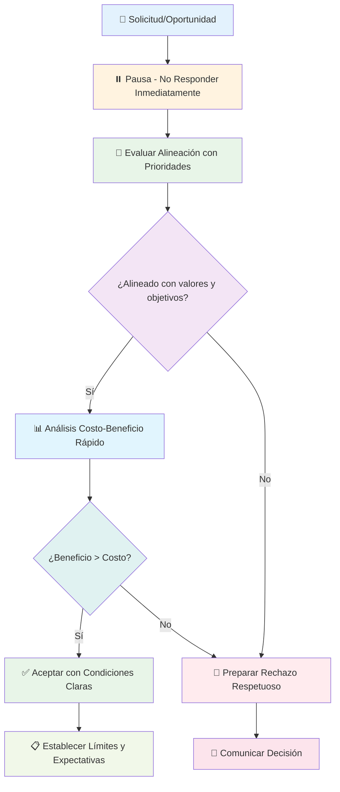

# El Arte de Decir No 🚫

> [!info] Definición **El arte de decir no** es la habilidad estratégica de rechazar compromisos, oportunidades y solicitudes que no se alinean con tus prioridades, valores o propósito. Es una competencia fundamental para proteger tu tiempo, energía y enfoque, permitiendo concentrarte en lo que realmente importa para tu crecimiento y bienestar.

## 🎯 Por Qué Decir No es Esencial

> [!tip] Fundamentos del Rechazo Estratégico
> 
> ### 1. Protección de Recursos Limitados ⏳
> 
> - **Tiempo**: Solo tienes 24 horas al día
> - **Energía**: Tu capacidad mental y física es finita
> - **Atención**: El enfoque es el recurso más valioso
> - **Oportunidades**: Cada sí cierra otras puertas
> 
> ### 2. Alineación con Propósito 🧭
> 
> - **Coherencia**: Mantienes dirección hacia tus objetivos
> - **Integridad**: Actúas conforme a tus valores
> - **Efectividad**: Maximizas impacto en áreas importantes
> - **Autenticidad**: Vives según tu verdadera naturaleza
> 
> ### 3. Prevención de Consecuencias Negativas ⚠️
> 
> - **Burnout**: Evitas sobrecarga y agotamiento
> - **Mediocriedad**: Prevens dilución de esfuerzos
> - **Resentimiento**: Evitas comprometerte contra tu voluntad
> - **Pérdida de credibilidad**: Mantienes estándares de calidad

## 🧠 Psicología del "Sí" Automático

> [!warning] Barreras Psicológicas para Decir No
> 
> ### Impulsos Internos 🔍
> 
> #### Necesidad de Aprobación 👍
> 
> - **Origen**: Programación social temprana
> - **Manifestación**: Miedo al rechazo o conflicto
> - **Consecuencia**: Sobrecarga de compromisos
> - **Antídoto**: Autoestima basada en valores internos
> 
> #### Síndrome del Salvador 🦸‍♂️
> 
> - **Origen**: Creencia de que debes ayudar siempre
> - **Manifestación**: Dificultad para ver a otros manejar problemas
> - **Consecuencia**: Dependencia y agotamiento personal
> - **Antídoto**: Reconocer límites de responsabilidad
> 
> #### FOMO (Fear of Missing Out) 😰
> 
> - **Origen**: Escasez percibida de oportunidades
> - **Manifestación**: Decir sí por miedo a perder algo
> - **Consecuencia**: Dispersión y falta de profundidad
> - **Antídoto**: Confianza en tu capacidad de crear oportunidades
> 
> ### Presiones Externas 🌪️
> 
> - **Expectativas sociales**: "Deberías ser colaborativo"
> - **Cultura organizacional**: "Los buenos empleados no dicen no"
> - **Presión de pares**: "Todo el mundo lo está haciendo"
> - **Manipulación emocional**: Guilt trips y chantaje sutil

## 🔄 Proceso de Decisión Estratégica



## 📋 Framework de Evaluación: Matriz del NO

> [!info] Sistema de Filtrado de Compromisos
> 
> |Criterio|Peso (1-5)|Pregunta Clave|Sí = +1, No = 0|
> |---|---|---|---|
> |**Alineación con Valores**|5|¿Esto refleja mis valores fundamentales?|_____|
> |**Contribución a Objetivos**|5|¿Avanza mis metas prioritarias?|_____|
> |**Uso de Fortalezas**|4|¿Utiliza mis talentos únicos?|_____|
> |**Impacto Positivo**|4|¿Genera valor significativo?|_____|
> |**Sostenibilidad**|3|¿Puedo hacerlo bien sin agotarme?|_____|
> |**Momento Adecuado**|3|¿Es el timing correcto?|_____|
> |**Reciprocidad/Fairness**|2|¿La relación es equilibrada?|_____|
> 
> ### Interpretación de Puntuaje:
> 
> - **25-26 puntos**: SÍ definitivo - Prioridad alta
> - **20-24 puntos**: SÍ condicional - Negociar términos
> - **15-19 puntos**: Tal vez - Requiere más información
> - **10-14 puntos**: Probablemente NO - Buscar alternativas
> - **0-9 puntos**: NO definitivo - Rechazar amablemente

## 🎭 Tipos de "No" y Cuándo Usarlos

> [!tip] Repertorio de Respuestas Estratégicas
> 
> ### 1. El No Directo 🎯
> 
> **Cuándo usar**: Con límites claros y relaciones de confianza **Ejemplo**: _"No puedo comprometerme con esto en este momento"_ **Ventaja**: Claridad absoluta, ahorra tiempo **Riesgo**: Puede parecer abrupto si no hay contexto
> 
> ### 2. El No Explicativo 📝
> 
> **Cuándo usar**: Con colegas y cuando la relación lo permite **Ejemplo**: _"No puedo participar porque estoy enfocado en X proyecto que es prioritario"_ **Ventaja**: Proporciona contexto y mantiene relación **Riesgo**: Puede generar debate o contraargumentos
> 
> ### 3. El No con Alternativa 🔄
> 
> **Cuándo usar**: Cuando quieres ayudar pero no puedes comprometerte completamente **Ejemplo**: _"No puedo liderar el proyecto, pero puedo conectarte con María que sería perfecta"_ **Ventaja**: Mantiene goodwill y ayuda de otra forma **Riesgo**: Puede generar expectativas futuras
> 
> ### 4. El No Temporal ⏰
> 
> **Cuándo usar**: Cuando la oportunidad es buena pero el timing es malo **Ejemplo**: _"No puedo en los próximos 3 meses, pero me interesaría revisar en enero"_ **Ventaja**: Mantiene puerta abierta para futuro **Riesgo**: Puede crear expectativas falsas
> 
> ### 5. El No Condicional 📊
> 
> **Cuándo usar**: Cuando podrías considerar bajo ciertas circunstancias **Ejemplo**: _"No puedo con el alcance actual, pero si reducimos a X, sí podría"_ **Ventaja**: Abre negociación hacia términos favorables **Riesgo**: Puede ser visto como indecisión

## 💬 Scripts para Diferentes Situaciones

> [!warning] Plantillas de Respuesta por Contexto
> 
> ### Ámbito Profesional 💼
> 
> #### Con el Jefe/Superior
> 
> ```
> "Aprecio que pienses en mí para este proyecto. Actualmente 
> estoy enfocado al 100% en [proyecto prioritario] que tiene 
> deadline el [fecha]. ¿Podríamos conversar sobre cómo priorizar 
> entre ambos, o si esto podría esperar hasta [fecha]?"
> ```
> 
> #### Con Colegas
> 
> ```
> "Suena como un proyecto interesante, pero no puedo 
> comprometerme con la calidad que merece en este momento. 
> ¿Has considerado hablar con [persona sugerida]?"
> ```
> 
> #### Con Clientes/Externos
> 
> ```
> "Agradezco la oportunidad. Mi agenda está completa hasta 
> [fecha], y prefiero ser honesto antes que comprometer la 
> calidad del trabajo. ¿Podríamos explorar un timeline 
> alternativo?"
> ```
> 
> ### Ámbito Personal 👨‍👩‍👧‍👦
> 
> #### Con Familia
> 
> ```
> "Entiendo que esto es importante para ti. En este momento 
> estoy comprometido con [prioridad personal]. ¿Podemos 
> encontrar otra forma en que pueda apoyarte?"
> ```
> 
> #### Con Amigos
> 
> ```
> "Me encantaría, pero he decidido ser más selectivo con mis 
> compromisos para estar realmente presente cuando digo sí. 
> ¿Qué tal si hacemos [alternativa] en su lugar?"
> ```
> 
> ### Ámbito Social/Comunitario 🌍
> 
> #### Organizaciones/Voluntariado
> 
> ```
> "Admiro mucho la causa, pero ya tengo compromisos con 
> [organización actual]. No quiero dividir mi atención y 
> hacer un trabajo mediocre en ambas."
> ```

## 🛡️ Estrategias para Mantener el No

> [!info] Técnicas Defensivas Avanzadas
> 
> ### Ante Insistencia o Presión 💪
> 
> #### Técnica del Disco Rayado 🔄
> 
> - **Método**: Repetir tu posición calmadamente sin alterarla
> - **Ejemplo**: "Como mencioné, no puedo comprometerme con esto"
> - **Efecto**: Evita ser arrastrado a debates o justificaciones
> 
> #### Técnica del Sandwich Positivo 🥪
> 
> - **Estructura**: Positivo + No + Positivo
> - **Ejemplo**: "Aprecio la confianza + No puedo + Espero futuras oportunidades"
> - **Efecto**: Mantiene relación mientras estableces límite
> 
> #### Técnica del Tiempo Muerto ⏰
> 
> - **Frase**: "Déjame pensarlo y te confirmo mañana"
> - **Uso**: Cuando sientes presión para decidir inmediatamente
> - **Beneficio**: Te da espacio para evaluar objetivamente
> 
> ### Ante Manipulación Emocional 🎭
> 
> #### Guilt Trips ("Pero esperaba que...")
> 
> - **Respuesta**: "Entiendo tu decepción, y mi decisión se mantiene"
> - **Principio**: No eres responsable de gestionar las emociones de otros
> 
> #### False Urgency ("Es urgente y solo tú puedes...")
> 
> - **Respuesta**: "Si es tan urgente, necesita alguien disponible ahora"
> - **Principio**: La urgencia de otros no constituye tu emergencia
> 
> #### Comparison Trap ("Todo el mundo dice sí menos tú")
> 
> - **Respuesta**: "Cada persona tiene diferentes prioridades y circunstancias"
> - **Principio**: Tus decisiones no necesitan validación grupal

## 🎯 Áreas Comunes Donde Aplicar el No

> [!warning] Zonas de Alto Riesgo de Sobrecarga
> 
> ### Compromisos Profesionales 💼
> 
> - **Reuniones innecesarias**: Meetings que podrían ser emails
> - **Proyectos fuera de rol**: Tareas que no desarrollan tu carrera
> - **Mentoría no recíproca**: Dar tiempo sin recibir valor
> - **Comités sin propósito**: Participaciones simbólicas sin impacto
> 
> ### Compromisos Sociales 👥
> 
> - **Eventos por obligación**: Asistir solo por "quedar bien"
> - **Favores unidireccionales**: Ayuda que nunca es recíproca
> - **Drama ajeno**: Involucrarte en conflictos de otros
> - **Actividades que drenan**: Eventos que te quitan energía
> 
> ### Compromisos Digitales 📱
> 
> - **Redes sociales excesivas**: Más tiempo del que aporta valor
> - **Notificaciones constantes**: Interrupciones que rompen flujo
> - **Suscripciones innecesarias**: Contenido que no consumes
> - **Grupos de chat tóxicos**: Conversaciones que generan estrés
> 
> ### Compromisos Financieros 💰
> 
> - **Gastos por presión social**: Compras para impresionar
> - **Suscripciones no utilizadas**: Servicios que no aprovechas
> - **Préstamos riesgosos**: Comprometer tu estabilidad financiera
> - **Inversiones emocionales**: Decisiones financieras por FOMO

## 🌟 El Poder Transformador del No

> [!tip] Beneficios Profundos del Rechazo Estratégico
> 
> ### Beneficios Inmediatos ⚡
> 
> - **Tiempo liberado**: Horas para prioridades importantes
> - **Energía conservada**: Menos agotamiento y burnout
> - **Menos estrés**: Reducción de sobrecarga mental
> - **Mayor control**: Sensación de autonomía sobre tu vida
> 
> ### Beneficios a Mediano Plazo 📈
> 
> - **Mejor reputación**: Conocido por calidad, no cantidad
> - **Relaciones más fuertes**: Conexiones más auténticas
> - **Desarrollo de fortalezas**: Tiempo para especializarte
> - **Logros más significativos**: Resultados de enfoque sostenido
> 
> ### Beneficios a Largo Plazo 🏆
> 
> - **Carrera más exitosa**: Progresión por especialización
> - **Vida más equilibrada**: Armonía entre diferentes roles
> - **Legado más claro**: Contribuciones memorables y distintivas
> - **Satisfacción profunda**: Vida vivida según tus términos

## 📊 Métricas para Evaluar tu Habilidad de Decir No

> [!info] Indicadores de Progreso
> 
> ### Autoevaluación Mensual 📋
> 
> |Métrica|Este Mes|Meta|Estado|
> |---|---|---|---|
> |Solicitudes rechazadas (%)|___%|30-50%|🔴🟡🟢|
> |Horas semanales libres|___h|>10h|🔴🟡🟢|
> |Nivel de estrés (1-10)|___|<5|🔴🟡🟢|
> |Proyectos prioritarios avanzados|___%|80%+|🔴🟡🟢|
> |Satisfacción con compromisos (1-10)|___|>7|🔴🟡🟢|
> 
> ### Señales de Mejora 📈
> 
> - **Menos urgencias**: Raramente en crisis por sobrecarga
> - **Mejor calidad**: Trabajo más profundo y cuidadoso
> - **Más selectividad**: Automáticamente filtras oportunidades
> - **Mayor respeto**: Otros valoran más tu tiempo y opinión
> - **Menos culpa**: Comodidad creciente con rechazar

## 📚 Referencias

> [!quote] Enlaces a Notas Relacionadas
> 
> - [[Análisis Costo-Beneficio]]
> - [[Clarificación de Valores]]
> - [[Planificación Estratégica]]
> - [[Matriz de Eisenhower]]
> - [[Toma de Decisiones]]
> - [[Time Blocking]]

## 📖 Notas Recomendadas para Complementar

> [!tip] Prerrequisitos y Temas Relacionados
> 
> ### Prerrequisitos 📋
> 
> - [[Clarificación de Valores]] - Base para decidir qué rechazar
> - [[Autoconocimiento]] - Comprensión de límites personales
> - [[Definición de Propósito]] - Criterio para evaluar alineación
> 
> ### Herramientas de Apoyo 🔗
> 
> - [[Matriz de Eisenhower]] - Priorización de compromisos
> - [[Time Blocking]] - Protección temporal de prioridades
> - [[Deep Work]] - Maximización del tiempo liberado
> - [[Bullet Journal Method (BuJo)]] - Tracking de compromisos y rechazos
> 
> ### Técnicas Complementarias 🧠
> 
> - [[Técnicas de Concentración]] - Para sesiones de evaluación
> - [[Gestión de Reuniones Efectivas]] - Optimización de compromisos aceptados
> - [[Límites de Comunicación]] - Establecimiento de boundaries digitales
> - [[Dashboard Semanal]] - Monitoreo de carga de compromisos

## 🧠 Técnica de Estudio: Método RECHAZA

> [!tip] Mnemotécnica para Decidir Estratégicamente **R** - Respira profundo antes de responder **E** - Evalúa alineación con valores y objetivos **C** - Considera costo de oportunidad real **H** - Honra tus límites de tiempo y energía **A** - Analiza si puedes hacer un trabajo excelente **Z** - Zerrate en tus prioridades fundamentales **A** - Actúa con cortesía pero firmeza
> 
> **Frase memorable**: _"Rechazar Estratégicamente Compromisos Habilita Avances Zonales Auténticos"_

## 📝 Template de Evaluación Rápida

> [!warning] Checklist de 2 Minutos para Cualquier Solicitud
> 
> ```markdown
> ## Evaluación Express: [Solicitud]
> 
> ### ⚡ Filtros Iniciales
> - [ ] ¿Alineado con mis 3 objetivos principales de este año?
> - [ ] ¿Utiliza mis fortalezas únicas?
> - [ ] ¿Tengo tiempo para hacerlo excelente, no solo "bien"?
> - [ ] ¿El beneficio supera claramente el costo de oportunidad?
> - [ ] ¿Me siento energizado al pensar en hacerlo?
> 
> ### 📊 Evaluación Profunda (si pasó filtros)
> - Impacto en objetivos prioritarios (1-10): ___
> - Nivel de energía que requiere (1-10): ___
> - Tiempo total estimado: ___ horas
> - ¿Qué tendría que sacrificar?: ___
> 
> ### ✅ Decisión
> - [ ] SÍ - Acepto con estas condiciones: ___
> - [ ] NO - Rechazaré por esta razón: ___
> - [ ] NEGOCIAR - Contrapropondré: ___
> 
> ### 💬 Respuesta Preparada
> [Draft de respuesta aquí]
> ```

## 🎯 Desafío de 30 Días: Maestría del No

> [!info] Plan de Desarrollo Progresivo
> 
> ### Semana 1: Autoconciencia 🔍
> 
> **Objetivo**: Observar sin juzgar
> 
> - **Días 1-3**: Registra todas las solicitudes que recibes
> - **Días 4-7**: Nota tu reacción automática (sí/no/duda)
> 
> ### Semana 2: Evaluación 📊
> 
> **Objetivo**: Aplicar criterios objetivos
> 
> - **Días 8-10**: Usa la Matriz del NO en 3 solicitudes
> - **Días 11-14**: Practica pausar antes de responder
> 
> ### Semana 3: Acción 🎯
> 
> **Objetivo**: Implementar rechazos estratégicos
> 
> - **Días 15-17**: Di no a 3 solicitudes menores
> - **Días 18-21**: Rechaza 1 compromiso significativo
> 
> ### Semana 4: Refinamiento ✨
> 
> **Objetivo**: Perfeccionar la técnica
> 
> - **Días 22-24**: Practica diferentes tipos de "no"
> - **Días 25-28**: Evalúa impacto y ajusta enfoque
> 
> ### Evaluación Final 📈
> 
> - **Días 29-30**: Reflexión sobre cambios y planificación futura

---

**Tags**: #arte-decir-no #limites-personales #gestion-tiempo #priorizacion #boundaries #asertividad #productividad-personal #sobrecarga #enfoque #equilibrio-vida #toma-decisiones #autoproteccion #gestion-compromisos #eficiencia-personal