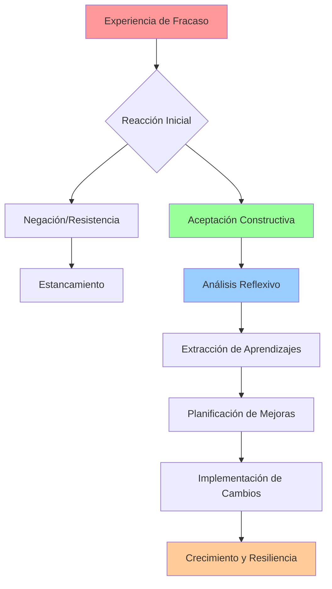

# Gestión del Fracaso 🔄

> [!quote] "El fracaso es simplemente la oportunidad de comenzar de nuevo, esta vez de forma más inteligente." - Henry Ford

## ¿Qué es la Gestión del Fracaso? 🤔

> [!info] **Definición** La gestión del fracaso es la habilidad de transformar experiencias negativas, errores y derrotas en oportunidades de aprendizaje, crecimiento personal y mejora continua. No se trata de evitar el fracaso, sino de desarrollar la capacidad de recuperarse, aprender y adaptarse efectivamente.

> [!tip] **Principio Fundamental** ✨ El fracaso no es lo opuesto al éxito, es parte del camino hacia él. La diferencia entre quienes triunfan y quienes se estancan radica en cómo procesan y utilizan sus fracasos.

## Marco Conceptual de la Gestión del Fracaso



## Las 4 Fases de la Gestión Efectiva del Fracaso

> [!warning] **Fase 1: Reconocimiento y Aceptación** 🎯
> 
> ### Características:
> 
> - **Reconocimiento honesto** de la situación
> - **Aceptación emocional** sin negación
> - **Evitar la victimización** o culpar a factores externos
> - **Gestión de emociones** iniciales (frustración, decepción)
> 
> ### Acciones clave:
> 
> - Permitirse sentir las emociones sin juzgarlas
> - Evitar decisiones impulsivas inmediatamente después
> - Buscar perspectiva temporal (¿importará en 5 años?)

> [!tip] **Fase 2: Análisis Constructivo** 🔍
> 
> ### Metodología de Análisis:
> 
> |Aspecto|Preguntas Clave|Enfoque|
> |---|---|---|
> |**Causas Internas**|¿Qué pude haber hecho diferente?|Responsabilidad personal|
> |**Causas Externas**|¿Qué factores estaban fuera de mi control?|Contexto y circunstancias|
> |**Decisiones Críticas**|¿Dónde estuvieron los puntos de quiebre?|Momentos de decisión|
> |**Recursos**|¿Tenía las herramientas necesarias?|Preparación y capacidades|
> 
> ### Framework FRACASO:
> 
> - **F**actores que contribuyeron
> - **R**ecursos que faltaron
> - **A**cciones que fallaron
> - **C**ausas raíz del problema
> - **A**prendizajes extraídos
> - **S**oluciones posibles
> - **O**portunidades de mejora

> [!info] **Fase 3: Extracción de Aprendizajes** 📚
> 
> ### Tipos de Aprendizajes:
> 
> #### 🧠 **Aprendizajes Cognitivos**
> 
> - Nuevos conocimientos técnicos
> - Comprensión de procesos
> - Identificación de patrones
> 
> #### 💪 **Aprendizajes de Habilidades**
> 
> - Competencias que necesito desarrollar
> - Técnicas que debo mejorar
> - Sistemas que debo implementar
> 
> #### ❤️ **Aprendizajes Emocionales**
> 
> - Gestión del estrés y presión
> - Tolerancia a la frustración
> - Desarrollo de resiliencia

> [!warning] **Fase 4: Implementación y Prevención** 🚀
> 
> ### Estrategias de Implementación:
> 
> ```mermaid
> mindmap
>   root((Implementación))
>     Plan de Acción
>       Objetivos específicos
>       Plazos definidos
>       Recursos necesarios
>     Sistemas de Prevención
>       Indicadores tempranos
>       Checkpoints regulares
>       Planes de contingencia
>     Seguimiento
>       Métricas de progreso
>       Revisiones periódicas
>       Ajustes continuos
> ```

## Estrategias Psicológicas para la Gestión del Fracaso

> [!tip] **Reencuadre Cognitivo** 🔄
> 
> ### Técnicas de Reencuadre:
> 
> |Pensamiento Limitante|Reencuadre Constructivo|
> |---|---|
> |"Soy un fracaso"|"Experimenté un fracaso, pero no me define"|
> |"Nunca lo lograré"|"Aún no lo he logrado, pero puedo aprender"|
> |"Perdí el tiempo"|"Invertí en aprendizaje y experiencia"|
> |"Todos me juzgarán"|"Los demás también han experimentado fracasos"|

> [!info] **Construcción de Resiliencia** 💪
> 
> ### Los 7 Pilares de la Resiliencia:
> 
> 1. **Autoconciencia emocional** 🎭
>     - Reconocer y nombrar emociones
>     - Entender patrones de respuesta
> 2. **Flexibilidad mental** 🤸‍♂️
>     - Adaptabilidad ante cambios
>     - Múltiples perspectivas del problema
> 3. **Red de apoyo** 👥
>     - Relaciones de confianza
>     - Mentores y consejeros
> 4. **Propósito claro** 🎯
>     - Conexión con valores profundos
>     - Visión de largo plazo
> 5. **Autocuidado** 🌱
>     - Gestión del estrés
>     - Hábitos saludables
> 6. **Aprendizaje continuo** 📖
>     - Mentalidad de crecimiento
>     - Curiosidad constante
> 7. **Acción proactiva** ⚡
>     - Enfoque en soluciones
>     - Iniciativa personal

## Herramientas Prácticas de Gestión

> [!warning] **Diario de Fracasos y Aprendizajes** 📝
> 
> ### Estructura del Diario:
> 
> **Fecha:** ___________
> 
> **Situación:** Describir objetivamente qué ocurrió
> 
> **Emociones:** ¿Cómo me sentí? ¿Qué emociones experimenté?
> 
> **Análisis:**
> 
> - Factores controlables: _____________
> - Factores no controlables: _____________
> - Decisiones críticas: _____________
> 
> **Aprendizajes:**
> 
> - ¿Qué aprendí sobre mí mismo?
> - ¿Qué haría diferente la próxima vez?
> - ¿Qué habilidades necesito desarrollar?
> 
> **Plan de Acción:**
> 
> - Próximos pasos concretos: _____________
> - Fecha de revisión: _____________

> [!tip] **Técnica del Post-Mortem Constructivo** 🔬
> 
> ### Metodología:
> 
> ```mermaid
> flowchart LR
>     A[Reunir Datos] --> B[Identificar Timeline]
>     B --> C[Análisis de Causas]
>     C --> D[Lecciones Aprendidas]
>     D --> E[Plan de Prevención]
>     E --> F[Documentación]
>     
>     style A fill:#e1f5fe
>     style B fill:#f3e5f5
>     style C fill:#fff3e0
>     style D fill:#e8f5e8
>     style E fill:#fff8e1
>     style F fill:#fce4ec
> ```

## Casos de Estudio: Fracasos Transformadores

> [!info] **Caso 1: Steve Jobs y Apple** 🍎
> 
> **El Fracaso:** Fue expulsado de Apple, la empresa que él mismo fundó
> 
> **La Gestión:**
> 
> - Aceptó la responsabilidad de sus errores de liderazgo
> - Usó el tiempo para experimentar con nuevos proyectos (NeXT, Pixar)
> - Desarrolló nuevas habilidades de gestión y visión empresarial
> 
> **El Resultado:** Regresó a Apple con una perspectiva renovada, liderando la creación del iPhone, iPad y la transformación digital de la empresa

> [!tip] **Caso 2: Oprah Winfrey** 📺
> 
> **El Fracaso:** Fue despedida de su primer trabajo en televisión por ser "demasiado emocional"
> 
> **La Gestión:**
> 
> - Reconoció que su autenticidad era su fortaleza, no su debilidad
> - Buscó oportunidades donde su estilo personal fuera valorado
> - Desarrolló su capacidad de conexión emocional con las audiencias
> 
> **El Resultado:** Creó un imperio mediático basado precisamente en la conexión emocional auténtica

## Errores Comunes en la Gestión del Fracaso

> [!warning] **Trampas a Evitar** ⚠️
> 
> ### 1. **Negación Prolongada**
> 
> - Rechazar la realidad del fracaso
> - Buscar culpables externos constantemente
> - Minimizar la importancia del evento
> 
> ### 2. **Rumiación Destructiva**
> 
> - Quedarse atrapado en el análisis sin acción
> - Perfectionism paralizante
> - Catastrofización del evento
> 
> ### 3. **Sobregeneralización**
> 
> - "Siempre me pasa lo mismo"
> - "No sirvo para nada"
> - Extrapolación excesiva de un evento
> 
> ### 4. **Aversión Extrema al Riesgo**
> 
> - Evitar todas las situaciones de riesgo
> - Paralización por análisis
> - Pérdida de oportunidades de crecimiento

## Construyendo una Cultura Personal Antifragil

> [!tip] **Antifragilidad vs Resiliencia** 💎
> 
> |Concepto|Definición|Ejemplo|
> |---|---|---|
> |**Fragilidad**|Se rompe bajo estrés|Vidrio que se quiebra|
> |**Resiliencia**|Resiste el estrés y regresa al estado original|Resorte que vuelve a su forma|
> |**Antifragilidad**|Se fortalece con el estrés controlado|Músculo que crece con ejercicio|

### Principios de Antifragilidad Personal:

> [!info] **Experimentación Constante** 🧪
> 
> - Realizar pequeños experimentos con bajo costo de fracaso
> - Aprender rápido y ajustar frecuentemente
> - Mantener múltiples opciones abiertas

> [!tip] **Diversificación de Riesgos** 🎲
> 
> - No poner todos los recursos en una sola apuesta
> - Desarrollar múltiples habilidades y competencias
> - Crear sistemas de respaldo y alternativas

## Técnica de Estudio: Método FRACTAL para Memorizar Lecciones

> [!tip] **Método FRACTAL** 🔄
> 
> **F** - **Falla identificada:** ¿Cuál fue el error específico? **R** - **Razón profunda:** ¿Por qué ocurrió realmente? **A** - **Acción correctiva:** ¿Qué puedo hacer diferente? **C** - **Consecuencias previstas:** ¿Qué podría pasar si se repite? **T** - **Técnica de prevención:** ¿Cómo puedo evitarlo? **A** - **Aplicación práctica:** ¿Dónde usaré este aprendizaje? **L** - **Lectura de señales:** ¿Qué indicadores tempranos debo observar?
> 
> ### Mnemotécnica Visual:
> 
> Imagina un **cristal fractal** que se rompe, pero cada fragmento contiene la información completa para reconstruirse más fuerte. Cada letra del FRACTAL representa una faceta del cristal de aprendizaje.

## Referencias y Conexiones

> [!quote] **Referencias a Otras Notas**
> 
> - [[Construcción de Confianza]] - Para reconstruir la confianza después del fracaso
> - [[Gestión del Estrés]] - Manejo emocional durante crisis
> - [[Toma de Decisiones]] - Mejorar el proceso decisional post-fracaso
> - [[Autoconocimiento]] - Comprensión profunda de patrones personales
> - [[Pensamiento Crítico]] - Análisis objetivo de situaciones complejas
> - [[Motivación Académica]] - Mantener la motivación después de fracasos académicos
> - [[Inteligencia Emocional]] - Gestión emocional integral
> - [[Técnicas de Concentración]] - Mantener el enfoque en la recuperación
> - [[Mindfulness]] - Presencia y aceptación en momentos difíciles

## Notas Recomendadas para Profundizar

> [!info] **Prerrequisitos y Complementos** 📋
> 
> ### **Fundamentos Necesarios:**
> 
> - [[Autoconocimiento]] - Base para entender patrones personales
> - [[Clarificación de Valores]] - Marco de referencia para decisiones
> - [[Definición de Propósito]] - Motivación profunda para perseverar
> 
> ### **Habilidades Complementarias:**
> 
> - [[Pensamiento Estratégico]] - Visión de largo plazo post-fracaso
> - [[Comunicación Efectiva]] - Expresar aprendizajes y buscar apoyo
> - [[Técnicas de Relajación]] - Manejo del estrés asociado
> - [[Hábitos y Rutinas Saludables]] - Mantener estabilidad durante crisis
> 
> ### **Aplicación Práctica:**
> 
> - [[Planificación Estratégica]] - Incorporar lecciones en planes futuros
> - [[Objetivos SMART]] - Establecer metas realistas de recuperación
> - [[Tracking de Hábitos]] - Monitorear progreso en la implementación de cambios

---

**Tags:** #productividad #desarrollo-personal #resiliencia #aprendizaje #gestión-emocional #crecimiento #estrategia #bienestar #liderazgo-personal #inteligencia-emocional #fracaso #éxito #antifragilidad #post-mortem #análisis #mejora-continua