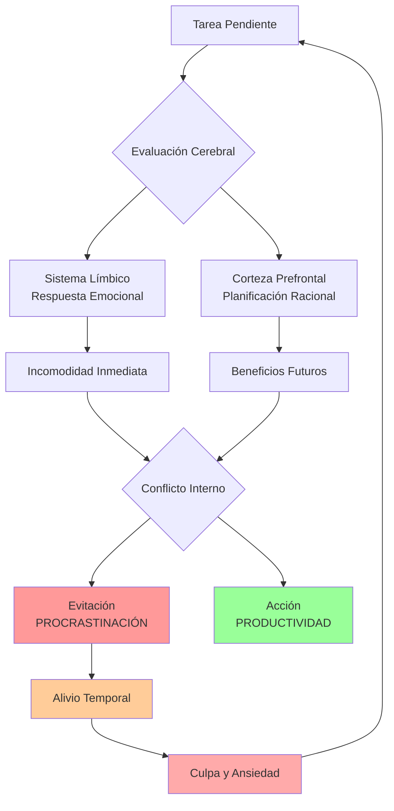
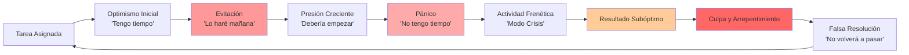

# Procrastinación ⏰

> [!quote] "La procrastinación es el ladrón del tiempo." - Edward Young

## ¿Qué es la Procrastinación? 🤔

> [!info] **Definición** La procrastinación es el acto de retrasar o posponer de manera voluntaria e irracional una tarea o decisión, a pesar de conocer las consecuencias negativas que esto puede acarrear. Es la brecha entre la intención y la acción, donde sabemos qué deberíamos hacer pero no lo hacemos.

> [!warning] **Mito vs Realidad** 💡 **Mito:** La procrastinación es simplemente pereza o mala gestión del tiempo **Realidad:** Es un mecanismo complejo de regulación emocional que involucra aspectos psicológicos, neurológicos y conductuales profundos

## La Neurociencia de la Procrastinación



## Los 6 Tipos de Procrastinación

> [!tip] **1. Procrastinación por Perfeccionismo** 🎯
> 
> ### Características:
> 
> - Miedo a no cumplir estándares imposiblemente altos
> - "Si no puedo hacerlo perfecto, mejor no lo hago"
> - Investigación excesiva sin pasar a la acción
> 
> ### Estrategias de Superación:
> 
> - **Regla del 80/20**: Buscar el 80% de calidad para empezar
> - **Prototipo rápido**: Crear versiones borradores primero
> - **Límites temporales**: Establecer tiempo máximo para cada fase

> [!info] **2. Procrastinación por Aversión a la Tarea** 😤
> 
> ### Características:
> 
> - La tarea se percibe como aburrida, difícil o desagradable
> - Falta de conexión emocional con el objetivo
> - Búsqueda constante de actividades más placenteras
> 
> ### Estrategias de Superación:
> 
> - **Gamificación**: Convertir la tarea en un juego con recompensas
> - **Técnica del sandwich**: Intercalar tareas placenteras con las difíciles
> - **Conexión con el propósito**: Encontrar el "por qué" profundo

> [!warning] **3. Procrastinación por Ansiedad** 😰
> 
> ### Características:
> 
> - Miedo al fracaso o al juicio de otros
> - Sentimientos de abrumamiento ante la magnitud de la tarea
> - Paralización por análisis excesivo
> 
> ### Estrategias de Superación:
> 
> - **Técnica de los 2 minutos**: Si toma menos de 2 minutos, hazlo ahora
> - **Fragmentación**: Dividir en micro-tareas manejables
> - **Técnicas de relajación**: Respiración y mindfulness antes de comenzar

> [!tip] **4. Procrastinación por Falta de Estructura** 📋
> 
> ### Características:
> 
> - No saber por dónde empezar
> - Ausencia de plazos claros o consecuencias inmediatas
> - Dificultad para priorizar entre múltiples tareas
> 
> ### Estrategias de Superación:
> 
> - **Método GTD**: Sistema "Getting Things Done" para organización
> - **Time blocking**: Asignar bloques específicos de tiempo
> - **Matriz de Eisenhower**: Clasificar por urgencia e importancia

> [!info] **5. Procrastinación por Rebeldía** 🔥
> 
> ### Características:
> 
> - Resistencia pasiva-agresiva a la autoridad
> - "Nadie me va a decir qué hacer"
> - Procrastinar como forma de mantener control
> 
> ### Estrategias de Superación:
> 
> - **Autonomía percibida**: Reencuadrar las tareas como elecciones personales
> - **Negociación interna**: Crear acuerdos contigo mismo
> - **Propósito personal**: Conectar con valores y metas propias

> [!warning] **6. Procrastinación por Agotamiento** 😴
> 
> ### Características:
> 
> - Fatiga mental o física crónica
> - Falta de energía para tareas que requieren concentración
> - Ciclo de culpa-agotamiento que empeora el problema
> 
> ### Estrategias de Superación:
> 
> - **Gestión de energía**: Identificar picos y valles energéticos
> - **Descanso estratégico**: Pausas planificadas y sueño adecuado
> - **Técnica Pomodoro**: Trabajo en intervalos con descansos obligatorios

## El Ciclo de la Procrastinación



## Técnicas Anti-Procrastinación Comprobadas

> [!tip] **Técnica de los 5 Minutos** ⏱️
> 
> ### Fundamento Psicológico:
> 
> El cerebro percibe 5 minutos como "no amenazante", reduciendo la resistencia inicial
> 
> ### Implementación:
> 
> 1. **Compromiso mínimo**: "Solo trabajaré 5 minutos"
> 2. **Sin expectativas**: No hay presión de completar nada
> 3. **Momentum natural**: Frecuentemente continuarás más allá de los 5 minutos
> 4. **Celebración**: Reconoce el éxito de haber empezado

> [!info] **Método de Temptation Bundling** 🍭
> 
> ### Concepto:
> 
> Combinar una actividad que "debes hacer" con una que "quieres hacer"
> 
> ### Ejemplos Prácticos:
> 
> |Tarea Obligatoria|Actividad Placentera|Combinación|
> |---|---|---|
> |Estudiar|Música favorita|Solo escuchar esa playlist mientras estudias|
> |Hacer ejercicio|Ver series|Solo ver Netflix en la caminadora|
> |Tareas domésticas|Podcasts|Escuchar mientras limpias|
> |Trabajo administrativo|Café especial|Preparar tu bebida favorita para acompañar|

> [!warning] **Técnica de Implementation Intentions** 📝
> 
> ### Fórmula: "Si... entonces..."
> 
> **Estructura básica:** "Si es [momento específico/situación], entonces haré [comportamiento específico] en [lugar específico]"
> 
> ### Ejemplos:
> 
> - "Si son las 9:00 AM, entonces abriré mi laptop y trabajaré en el proyecto X por 25 minutos"
> - "Si termino de desayunar, entonces me sentaré en mi escritorio y haré 3 ejercicios de matemáticas"
> - "Si siento ganas de procrastinar, entonces me haré estas 3 preguntas..."

## Las 3 Preguntas Anti-Procrastinación

> [!tip] **Sistema de Auto-Interrogación** 🤔
> 
> ### Pregunta 1: "¿Qué estoy evitando realmente?"
> 
> - ¿Es la tarea en sí o las emociones asociadas?
> - ¿Tengo miedo al fracaso, al éxito, al juicio?
> - ¿Qué historia me estoy contando sobre esta tarea?
> 
> ### Pregunta 2: "¿Cuál es el siguiente paso más pequeño?"
> 
> - ¿Puedo hacer algo en menos de 2 minutos?
> - ¿Cuál es la acción mínima viable?
> - ¿Qué necesito para dar ese pequeño paso?
> 
> ### Pregunta 3: "¿Cómo me sentiré si lo hago vs si no lo hago?"
> 
> - Visualizar el alivio de haber completado la tarea
> - Imaginar las consecuencias de continuar posponiendo
> - Conectar con los valores y objetivos personales

## Herramientas Digitales y Analógicas

> [!info] **Arsenal Anti-Procrastinación** 🛠️
> 
> ### **Apps Recomendadas:**
> 
> - **Forest**: Gamificación con árboles virtuales que crecen mientras trabajas
> - **Freedom**: Bloqueo de sitios web y apps distractoras
> - **Toggl**: Seguimiento de tiempo para crear conciencia
> - **Notion**: Organización integral de tareas y proyectos
> 
> ### **Técnicas Analógicas:**
> 
> - **Lista de 3**: Solo 3 tareas importantes por día
> - **Calendario visual**: Representación gráfica del tiempo
> - **Accountability partner**: Compañero de responsabilidad
> - **Recompensas físicas**: Elementos tangibles como motivación

## El Entorno Anti-Procrastinación

> [!warning] **Diseño de Espacios** 🏠
> 
> ### **Principios de Diseño:**
> 
> ```mermaid
> mindmap
>   root((Espacio Anti-Procrastinación))
>     Eliminar Distracciones
>       Sin teléfono a la vista
>       Notifications OFF
>       Espacios separados para trabajo/ocio
>     Facilitar el Inicio
>       Materiales siempre listos
>       Escritorio despejado
>       Iluminación adecuada
>     Crear Rituales
>       Rutina pre-trabajo
>       Música o sonidos específicos
>       Objetos que anclen el estado mental
>     Feedback Visual
>       Progreso visible
>       Calendarios de cadenas
>       Recordatorios positivos
> ```

## Estrategias Avanzadas de Superación

> [!tip] **Técnica del Peor Primer Paso** 💥
> 
> ### Metodología:
> 
> 1. **Identifica** la parte más desagradable de la tarea
> 2. **Hazla primero** cuando tengas más energía
> 3. **Celebra** inmediatamente después de completarla
> 4. **Contrasta** cómo el resto se siente más fácil
> 
> ### Beneficios:
> 
> - Elimina la ansiedad anticipatoria
> - Crea momentum positivo
> - Aprovecha la energía matutina

> [!info] **Método de Batching** 📦
> 
> ### Principios:
> 
> - **Agrupa tareas similares** para minimizar el cambio de contexto
> - **Asigna bloques específicos** para cada tipo de actividad
> - **Reduce la fatiga decisional** al automatizar secuencias
> 
> ### Ejemplo de Estructura:
> 
> |Horario|Tipo de Trabajo|Tareas Agrupadas|
> |---|---|---|
> |9:00-11:00|Deep Work|Escritura, análisis, creación|
> |11:00-12:00|Comunicación|Emails, llamadas, mensajes|
> |14:00-15:30|Tareas Administrativas|Facturas, archivos, organización|
> |16:00-17:00|Aprendizaje|Lecturas, cursos, investigación|

## Manejo de Recaídas

> [!warning] **Plan de Contingencia** 🚨
> 
> ### **Cuando Vuelvas a Procrastinar:**
> 
> #### **Paso 1: Autocompasión** 💙
> 
> - Reconoce que es normal tener recaídas
> - Evita el diálogo interno destructivo
> - Trata tu error como lo harías con un buen amigo
> 
> #### **Paso 2: Análisis Rápido** 🔍
> 
> - ¿Qué desencadenó la procrastinación?
> - ¿Estaba cansado, abrumado, ansioso?
> - ¿Qué patrón puedo identificar?
> 
> #### **Paso 3: Reajuste Inmediato** ⚡
> 
> - Reduce la tarea a algo más pequeño
> - Cambia el enfoque o el entorno
> - Aplica la regla de los 2 minutos
> 
> #### **Paso 4: Prevención Futura** 🛡️
> 
> - Ajusta el sistema basado en lo aprendido
> - Identifica señales de alerta temprana
> - Refuerza estrategias que funcionaron antes

## Técnica de Estudio: Método ACCIÓN

> [!tip] **Método ACCIÓN para Vencer la Procrastinación** 🎯
> 
> **A** - **Acepta** la resistencia inicial como normal **C** - **Clarifica** qué tarea específica vas a hacer **C** - **Compromete** solo 5-10 minutos iniciales **I** - **Inicia** inmediatamente sin más planificación **Ó** - **Observa** cómo cambia tu estado mental al comenzar **N** - **Navega** el momentum para continuar naturalmente
> 
> ### Mnemotécnica Visual:
> 
> Imagina una **película de acción** donde el protagonista no puede permitirse dudar o esperar. Cada letra representa una fase de la secuencia de acción que debe ejecutarse rápidamente y sin pausa para salvar el día. El héroe ACEPTA el peligro, CLARIFICA la misión, se COMPROMETE con el plan, INICIA la acción, OBSERVA los resultados y NAVEGA hacia el éxito.

## Casos de Éxito: De Procrastinadores a Productivos

> [!info] **Caso 1: Tim Urban - Wait But Why** 📝
> 
> **El Problema:** Procrastinador crónico que tardaba meses en escribir su tesis
> 
> **La Transformación:**
> 
> - Creó el concepto del "Panic Monster" para entender su proceso
> - Desarrolló deadlines artificiales con consecuencias reales
> - Utilizó la exposición pública como accountability
> 
> **El Resultado:** Fundó uno de los blogs más exitosos sobre productividad y pensamiento crítico

> [!tip] **Caso 2: Cal Newport - Deep Work** 🧠
> 
> **El Enfoque:** Combatió la procrastinación con trabajo profundo estructurado
> 
> **Las Estrategias:**
> 
> - Eliminación radical de distracciones digitales
> - Bloques de tiempo dedicados exclusivamente a trabajo cognitivo intenso
> - Rituales específicos para entrar en estado de flujo
> 
> **El Resultado:** Profesor universitario, autor bestseller y experto en productividad académica

## Mitos y Verdades sobre la Procrastinación

> [!warning] **Desmitificando Creencias Limitantes** 🎭
> 
> |Mito|Realidad|
> |---|---|
> |"Trabajo mejor bajo presión"|La presión crea activación, no necesariamente mejor calidad|
> |"Es solo un problema de organización"|Involucra aspectos emocionales y neurológicos profundos|
> |"Los procrastinadores son perezosos"|Muchos son perfeccionistas o altamente ansiosos|
> |"Es un defecto de personalidad"|Es un comportamiento aprendido que se puede modificar|
> |"La fuerza de voluntad es suficiente"|Se necesitan sistemas y estructuras, no solo motivación|

## La Paradoja del Procrastinador Productivo

> [!info] **Procrastinación Estructurada** 🔄
> 
> ### Concepto:
> 
> Usar la tendencia a procrastinar en tareas importantes para hacer otras tareas útiles pero menos críticas
> 
> ### Implementación:
> 
> 1. **Lista estratificada**: Coloca la tarea más temida arriba
> 2. **Tareas de segundo nivel**: Incluye actividades productivas pero menos intimidantes
> 3. **Permite la evasión constructiva**: Deja que la procrastinación te lleve a hacer otras cosas útiles
> 4. **Rotación natural**: Eventualmente la tarea temida se vuelve menos intimidante por contraste

## Referencias y Conexiones

> [!quote] **Referencias a Otras Notas**
> 
> - [[Gestión del Tiempo]] - Estrategias temporales para combatir la procrastinación
> - [[Time Blocking]] - Técnica específica de asignación temporal
> - [[Técnicas de Enfoque]] - Métodos para mantener la concentración
> - [[Deep Work]] - Trabajo profundo como antídoto a la distracción
> - [[Gestión del Estrés]] - Manejo de la ansiedad que alimenta la procrastinación
> - [[Eliminación de Distracciones]] - Crear entornos propicios para la acción
> - [[Técnicas de Concentración]] - Herramientas para mantener el focus
> - [[Mindfulness]] - Conciencia presente para reconocer patrones
> - [[Objetivos SMART]] - Claridad en metas para reducir la evitación
> - [[Hábitos y Rutinas Saludables]] - Sistemas que automatizan la productividad
> - [[Inteligencia Emocional]] - Gestión emocional de la resistencia a tareas
> - [[Toma de Decisiones]] - Procesos para superar la paralización por análisis

## Notas Recomendadas para Profundizar

> [!info] **Prerrequisitos y Complementos** 📋
> 
> ### **Fundamentos Necesarios:**
> 
> - [[Autoconocimiento]] - Identificar patrones personales de procrastinación
> - [[Clarificación de Valores]] - Conectar tareas con propósito personal
> - [[Motivación Académica]] - Mantener la motivación en contextos de estudio
> 
> ### **Habilidades Complementarias:**
> 
> - [[Análisis de Tiempo]] - Entender cómo se invierte realmente el tiempo
> - [[Seguimiento de Picos de Energía]] - Optimizar horarios según biorhythms
> - [[Gestión de Proyectos]] - Estructura para tareas complejas
> - [[Sistemas de Revisión]] - Evaluación periódica de progreso
> - [[Bullet Journal Method (BuJo)]] - Sistema analógico de organización
> 
> ### **Aplicación Avanzada:**
> 
> - [[Automatizaciones Digitales]] - Reducir decisiones y fricciones
> - [[Gestión de Atención Avanzada]] - Optimización cognitiva profunda
> - [[Biohacking Personal]] - Optimización biológica para productividad
> - [[Gamificación Personal]] - Convertir tareas en experiencias motivantes
> - [[Productividad Digital]] - Herramientas tecnológicas específicas
> - [[Método 1 - Pomodoro]] - Técnica específica de intervalos de trabajo

---

**Tags:** #procrastinación #productividad #gestión-tiempo #psicología #hábitos #enfoque #concentración #motivación #desarrollo-personal #neurociencia #behavioral-change #deep-work #time-management #distracción #acción #sistemas #rutinas #autocontrol #disciplina #flujo