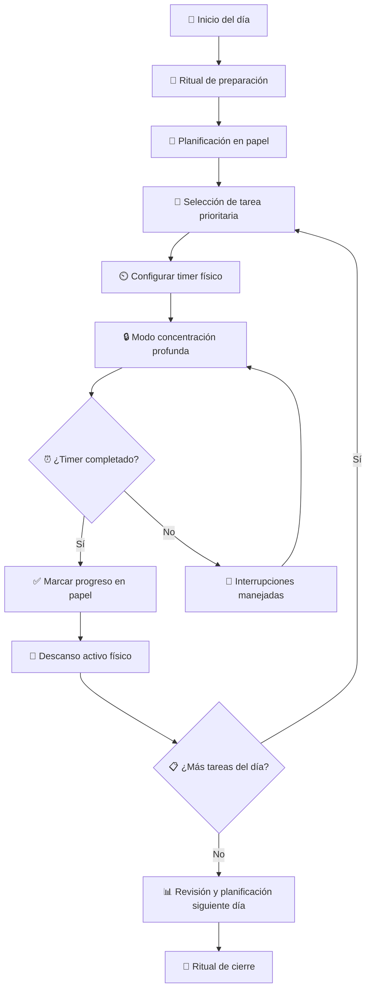

# 🏠 Productividad en la Vida Real

> [!info] 🎯 Contexto Mientras que la productividad digital se enfoca en herramientas tecnológicas, la productividad en la vida real abarca métodos físicos, mentales y ambientales para optimizar nuestro rendimiento sin depender de dispositivos. Se basa en principios fundamentales de organización espacial, gestión de energía física y técnicas analógicas probadas por décadas.

## 🔧 Variables Comunes

> [!tip] 🏗️ Elementos Fundamentales
> 
> - **🏠 Espacio físico**: El ambiente de trabajo y estudio organizado
> - **⚡ Energía personal**: Los ciclos naturales de concentración y descanso
> - **📝 Herramientas analógicas**: Papel, lápices, cronómetros, tableros físicos
> - **🧠 Estado mental**: Claridad, motivación y enfoque sin distracciones digitales
> - **⏰ Ritmos circadianos**: Los ciclos naturales del cuerpo para máximo rendimiento
> - **🎯 Objetivos tangibles**: Metas medibles en el mundo físico

## ⚙️ Metodología de los 5 Pilares

> [!warning] 📝 Sistema Integral Offline
> 
> ### 1. 🏗️ **Organización Espacial**
> 
> - Crear un espacio de trabajo dedicado y libre de distracciones
> - Aplicar principios de minimalismo: "Un lugar para cada cosa"
> - Optimizar iluminación natural y ergonomía física
> 
> ### 2. ⚡ **Gestión de Energía**
> 
> - Identificar horarios de máximo rendimiento personal
> - Planificar tareas complejas en momentos de alta energía
> - Programar descansos activos y pasivos
> 
> ### 3. 📝 **Sistemas Analógicos**
> 
> - Usar papel para brainstorming y planificación inicial
> - Implementar tableros Kanban físicos
> - Mantener agenda física como respaldo
> 
> ### 4. 🧘 **Técnicas de Concentración**
> 
> - Implementar técnicas de respiración y mindfulness
> - Crear rituales de inicio y cierre de sesiones de trabajo
> - Practicar single-tasking (una tarea a la vez)
> 
> ### 5. 📊 **Medición Física**
> 
> - Usar cronómetros y temporizadores analógicos
> - Llevar registro manual de hábitos
> - Tracking físico de progreso (gráficos en papel)

## 📚 Explicación Teórica

> [!info] 🧠 Fundamentos Científicos La productividad en la vida real se basa en:
> 
> - **Neurociencia**: El cerebro funciona mejor con menos distracciones digitales
> - **Psicología Ambiental**: El espacio físico impacta directamente en el rendimiento
> - **Cronobiología**: Aprovechar los ritmos naturales del cuerpo
> - **Ergonomía**: La postura y el ambiente físico afectan la concentración
> - **Psicología de Hábitos**: Los rituales físicos crean asociaciones mentales poderosas
> 
> **Ventaja clave**: Reduce la fatiga digital y la dependencia tecnológica, creando un sistema resiliente que funciona sin batería ni conexión.

## 🎯 Técnicas y Herramientas Analógicas

### 📝 Planificación en Papel

> [!tip] ✏️ Métodos Tradicionales Efectivos
> 
> |Técnica|Herramienta|Beneficio Principal|
> |---|---|---|
> |**Bullet Journal**|📒 Libreta punteada|🔄 Sistema flexible y personalizable|
> |**Agenda tradicional**|📅 Calendario físico|👀 Vista general sin distracciones|
> |**Tablero Kanban**|📋 Cartón + Post-its|📊 Visualización del flujo de trabajo|
> |**Matriz Eisenhower**|📊 Papel cuadriculado|🎯 Priorización clara de tareas|
> |**Time blocking**|📅 Agenda horaria|⏰ Gestión específica del tiempo|

### 🏠 Organización del Espacio

> [!tip] 🗂️ Optimización Ambiental
> 
> |Área|Principio|Implementación|
> |---|---|---|
> |**Escritorio**|Superficie despejada|🧹 Solo elementos para tarea actual|
> |**Archivos**|Sistema físico de carpetas|📁 Categorización por proyectos|
> |**Materiales**|Acceso inmediato|✏️ Herramientas siempre a mano|
> |**Iluminación**|Luz natural + artificial|💡 Evitar fatiga visual|
> |**Ergonomía**|Postura saludable|🪑 Silla y mesa ajustadas|

### ⏰ Técnicas de Tiempo

> [!tip] 🕐 Gestión Temporal Física
> 
> |Método|Herramienta|Duración|Propósito|
> |---|---|---|---|
> |**Pomodoro Analógico**|⏲️ Timer mecánico|25 min trabajo + 5 descanso|🎯 Concentración intensa|
> |**Time Boxing**|⏰ Reloj de mesa|Bloques personalizados|📦 Asignación específica|
> |**Regla de 2 minutos**|⏱️ Cronómetro|< 2 minutos|⚡ Acción inmediata|
> |**Técnica 52/17**|📱 Timer básico|52 min trabajo + 17 descanso|🔋 Ciclos de energía optimizados|

## 🔄 Flujo de Trabajo Físico

## 🎭 Ejemplos de Aplicación

> [!tip] 💡 Implementación Práctica
> 
> ### 📚 **Estudiante Preparando Exámenes**
> 
> **Configuración física**:
> 
> - Mesa despejada con solo libros del tema actual
> - Timer Pomodoro físico (25 min estudio + 5 min descanso)
> - Pizarra blanca para explicarse a sí mismo (Técnica Feynman)
> - Fichas de papel para memorización activa
> - Cronograma de estudio pegado en la pared
> 
> ### 💼 **Profesional Trabajando desde Casa**
> 
> **Sistema analógico**:
> 
> - Bullet Journal para planificación semanal
> - Tablero Kanban con 3 columnas: Por hacer | Haciendo | Hecho
> - Agenda física para citas importantes
> - Timer de escritorio para sesiones de trabajo profundo
> - Libreta de notas para llamadas (sin laptop)
> 
> ### 🎨 **Creativo/Artista**
> 
> **Ambiente optimizado**:
> 
> - Espacio de trabajo con luz natural
> - Materiales organizados por tipo de proyecto
> - Cronómetro para sesiones de creatividad sin presión
> - Moodboard físico pegado en la pared
> - Diario de ideas en papel siempre accesible

## 🌟 Ventajas vs Métodos Digitales

> [!info] ⚖️ Comparación Objetiva
> 
> ### 🏆 **Ventajas del Método Físico**
> 
> - **🔋 Sin dependencia de batería o conectividad**
> - **🧠 Menor fatiga mental y ocular**
> - **✍️ Mayor retención por escritura a mano**
> - **🎯 Elimina distracciones digitales automáticamente**
> - **💪 Desarrolla disciplina y autocontrol**
> - **🔒 Mayor privacidad y seguridad de información**
> 
> ### ⚠️ **Limitaciones a Considerar**
> 
> - **📊 Dificultad para análisis complejos de datos**
> - **🔄 No hay sincronización automática**
> - **🔍 Búsqueda manual en lugar de digital**
> - **📱 Menos integración con herramientas modernas**
> - **💾 Riesgo de pérdida física de información**

## 🛠️ Kit de Herramientas Esenciales

> [!warning] 🎒 Lista de Materiales Básicos
> 
> ### 📝 **Escritura y Planificación**
> 
> - Libreta de calidad (A5 o tamaño preferido)
> - Bolígrafos de diferentes colores
> - Lápiz y borrador
> - Regla y marcadores
> 
> ### ⏰ **Gestión del Tiempo**
> 
> - Timer/cronómetro analógico
> - Reloj de mesa visible
> - Calendario de pared
> 
> ### 🗂️ **Organización**
> 
> - Carpetas y archivadores
> - Post-its de colores
> - Clips y grapadora
> - Tablero de corcho o magnético
> 
> ### 🏠 **Ambiente**
> 
> - Lámpara de escritorio ajustable
> - Plantas para mejorar ambiente
> - Caja organizadora para materiales

## 🌐 Relación con Otros Temas

> [!info] 🔗 Conexiones en el Ecosistema
> 
> ### 🤝 **Complementa con**:
> 
> - **[[Productividad Digital]]**: Enfoque híbrido balanceado
> - **[[Método 1 - Pomodoro]]**: Timer físico vs digital
> - **[[Método 2 - Feynman]]**: Explicación con pizarra/papel
> 
> ### 🔄 **Se integra con**:
> 
> - **[[Hábitos y Rutinas Saludables]]**: Tracking analógico
> - **[[Mindfulness]]**: Técnicas de respiración 
> - **[[Organización Física del Espacio]]**: Feng shui y orden

## 📖 Referencias

> [!quote] 🔗 Enlaces a Notas Relacionadas
> 
> - [[Productividad Digital]]
> - [[Método 1 - Pomodoro]]
> - [[Bullet Journal Method (BuJo)]]
> - [[Organización Física del Espacio]]
> - [[Hábitos y Rutinas Saludables]]
> - [[Técnicas de Concentración]]

---

#productividad #analógico #offline #organización #espacio-físico #tiempo #concentración #minimalismo #hábitos #ergonomía