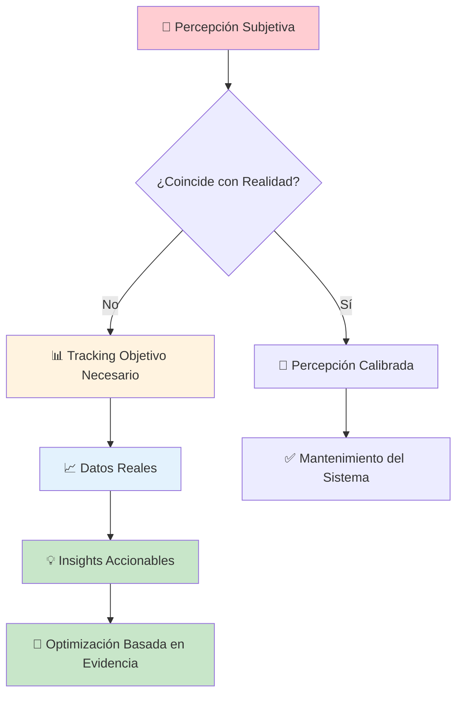
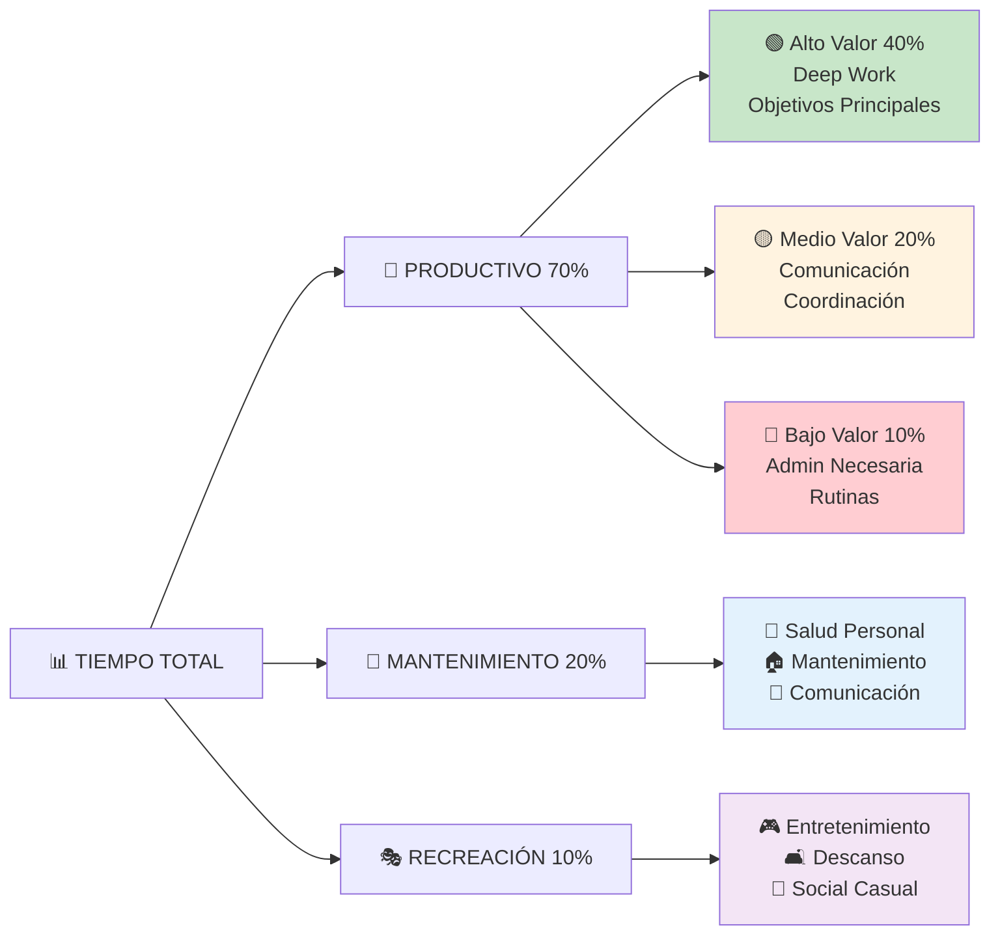

# ⏱️ Análisis de Tiempo - Optimización Temporal Científica

## 📋 Definición

> [!info] ¿Qué es el Análisis de Tiempo? El análisis de tiempo es el proceso sistemático de examinar, cuantificar y optimizar cómo invertimos nuestro recurso más valioso: el tiempo. Va más allá del simple seguimiento; implica identificar patrones, ineficiencias y oportunidades de mejora mediante datos objetivos y métodos científicos de medición.

## 🧠 Fundamentos Psicológicos

> [!tip] Por qué Nuestras Percepciones del Tiempo Son Imprecisas
> 
> - **Planning Fallacy**: Subestimamos consistentemente el tiempo necesario para tareas
> - **Time Perception Bias**: Actividades placenteras "pasan volando", las aburridas "se eternizan"
> - **Recency Effect**: Recordamos mejor cómo usamos el tiempo recientemente
> - **Attention Distortion**: Multitasking crea ilusión de productividad pero reduce eficiencia real



## 📊 Metodologías de Tracking

### ⏰ Métodos de Medición

> [!tip] Espectro de Precisión vs. Esfuerzo **Nivel 1: Estimación Retrospectiva** (Baja precisión, bajo esfuerzo)
> 
> - Revisión diaria: "¿En qué gasté mi tiempo hoy?"
> - Categorización aproximada por bloques de tiempo
> - Útil para awareness inicial, no para optimización detallada
> 
> **Nivel 2: Logging Manual** (Media precisión, medio esfuerzo)
> 
> - Registro cada 30-60 minutos de actividad actual
> - Apps como Toggl, Clockify, TimeTree
> - Balance entre precisión y sostenibilidad
> 
> **Nivel 3: Tracking Automático** (Alta precisión, bajo esfuerzo)
> 
> - RescueTime, Time Doctor, Qbserve (Mac)
> - Monitoring de aplicaciones, websites, tiempo activo
> - Datos objetivos sin sesgo de autoregistro
> 
> **Nivel 4: Tracking Híbrido** (Máxima precisión, esfuerzo moderado)
> 
> - Automático para tiempo digital + manual para offline
> - Contextualización de datos automáticos
> - Gold standard para análisis profesional

### 📱 Herramientas Especializadas

> [!info] Stack Tecnológico Recomendado **Tracking Automático:**
> 
> - **RescueTime**: Líder en seguimiento digital automático
> - **Qbserve** (Mac): Tracking local, privacy-first
> - **Time Doctor**: Monitoring empresarial con screenshots
> - **ManicTime** (Windows): Tracking detallado offline/online
> 
> **Tracking Manual:**
> 
> - **Toggl Track**: Interface simple, potente reporting
> - **Clockify**: Gratuito, ilimitado, ideal para equipos
> - **TimeCamp**: Automático + manual, facturación integrada
> - **Forest**: Gamificación de sesiones de enfoque
> 
> **Análisis y Visualización:**
> 
> - **Tableau**: Dashboards profesionales de tiempo
> - **Google Data Studio**: Visualización gratuita y personalizable
> - **Excel/Google Sheets**: Templates personalizados
> - **Notion**: Databases con análisis integrado

## 📈 Categorización y Taxonomía

### 🎯 Sistemas de Clasificación

> [!tip] Framework Multidimensional **Por Valor Agregado:**
> 
> - 🟢 **High Value**: Contribuye directamente a objetivos principales
> - 🟡 **Medium Value**: Importante pero no crítico para metas
> - 🔴 **Low Value**: Necesario pero sin impacto directo
> - ⚫ **No Value**: Actividades de desperdicio o procrastinación
> 
> **Por Energía Requerida:**
> 
> - ⚡⚡⚡ **High Cognitive Load**: Análisis, creación, decisiones complejas
> - ⚡⚡ **Medium Cognitive Load**: Comunicación, coordinación
> - ⚡ **Low Cognitive Load**: Rutinas, administración, consumo
> 
> **Por Contexto:**
> 
> - 🏢 **Work**: Trabajo principal, proyectos profesionales
> - 📚 **Learning**: Educación, desarrollo de habilidades
> - 💪 **Health**: Ejercicio, alimentación, cuidado personal
> - 👥 **Social**: Familia, amigos, networking
> - 🎭 **Recreation**: Hobbies, entretenimiento, descanso
> - 🏠 **Personal**: Tareas domésticas, administración personal

### 📊 Matriz de Análisis Temporal



## 🔍 Métricas Clave de Análisis

### 📊 KPIs Fundamentales

> [!info] Indicadores de Salud Temporal **Eficiencia Productiva:**
> 
> - **Deep Work Ratio**: % tiempo en tareas de alto valor cognitivo
> - **Focus Session Duration**: Duración promedio sin interrupciones
> - **Context Switch Frequency**: Número de cambios de tarea por hora
> - **Completion Rate**: % tareas completadas vs. iniciadas
> 
> **Distribución Temporal:**
> 
> - **Value Distribution**: % tiempo en actividades alto/medio/bajo valor
> - **Energy Alignment**: Correlación tareas demandantes vs. picos energéticos
> - **Planned vs. Actual**: Desviación entre lo planificado y ejecutado
> - **Buffer Utilization**: % tiempo de buffer usado para imprevistos
> 
> **Bienestar Temporal:**
> 
> - **Work-Life Balance Ratio**: Distribución trabajo vs. vida personal
> - **Recovery Time**: Tiempo dedicado a descanso y recuperación
> - **Stress Indicators**: Horas extra, trabajo en fines de semana
> - **Sleep Quality Impact**: Correlación horas trabajo vs. calidad sueño

### 📈 Benchmarks y Objetivos

> [!tip] Metas Basadas en Investigación **Para Knowledge Workers:**
> 
> - **Deep Work**: 3-4 horas diarias (25-30% del tiempo laboral)
> - **Communication**: 2-3 horas diarias (20-25% del tiempo laboral)
> - **Admin Tasks**: 1-2 horas diarias (10-15% del tiempo laboral)
> - **Learning**: 5-10 horas semanales (desarrollo continuo)
> 
> **Distribución Semanal Ideal:**
> 
> - **Productivo**: 40-50 horas (trabajo + aprendizaje)
> - **Salud**: 10-15 horas (ejercicio + cuidado personal)
> - **Social/Familia**: 15-20 horas (relaciones importantes)
> - **Recreación**: 10-15 horas (hobbies + entretenimiento)
> - **Mantenimiento**: 8-12 horas (admin + doméstico)

## 🎯 Proceso de Análisis Sistemático

### 📅 Ciclos de Evaluación

> [!warning] Framework de Revisión Estructurada **Análisis Diario (5 minutos)**
> 
> - Review rápido de categorías de tiempo
> - Identificación de desviaciones principales
> - Nota de patrones o anomalías
> - Ajustes micro para el día siguiente
> 
> **Análisis Semanal (30 minutos)**
> 
> - Generación de reportes automáticos
> - Comparación vs. objetivos semanales
> - Identificación de tendencias problemáticas
> - Planificación de ajustes para próxima semana
> 
> **Análisis Mensual (90 minutos)**
> 
> - Deep dive en patrones de comportamiento
> - Correlación con productividad/bienestar
> - Identificación de oportunidades de optimización
> - Ajustes en sistemas y procesos

### 🔍 Técnicas de Análisis Avanzado

> [!tip] Métodos de Investigación Temporal **Análisis de Patrones:**
> 
> - **Time Series Analysis**: Tendencias de productividad por día/semana/mes
> - **Correlation Analysis**: Relación entre variables (sueño vs. productividad)
> - **Outlier Detection**: Días excepcionalmente productivos/improductivos
> - **Seasonality Patterns**: Variaciones por época del año
> 
> **Análisis Comparativo:**
> 
> - **Before/After Studies**: Impact de cambios en rutinas
> - **A/B Testing**: Comparación de diferentes enfoques
> - **Cohort Analysis**: Seguimiento de hábitos específicos en el tiempo
> - **Benchmark Comparison**: Versus estándares de industria/pares

## 📊 Templates de Reporte

### 📈 Dashboard Semanal

> [!info] Template de Análisis Semanal
> 
> ```
> 📊 ANÁLISIS TEMPORAL - SEMANA [Fecha]
> 
> ⏱️ DISTRIBUCIÓN TOTAL: 168 horas
> 
> 🎯 PRODUCTIVIDAD:
> • Deep Work: ___h (___%) [Meta: 25h]
> • Shallow Work: ___h (___%) [Meta: 15h]
> • Learning: ___h (___%) [Meta: 8h]
> • Communication: ___h (___%) [Meta: 12h]
> 
> 💪 BIENESTAR:
> • Ejercicio: ___h (___%) [Meta: 6h]
> • Sueño: ___h (___%) [Meta: 56h]
> • Alimentación: ___h (___%) [Meta: 8h]
> • Cuidado personal: ___h (___%) [Meta: 4h]
> 
> 👥 SOCIAL/PERSONAL:
> • Familia: ___h (___%) [Meta: 15h]
> • Amigos: ___h (___%) [Meta: 5h]
> • Hobbies: ___h (___%) [Meta: 8h]
> • Descanso: ___h (___%) [Meta: 10h]
> 
> 🏠 MANTENIMIENTO:
> • Admin personal: ___h (___%) [Meta: 3h]
> • Doméstico: ___h (___%) [Meta: 5h]
> • Desplazamientos: ___h (___%) [Meta: 4h]
> 
> 📈 INSIGHTS CLAVE:
> • Patrón más productivo: ____________
> • Mayor desperdicio de tiempo: ____________
> • Correlación observada: ____________
> • Ajuste para próxima semana: ____________
> ```

### 🎯 Análisis de Oportunidades

> [!tip] Framework de Identificación de Mejoras **Método LEAN para Tiempo:**
> 
> 1. **Value Stream Mapping**: Mapear flujo de actividades diarias
> 2. **Waste Identification**: Identificar 8 desperdicios temporales
> 3. **Root Cause Analysis**: 5 por qués para ineficiencias principales
> 4. **Kaizen Events**: Micro-mejoras incrementales semanales
> 5. **Standardization**: Documentar mejores prácticas temporales

## 🔧 Optimizaciones Específicas

### ⚡ Eliminación de Desperdicios Temporales

> [!warning] Los 8 Desperdicios del Tiempo Personal **1. Sobreproducción** 📊
> 
> - Hacer más trabajo del necesario
> - Perfeccionismo en tareas de bajo valor
> - _Solución_: Definir "good enough" standards
> 
> **2. Espera** ⏰
> 
> - Tiempo inactivo esperando respuestas/recursos
> - Procesos secuenciales que podrían ser paralelos
> - _Solución_: Paralelización y trabajo asíncrono
> 
> **3. Transporte** 🚗
> 
> - Desplazamientos innecesarios o ineficientes
> - Viajes que podrían ser virtuales
> - _Solución_: Optimización de rutas, trabajo remoto
> 
> **4. Sobreprocesamiento** 🔄
> 
> - Más pasos de los necesarios para completar tarea
> - Burocracia personal innecesaria
> - _Solución_: Simplificación de procesos
> 
> **5. Inventario** 📦
> 
> - Acumulación de tareas pendientes
> - WIP (Work in Progress) excesivo
> - _Solución_: Limitar trabajo simultáneo, flujo pull
> 
> **6. Movimiento** 🚶‍♂️
> 
> - Movimientos físicos innecesarios
> - Búsqueda de herramientas/información
> - _Solución_: Organización del workspace, access rápido
> 
> **7. Defectos** ❌
> 
> - Retrabajos por errores evitables
> - Decisiones que deben rehacerse
> - _Solución_: Right first time practices, checklists
> 
> **8. Talento Subutilizado** 🧠
> 
> - No usar habilidades/conocimientos óptimamente
> - Tareas que otros podrían hacer mejor/más rápido
> - _Solución_: Delegación estratégica, especialización

### 🎯 Técnicas de Optimización

> [!tip] Estrategias Probadas de Mejora **Batching (Agrupación)** 📦
> 
> - Agrupar tareas similares para minimizar context switching
> - Email processing en 2-3 bloques diarios
> - Calls consecutivos en ventanas específicas
> - Errands agrupados por ubicación geográfica
> 
> **Automation (Automatización)** 🤖
> 
> - Scripts para tareas repetitivas
> - Templates para comunicaciones estándar
> - Sistemas de recordatorios automáticos
> - Flujos de trabajo digitales optimizados
> 
> **Delegation (Delegación)** 👥
> 
> - Tareas por debajo de tu valor por hora
> - Actividades que otros hacen mejor/más rápido
> - Formación de otros para recibir delegación
> - Outsourcing de tareas especializadas
> 
> **Elimination (Eliminación)** ✂️
> 
> - Meetings sin valor agregado claro
> - Actividades que no alinean con objetivos
> - Compromisos adquiridos por inercia
> - Perfectionism en tareas de bajo impacto

## 📱 Análisis de Tiempo Digital

### 📊 Digital Wellness Metrics

> [!info] Métricas Específicas del Tiempo Digital **Screen Time Analysis:**
> 
> - Total daily screen time por dispositivo
> - App usage breakdown por categoría
> - Peak usage hours y patrones diarios
> - Weekend vs. weekday differences
> 
> **Productivity vs. Distraction Ratio:**
> 
> - Tiempo en apps productivas vs. entretenimiento
> - Social media time vs. objetivos personales
> - News consumption vs. information overload
> - Gaming/streaming vs. tiempo en objetivos

### 🎯 Digital Time Optimization

> [!tip] Estrategias de Optimización Digital **App Usage Limits** 📱
> 
> - Screen Time controls (iOS) / Digital Wellbeing (Android)
> - Third-party apps: Moment, Space, Offtime
> - Progressive reduction de tiempo en apps problema
> - Replacement habits para tiempo liberado
> 
> **Notification Management** 🔔
> 
> - Audit completo de todas las notificaciones
> - Priority notifications vs. nice-to-know
> - Batch processing de non-urgent notifications
> - Do Not Disturb schedules durante focus work
> 
> **Digital Environment Design** 🎨
> 
> - Home screen optimization para productivity
> - Elimination de trigger apps del home screen
> - Folder organization para friction increase
> - Progressive web apps vs. native apps distractivas

## 🧪 Experimentos y A/B Testing

### 🔬 Metodología Experimental

> [!tip] Diseño de Experimentos Temporales **Hypothesis Formation:**
> 
> - "Si cambio X, entonces Y mejorará en Z%"
> - Predicciones específicas y medibles
> - Timeframe definido para el experimento
> - Métricas de éxito claramente definidas
> 
> **Control Variables:**
> 
> - Solo cambiar una variable por experimento
> - Mantener otras rutinas constantes
> - Documentar external factors que podrían influir
> - Sample size adecuado (mínimo 2-4 semanas)
> 
> **Measurement & Analysis:**
> 
> - Before/during/after metrics comparison
> - Statistical significance testing cuando aplique
> - Qualitative feedback además de quantitative data
> - Decision framework para adopt/adapt/abandon

### 🧩 Experimentos Comunes

> [!info] Ideas de Experiments Temporales **Schedule Optimization:**
> 
> - Early bird vs. night owl productivity
> - 4-day work week vs. traditional 5-day
> - Different wake-up times impact on energy
> - Meal timing effects en afternoon productivity
> 
> **Technology Usage:**
> 
> - Phone-free morning hours impact
> - Single-tasking vs. multitasking effectiveness
> - Different notification schedules
> - Analog vs. digital tools para specific tasks
> 
> **Work Patterns:**
> 
> - 90-minute work blocks vs. 45-minute blocks
> - Standing desk vs. sitting productivity
> - Background music vs. silence para focus work
> - Different break activities impact en sustained attention

## 📚 Integración con Sistemas Personales

### 🔄 Conexión con Otras Metodologías

> [!info] Sinergias Sistémicas **Time Analysis + GTD:**
> 
> - Tracking por contexts para optimizar batching
> - Analysis de capture-to-completion times
> - Review data para informar weekly reviews
> - Project velocity metrics para better estimation
> 
> **Time Analysis + Time Blocking:**
> 
> - Historical data para better block duration estimates
> - Identification de optimal blocks para different task types
> - Buffer time optimization basado en interrupt patterns
> - Energy level data para smart block scheduling
> 
> **Time Analysis + Habit Tracking:**
> 
> - Correlation analysis entre habits y productivity
> - Habit stack optimization basado en natural patterns
> - Implementation time tracking para new habits
> - Habit ROI analysis basado en time investment

### 🎯 Personalización por Cronotipo

> [!tip] Optimización Basada en Ritmos Personales **Para Alondras (Morning People):**
> 
> - Deep work scheduling en 6-10am window
> - Administrative tasks en afternoon dip
> - Social activities en early evening
> - Earlier sleep time para maximize morning energy
> 
> **Para Búhos (Night People):**
> 
> - Light tasks en morning, ramp up después lunch
> - Peak creative work en late afternoon/evening
> - Flexible morning schedules cuando posible
> - Protect late-night productive hours
> 
> **Para Tipos Intermedios:**
> 
> - Flexibility en scheduling basado en daily energy
> - Bi-modal productivity peaks (mid-morning y mid-afternoon)
> - Social activities en varied times
> - Adaptation strategies para different contexts

## ⚠️ Limitaciones y Consideraciones Éticas

### 🚧 Desafíos del Time Tracking

> [!warning] Potenciales Problemas **Tracking Fatigue** 😴
> 
> - Burnout por sobre-monitoreo de comportamiento
> - Analysis paralysis por exceso de data
> - Pérdida de espontaneidad y flow natural
> - _Solución_: Automated tracking + periodic manual reviews
> 
> **Privacy Concerns** 🔒
> 
> - Data sensitivity de detailed time tracking
> - Employer surveillance implications
> - Third-party data sharing policies
> - _Solución_: Local-first tools, data ownership clarity
> 
> **Behavioral Distortion** 🎭
> 
> - Hawthorne effect: behavior change porque se mide
> - Gaming the metrics vs. genuine improvement
> - Over-optimization de measurable activities
> - _Solución_: Focus en outcomes vs. activities, regular metric review

### 🧠 Consideraciones Psicológicas

> [!info] Balance Mental y Medición **Healthy Relationship with Data:**
> 
> - Data como información, no como judgment
> - Progress tracking vs. perfectionism
> - Flexibility para life circumstances
> - Regular "measurement sabbaticals"
> 
> **Avoiding Time Anxiety:**
> 
> - Use analysis para empowerment, no stress
> - Focus en patterns vs. daily variations
> - Celebration de improvements, no matter size
> - Integration de time for spontaneity y serendipity

---

## 📎 Referencias

> [!quote] Enlaces a Otras Notas
> 
> - [[Gestión del Tiempo]] - Principios fundamentales de administración temporal
> - [[Time Blocking]] - Aplicación práctica de insights temporales
> - [[Productividad Digital]] - Herramientas para tracking y análisis
> - [[Matriz de Eisenhower]] - Priorización basada en análisis de valor
> - [[Gestión de la Energía Personal]] - Correlación tiempo-energía
> - [[Hábitos y Rutinas Saludables]] - Patrones temporales para bienestar
> - [[Deep Work]] - Maximización de tiempo de alto valor cognitivo

---

_Tags: #análisis-de-tiempo #time-tracking #optimización-temporal #productividad #métricas #data-analysis #time-management #eficiencia #digital-wellness #lean-personal #cronobiología #behavioral-analytics #time-audit #productivity-metrics_