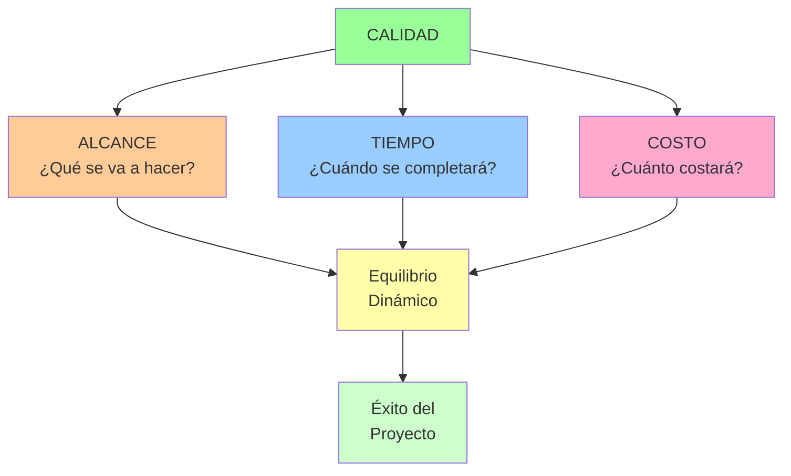

# Gestión de Proyectos 📊

> [!quote] "Un proyecto es una serie de tareas que tienen un objetivo específico para ser completadas dentro de ciertos parámetros." - Project Management Institute (PMI)

## ¿Qué es la Gestión de Proyectos? 🎯

> [!info] **Definición** La gestión de proyectos es la aplicación de conocimientos, habilidades, herramientas y técnicas para ejecutar proyectos de manera efectiva y eficiente. Es el arte de dirigir y coordinar recursos humanos y materiales durante la vida de un proyecto, utilizando técnicas modernas de gestión para lograr objetivos predefinidos de alcance, costo, tiempo, calidad y satisfacción de los participantes.

> [!tip] **Características de un Proyecto** ✨
> 
> - **Temporal**: Tiene un inicio y fin definidos
> - **Único**: Crea un producto, servicio o resultado específico
> - **Progresivo**: Se desarrolla en etapas incrementales
> - **Recursos limitados**: Restricciones de tiempo, presupuesto y personal
> - **Interdisciplinario**: Requiere diferentes habilidades y conocimientos

## El Triángulo de la Gestión de Proyectos



## Las 5 Fases del Ciclo de Vida del Proyecto

> [!warning] **Fase 1: Iniciación** 🚀
> 
> ### Objetivos Principales:
> 
> - **Definir el proyecto** a alto nivel
> - **Identificar stakeholders** clave
> - **Autorizar el proyecto** formalmente
> - **Establecer el charter del proyecto**
> 
> ### Entregables Clave:
> 
> - Project Charter (Acta de Constitución)
> - Registro de Stakeholders
> - Análisis de Factibilidad
> - Justificación del Negocio
> 
> ### Herramientas:
> 
> - Análisis FODA (SWOT)
> - Análisis Costo-Beneficio
> - Benchmarking
> - Entrevistas con stakeholders

> [!tip] **Fase 2: Planificación** 📋
> 
> ### Componentes del Plan:
> 
> |Área de Conocimiento|Plan Específico|Herramientas|
> |---|---|---|
> |**Alcance**|Plan de Gestión del Alcance|WBS, Diccionario WBS|
> |**Tiempo**|Cronograma del Proyecto|Diagrama de Gantt, PERT|
> |**Costo**|Presupuesto del Proyecto|Estimación por analogía, paramétrica|
> |**Calidad**|Plan de Calidad|Checklists, métricas|
> |**Recursos**|Plan de Recursos Humanos|Matriz RACI, organigramas|
> |**Comunicación**|Plan de Comunicaciones|Matriz de comunicación|
> |**Riesgos**|Plan de Gestión de Riesgos|Registro de riesgos, análisis cualitativo|
> |**Adquisiciones**|Plan de Adquisiciones|Make vs Buy, criterios de selección|
> 
> ### Work Breakdown Structure (WBS):
> 
> ```mermaid
> graph TD
>     A[Proyecto Principal] --> B[Entregable 1]
>     A --> C[Entregable 2]
>     A --> D[Entregable 3]
>     
>     B --> E[Actividad 1.1]
>     B --> F[Actividad 1.2]
>     C --> G[Actividad 2.1]
>     C --> H[Actividad 2.2]
>     D --> I[Actividad 3.1]
>     D --> J[Actividad 3.2]
>     
>     E --> K[Tarea 1.1.1]
>     E --> L[Tarea 1.1.2]
>     
>     style A fill:#e1f5fe
>     style B fill:#f3e5f5
>     style C fill:#f3e5f5
>     style D fill:#f3e5f5
>     style E fill:#fff3e0
>     style F fill:#fff3e0
> ```

> [!info] **Fase 3: Ejecución** ⚡
> 
> ### Actividades Principales:
> 
> - **Coordinar recursos** y personas
> - **Ejecutar el plan** del proyecto
> - **Gestionar expectativas** de stakeholders
> - **Implementar cambios** aprobados
> 
> ### Procesos de Gestión:
> 
> - Dirección y gestión del trabajo del proyecto
> - Gestión del conocimiento del proyecto
> - Gestión de la calidad
> - Adquisición y desarrollo del equipo
> - Gestión de las comunicaciones
> - Gestión del involucramiento de stakeholders

> [!warning] **Fase 4: Monitoreo y Control** 📊
> 
> ### Indicadores Clave de Rendimiento (KPIs):
> 
> #### **Métricas de Tiempo:**
> 
> - **SPI** (Schedule Performance Index) = EV/PV
> - **Variación del Cronograma** = EV - PV
> - **Estimación a la Finalización** = AC + (BAC - EV)/CPI
> 
> #### **Métricas de Costo:**
> 
> - **CPI** (Cost Performance Index) = EV/AC
> - **Variación del Costo** = EV - AC
> - **Índice de Rendimiento del Trabajo** = (BAC - EV)/(BAC - AC)
> 
> #### **Métricas de Calidad:**
> 
> - Defectos por millón
> - Porcentaje de entregables aceptados
> - Índice de satisfacción del cliente
> 
> ### Técnica del Valor Ganado (EVM):
> 
> ```mermaid
> graph LR
>     A[PV<br/>Valor Planificado] --> D[Análisis de<br/>Variaciones]
>     B[EV<br/>Valor Ganado] --> D
>     C[AC<br/>Costo Real] --> D
>     
>     D --> E[SPI = EV/PV<br/>Rendimiento Cronograma]
>     D --> F[CPI = EV/AC<br/>Rendimiento Costo]
>     D --> G[Pronósticos y<br/>Acciones Correctivas]
>     
>     style E fill:#99ff99
>     style F fill:#ffcc99
>     style G fill:#ff9999
> ```

> [!tip] **Fase 5: Cierre** 🎯
> 
> ### Actividades de Cierre:
> 
> - **Aceptación formal** de entregables
> - **Documentación** de lecciones aprendidas
> - **Liberación de recursos** del proyecto
> - **Cierre de contratos** y adquisiciones
> - **Archivo** de documentos del proyecto
> 
> ### Entregables Finales:
> 
> - Informe final del proyecto
> - Documentación de lecciones aprendidas
> - Transferencia de productos/servicios
> - Celebración y reconocimiento del equipo

## Metodologías de Gestión de Proyectos

> [!info] **Metodologías Tradicionales (Waterfall)** 🏗️
> 
> ### Características:
> 
> - **Secuencial**: Cada fase debe completarse antes de la siguiente
> - **Planificación extensiva**: Documentación detallada upfront
> - **Cambios controlados**: Proceso formal para modificaciones
> - **Predictivo**: Basado en requisitos bien definidos
> 
> ### Ventajas:
> 
> - Estructura clara y comprensible
> - Documentación exhaustiva
> - Control riguroso de cambios
> - Adecuado para proyectos con requisitos estables
> 
> ### Desventajas:
> 
> - Poca flexibilidad para cambios
> - Entrega tardía de valor
> - Riesgo alto si los requisitos cambian

> [!tip] **Metodologías Ágiles** 🔄
> 
> ### Principios Fundamentales:
> 
> 1. **Individuos e interacciones** sobre procesos y herramientas
> 2. **Software funcionando** sobre documentación extensiva
> 3. **Colaboración con el cliente** sobre negociación contractual
> 4. **Respuesta ante el cambio** sobre seguir un plan
> 
> ### Framework Scrum:
> 
> ```mermaid
> graph LR
>     A[Product Backlog] --> B[Sprint Planning]
>     B --> C[Sprint Backlog]
>     C --> D[Sprint<br/>1-4 semanas]
>     D --> E[Daily Scrum]
>     E --> D
>     D --> F[Sprint Review]
>     F --> G[Sprint Retrospective]
>     G --> B
>     F --> H[Increment]
>     
>     style D fill:#99ff99
>     style E fill:#ffcc99
>     style F fill:#99ccff
>     style G fill:#ffaacc
> ```
> 
> ### Roles en Scrum:
> 
> - **Product Owner**: Define qué se construye
> - **Scrum Master**: Facilita el proceso
> - **Development Team**: Construye el producto

> [!warning] **Metodologías Híbridas** ⚖️
> 
> ### Cuándo Usar Cada Enfoque:
> 
> |Factor|Tradicional|Ágil|Híbrido|
> |---|---|---|---|
> |**Requisitos**|Estables y claros|Cambiantes|Mixtos|
> |**Equipo**|Distribuido|Co-ubicado|Mixto|
> |**Riesgo**|Bajo|Alto|Medio|
> |**Innovación**|Baja|Alta|Media|
> |**Regulación**|Alta|Baja|Media|
> 
> ### Ejemplos de Híbridos:
> 
> - **Water-Scrum-Fall**: Planificación tradicional + desarrollo ágil + implementación tradicional
> - **Scaled Agile**: Múltiples equipos ágiles coordinados tradicionalmente
> - **Lean-Agile**: Principios Lean aplicados a desarrollo ágil

## Herramientas Digitales de Gestión

> [!tip] **Categorías de Herramientas** 🛠️
> 
> ### **Planificación y Seguimiento:**
> 
> - **Microsoft Project**: Gestión completa, diagramas de Gantt avanzados
> - **Smartsheet**: Colaborativo, basado en web
> - **Monday.com**: Visual, personalizable, intuitivo
> - **Wrike**: Gestión de recursos, reporting avanzado
> 
> ### **Metodologías Ágiles:**
> 
> - **Jira**: Especializado en desarrollo de software
> - **Trello**: Kanban simple y visual
> - **Azure DevOps**: Integrado con herramientas de desarrollo
> - **Notion**: All-in-one con flexibilidad máxima
> 
> ### **Comunicación y Colaboración:**
> 
> - **Slack**: Comunicación en tiempo real
> - **Microsoft Teams**: Integrado con Office 365
> - **Zoom**: Videoconferencias y webinars
> - **Miro**: Pizarras colaborativas virtuales

## Gestión de Riesgos en Proyectos

> [!warning] **Proceso de Gestión de Riesgos** ⚠️
> 
> ### 1. Identificación de Riesgos:
> 
> - **Brainstorming** con el equipo
> - **Análisis de supuestos** del proyecto
> - **Revisión de lecciones aprendidas** de proyectos similares
> - **Técnica Delphi** para consulta a expertos
> 
> ### 2. Análisis Cualitativo:
> 
> |Probabilidad|Impacto Bajo|Impacto Medio|Impacto Alto|
> |---|---|---|---|
> |**Alta**|🟨 Medio|🟧 Alto|🟥 Muy Alto|
> |**Media**|🟩 Bajo|🟨 Medio|🟧 Alto|
> |**Baja**|🟩 Muy Bajo|🟩 Bajo|🟨 Medio|
> 
> ### 3. Estrategias de Respuesta:
> 
> - **Evitar**: Eliminar la amenaza
> - **Mitigar**: Reducir probabilidad o impacto
> - **Transferir**: Pasar el riesgo a terceros
> - **Aceptar**: Reconocer pero no actuar activamente

## Liderazgo de Proyectos vs Gestión

> [!info] **Diferencias Clave** 👥
> 
> |Aspecto|Gestión de Proyectos|Liderazgo de Proyectos|
> |---|---|---|
> |**Enfoque**|Procesos y sistemas|Personas y visión|
> |**Orientación**|Control y eficiencia|Inspiración y cambio|
> |**Tiempo**|Presente y corto plazo|Futuro y largo plazo|
> |**Métodos**|Planificación y organización|Comunicación y motivación|
> |**Objetivo**|Hacer las cosas bien|Hacer las cosas correctas|
> 
> ### Competencias del Líder de Proyectos:
> 
> - **Inteligencia emocional** para manejar conflictos
> - **Comunicación efectiva** para alinear stakeholders
> - **Toma de decisiones** bajo incertidumbre
> - **Adaptabilidad** ante cambios inesperados
> - **Negociación** para resolver conflictos de recursos

## Gestión de Stakeholders

> [!tip] **Análisis de Stakeholders** 🎭
> 
> ### Matriz de Poder vs Interés:
> 
> ```mermaid
> graph TD
>     A[ALTA INFLUENCIA<br/>ALTO INTERÉS<br/>🎯 GESTIONAR DE CERCA] --> B[ALTA INFLUENCIA<br/>BAJO INTERÉS<br/>😊 MANTENER SATISFECHO]
>     C[BAJA INFLUENCIA<br/>ALTO INTERÉS<br/>📢 MANTENER INFORMADO] --> D[BAJA INFLUENCIA<br/>BAJO INTERÉS<br/>👁️ MONITOREAR]
>     
>     style A fill:#ff9999
>     style B fill:#ffcc99
>     style C fill:#99ccff
>     style D fill:#99ff99
> ```
> 
> ### Estrategias por Cuadrante:
> 
> - **Gestionar de cerca**: Comunicación frecuente, involucrar en decisiones
> - **Mantener satisfecho**: Comunicación regular, demostrar valor
> - **Mantener informado**: Updates periódicos, canales apropiados
> - **Monitorear**: Vigilancia ocasional, comunicación mínima

## Técnicas Avanzadas de Estimación

> [!info] **Métodos de Estimación** 📊
> 
> ### **1. Estimación por Analogía:**
> 
> - Comparar con proyectos similares pasados
> - Ajustar por diferencias en complejidad
> - Rápido pero requiere experiencia histórica
> 
> ### **2. Estimación Paramétrica:**
> 
> - Usar datos históricos y variables del proyecto
> - Ejemplo: X horas por punto de función
> - Más preciso con datos estadísticamente válidos
> 
> ### **3. Estimación por Tres Puntos (PERT):**
> 
> - **Optimista (O)**: Mejor escenario posible
> - **Pesimista (P)**: Peor escenario probable
> - **Más Probable (M)**: Escenario más realista
> - **Fórmula**: E = (O + 4M + P) / 6
> 
> ### **4. Planning Poker (Ágil):**
> 
> - Estimación colaborativa del equipo
> - Uso de secuencia Fibonacci para story points
> - Discusión hasta llegar a consenso

## Manejo de Cambios en Proyectos

> [!warning] **Proceso de Control de Cambios** 🔄
> 
> ### Flujo del Proceso:
> 
> ```mermaid
> flowchart TD
>     A[Solicitud de Cambio] --> B{Evaluación Inicial}
>     B --> C[Análisis de Impacto]
>     C --> D[Documentación Detallada]
>     D --> E[Comité de Control de Cambios]
>     E --> F{Decisión}
>     F -->|Aprobado| G[Actualizar Plan del Proyecto]
>     F -->|Rechazado| H[Notificar Rechazo]
>     F -->|Diferido| I[Backlog de Cambios]
>     G --> J[Implementar Cambio]
>     J --> K[Comunicar a Stakeholders]
>     
>     style F fill:#ffffaa
>     style G fill:#99ff99
>     style H fill:#ff9999
>     style I fill:#ffcc99
> ```
> 
> ### Criterios de Evaluación:
> 
> - **Impacto en alcance, tiempo y costo**
> - **Alineación con objetivos del proyecto**
> - **Disponibilidad de recursos**
> - **Riesgos asociados**
> - **Valor para el cliente/negocio**

## Técnica de Estudio: Método PRINCE2

> [!tip] **Método PRINCE2 para Memorizar Principios** 👑
> 
> **P** - **Principios** claros y aplicables **R** - **Roles** definidos con responsabilidades específicas **I** - **Integración** de todas las áreas de conocimiento **N** - **Negocio** como justificación continua **C** - **Control** por etapas del proyecto **E** - **Experiencia** aprovechada mediante lecciones aprendidas **2** - **Dos niveles**: gestión y dirección del proyecto
> 
> ### Los 7 Principios PRINCE2:
> 
> 1. **Justificación comercial continua**
> 2. **Aprender de la experiencia**
> 3. **Roles y responsabilidades definidos**
> 4. **Gestión por etapas**
> 5. **Gestión por excepción**
> 6. **Enfoque en los productos**
> 7. **Adaptación al entorno del proyecto**
> 
> ### Mnemotécnica Visual:
> 
> Imagina un **príncipe medieval** que gestiona la construcción de un castillo. Cada principio representa una torre del castillo que debe estar perfectamente integrada con las demás para que la estructura sea sólida y cumpla su propósito de proteger el reino (objetivos del proyecto).

## Casos de Éxito y Fracaso

> [!info] **Caso de Éxito: Proyecto Manhattan** ⚛️
> 
> **Características del Éxito:**
> 
> - **Objetivo claro y urgente**: Desarrollar arma nuclear antes que el enemigo
> - **Recursos ilimitados**: Presupuesto y personal sin restricciones
> - **Liderazgo fuerte**: General Leslie Groves y Robert Oppenheimer
> - **Gestión de la complejidad**: Múltiples enfoques paralelos
> - **Seguridad y confidencialidad**: Compartimentación de información
> 
> **Lecciones Aprendidas:**
> 
> - La claridad de propósito puede superar cualquier obstáculo técnico
> - El liderazgo dual (administrativo-técnico) puede ser muy efectivo
> - Los proyectos complejos requieren enfoques múltiples y paralelos

> [!warning] **Caso de Fracaso: Berlin Brandenburg Airport** ✈️
> 
> **Factores del Fracaso:**
> 
> - **Cambios constantes** en requisitos y diseño
> - **Falta de expertise** en sistemas complejos de seguridad
> - **Gestión deficiente** de múltiples stakeholders
> - **Subestimación** de la complejidad técnica
> - **Presión política** vs realidad técnica
> 
> **Lecciones Aprendidas:**
> 
> - Los cambios tardíos en proyectos complejos son exponencialmente costosos
> - La expertise técnica específica es irreemplazable
> - La presión política no puede acelerar realidades técnicas

## Métricas de Éxito del Proyecto

> [!tip] **KPIs Cuantitativos** 📈
> 
> ### **Métricas Tradicionales:**
> 
> - **CPI** (Cost Performance Index): Eficiencia de costos
> - **SPI** (Schedule Performance Index): Eficiencia temporal
> - **Quality Index**: % de entregables sin defectos
> - **Scope Creep**: % de cambios no controlados
> 
> ### **Métricas de Valor:**
> 
> - **ROI** (Return on Investment): Retorno de la inversión
> - **NPV** (Net Present Value): Valor presente neto
> - **Payback Period**: Tiempo de recuperación
> - **Business Value Delivered**: Valor entregado al negocio

> [!info] **KPIs Cualitativos** 🎯
> 
> ### **Satisfacción de Stakeholders:**
> 
> - Encuestas de satisfacción del cliente
> - Feedback del equipo del proyecto
> - Evaluación de la alta dirección
> - Percepción de usuarios finales
> 
> ### **Capacidades Organizacionales:**
> 
> - Lecciones aprendidas documentadas
> - Mejoras en procesos organizacionales
> - Desarrollo de competencias del equipo
> - Madurez en gestión de proyectos

## Referencias y Conexiones

> [!quote] **Referencias a Otras Notas**
> 
> - [[Gestión del Tiempo]] - Técnicas específicas de planificación temporal
> - [[Toma de Decisiones]] - Procesos decisionales en contextos de proyecto
> - [[Liderazgo Situacional]] - Adaptación del estilo de liderazgo según la fase
> - [[Gestión de Conflictos]] - Resolución de conflictos entre stakeholders
> - [[Comunicación Efectiva]] - Habilidades comunicacionales para PM
> - [[Análisis Costo-Beneficio]] - Evaluación económica de proyectos
> - [[Team Building]] - Construcción y desarrollo de equipos de proyecto
> - [[Objetivos SMART]] - Definición clara de objetivos de proyecto
> - [[Pensamiento Estratégico]] - Alineación de proyectos con estrategia organizacional
> - [[Delegación Efectiva]] - Asignación eficiente de responsabilidades
> - [[Gestión del Estrés]] - Manejo de presión en entornos de proyecto
> - [[Feedback y Coaching]] - Desarrollo del equipo durante el proyecto

## Notas Recomendadas para Profundizar

> [!info] **Prerrequisitos y Complementos** 📋
> 
> ### **Fundamentos Necesarios:**
> 
> - [[Planificación Estratégica Personal]] - Base conceptual de planificación
> - [[Análisis Costo-Beneficio]] - Evaluación económica de alternativas
> - [[Toma de Decisiones]] - Procesos decisionales estructurados
> - [[Comunicación Efectiva]] - Habilidades comunicacionales esenciales
> 
> ### **Habilidades Complementarias:**
> 
> - [[Time Blocking]] - Gestión efectiva del tiempo personal
> - [[Gestión de Reuniones Efectivas]] - Coordinación de equipos
> - [[Documentación de Procesos]] - Sistematización de procedimientos
> - [[Técnicas de Concentración]] - Enfoque en tareas complejas
> - [[Deep Work]] - Trabajo profundo en planificación y análisis
> 
> ### **Metodologías Específicas:**
> 
> - [[Bullet Journal Method (BuJo)]] - Seguimiento personal de proyectos
> - [[Objetivos SMART]] - Definición precisa de objetivos
> - [[Matriz de Eisenhower]] - Priorización de actividades
> - [[Sistemas de Productividad]] - Frameworks de organización personal
> - [[Automatizaciones Digitales]] - Optimización de procesos repetitivos
> 
> ### **Aplicación Avanzada:**
> 
> - [[Apps de Productividad]] - Herramientas digitales específicas
> - [[Productividad Digital]] - Optimización de flujos de trabajo digitales
> - [[Gamificación Personal]] - Motivación a través de elementos de juego
> - [[Sistemas de Revisión]] - Evaluación periódica de progreso
> ### Fases y Metodologías
> * Para el éxito de un proyecto, es crucial considerar cómo la gente se adapta a los cambios. Puedes encontrar más detalles aquí: [[Gestión de Cambios]]
---

**Tags:** #gestión-proyectos #planificación #metodologías #scrum #agile #waterfall #liderazgo #stakeholders #riesgos #pmbok #prince2 #kanban #gantt #recursos #presupuesto #cronograma #calidad #comunicación #equipos #deliverables #kpis #roi #change-management #estimación #valor-ganado