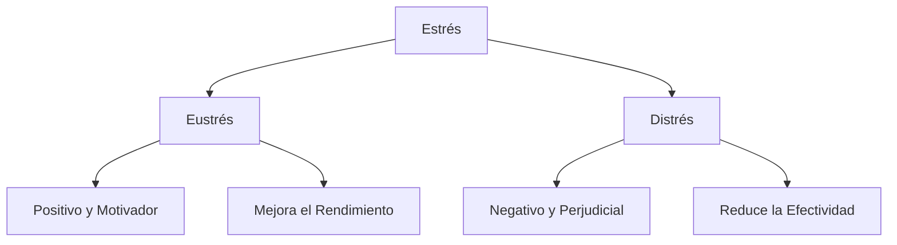
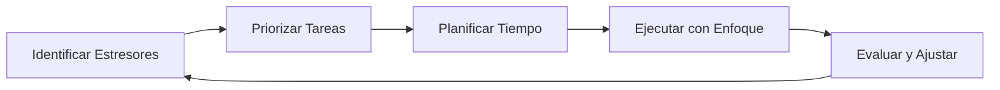

# 🧘‍♀️ Gestión del Estrés

> [!tip] 💡 Concepto Clave La gestión del estrés es el conjunto de técnicas y estrategias que nos permiten identificar, controlar y reducir las respuestas fisiológicas y psicológicas negativas ante situaciones desafiantes o amenazantes.

## 🎯 ¿Qué es el Estrés?

> [!info] 📚 Definición El estrés es una respuesta natural del organismo ante situaciones percibidas como amenazantes o desafiantes. Se manifiesta a través de cambios fisiológicos, cognitivos y conductuales que preparan al cuerpo para la acción.

### Tipos de Estrés

> [!warning] ⚠️ Señales de Alerta **Síntomas físicos:** Tensión muscular, fatiga, dolores de cabeza, problemas digestivos **Síntomas emocionales:** Irritabilidad, ansiedad, tristeza, cambios de humor **Síntomas cognitivos:** Dificultad de concentración, olvidos, pensamientos negativos **Síntomas conductuales:** Cambios en el apetito, aislamiento social, procrastinación

## 🛠️ Estrategias de Gestión del Estrés

### 1. Técnicas de Relajación

> [!tip] 🌱 Mindfulness y Meditación La práctica regular de [[Mindfulness]] ayuda a desarrollar la conciencia plena del momento presente, reduciendo la rumiación y la ansiedad anticipatoria.

#### Técnica de Respiración 4-7-8

1. **Inhala** por 4 segundos
2. **Mantén** la respiración por 7 segundos
3. **Exhala** por 8 segundos
4. Repite 4 ciclos

### 2. Gestión del Tiempo y Organización

> [!info] ⏰ Conexión con Productividad Una adecuada [[Gestión del Tiempo]] y técnicas como el [[Bullet Journal Method (BuJo)]] pueden reducir significativamente los niveles de estrés al proporcionar estructura y control.

### 3. Métodos de Estudio Anti-Estrés

> [!tip] 📖 Técnicas Efectivas Implementar métodos como:
> 
> - [[Método 1 - Pomodoro]] para mantener el enfoque sin sobrecarga
> - [[Método 5 - Mapas Mentales]] para organizar información de manera visual
> - [[Método 6 - SQ3R]] para un aprendizaje más estructurado y menos estresante

### 4. Técnicas de Concentración

> [!info] 🎯 Enfoque Mental Las [[Técnicas de Concentración]] como la técnica del palacio de la memoria o ejercicios de atención plena pueden reducir el estrés cognitivo y mejorar el rendimiento.

## 🏃‍♀️ Estilo de Vida y Estrés

### Hábitos Saludables

> [!tip] 💪 Rutinas Beneficiosas
> 
> - **[[Hábitos y Rutinas Saludables]]**: Ejercicio regular, alimentación balanceada, sueño adecuado
> - **[[Hábitos de Estudio]]**: Crear un ambiente propicio y rutinas consistentes
> - **[[Minimalismo Digital]]**: Reducir la sobrecarga de información y distracciones

### Gestión del Espacio

> [!info] 🏠 Ambiente Físico La [[Organización Física del Espacio]] influye directamente en nuestro estado mental. Un espacio ordenado y funcional reduce el estrés ambiental.

## 🧠 Aspectos Cognitivos

### Neurociencia del Estrés

> [!info] 🔬 Base Científica La [[Neurociencia del Aprendizaje]] nos enseña que el estrés crónico afecta la formación de memoria y la capacidad de aprendizaje, especialmente en el hipocampo y la corteza prefrontal.

### Metacognición y Autoconciencia

> [!tip] 🤔 Reflexión Personal La [[Metacognición]] nos permite identificar nuestros patrones de pensamiento estresantes y desarrollar estrategias personalizadas de afrontamiento.

## 📱 Herramientas Digitales

### Detox Digital

> [!warning] 📵 Desconexión Necesaria  
> El [[Detox Digital]] es fundamental en nuestra era. El exceso de estímulos digitales puede generar estrés tecnológico y afectar nuestro bienestar mental.

### Productividad Digital Consciente

> [!tip] 💻 Uso Inteligente Implementar estrategias de [[Productividad Digital]] que incluyan límites de tiempo en pantallas y uso consciente de aplicaciones.

## 🎯 Aplicación Práctica

### Plan de Acción Semanal

```mermaid
gantt
    title Rutina Semanal Anti-Estrés
    dateFormat X
    axisFormat %d
    
    section Lunes
    Meditación Matutina    :1, 2
    Planificación Semanal  :2, 3
    
    section Miércoles  
    Ejercicio              :3, 4
    Revisión de Objetivos  :4, 5
    
    section Viernes
    Reflexión Semanal      :5, 6
    Descanso Digital       :6, 7
    
    section Domingo
    Preparación Semana     :7, 8
```

### Técnica GTD para el Estrés

> [!tip] 📋 Getting Things Done Aplicar la [[Método 9 - Metodología GTD (Getting Things Done)]] ayuda a liberar la mente de la carga de recordar tareas pendientes, reduciendo significativamente el estrés mental.

## 📚 Referencias

> [!quote] 📖 Enlaces Relacionados
> 
> - [[Deep Work]] - Para mantener el enfoque sin estrés
> - [[Curva del Olvido]] - Comprender cómo el estrés afecta la memoria
> - [[Motivación Académica]] - Mantener la motivación bajo presión
> - [[Productividad en la Vida Real]] - Aplicar técnicas en contextos cotidianos

## 📝 Notas Recomendadas

> [!info] 🔗 Para Profundizar
> 
> - **[[Gestión del Tiempo]]** - Técnicas sin dependencia tecnológica
> - **[[Método 2 - Feynman]]** - Reducir estrés académico simplificando conceptos
> - **[[Método 4 - Aprendizaje Activo]]** - Engagement que reduce ansiedad
> - **[[Método 8 - Palacio de la Memoria]]** - Técnica mnemotécnica relajante
> - **[[Método 10 - Aprendizaje Basado en Problemas]]** - Enfoque estructurado que reduce incertidumbre

---

**Tags:** #gestion-estres #bienestar #productividad #mindfulness #salud-mental #tecnicas-relajacion #neurociencia #habitos-saludables #organizacion #metacognicion