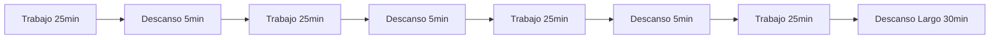
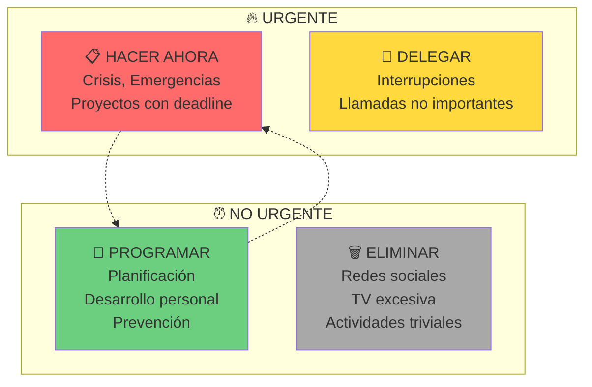
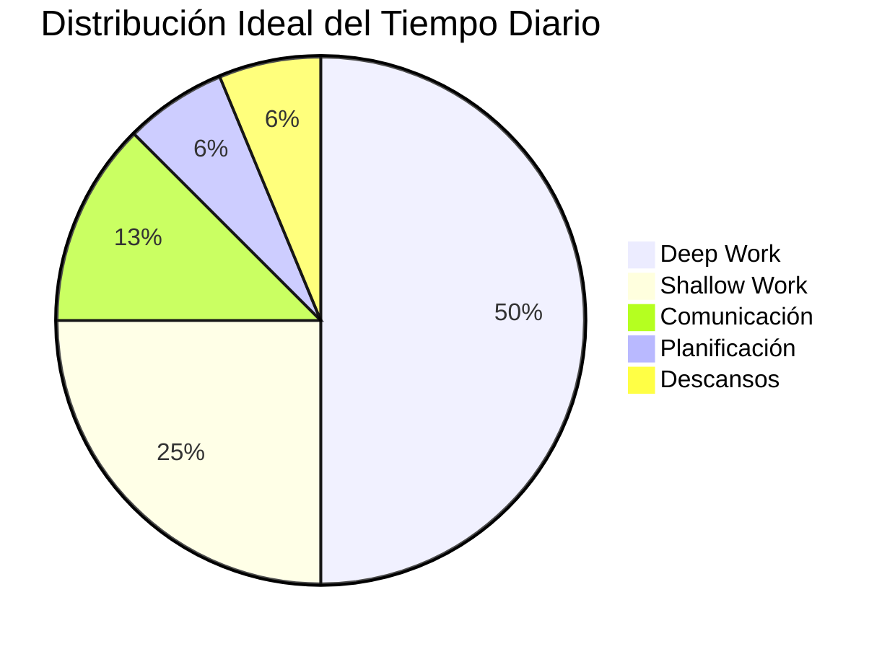
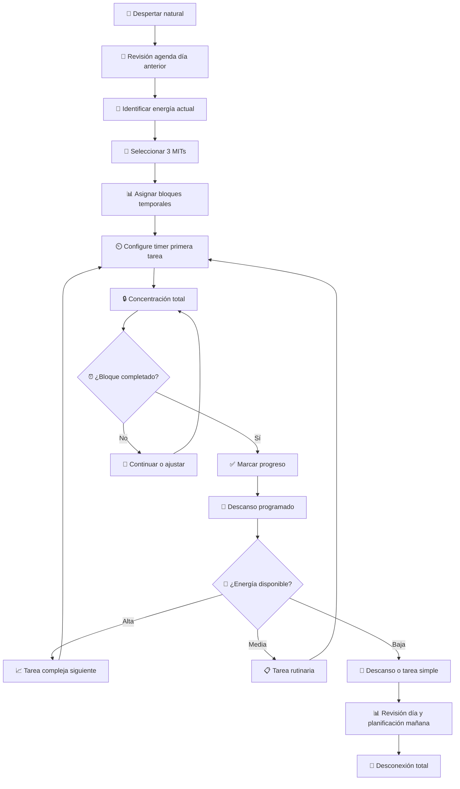

# ⏰ Gestión del Tiempo

> [!info] 📋 Definición La gestión del tiempo es la capacidad de planificar y controlar conscientemente el tiempo dedicado a actividades específicas, especialmente para aumentar la efectividad, eficiencia y productividad.

## 🎯 Principios Fundamentales

> [!tip] ⭐ Ley de Parkinson El trabajo se expande para llenar el tiempo disponible para su finalización. Por eso es crucial establecer límites de tiempo específicos.

> [!warning] ⚠️ Mito del Multitasking El cerebro humano no puede realizar múltiples tareas cognitivas complejas simultáneamente. El "multitasking" en realidad es cambio rápido entre tareas, lo que reduce la eficiencia hasta un 40%.

## 🔄 Métodos y Técnicas Principales

### 🍅 Técnica Pomodoro

> [!tip] 🕐 Funcionamiento
> 
> - **25 minutos** de trabajo concentrado
> - **5 minutos** de descanso
> - Después de 4 pomodoros: **descanso largo de 15-30 minutos**
> 
> **Beneficios:**
> 
> - Mantiene la concentración
> - Evita el agotamiento mental
> - Proporciona sensación de progreso



### 📊 Matriz de Eisenhower

> [!info] 🎯 Cuadrantes de Priorización
> 
> |Urgente|No Urgente|
> |---|---|
> |**Importante**: Hacer Ahora 🔥|**Importante**: Programar 📅|
> |**No Importante**: Delegar 👥|**No Importante**: Eliminar 🗑️|



### ⚡ Getting Things Done (GTD)

> [!tip] 🔄 Flujo de Trabajo GTD
> 
> 1. **Capturar**: Recopilar todo en un sistema confiable
> 2. **Clarificar**: Procesar qué significa cada elemento
> 3. **Organizar**: Colocar elementos en las categorías correctas
> 4. **Reflexionar**: Revisar y actualizar el sistema
> 5. **Actuar**: Tomar decisiones confiadas sobre las próximas acciones

### 🎯 Técnica SMART para Objetivos

> [!info] 📝 Criterios SMART
> 
> - **S**pecific (Específico)
> - **M**easurable (Medible)
> - **A**chievable (Alcanzable)
> - **R**elevant (Relevante)
> - **T**ime-bound (Con límite de tiempo)

## 🧠 Estrategias Avanzadas

### 🦅 Time Blocking

> [!tip] 📅 Planificación por Bloques Asignar bloques específicos de tiempo a diferentes tipos de trabajo:
> 
> - **Deep Work**: 2-4 horas de trabajo profundo
> - **Shallow Work**: Tareas administrativas y comunicación
> - **Buffer Time**: Tiempo de margen para imprevistos

### 🔋 Gestión de Energía

> [!warning] ⚡ Ritmos Circadianos Identifica tus **picos de energía natural**:
> 
> - **Mañana**: Ideal para trabajo creativo y estratégico
> - **Tarde**: Mejor para tareas rutinarias y administrativas
> - **Noche**: Tiempo para revisión y planificación

## 📱 Herramientas Digitales

> [!info] 🛠️ Stack Tecnológico Recomendado
> 
> - **Planificación**: Notion, TickTick, Todoist
> - **Time Tracking**: RescueTime, Toggl, Forest
> - **Concentración**: Freedom, Cold Turkey, Focus
> - **Notas**: Obsidian, Roam Research, LogSeq

## 🚫 Eliminadores de Tiempo Comunes

> [!warning] ⛔ Ladrones de Tiempo
> 
> - **Interrupciones constantes** (notificaciones, llamadas)
> - **Perfeccionismo excesivo** en tareas de baja prioridad
> - **Procrastinación** por miedo al fracaso
> - **Reuniones innecesarias** sin agenda clara
> - **Multitasking** ineficiente

## 📈 Métricas y Seguimiento



> [!tip] 📊 KPIs de Productividad
> 
> - **Tiempo en Deep Work**: Horas diarias de trabajo concentrado
> - **Tasa de Finalización**: % de tareas completadas vs planificadas
> - **Tiempo de Respuesta**: Velocidad para responder emails/mensajes
> - **Distracción Rate**: Frecuencia de interrupciones por hora

## 🎯 Plan de Implementación

> [!info] 🚀 Pasos para Comenzar
> 
> 1. **Semana 1**: Auditoría de tiempo actual (tracking)
> 2. **Semana 2**: Implementar técnica Pomodoro
> 3. **Semana 3**: Crear sistema de priorización (Eisenhower)
> 4. **Semana 4**: Establecer rutinas de planificación diaria/semanal

---

## 📚 Referencias

> [!quote] Enlaces a Otras Notas
> 
> - [[Método 1 - Pomodoro]] - Guía detallada del método
> - [[Método 9 - Metodología GTD (Getting Things Done)]] - Sistema completo Getting Things Done
> - [[Deep Work]] - Estrategias para trabajo profundo
> - [[Hábitos de Estudio]] - Rutinas para optimizar el aprendizaje
> - [[Productividad Digital]] - Herramientas y apps recomendadas
> - [[Mindfulness]] - Técnicas de atención plena para la concentración

## 📖 Notas Recomendadas para Complementar

- [[Bullet Journal Method (BuJo)]] - Sistema analógico de organización
- [[Curva del Olvido]] - Optimización de la retención de información
- [[Técnicas de Concentración]] - Métodos para mejorar el focus
- [[Organización Física del Espacio]] - Ambiente óptimo para productividad
- [[Hábitos y Rutinas Saludables]] - Fundamentos para sostener la productividad
- [[Motivación Académica]] - Mantener el impulso a largo plazo

---

**Tags:** #gestión-tiempo #productividad #organización #técnicas-estudio #planificación #pomodoro #gtd #eisenhower #deep-work #concentración

# ⏰ Gestión del Tiempo Offline

> [!info] 🎯 Contexto La gestión del tiempo offline se refiere a las técnicas y metodologías para organizar, planificar y optimizar el uso del tiempo sin depender de herramientas digitales. Se basa en métodos analógicos probados, cronómetros físicos y la comprensión de nuestros ritmos biológicos naturales para maximizar la productividad y el bienestar.

## 🔧 Variables Comunes

> [!tip] ⚙️ Elementos Fundamentales
> 
> - **⏰ Tiempo disponible**: Las horas reales que tenemos en el día
> - **⚡ Energía personal**: Los niveles de concentración y motivación a lo largo del día
> - **🎯 Prioridades**: Las tareas más importantes vs. las más urgentes
> - **🔄 Ritmos circadianos**: Los ciclos naturales de alerta y descanso del cuerpo
> - **📊 Bloques temporales**: Segmentos definidos de tiempo para actividades específicas
> - **🚫 Distractores**: Interrupciones y elementos que nos alejan del foco

## ⚙️ Metodología de los 4 Principios

> [!warning] 📝 Sistema Integral de Tiempo
> 
> ### 1. ⚖️ **Principio de Priorización**
> 
> - **Matriz de Eisenhower**: Urgente vs Importante
> - **Regla 80/20**: 20% de actividades generan 80% de resultados
> - **Principio ABC**: Clasificar tareas por impacto (A=crítico, B=importante, C=nice-to-have)
> 
> ### 2. ⏳ **Principio de Bloques Temporales**
> 
> - **Time Blocking**: Asignar bloques específicos a actividades
> - **Batching**: Agrupar tareas similares en el mismo período
> - **Buffer Time**: Tiempo de colchón entre actividades
> 
> ### 3. 🧠 **Principio de Energía Natural**
> 
> - **Identificar horarios pico**: Momentos de máxima concentración
> - **Matching**: Asignar tareas complejas a momentos de alta energía
> - **Gestión de la fatiga**: Reconocer y respetar las bajadas de energía
> 
> ### 4. 🔄 **Principio de Ritmo Sostenible**
> 
> - **Descansos programados**: No son pérdida de tiempo, son inversión
> - **Ciclos de trabajo**: Alternar períodos de intensidad con recuperación
> - **Límites claros**: Inicio y fin definidos para cada actividad

## 📚 Explicación Teórica

> [!info] 🧠 Fundamentos Científicos La gestión del tiempo offline se fundamenta en:
> 
> - **Cronobiología**: Nuestro cuerpo tiene ritmos naturales de 90-120 minutos (ritmos ultradianos)
> - **Neurociencia**: El cerebro necesita 15-23 minutos para entrar en estado de flow
> - **Psicología Cognitiva**: La atención sostenida tiene límites físicos (45-90 minutos)
> - **Teoría de la Carga Cognitiva**: Menos decisiones = más energía para tareas importantes
> - **Ley de Parkinson**: El trabajo se expande para llenar el tiempo disponible
> 
> **Ventaja clave**: Al usar métodos físicos, eliminamos las distracciones digitales y desarrollamos una relación más consciente con el tiempo.

## 🎯 Técnicas y Herramientas Analógicas

### ⏲️ Técnicas de Cronometraje

> [!tip] 🕐 Métodos de Tiempo Medido
> 
> |Técnica|Duración|Herramienta|Propósito|
> |---|---|---|---|
> |**Pomodoro Clásico**|25 min + 5 min|⏲️ Timer cocina|🎯 Concentración máxima|
> |**Ultradian Rhythm**|90 min + 20 min|⏰ Cronómetro mesa|🌊 Seguir ritmos naturales|
> |**Técnica 52/17**|52 min + 17 min|📱 Timer básico|⚡ Productividad óptima|
> |**Time Boxing**|Variable|🕐 Reloj pared|📦 Límites estrictos|
> |**Regla 2 minutos**|< 2 min|⏱️ Reloj pulsera|⚡ Acción inmediata|

### 📅 Planificación en Papel

> [!tip] 📝 Sistemas de Organización Temporal
> 
> |Sistema|Herramienta|Ventaja Principal|
> |---|---|---|
> |**Agenda Diaria**|📖 Cuaderno horario|👀 Vista completa del día|
> |**Planificación Semanal**|📅 Calendario grande|🗓️ Perspectiva a medio plazo|
> |**Time Map**|📊 Papel cuadriculado|🗺️ Visualización de patrones|
> |**Lista MIT**|📝 Tarjetas índice|🎯 3 Most Important Tasks|
> |**Log de Tiempo**|📋 Registro manual|📊 Análisis de uso real|

### 🎯 Matriz de Priorización

> [!tip] ⚖️ Sistemas de Decisión
> 
> |Método|Implementación|Resultado|
> |---|---|---|
> |**Eisenhower**|Papel 4 cuadrantes|🎯 Enfoque en lo importante|
> |**Método ABCDE**|Lista con letras|📈 Jerarquía clara|
> |**Eat That Frog**|Tarea más difícil primero|🐸 Momentum positivo|
> |**Ivy Lee**|6 tareas máximo/día|✨ Simplicidad efectiva|

## 🔄 Flujo de Trabajo Temporal



## 🕐 Cronotipos y Optimización Personal

> [!info] 🧬 Adaptación a tu Ritmo Natural
> 
> ### 🌅 **Madrugador (Alondra)**
> 
> - **Horas pico**: 6:00-10:00 AM
> - **Estrategia**: Tareas complejas en la mañana
> - **Descanso óptimo**: 21:00-22:00
> 
> ### 🦉 **Nocturno (Búho)**
> 
> - **Horas pico**: 22:00-02:00 AM
> - **Estrategia**: Trabajo creativo en la noche
> - **Descanso óptimo**: Después de 23:00
> 
> ### 🐻 **Intermedio (Oso)**
> 
> - **Horas pico**: 10:00-14:00
> - **Estrategia**: Seguir horarios tradicionales
> - **Descanso óptimo**: 22:00-22:30
> 
> ### 🐺 **Bi-modal (Lobo)**
> 
> - **Horas pico**: 17:00-midnight
> - **Estrategia**: Segunda mitad del día productiva
> - **Descanso óptimo**: Variable pero tardío

## 🎭 Ejemplos de Aplicación

> [!tip] 💡 Casos de Uso Específicos
> 
> ### 📚 **Estudiante con Exámenes**
> 
> **Configuración temporal**:
> 
> - **6:00-7:00**: Repaso rápido (memoria fresca)
> - **9:00-11:30**: Estudio intensivo (tema complejo)
> - **11:30-12:00**: Descanso activo + snack
> - **12:00-13:30**: Práctica/ejercicios
> - **15:00-16:30**: Revisión/memorización
> - **20:00-21:00**: Planificación día siguiente
> 
> ### 💼 **Profesional Freelancer**
> 
> **Bloques temporales**:
> 
> - **8:00-9:00**: Planificación + emails importantes
> - **9:00-11:00**: Trabajo creativo (proyecto principal)
> - **11:15-12:15**: Llamadas/reuniones
> - **14:00-16:00**: Tareas administrativas
> - **16:30-17:30**: Desarrollo personal/aprendizaje
> - **17:30-18:00**: Cierre y planificación
> 
> ### 🏠 **Padre/Madre con Trabajo**
> 
> **Gestión familiar**:
> 
> - **5:30-7:00**: Tiempo personal (antes que despierten)
> - **7:00-8:30**: Rutina familiar
> - **9:00-15:00**: Trabajo (bloques de 2 horas)
> - **15:00-18:00**: Tiempo familiar dirigido
> - **20:00-21:00**: Trabajo extra o descanso
> - **21:00+**: Tiempo pareja/personal

## 📊 Herramientas de Medición y Análisis

> [!warning] 📈 Tracking Manual Efectivo
> 
> ### 📋 **Log de Tiempo Semanal**
> 
> ```
> LUNES | Actividad | Inicio | Fin | Energía (1-10) | Productividad (1-10)
> _____|___________|________|_____|________________|___________________
>      | Estudio   | 9:00   |11:00| 8              | 9
>      | Email     | 11:15  |11:45| 6              | 7
>      | Almuerzo  | 12:00  |13:00| -              | -
> ```
> 
> ### 🎯 **Métricas Clave a Medir**
> 
> - **⏱️ Tiempo real** vs tiempo estimado
> - **⚡ Niveles de energía** por hora del día
> - **🎯 Tareas completadas** vs planificadas
> - **🚫 Interrupciones** y su impacto
> - **😌 Satisfacción** con el día (1-10)

## 🛠️ Kit de Herramientas Esenciales

> [!tip] 🎒 Arsenal Temporal Físico
> 
> ### ⏰ **Dispositivos de Tiempo**
> 
> - Timer de cocina (Pomodoro)
> - Cronómetro de mesa
> - Reloj de pared visible
> - Reloj de pulsera (sin smartwatch)
> 
> ### 📝 **Planificación**
> 
> - Agenda diaria con horarios
> - Calendario de pared mensual
> - Tarjetas de índice para MITs
> - Papel cuadriculado para time maps
> 
> ### 📊 **Seguimiento**
> 
> - Libreta para log de tiempo
> - Lápices de colores para codificación
> - Regla para gráficos temporales
> - Calculadora para análisis

## 🌟 Beneficios del Método Offline

> [!info] 🏆 Ventajas Comprobadas
> 
> ### 💪 **Fortalezas Únicas**
> 
> - **🔋 Sin dependencia tecnológica**: Funciona sin batería
> - **🧠 Mayor consciencia temporal**: Relación física con el tiempo
> - **🎯 Menos distracciones**: No notificaciones ni multitasking
> - **✍️ Mejor retención**: Escribir a mano mejora memoria
> - **💰 Costo mínimo**: Herramientas simples y económicas
> - **🔒 Privacidad total**: Sin tracking digital ni datos compartidos
> 
> ### ⚠️ **Consideraciones**
> 
> - Requiere disciplina autodidacta
> - No hay recordatorios automáticos
> - Análisis de datos más manual
> - Menos flexibilidad para cambios rápidos

## 🌐 Relación con Otros Temas

> [!info] 🔗 Conexiones en el Ecosistema
> 
> ### 🤝 **Se combina perfectamente con**:
> 
> - **[[Organización Física del Espacio]]**: Ambiente optimizado para tiempo efectivo
> - **[[Hábitos y Rutinas Saludables]]**: Estructura temporal para nuevos hábitos
> - **[[Productividad en la Vida Real]]**: Marco general de productividad offline
> 
> ### 🔄 **Complementa con**:
> 
> - **[[Método 1 - Pomodoro]]**: Implementación específica de cronometraje
> - **[[Minimalismo Digital]]**: Reducción de distracciones temporales
> 
> ### 📈 **Se desarrolla hacia**:
> 
> - **[[Gestión de la Energía Personal]]**: Optimización de recursos internos


## 📖 Referencias

> [!quote] 🔗 Enlaces a Notas Relacionadas
> 
> - [[Productividad en la Vida Real]]
> - [[Organización Física del Espacio]]
> - [[Hábitos y Rutinas Saludables]]
> - [[Método 1 - Pomodoro]]
> - [[Técnicas de Concentración]]

---

#tiempo #offline #planificación #productividad #cronometraje #energía #prioridades #bloques-temporales #ritmos-circadianos #análisis-temporal