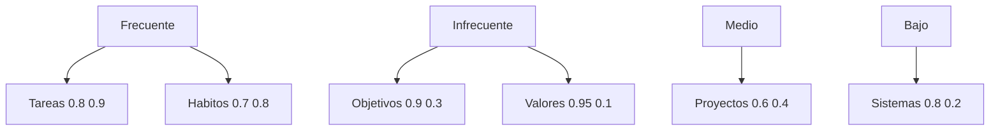

# Sistemas de Revisión 🔄

> [!tip] Concepto Central Los sistemas de revisión son metodologías estructuradas y periódicas que garantizan el mantenimiento, optimización y evolución continua de nuestros procesos, hábitos, objetivos y sistemas de productividad personal y profesional.

## Definición y Fundamentos Psicológicos

> [!info] ¿Qué es un Sistema de Revisión? 🔍 **Definición**: Proceso sistemático de evaluación, análisis y ajuste de nuestras actividades, sistemas y resultados para asegurar alineación con objetivos y mejora continua
> 
> **Principios Científicos:**
> 
> - **Metacognición**: Pensar sobre el pensamiento y los procesos
> - **Espiral de Mejora**: Ciclo continuo planificar-hacer-verificar-actuar
> - **Retroalimentación**: Información que permite ajustes precisos
> - **Reflexión Deliberada**: Análisis consciente y estructurado

## Neurociencia de la Revisión 🧠

> [!warning] Base Científica del Proceso
> 
> ### Impacto Neurológico
> 
> ```mermaid
> graph TD
>     A[Experiencia] --> B[Corteza Prefrontal]
>     B --> C[Análisis Metacognitivo]
>     C --> D[Hipocampo - Consolidación]
>     D --> E[Memoria de Trabajo]
>     E --> F[Nuevas Conexiones Sinápticas]
>     F --> G[Comportamiento Optimizado]
>     G --> A
>     style C fill:#4ecdc4
>     style F fill:#95f985
>     style G fill:#ffa726
> ```
> 
> **Beneficios Neurocientíficos:**
> 
> - 🧠 Fortalece conexiones prefrontales de autorregulación
> - 🔄 Activa neuroplasticidad dirigida al cambio positivo
> - 📈 Mejora la función ejecutiva y toma de decisiones
> - 🎯 Consolida aprendizajes en memoria a largo plazo

## Arquitectura del Sistema GTD+ 📋

> [!tip] Framework Integral de Revisión
> 
> ### Niveles de Revisión (Horizonte Temporal)
> 
> |Nivel|Frecuencia|Duración|Enfoque|Herramientas|
> |---|---|---|---|---|
> |🔄 **Diaria**|Cada día|10-15 min|Tareas, prioridades|Dashboard, checklist|
> |📅 **Semanal**|Viernes|60-90 min|Proyectos, objetivos|Template, métricas|
> |🗓️ **Mensual**|Fin de mes|2-3 horas|Sistemas, hábitos|Análisis profundo|
> |📆 **Trimestral**|Cada 3 meses|Medio día|Estrategia, dirección|Retiro personal|
> |🎯 **Anual**|Diciembre|1-2 días|Visión, propósito|Planificación integral|

 ### Matriz de Elementos a Revisar



## Revisión Diaria: El Ritual Fundamental ☀️

> [!info] Protocolo de 15 Minutos
> 
> ### Estructura Matutina (10 min)
> 
> |Tiempo|Actividad|Preguntas Clave|
> |---|---|---|
> |2 min|**Contexto**|¿Cómo me siento? ¿Qué energía tengo?|
> |3 min|**Prioridades**|¿Qué 3 cosas DEBO hacer hoy?|
> |2 min|**Calendario**|¿Qué compromisos tengo? ¿Bloques libres?|
> |2 min|**Preparación**|¿Qué necesito para ejecutar bien?|
> |1 min|**Intención**|¿Cómo quiero sentirme al final del día?|
> 
> ### Estructura Vespertina (5 min)
> 
> - 📊 **Evaluación**: ¿Qué funcionó/no funcionó?
> - 📝 **Captura**: ¿Qué aprendí/noté?
> - 🔄 **Ajuste**: ¿Qué cambiaré mañana?
> - 🎯 **Preparación**: ¿Cómo inicio mañana?
> 
> ### Template de Revisión Diaria
> 
> ```markdown
> # Revisión Diaria - {{date}}
> 
> ## 🌅 Revisión Matutina
> **Energía (1-10):** 
> **Estado emocional:** 
> **Top 3 prioridades:**
> 1. 
> 2. 
> 3. 
> 
> **Tiempo disponible:** 
> **Intención del día:** 
> 
> ## 🌙 Revisión Vespertina
> **Completado ✅:**
> **Pendiente ⏳:**
> **Aprendizajes 💡:**
> **Mejoras para mañana 🔄:**
> **Gratitud 🙏:**
> ```

## Revisión Semanal: Recalibración Estratégica 📊

> [!warning] Sesión de 90 Minutos - Protocolo Detallado
> 
> ### Fase 1: Recolección (20 min)
> 
> ```mermaid
> flowchart LR
>     A[📥 Inbox] --> B[📋 Lista Tareas]
>     B --> C[📂 Proyectos]
>     C --> D[📅 Calendario]
>     D --> E[📊 Métricas]
>     E --> F[🧠 Notas Mentales]
>     F --> G[📱 Apps/Digital]
>     G --> H[✅ Todo Capturado]
>     style H fill:#95f985
> ```
> 
> ### Fase 2: Procesamiento (30 min)
> 
> |Elemento|Preguntas Clave|Acción|
> |---|---|---|
> |**Tareas**|¿Sigue siendo relevante? ¿Cuándo la haré?|Eliminar/Posponer/Agendar|
> |**Proyectos**|¿Avanzó según lo planeado? ¿Siguiente acción?|Actualizar/Redefinir|
> |**Hábitos**|¿Cumplí la frecuencia objetivo? ¿Qué obstáculos?|Ajustar/Reforzar|
> |**Objetivos**|¿Estoy en el camino correcto? ¿Necesito pivotar?|Mantener/Modificar|
> 
> ### Fase 3: Análisis de Métricas (25 min)
> 
> ```mermaid
> pie title Distribución Tiempo Semanal
>     "Trabajo Profundo" : 35
>     "Reuniones/Colaboración" : 25
>     "Administración" : 15
>     "Aprendizaje" : 15
>     "Imprevistos" : 10
> ```
> 
> **KPIs Semanales a Revisar:**
> 
> - ⏰ Horas de trabajo profundo vs objetivo
> - 🎯 % de tareas importantes completadas
> - 🔋 Promedio de energía diaria
> - 📚 Tiempo invertido en aprendizaje
> - 🏃 Adherencia a hábitos clave
> 
> ### Fase 4: Planificación Siguiente Semana (15 min)
> 
> - 🎯 **3 Objetivos Principales**: Máximo impacto
> - 🗓️ **Time Blocking**: Asignar tiempo específico
> - 🚧 **Anticipar Obstáculos**: Plan B para imprevistos
> - 🔄 **Un Experimento**: Algo nuevo a probar

## Revisión Mensual: Optimización de Sistemas 🔧

> [!tip] Sesión de Medio Día - Análisis Profundo
> 
> ### Estructura de 3 Horas
> 
> **Hora 1: Análisis de Rendimiento** 📈
> 
> - Tendencias de productividad del mes
> - Patrones de energía y efectividad
> - ROI de diferentes actividades
> - Identificación de cuellos de botella
> 
> **Hora 2: Evaluación de Sistemas** ⚙️
> 
> |Sistema|Estado|Efectividad|Acción Requerida|
> |---|---|---|---|
> |[[Procesamiento por Lotes]]|✅ Funcionando|8/10|Mantener|
> |[[Eliminación de Distracciones]]|⚠️ Irregular|6/10|Reforzar barreras|
> |[[Seguimiento de Picos de Energía]]|🔧 En ajuste|7/10|Automatizar registro|
> |[[Time Blocking]]|✅ Sólido|9/10|Expandir uso|
> 
> **Hora 3: Planificación y Ajustes** 🎯
> 
> - Definir 1-2 mejoras principales para el próximo mes
> - Actualizar templates y workflows
> - Revisar y ajustar objetivos trimestrales
> - Planificar experimentos de optimización

## Revisión Trimestral: Recalibración Estratégica 🎯

> [!warning] Retiro Personal de Medio Día
> 
> ### Agenda de 4 Horas
> 
> ```mermaid
> timeline
>     title Revisión Trimestral
>     
>     Hora 1 : Retrospectiva 360°
>            : Análisis de logros
>            : Identificación de gaps
>            
>     Hora 2 : Evaluación de Dirección
>            : Alineación con propósito
>            : Ajuste de objetivos
>            
>     Hora 3 : Diseño del Próximo Trimestre
>            : Metas específicas
>            : Estrategias clave
>            
>     Hora 4 : Sistemas y Herramientas
>            : Optimización de procesos
>            : Nuevas implementaciones
> ```
> 
> ### Preguntas de Reflexión Profunda
> 
> - 🎯 **Propósito**: ¿Mis acciones reflejan mis valores fundamentales?
> - 📈 **Crecimiento**: ¿En qué áreas he evolucionado significativamente?
> - ⚖️ **Balance**: ¿Estoy invirtiendo tiempo en lo que realmente importa?
> - 🔮 **Futuro**: ¿Hacia dónde quiero dirigir mi energía los próximos 3 meses?
> - 🛠️ **Herramientas**: ¿Qué sistemas necesito crear/modificar/eliminar?

## Herramientas y Templates 🛠️

> [!info] Arsenal de Revisión
> 
> ### Software Especializado
> 
> |Herramienta|Función|Integración|Automatización|
> |---|---|---|---|
> |**Notion**|Templates dinámicos|API con calendario|Rollups automáticos|
> |**Obsidian**|Notas interconectadas|Plugins de tracking|Queries dinámicos|
> |**Todoist**|Gestión de tareas|Karma y métricas|Reportes semanales|
> |**RescueTime**|Análisis tiempo|Datos objetivos|Alertas automáticas|
> 
> ### Templates Personalizables
> 
> - 📋 **Checklist de Revisión**: Por frecuencia y contexto
> - 📊 **Dashboard de Métricas**: KPIs visuales automáticos
> - 🎯 **Matriz de Objetivos**: Seguimiento de progreso
> - 🔄 **Journal de Experimentos**: Testing de optimizaciones

## Mantenimiento del Sistema 🔧

> [!warning] Prevención de Degradación
> 
> ### Señales de Alerta
> 
> ```mermaid
> graph TD
>     A[Sistema de Revisión] --> B{¿Consistencia?}
>     B -->|Sí| C[✅ Sistema Saludable]
>     B -->|No| D[⚠️ Señales de Alerta]
>     D --> E[📉 Saltarse revisiones]
>     D --> F[⏰ Acortar tiempos]
>     D --> G[📝 Revisiones superficiales]
>     D --> H[🎯 Perder el propósito]
>     E --> I[🔧 Intervención Requerida]
>     F --> I
>     G --> I
>     H --> I
>     I --> J[Rediseño del Sistema]
>     style C fill:#95f985
>     style I fill:#ff6b6b
> ```
> 
> ### Estrategias de Mantenimiento
> 
> - 🎯 **Propósito Claro**: Recordar el "por qué" regularmente
> - ⚡ **Energía Óptima**: Hacer revisiones en momentos de alta energía
> - 🏆 **Celebrar Avances**: Reconocer mejoras y logros
> - 🔄 **Evolución Constante**: Adaptar el sistema según necesidades
> - 👥 **Accountability**: Compartir compromisos con otros

## Casos de Estudio y Resultados 📊

> [!tip] Implementaciones Exitosas
> 
> ### Caso 1: Emprendedor Tech
> 
> **Antes del sistema:**
> 
> - Revisiones esporádicas e inconsistentes
> - Proyectos sin seguimiento claro
> - Reactividad constante sin dirección estratégica
> 
> **Después de 6 meses:**
> 
> - 95% adherencia a revisiones semanales
> - 40% aumento en completion rate de objetivos importantes
> - 60% reducción en tiempo dedicado a "apagar incendios"
> 
> ### Caso 2: Ejecutiva Corporativa
> 
> ```mermaid
> xychart-beta
>     title "Evolución de Efectividad Mensual"
>     x-axis [Mes1, Mes2, Mes3, Mes4, Mes5, Mes6]
>     y-axis "Puntuación (1-10)" 0 --> 10
>     bar [4.2, 5.8, 6.9, 7.5, 8.2, 8.8]
> ```
> 
> **Métricas Clave de Mejora:**
> 
> - ⬆️ Tiempo en actividades estratégicas: +65%
> - ⬆️ Satisfacción con progreso personal: +80%
> - ⬇️ Estrés por desorganización: -70%
> - ⬆️ Claridad en prioridades: +90%

---

## Referencias 📚

> [!quote] Enlaces Relacionados
> 
> - [[Dashboard Semanal]] - Herramienta de seguimiento visual
> - [[Objetivos 2025]] - Marco de referencia para revisiones
> - [[Planificación Estratégica]] - Alineación a largo plazo
> - [[Time Blocking]] - Asignación de tiempo para revisiones
> - [[Tracking de Hábitos]] - Seguimiento específico de comportamientos
> - [[Gestión del Tiempo]] - Optimización temporal integral
> - [[Deep Work]] - Aprovechamiento de sesiones de revisión

## Notas Recomendadas 🎓

> [!tip] Prerrequisitos y Complementos
> 
> **Antes de implementar:**
> 
> - [[Autoconocimiento]] - Base para reflexión honesta
> - [[Clarificación de Valores]] - Marco para evaluar alineación
> - [[Definición de Propósito]] - Norte para dirigir revisiones
> - [[Pensamiento Estratégico]] - Capacidad de análisis sistemático
> 
> **Para profundizar:**
> 
> - [[Análisis Costo-Beneficio]] - Evaluar ROI de diferentes sistemas
> - [[Toma de Decisiones]] - Optimizar proceso de ajustes
> - [[Gestión de Atención Avanzada]] - Mantener foco durante revisiones
> - [[Delegación Efectiva]] - Incluir revisión de responsabilidades
> 
> **Complementarios:**
> 
> - [[Bullet Journal Method (BuJo)]] - Sistema de captura y reflexión
> - [[Matriz de Eisenhower]] - Priorización durante revisiones
> - [[Objetivos SMART]] - Estructura para definir mejoras
> - [[Curva del Olvido]] - Frecuencia óptima de revisiones

## Técnica de Estudio: Método REVISAR 🧠

> [!warning] Mnemotecnia REVISAR
> 
> **R** - **Recopilar**: Juntar toda la información dispersa **E** - **Evaluar**: Analizar objetivamente los resultados **V** - **Valorar**: Determinar qué funcionó y qué no **I** - **Identificar**: Encontrar patrones y oportunidades **S** - **Sistematizar**: Organizar insights en acciones **A** - **Ajustar**: Implementar mejoras específicas **R** - **Repetir**: Mantener el ciclo activo
> 
> _Visualización_: Imagina un telescopio que enfoca diferentes distancias: primero mira los detalles cercanos (diario), luego el paisaje medio (semanal), después el horizonte (mensual), y finalmente las estrellas (trimestral/anual).
> 
> **Práctica de Memoria:**
> 
> - 🔄 REVISAR = "Reflexiona, Evalúa, Valora, Identifica, Sistematiza, Ajusta, Repite"
> - Asociar con ritual matutino: cada letra representa un momento del día
> - Timer de 25 min (Pomodoro) para cada fase durante revisiones largas
> - Crear checklist visual con los 7 pasos en orden

---

**Tags:** #revision #mejora-continua #metacognicion #reflexion #sistemas #productividad #gtd #optimizacion #planificacion #seguimiento #habitos #objetivos #analisis #desarrollo-personal