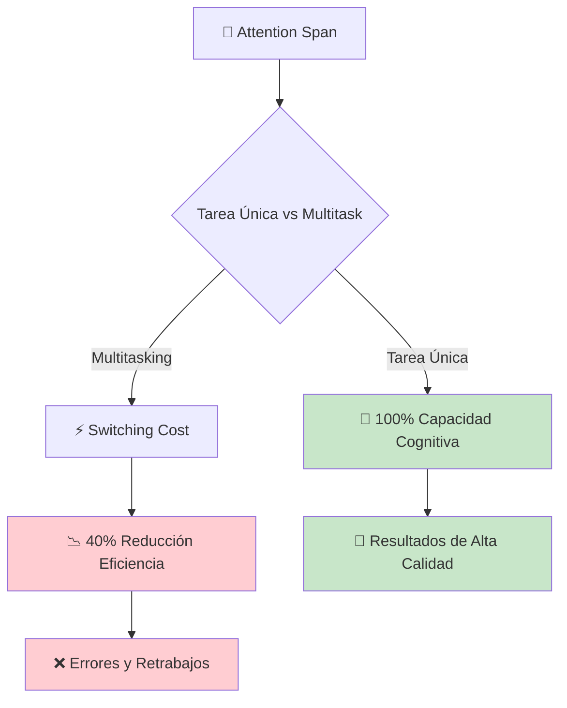
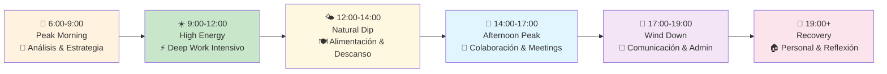
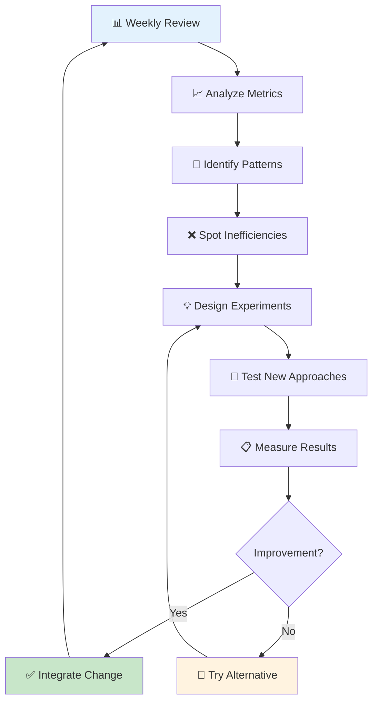

# ⏰ Time Blocking Avanzado - Planificación Temporal Estratégica

## 📋 Definición

> [!info] ¿Qué es Time Blocking Avanzado? Time Blocking Avanzado es una metodología de gestión temporal que va más allá del simple bloqueo de tareas en el calendario. Incorpora principios de cronobiología, energía personal, contextualización de actividades y protección proactiva del tiempo para maximizar la productividad y minimizar la fragmentación cognitiva.

## 🧠 Fundamentos Neurológicos

> [!tip] Base Científica del Time Blocking
> 
> - **Switching Cost**: Cambiar entre tareas consume 23 minutos promedio para reenfocarse
> - **Attention Residue**: Parte de la atención permanece en la tarea anterior
> - **Cognitive Load Theory**: La mente procesa mejor información en chunks organizados
> - **Deep Work Capacity**: Períodos sostenidos de 90-120 minutos de concentración máxima



## 📊 Tipos de Time Blocks

### 🎯 Clasificación por Intensidad Cognitiva

> [!tip] Deep Work Blocks (90-120 min)
> 
> - **Propósito**: Trabajo cognitivamente demandante
> - **Duración**: 90-120 minutos máximo
> - **Frecuencia**: 1-3 bloques por día
> - **Ejemplos**: Escritura, programación, análisis complejo, diseño estratégico

> [!info] Shallow Work Blocks (30-60 min)
> 
> - **Propósito**: Tareas administrativas y rutinarias
> - **Duración**: 30-60 minutos
> - **Frecuencia**: 2-4 bloques por día
> - **Ejemplos**: Emails, llamadas, organización, tareas repetitivas

> [!warning] Buffer Blocks (15-30 min)
> 
> - **Propósito**: Transiciones y imprevistos
> - **Duración**: 15-30 minutos
> - **Ubicación**: Entre bloques importantes
> - **Función**: Absorber retrasos, preparar contexto siguiente

### 🌅 Clasificación por Ritmo Circadiano



## 🎨 Técnicas Avanzadas de Blocking

### 🏗️ Theme-Based Time Blocking

> [!tip] Organización por Contextos Temáticos **Lunes - Admin Day** 📊
> 
> - Financias personales
> - Planificación semanal
> - Emails y comunicaciones
> - Organización de espacios
> 
> **Martes/Miércoles - Deep Work Days** 🎯
> 
> - Proyectos principales
> - Aprendizaje intensivo
> - Escritura y creación
> - Análisis complejos
> 
> **Jueves - Collaboration Day** 🤝
> 
> - Reuniones y calls
> - Revisiones y feedback
> - Trabajo en equipo
> - Networking

### ⚡ Energy-Based Blocking

> [!info] Alineación con Niveles de Energía Personal **High Energy Blocks** (Picos personales)
> 
> - Tareas más desafiantes
> - Decisiones importantes
> - Trabajo creativo
> - Aprendizaje de conceptos nuevos
> 
> **Medium Energy Blocks** (Nivel estable)
> 
> - Tareas rutinarias complejas
> - Revisiones y ediciones
> - Planificación y organización
> - Comunicación importante
> 
> **Low Energy Blocks** (Valles naturales)
> 
> - Tareas administrativas
> - Organización de archivos
> - Investigación pasiva
> - Preparación de materiales

### 🎭 Context Switching Minimization

> [!warning] Estrategias Anti-Fragmentación
> 
> - **Batching Similar**: Agrupa tareas del mismo tipo
> - **Tool Consistency**: Usa las mismas herramientas por bloque
> - **Location Locking**: Mismo espacio físico para contextos similares
> - **Communication Windows**: Momentos específicos para mensajes/emails

## 📅 Arquitectura del Calendario Ideal

### 🏛️ Estructura Semanal Estratégica

> [!tip] Template de Semana Productiva
> 
> ```
> LUNES - Foundation Day 🏗️
> 06:00-07:00 | Morning Routine
> 07:00-09:00 | Strategic Planning + Week Setup
> 09:00-11:00 | Deep Work Block 1
> 11:00-11:15 | Buffer + Movement
> 11:15-12:15 | Admin & Communications
> 12:15-13:15 | Lunch + Recovery
> 13:15-15:15 | Deep Work Block 2
> 15:15-15:30 | Buffer
> 15:30-17:00 | Shallow Work Batch
> 17:00-18:00 | Day Review + Tomorrow Prep
> 
> MARTES/MIÉRCOLES - Production Days 🎯
> [Estructura similar con énfasis en Deep Work]
> 
> JUEVES - Collaboration Day 🤝
> [Optimizado para meetings y trabajo grupal]
> 
> VIERNES - Integration Day 🔄
> [Review, catch-up, planificación siguiente semana]
> ```

### 🛡️ Protección Temporal Avanzada

> [!warning] Técnicas de Defensa del Tiempo **Focus Fortresses** 🏰
> 
> - Bloques de 3+ horas sin interrupciones
> - Notificaciones completamente desactivadas
> - Modo "Do Not Disturb" en todos los dispositivos
> - Señales físicas (auriculares, cartel, puerta cerrada)
> 
> **Interrupt Protocols** 🚫
> 
> - "Parking Lot" para ideas que surgen durante focus
> - Sistema de urgencia real vs. percibida
> - Respuestas automáticas con tiempos de respuesta esperados
> - Delegación proactiva de interrupciones rutinarias

## 🎯 Time Blocking por Tipo de Trabajo

### 💻 Knowledge Work

> [!info] Bloques para Trabajo Cognitivo **Research Blocks** (60-90 min)
> 
> - Investigación profunda sin distracciones
> - Múltiples fuentes y síntesis
> - Note-taking estructurado
> - Fact-checking y verificación
> 
> **Analysis Blocks** (90-120 min)
> 
> - Procesamiento de datos complejos
> - Identificación de patrones
> - Desarrollo de insights
> - Creación de frameworks
> 
> **Creation Blocks** (120+ min)
> 
> - Escritura de contenido original
> - Desarrollo de estrategias
> - Diseño de soluciones
> - Producción de deliverables

### 🎨 Creative Work

> [!tip] Optimización para Creatividad **Inspiration Gathering** (30-45 min)
> 
> - Consumo de contenido diverso
> - Exploration sin agenda específica
> - Conexiones inesperadas
> - Input sensorial variado
> 
> **Ideation Sessions** (45-90 min)
> 
> - Brainstorming estructurado
> - Mind mapping extensivo
> - Técnicas de creatividad aplicada
> - Documentación de ideas raw
> 
> **Execution Blocks** (90-180 min)
> 
> - Desarrollo de conceptos seleccionados
> - Iteración y refinamiento
> - Producción tangible
> - Feedback loops internos

## 🛠️ Herramientas y Sistemas

### 📱 Apps Especializadas

> [!tip] Stack Tecnológico Recomendado **Calendarios Avanzados**
> 
> - **Fantastical**: Parsing natural del lenguaje
> - **Calendly**: Automatización de scheduling
> - **Google Calendar**: Integración ecosistema
> - **Apple Calendar**: Sincronización seamless iOS/Mac
> 
> **Time Tracking & Analytics**
> 
> - **RescueTime**: Tracking automático de tiempo
> - **Toggl**: Manual tracking con categorías
> - **Time Doctor**: Monitoring y screenshots
> - **Forest**: Gamificación de focus blocks
> 
> **Focus & Blocking**
> 
> - **Cold Turkey**: Bloqueo websites/apps extremo
> - **Freedom**: Cross-platform session blocking
> - **SelfControl**: Mac blocking simple pero efectivo
> - **Focus**: iOS focus modes personalizados

### 🎨 Métodos de Visualización

> [!info] Técnicas de Representación Visual **Color Coding System** 🎨
> 
> - 🔴 Deep Work (rojo): Máxima concentración
> - 🟡 Shallow Work (amarillo): Tareas administrativas
> - 🔵 Learning (azul): Educación y desarrollo
> - 🟢 Health (verde): Ejercicio, alimentación, descanso
> - 🟣 Personal (púrpura): Familia, hobbies, social
> - ⚪ Buffer (gris): Transiciones y contingencias
> 
> **Visual Intensity Markers** 📊
> 
> - ⚡⚡⚡ High cognitive load
> - ⚡⚡ Medium cognitive load
> - ⚡ Low cognitive load
> - 🔄 Routine/Automated

### 📊 Templates y Frameworks

> [!tip] Plantillas Reutilizables **Daily Block Template**
> 
> ```
> DATE: [Date]
> ENERGY LEVEL: [1-10]
> TOP 3 PRIORITIES: 
> - [ ] Priority 1 (Deep Work)
> - [ ] Priority 2 (Important)  
> - [ ] Priority 3 (Should Do)
> 
> TIME BLOCKS:
> 06:00-07:00 | 🌅 Morning Routine
> 07:00-09:00 | 🎯 Deep Work Block 1
> 09:00-09:15 | ⚪ Buffer
> 09:15-10:15 | 📧 Communications
> [Continue...]
> 
> PROTECTED TIME: [Specify no-interrupt periods]
> FLEXIBILITY BUFFER: [Total buffer time planned]
> ```

## 📈 Métricas y Optimización

### 📊 KPIs de Time Blocking

> [!info] Indicadores Clave de Rendimiento **Eficiencia Metrics**
> 
> - **Block Completion Rate**: % bloques completados según planificado
> - **Deep Work Hours**: Tiempo real en estado de flow por semana
> - **Interrupt Frequency**: Número interrupciones por bloque
> - **Context Switch Count**: Cambios de contexto por día
> 
> **Effectiveness Metrics**
> 
> - **Priority Achievement**: % objetivos importantes completados
> - **Energy Alignment**: Correlación tareas vs. energía personal
> - **Satisfaction Score**: Sensación subjetiva de productividad
> - **Stress Level**: Percepción de presión temporal

### 🔄 Proceso de Mejora Continua



## ⚠️ Trampas Comunes y Soluciones

### 🚫 Errores Frecuentes

> [!warning] Pitfalls del Time Blocking **Over-Scheduling** 📅
> 
> - _Problema_: Calendario 100% lleno sin flexibilidad
> - _Solución_: Regla del 80% - máximo 80% del tiempo planificado
> - _Buffer_: 20% para imprevistos y transiciones
> 
> **Under-Estimation** ⏱️
> 
> - _Problema_: Subestimar tiempo necesario para tareas
> - _Solución_: Historical tracking + Planning Fallacy awareness
> - _Buffer_: 1.5x factor para tareas nuevas/complejas
> 
> **Rigidity Trap** 🏗️
> 
> - _Problema_: Sistema demasiado rígido para la realidad
> - _Solución_: Flexibilidad estructurada con opciones predefinidas
> - _Framework_: Plan A, B, C según contexto/energía

### 🛠️ Estrategias de Recuperación

> [!tip] Planes de Contingencia **When Blocks Fail** 🆘
> 
> 1. **5-Minute Rule**: Si bloque se interrumpe, evaluar en 5 min
> 2. **Pivot Options**: 3 alternativas predefinidas por bloque
> 3. **Minimum Viable Block**: Versión 15-min de tareas importantes
> 4. **Capture & Reschedule**: Documentar progreso y replanificar
> 
> **Energy Mismatch** ⚡
> 
> - **High Energy, Low Demand Task**: Upgrade a tarea más desafiante
> - **Low Energy, High Demand Task**: Defer o break into smaller pieces
> - **Energy Boost Techniques**: Microbreak, movement, nutrition

## 🎓 Integración con Otras Metodologías

### 🔄 Compatibilidad Sistémica

> [!info] Sinergias con Otros Frameworks **Getting Things Done (GTD)** 🗂️
> 
> - Time blocks para "contexts" específicos
> - Weekly review como block dedicado
> - Inbox processing en shallow work blocks
> 
> **Bullet Journal** 📔
> 
> - Daily logs complementan time blocks
> - Rapid logging para capture durante bloques
> - Monthly/weekly spreads para block planning
> 
> **Pomodoro Technique** 🍅
> 
> - Micro-estructura dentro de bloques largos
> - 4 pomodoros = 1 deep work block aprox
> - Breaks como micro-buffers

### 🏢 Adaptación a Contextos Específicos

> [!tip] Customización por Rol/Industria **Executives/Leaders** 👔
> 
> - Decision blocks vs. execution blocks
> - Strategic thinking time protegido
> - Communication windows estructurados
> - Delegation blocks planificados
> 
> **Creatives/Designers** 🎨
> 
> - Inspiration collection blocks
> - Ideation vs. execution separation
> - Client work vs. personal projects
> - Portfolio development time
> 
> **Students/Researchers** 📚
> 
> - Study blocks por materia/tema
> - Research vs. writing vs. review blocks
> - Exam preparation intensive blocks
> - Paper/thesis dedicated time

## 📱 Implementación Móvil y Remota

### 🌐 Time Blocking Digital Nomad

> [!info] Adaptación para Trabajo Remoto **Timezone Coordination** 🌍
> 
> - Multiple calendar views para equipos globales
> - Core collaboration hours identificadas
> - Async work blocks optimizados
> - Meeting-free focus days coordinados
> 
> **Location Independence** 📍
> 
> - Portable focus rituals
> - Noise-canceling y ambiente controlado
> - Internet backup plans para critical blocks
> - Local rhythm adaptation strategies

## 🎯 Plan de Implementación

### Semana 1: Fundamentos

> [!tip] Establecer Base Sólida
> 
> - [ ] Audit tiempo actual con tracking por 5 días
> - [ ] Identificar picos/valles energía personal
> - [ ] Definir 3 tipos de work principales
> - [ ] Setup calendario con color coding básico

### Semana 2: Estructura Básica

> [!tip] Crear Arquitectura Temporal
> 
> - [ ] Diseñar template día típico
> - [ ] Implementar morning/evening routine blocks
> - [ ] Establecer 1-2 deep work blocks diarios
> - [ ] Crear buffer time entre bloques importantes

### Semana 3: Optimización

> [!tip] Refinar y Ajustar
> 
> - [ ] Analizar completion rate primera semana
> - [ ] Ajustar duración bloques según realidad
> - [ ] Implementar interrupt protocols
> - [ ] Experimentar con diferentes configuraciones

### Semana 4: Sistemas Avanzados

> [!tip] Incorporar Técnicas Sofisticadas
> 
> - [ ] Theme-based days si aplica
> - [ ] Energy-based task allocation
> - [ ] Advanced tools setup (apps, automation)
> - [ ] Weekly review proceso establecido

---

## 📎 Referencias

> [!quote] Enlaces a Otras Notas
> 
> - [[Gestión del Tiempo]] - Principios fundamentales temporales
> - [[Deep Work]] - Técnicas de concentración profunda
> - [[Productividad Digital]] - Herramientas y apps especializadas
> - [[Gestión de la Energía Personal]] - Optimización según ritmos naturales
> - [[Técnicas de Concentración]] - Métodos para mantener focus
> - [[Método 9 - Metodología GTD (Getting Things Done)]] - Integración con Getting Things Done
> - [[Hábitos y Rutinas Saludables]] - Optimización de bloques iniciales del día

## 📚 Notas Recomendadas

> [!info] Lecturas Complementarias
> 
>
> - [[Procesamiento por Lotes]] - Agrupación eficiente de tareas similares
> - [[Gestión de Reuniones Efectivas]] - Optimización de tiempo en reuniones
> - [[Gestión de Atención Avanzada]] - Control avanzado de la atención
> - [[Automatización de Flujos de Trabajo]] - Automatización de rutinas temporales
> - [[Seguimiento de Picos de Energía]] - Monitoreo científico de ritmos personales
> - [[Feng Shui para Espacios Pequeños]] - Diseño de espacios para concentración
> - [[Límites de Comunicación]] - Gestión de interrupciones y disponibilidad

---

_Tags: #time-blocking #gestión-del-tiempo #productividad #planificación #calendario #deep-work #concentración #eficiencia #organización-temporal #cronobiología #ritmos-circadianos #focus #protección-del-tiempo_