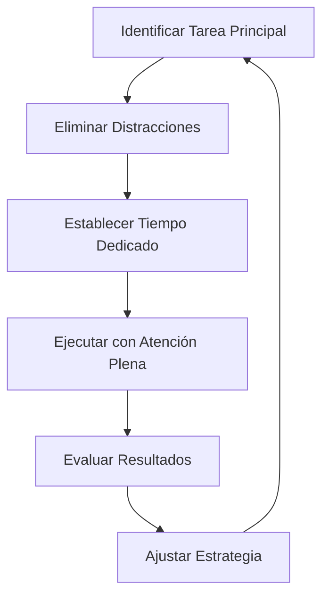
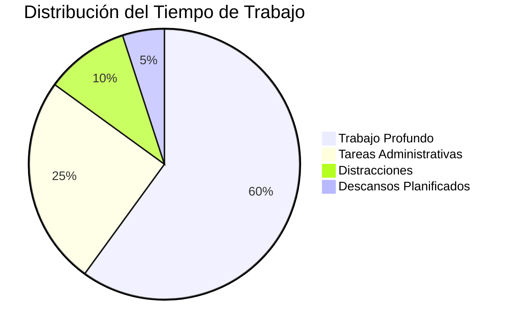

# 🎯 Técnicas de Enfoque

> [!tip] 💡 Concepto Clave Las técnicas de enfoque son estrategias cognitivas y ambientales diseñadas para maximizar la concentración, minimizar las distracciones y optimizar el rendimiento mental en tareas específicas.

## 🧠 Fundamentos Neurológicos del Enfoque

> [!info] 🔬 Base Científica El enfoque depende de la **corteza prefrontal** y el **sistema de atención ejecutiva**. Estas áreas cerebrales regulan la capacidad de mantener la atención sostenida y filtrar información irrelevante.
>
### Tipos de Atención
>[!success] Los distintos tipos de atención son: 
>- **Atención Sostenida**: Mantener el foco en una tarea durante períodos prolongados
>- **Atención Selectiva**: Filtrar distracciones y centrarse en estímulos relevantes
>- **Atención Dividida**: Gestionar múltiples tareas simultáneamente (menos eficiente)

## 🛠️ Técnicas Principales de Enfoque

### 1. 🍅 Técnica Pomodoro

> [!tip] ⏰ Implementación
> 
> - **25 minutos** de trabajo concentrado
> - **5 minutos** de descanso
> - Cada 4 pomodoros: descanso largo de **15-30 minutos**
> - Eliminar todas las distracciones durante los bloques de trabajo

### 2. 🎵 Música y Sonidos Ambientales

> [!info] 🎧 Tipos Recomendados
> 
> - **Ruido blanco**: Para bloquear distracciones auditivas
> - **Música instrumental**: Sin letras que compitan por atención
> - **Sonidos de la naturaleza**: Lluvia, olas, bosque
> - **Frecuencias binaurales**: 40Hz para concentración

### 3. 🌬️ Técnicas de Respiración

> [!tip] 🫁 Respiración 4-7-8
> 
> 1. Inhala por **4 segundos**
> 2. Mantén por **7 segundos**
> 3. Exhala por **8 segundos**
> 4. Repite 3-4 ciclos antes de comenzar trabajo intenso

### 4. 🎯 Método de Enfoque Singular

> [!warning] ⚠️ Evitar Multitasking El cerebro no puede procesar múltiples tareas complejas simultáneamente. La alternancia entre tareas reduce la eficiencia hasta un 40%.

## 🏠 Optimización del Entorno

### Espacio Físico

> [!tip] 🪑 Configuración Ideal
> 
> - **Iluminación**: Luz natural o lámpara de escritorio de 2700K-3000K
> - **Temperatura**: 20-22°C para máximo rendimiento cognitivo
> - **Orden**: Escritorio limpio con solo elementos esenciales
> - **Ergonomía**: Silla cómoda, monitor a altura de ojos

### Eliminación de Distracciones Digitales

> [!warning] 📱 Gestión de Dispositivos
> 
> - Modo avión o silencioso en dispositivos
> - Bloquear redes sociales durante bloques de trabajo
> - Usar aplicaciones como Forest, Cold Turkey o Freedom
> - Mantener solo pestañas necesarias abiertas

## 🧘 Técnicas de Preparación Mental

### Ritual de Entrada

> [!info] 🚪 Creando el Estado Mental
> 
> 1. **5 minutos** de respiración consciente
> 2. Revisar objetivos específicos de la sesión
> 3. Visualizar el proceso y resultado deseado
> 4. Establecer intención clara y positiva

### Mindfulness para el Enfoque

> [!tip] 🧘‍♂️ Práctica de Anclaje
> 
> - Observar pensamientos sin juzgar
> - Retornar suavemente la atención a la tarea
> - Usar la respiración como ancla de concentración
> - Practicar la **atención plena** en actividades simples

## 📊 Medición y Seguimiento

### Métricas de Enfoque

> [!info] 📈 Indicadores Clave
> 
> - **Tiempo en estado de flujo** por sesión
> - **Número de distracciones** por hora
> - **Calidad del output** producido
> - **Nivel de fatiga mental** post-sesión

## 🔄 Técnicas Avanzadas

### Flow State (Estado de Flujo)

> [!tip] 🌊 Condiciones para Alcanzar Flow
> 
> - **Desafío equilibrado**: Ni muy fácil ni muy difícil
> - **Objetivos claros**: Saber qué se debe lograr
> - **Retroalimentación inmediata**: Poder evaluar el progreso
> - **Concentración total**: Fusión entre acción y conciencia

### Técnica del Timeboxing

> [!info] ⏳ Asignación Temporal
> 
> - Asignar bloques específicos de tiempo a tareas
> - No exceder el tiempo asignado
> - Evaluar qué se logró en cada bloque
> - Ajustar estimaciones futuras basándose en resultados

## 🍎 Aspectos Nutricionales y Físicos

### Alimentación para el Enfoque

> [!tip] 🥗 Nutrientes Clave
> 
> - **Omega-3**: Pescado, nueces, semillas de chía
> - **Antioxidantes**: Arándanos, té verde, chocolate negro
> - **Proteínas**: Para neurotransmisores (dopamina, norepinefrina)
> - **Hidratación**: 2-3 litros de agua diarios

### Ejercicio y Enfoque

> [!info] 🏃‍♂️ Actividad Física
> 
> - **20 minutos** de ejercicio moderado mejoran la concentración por 2-3 horas
> - Caminatas cortas entre sesiones de trabajo
> - Ejercicios de estiramiento cada hora

## 🚨 Problemas Comunes y Soluciones

> [!warning] ⚠️ Obstáculos Frecuentes
> 
> **Procrastinación**
> 
> - Usar la regla de los 2 minutos
> - Dividir tareas grandes en micro-tareas
> - Implementar sistemas de recompensas
> 
> **Fatiga Mental**
> 
> - Respetar ciclos naturales de energía
> - Tomar descansos cada 90 minutos
> - Variar tipos de tareas según energía disponible
> 
> **Distracciones Internas**
> 
> - Mantener una libreta para "parking lot" de pensamientos
> - Practicar técnicas de mindfulness
> - Desarrollar autoconciencia sobre patrones mentales

## 🔗 Referencias

> [!quote] Enlaces a Otras Notas
> 
> - [[Método 1 - Pomodoro]] - Técnica de gestión del tiempo
> - [[Deep Work]] - Trabajo profundo y concentración
> - [[Mindfulness]] - Atención plena y consciencia
> - [[Gestión del Tiempo]] - Optimización temporal
> - [[Hábitos de Estudio]] - Estrategias de aprendizaje
> - [[Neurociencia del Aprendizaje]] - Base científica del enfoque
> - [[Gestión del Estrés]] - Manejo de presión y ansiedad
> - [[Higiene de Sueño]] - Descanso para mejor concentración

## 📚 Notas Recomendadas

Para complementar este tema, revisa:

- [[Técnicas de Concentración]] - Métodos específicos de atención
- [[Productividad en la Vida Real]] - Aplicación práctica
- [[Matriz de Eisenhower]] - Priorización de tareas
- [[Time Blocking]] - Planificación temporal detallada
- [[Método 5 - Mapas Mentales]] - Organización visual de ideas
- Carpeta Automatizaciones - Reducir carga cognitiva
- [[Detox Digital]] - Limpieza de distracciones tecnológicas

---

#enfoque #concentración #productividad #mindfulness #neurociencia #técnicas-estudio #gestión-tiempo #rendimiento-mental