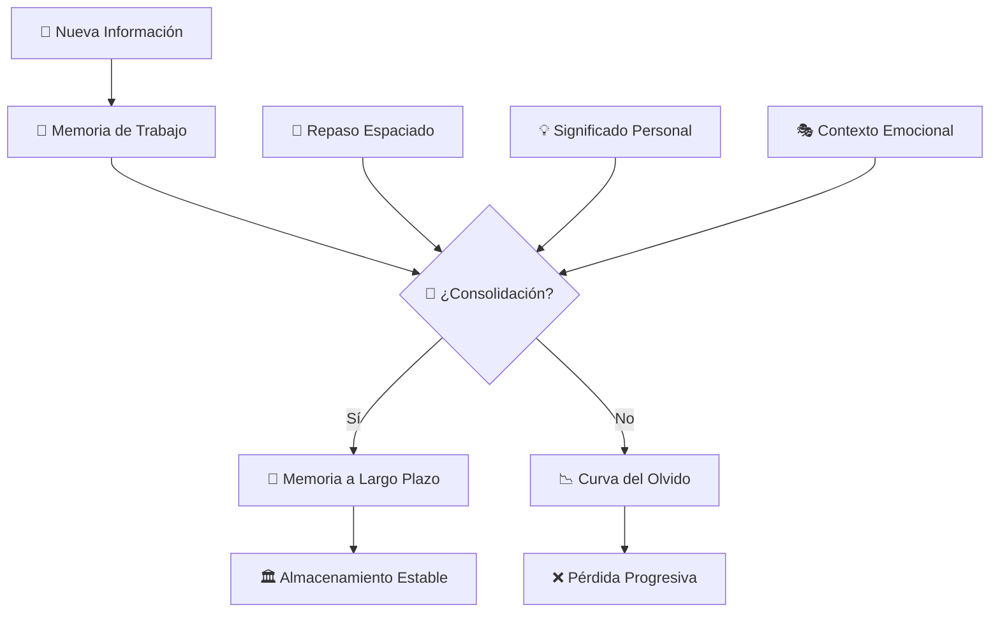
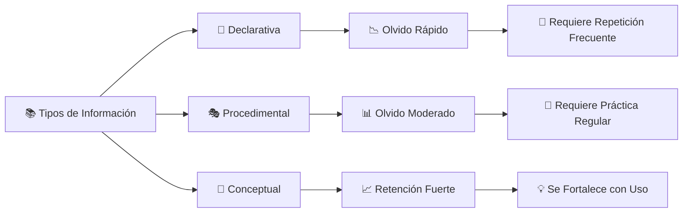

# 📉 Curva del Olvido - La Ciencia del Recordar

> [!tip] 💡 **Concepto Clave** La Curva del Olvido (Forgetting Curve) es un fenómeno psicológico descubierto por Hermann Ebbinghaus que describe la disminución exponencial de la retención de información en la memoria a lo largo del tiempo, cuando no se hace un esfuerzo consciente para retenerla.

## 🏛️ Historia y Descubrimiento

> [!info] 📜 **Hermann Ebbinghaus (1850-1909)**
> 
> - **📅 1885**: Publicación de "Über das Gedächtnis" (Sobre la Memoria)
> - **🔬 Método Revolucionario**: Primer estudio científico de la memoria
> - **📊 Autoexperimentación**: Usó sílabas sin sentido para evitar asociaciones previas
> - **🎯 Descubrimiento**: La pérdida de memoria sigue un patrón matemático predecible

> [!quote] 📖 **Experimento Original** Ebbinghaus memorizó listas de sílabas sin sentido (como "DAX", "BEK", "LUF") y midió cuánto tiempo le tomaba reaprender las listas después de diferentes intervalos de tiempo.

## 📊 La Fórmula Matemática

> [!success] 🧮 **Ecuación de Ebbinghaus**
> 
> **R = e^(-t/S)**
> 
> Donde:
> 
> - **R** = Retención (% de información recordada)
> - **e** = Constante matemática (≈2.718)
> - **t** = Tiempo transcurrido
> - **S** = Fuerza relativa de la memoria

## 📈 Patrones de Pérdida de Memoria

### ⏰ Cronología del Olvido

> [!warning] ⚠️ **Pérdida Temporal de Información**
> 
> **🕐 Primeros 20 minutos**: Pérdida del 42%
> 
> - La caída más pronunciada ocurre inmediatamente
> - El cerebro descarta información "irrelevante"
> - Período crítico para la consolidación
> 
> **🕐 Primera hora**: Pérdida del 56%
> 
> - Continúa la eliminación rápida
> - Solo información "importante" permanece
> - Momento clave para el primer repaso
> 
> **📅 Primer día**: Pérdida del 67%
> 
> - Estabilización relativa del olvido
> - Solo un tercio de la información original permanece
> - Última oportunidad para retención fácil
> 
> **📅 Primera semana**: Pérdida del 75%
> 
> - Olvido se ralentiza considerablemente
> - Información restante más resistente
> - Requiere esfuerzo activo para recuperar más
> 
> **📅 Primer mes**: Pérdida del 79%
> 
> - Curva se aplana casi completamente
> - Lo que queda tiende a permanecer
> - Base para la memoria a largo plazo

### 📊 Factores que Influyen en la Curva

> [!note] 🔍 **Variables Modificadoras**
> 
> **🧠 Factores Internos:**
> 
> - **Edad**: Curvas más pronunciadas en adultos mayores
> - **Capacidad cognitiva**: Mayor CI = menor olvido inicial
> - **Estado emocional**: Estrés acelera el olvido
> - **Fatiga**: Cansancio mental profundiza la curva
> 
> **📚 Características del Material:**
> 
> - **Significado**: Información meaningful se olvida menos
> - **Organización**: Material estructurado resiste mejor
> - **Novedad**: Información completamente nueva se olvida más rápido
> - **Complejidad**: Material complejo tiene curvas más pronunciadas
> 
> **🎯 Métodos de Aprendizaje:**
> 
> - **Comprensión vs Memorización**: Comprensión tiene mejor retención
> - **Conexiones**: Material conectado con conocimiento previo persiste más
> - **Repetición**: Espaciada vs masiva cambia la curva dramáticamente
> - **Contexto**: Aprendizaje multicontextual mejora retención

## 🧠 Neurociencia del Olvido

> [!info] 🔬 **Base Neurológica**
> 
> **🔗 Formación de Sinapsis:**
> 
> - Las conexiones neuronales se debilitan sin uso
> - Poda sináptica elimina conexiones "innecesarias"
> - La mielina se degrada en vías no utilizadas
> 
> **💾 Consolidación de Memoria:**
> 
> - **Memoria de corto plazo**: Extremadamente vulnerable (0-30 minutos)
> - **Consolidación sistémica**: Proceso de 1-30 días
> - **Memoria de largo plazo**: Relativamente estable después de consolidación
> 
> **🧩 Tipos de Memoria Afectados:**
> 
> - **Declarativa**: Hechos y eventos (más vulnerable)
> - **Procedimental**: Habilidades motoras (más resistente)
> - **Episódica**: Experiencias personales (moderadamente vulnerable)
> - **Semántica**: Conocimiento conceptual (resistencia variable)

## 🛡️ Estrategias Contra el Olvido

### 🔄 Repetición Espaciada

> [!success] 🎯 **Combatiendo la Curva**
> 
> **📅 Intervalos Óptimos de Repaso:**
> 
> - **1er repaso**: 1 hora después del aprendizaje inicial
> - **2do repaso**: 1 día después
> - **3er repaso**: 3 días después
> - **4to repaso**: 1 semana después
> - **5to repaso**: 2 semanas después
> - **6to repaso**: 1 mes después
> - **7mo repaso**: 3 meses después

> [!tip] 💡 **Principio de Expansión** Cada repaso exitoso permite expandir el intervalo antes del siguiente repaso, creando una curva de retención ascendente en lugar de descendente.

### 🧩 Técnicas de Consolidación

> [!example] 🛠️ **Métodos Efectivos**
> 
> **🎭 Elaboración**
> 
> - Conectar nueva información con conocimiento previo
> - Crear historias o narrativas
> - Hacer analogías y metáforas
> 
> **🎨 Codificación Dual**
> 
> - Combinar información verbal y visual
> - Usar diagramas, mapas mentales
> - Crear imágenes mentales vívidas
> 
> **🏃 Práctica Activa**
> 
> - Autoexamen en lugar de relectura pasiva
> - Explicar conceptos en voz alta
> - Enseñar a otros (Efecto Protégé)
> 
> **🌍 Variación de Contexto**
> 
> - Estudiar en diferentes lugares
> - Cambiar métodos de práctica
> - Aplicar conocimiento en diversos contextos

### 🎯 Estrategias Preventivas

> [!note] 📋 **Antes del Olvido**
> 
> **💪 Aprendizaje Profundo Inicial**
> 
> - Dedicar tiempo suficiente a la comprensión
> - Hacer preguntas sobre el material
> - Buscar múltiples perspectivas
> 
> **🔗 Creación de Conexiones**
> 
> - Relacionar con experiencias personales
> - Conectar con otros temas estudiados
> - Identificar aplicaciones prácticas
> 
> **🎭 Engagement Emocional**
> 
> - Encontrar razones personales para aprender
> - Crear asociaciones emocionales positivas
> - Celebrar pequeños logros de comprensión

## 📚 Aplicaciones Prácticas por Materia

### 🔬 Ciencias Exactas

> [!example] 🧮 **Matemáticas y Física**
> 
> **⚠️ Vulnerabilidades Específicas:**
> 
> - Fórmulas y ecuaciones se olvidan rápidamente
> - Procedimientos complejos son especialmente vulnerables
> - Conceptos abstractos necesitan refuerzo constante
> 
> **🛡️ Estrategias de Retención:**
> 
> - **Práctica diaria**: 15-20 minutos de problemas variados
> - **Derivación de fórmulas**: Entender el origen, no solo memorizar
> - **Aplicaciones múltiples**: Usar fórmulas en diferentes contextos
> - **Revisión semanal**: Repaso sistemático de temas anteriores

### 📖 Humanidades

> [!example] 🏛️ **Historia y Literatura**
> 
> **⚠️ Vulnerabilidades Específicas:**
> 
> - Fechas y nombres se olvidan fácilmente
> - Secuencias cronológicas se confunden
> - Detalles específicos son muy vulnerables
> 
> **🛡️ Estrategias de Retención:**
> 
> - **Narrativas coherentes**: Crear historias conectadas
> - **Líneas de tiempo visuales**: Mapas temporales ilustrados
> - **Conexiones temáticas**: Relacionar eventos y patrones
> - **Discusión grupal**: Debates y análisis colaborativo

### 🌍 Idiomas

> [!example] 🗣️ **Lenguas Extranjeras**
> 
> **⚠️ Vulnerabilidades Específicas:**
> 
> - Vocabulario nuevo extremadamente vulnerable
> - Estructuras gramaticales se deterioran sin uso
> - Pronunciación se degrada rápidamente
> 
> **🛡️ Estrategias de Retención:**
> 
> - **Inmersión diaria**: Contacto constante con el idioma
> - **Spaced Repetition Systems (SRS)**: Anki, Memrise
> - **Uso activo**: Conversación y escritura regular
> - **Contexto cultural**: Conectar idioma con cultura

## 📱 Tecnología y Herramientas

### 🤖 Aplicaciones Especializadas

> [!tip] 💻 **Software de Repetición Espaciada**
> 
> **🃏 Anki**
> 
> - Algoritmo SM-2 optimizado
> - Personalización completa de intervalos
> - Sincronización multiplataforma
> - Estadísticas detalladas de retención
> 
> **🎯 Memrise**
> 
> - Gamificación del aprendizaje
> - Contenido generado por comunidad
> - Técnicas mnemotécnicas integradas
> - Enfoque específico en idiomas
> 
> **🧠 SuperMemo**
> 
> - Pionero en repetición espaciada
> - Algoritmo más sofisticado (SM-18)
> - Análisis profundo de patrones de olvido
> - Optimización personalizada extrema

### 📊 Herramientas de Seguimiento

> [!success] 📈 **Monitoreo del Progreso**
> 
> **📋 Diarios de Retención**
> 
> - Registro de qué se recuerda/olvida
> - Identificación de patrones personales
> - Ajuste de estrategias basado en datos
> 
> **⏰ Recordatorios Inteligentes**
> 
> - Notificaciones basadas en curva personal
> - Adaptación a horarios de estudio
> - Integración con calendarios académicos
> 
> **📊 Analytics de Aprendizaje**
> 
> - Visualización de curvas personales
> - Comparación de efectividad de métodos
> - Predicción de momentos de olvido críticos

## 🔬 Investigación Moderna

### 📈 Avances Recientes

> [!info] 🆕 **Descubrimientos del Siglo XXI**
> 
> **🧠 Neuroplasticidad y Olvido**
> 
> - El cerebro olvida activamente para optimizar aprendizaje
> - Olvido selectivo mejora la flexibilidad cognitiva
> - Balance entre retención y olvido es crucial para creatividad
> 
> **💊 Factores Bioquímicos**
> 
> - Neurotransmisores específicos modulan la retención
> - Ritmos circadianos afectan consolidación de memoria
> - Ejercicio físico mejora significativamente la retención
> 
> **🎯 Personalización de Curvas**
> 
> - Cada individuo tiene patrones únicos de olvido
> - Genética influye en velocidad de deterioro
> - Historial de aprendizaje modifica curvas futuras

### 📊 Metaanálisis y Estudios

> [!quote] 📚 **Evidencia Científica Actual**
> 
> **Murre & Dros (2015)** "Replicación moderna de Ebbinghaus confirma validez de curva básica, pero identifica múltiples factores moduladores significativos."
> 
> **Averell & Heathcote (2011)** "La curva del olvido varía dramáticamente según tipo de material, método de aprendizaje y características individuales."
> 
> **Wozniak & Gorzelanczyk (1994)** "Repetición espaciada optimizada puede reducir tiempo de estudio en 95% manteniendo misma retención."

## 🎯 Curvas Específicas por Tipo de Información

### 📝 Información Declarativa

> [!note] 📊 **Hechos y Datos**
> 
> **Características:**
> 
> - Caída inicial muy pronunciada (60% en primera hora)
> - Estabilización lenta
> - Altamente susceptible a interferencia
> 
> **Ejemplos:**
> 
> - Fechas históricas
> - Fórmulas químicas
> - Vocabulario técnico
> - Estadísticas y números

### 🎭 Información Procedimental

> [!example] 🛠️ **Habilidades y Procedimientos**
> 
> **Características:**
> 
> - Caída inicial moderada (30% en primera hora)
> - Mayor resistencia al olvido
> - Recuperación más rápida con práctica
> 
> **Ejemplos:**
> 
> - Tocar instrumentos musicales
> - Habilidades deportivas
> - Procedimientos de laboratorio
> - Técnicas de resolución de problemas

### 🧠 Información Conceptual

> [!success] 💡 **Comprensión y Significado**
> 
> **Características:**
> 
> - Caída inicial lenta (20% en primera hora)
> - Excelente retención a largo plazo
> - Se fortalece con uso y aplicación
> 
> **Ejemplos:**
> 
> - Principios científicos
> - Teorías filosóficas
> - Modelos conceptuales
> - Marcos de referencia

## 🌟 Aplicaciones Innovadoras

### 🎓 Diseño Curricular

> [!tip] 🏫 **Implicaciones Educativas**
> 
> **📅 Programación de Contenidos**
> 
> - Introducir conceptos clave múltiples veces
> - Espaciar revisiones según curvas empíricas
> - Integrar evaluaciones formativas frecuentes
> 
> **🔄 Curriculum Espiral**
> 
> - Retomar temas con mayor profundidad
> - Construir sobre conocimiento previamente consolidado
> - Permitir tiempo para consolidación natural
> 
> **📊 Evaluación Adaptativa**
> 
> - Ajustar frecuencia de evaluación a curvas de olvido
> - Identificar estudiantes en riesgo de olvido acelerado
> - Personalizar estrategias de retención

### 💼 Entrenamiento Corporativo

> [!example] 🏢 **Capacitación Empresarial**
> 
> **🎯 Programas de Inducción**
> 
> - Sesiones de refuerzo programadas
> - Evaluaciones periódicas de retención
> - Microlearning basado en curvas de olvido
> 
> **📈 Desarrollo de Competencias**
> 
> - Seguimiento longitudinal de habilidades
> - Refreshers automáticos antes de degradación
> - Certificaciones con validez temporal

### 🏥 Aplicaciones Médicas

> [!success] ⚕️ **Educación Médica Continua**
> 
> **📚 Conocimiento Médico**
> 
> - Protocolos de actualización basados en evidencia
> - Sistemas de alerta para conocimiento crítico
> - Simulaciones periódicas para mantener habilidades
> 
> **🧠 Rehabilitación Cognitiva**
> 
> - Terapias personalizadas para trastornos de memoria
> - Programas de estimulación cognitiva preventiva
> - Intervenciones tempranas en deterioro cognitivo

## ⚖️ Limitaciones y Críticas

### 🤔 Debates Actuales

> [!warning] ⚠️ **Limitaciones del Modelo Original**
> 
> **🧪 Condiciones Artificiales**
> 
> - Sílabas sin sentido no representan aprendizaje real
> - Laboratorio no refleja contextos naturales
> - Autoexperimentación limita generalización
> 
> **👥 Variabilidad Individual**
> 
> - Diferencias genéticas significativas
> - Impacto del trasfondo educativo
> - Influencia de factores culturales
> 
> **📊 Complejidad del Olvido Real**
> 
> - Interferencia entre memorias
> - Efectos de contexto y estado de ánimo
> - Recuperación parcial vs pérdida total

### 🔄 Modelos Alternativos

> [!info] 🆕 **Teorías Contemporáneas**
> 
> **🧠 Modelo de Fortaleza/Accesibilidad**
> 
> - Distinción entre disponibilidad y recuperabilidad
> - Olvido como problema de acceso, no pérdida
> - Implicaciones para estrategias de recuperación
> 
> **🌐 Teoría de Redes Asociativas**
> 
> - Memoria como red de conexiones
> - Olvido como debilitamiento de enlaces
> - Recuperación a través de rutas alternativas
> 
> **⚡ Modelo de Activación-Decaimiento**
> 
> - Activación variable según uso
> - Decaimiento gradual sin refuerzo
> - Reactivación restaura fuerza original

## 🎯 Estrategias Personalizadas

### 🧬 Perfil de Olvido Personal

> [!note] 📋 **Autoevaluación**
> 
> **🔍 Identificación de Patrones**
> 
> - Mantener diario de retención por 2 semanas
> - Identificar tipos de información más vulnerables
> - Determinar momentos del día de mejor/peor retención
> 
> **📊 Análisis de Variables**
> 
> - Contexto de aprendizaje más efectivo
> - Métodos de codificación preferidos
> - Intervalos óptimos personales de repaso
> 
> **🎯 Diseño de Sistema Personal**
> 
> - Cronograma de repasos personalizado
> - Alertas basadas en patrones individuales
> - Métricas de éxito específicas

### 🛠️ Kit de Herramientas Anti-Olvido

> [!success] 🎒 **Arsenal Personal**
> 
> **⏰ Gestión Temporal**
> 
> - Calendario de repasos automatizado
> - Bloques de tiempo dedicados a consolidación
> - Alertas inteligentes basadas en curva personal
> 
> **📚 Técnicas de Codificación**
> 
> - Métodos visuales para información espacial
> - Técnicas auditivas para secuencias
> - Approaches kinestésicos para procedimientos
> 
> **🔄 Sistemas de Recuperación**
> 
> - Autoexámenes regulares programados
> - Práctica de recuperación libre
> - Tests de aplicación en nuevos contextos

---

## 📚 Referencias

> [!quote] 🔗 **Enlaces a Otras Notas**
> 
> - [[Método 3 - Repetición Espaciada]] - Para aplicación práctica contra el olvido
> - [[Metacognición]] - Para automonitoreo de retención
> - [[Método 5 - Mapas Mentales]] - Para codificación visual resistente al olvido
> - [[Técnicas de Concentración]] - Para mejorar consolidación inicial
> - [[Neurociencia del Aprendizaje]] - Para comprensión profunda de mecanismos
> - [[Hábitos de Estudio]] - Para rutinas de repaso sistemático

---

#curva-del-olvido #hermann-ebbinghaus #retención-memoria #repetición-espaciada #consolidación #neurociencia #olvido-selectivo #memoria-largo-plazo #estrategias-retención #psicología-cognitiva