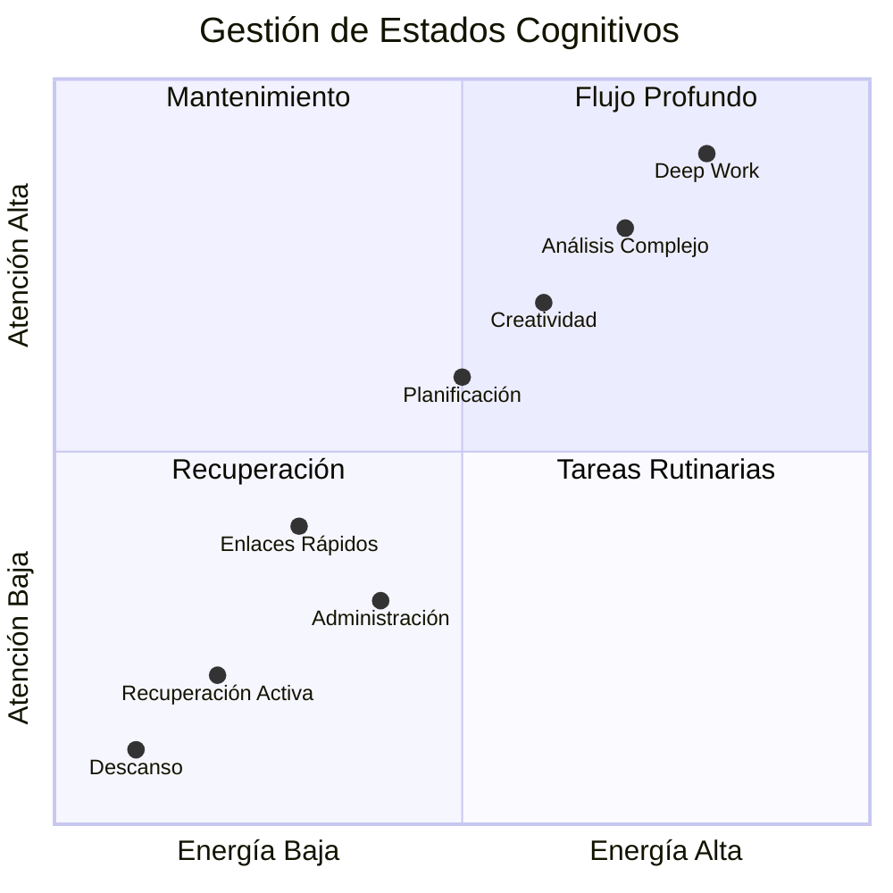

# Gestión de Atención Avanzada 🧠

> [!info] 📋 Definición La **Gestión de Atención Avanzada** es un conjunto de técnicas y estrategias sistemáticas para optimizar nuestra capacidad de concentración, minimizar distracciones y maximizar la productividad cognitiva en entornos complejos y demandantes.

## 🎯 Fundamentos de la Atención

> [!tip] 🧩 Tipos de Atención
> 
> ### Clasificación Principal
> 
> |Tipo|Descripción|Duración Típica|Aplicación|
> |---|---|---|---|
> |**Atención Sostenida**|Mantener foco en una tarea específica|20-45 min|[[Deep Work]], estudio intensivo|
> |**Atención Selectiva**|Filtrar información relevante|Variable|[[Eliminación de Distracciones]]|
> |**Atención Dividida**|Procesar múltiples fuentes|2-10 min|[[Gestión de Reuniones Efectivas]]|
> |**Atención Ejecutiva**|Control y regulación consciente|5-15 min|[[Toma de Decisiones]]|

> [!warning] ⚠️ Limitaciones Cognitivas
> 
> ### Factores que Degradan la Atención
> 
> - **Multitarea Excesiva**: Reduce eficiencia hasta 40%
> - **Fatiga de Decisión**: Deterioro progresivo durante el día
> - **Sobrecarga de Información**: Paralización por exceso de opciones
> - **Interrupciones Frecuentes**: Requiere 23 minutos promedio para retomar foco

## 🔧 Técnicas Avanzadas de Gestión

> [!tip] 🎛️ Modelo FOCUS
> 
> ```mermaid
> graph TD
>     A[FOCUS Model] --> B[Filter - Filtrar]
>     A --> C[Organize - Organizar]
>     A --> D[Concentrate - Concentrar]
>     A --> E[Utilize - Utilizar]
>     A --> F[Sustain - Sostener]
>     
>     B --> B1[Eliminar distracciones]
>     B --> B2[Identificar prioridades]
>     
>     C --> C1[Estructurar ambiente]
>     C --> C2[Planificar bloques]
>     
>     D --> D1[Técnicas de concentración]
>     D --> D2[Estados de flujo]
>     
>     E --> E1[Maximizar recursos]
>     E --> E2[Optimizar energía]
>     
>     F --> F1[Mantener consistencia]
>     F --> F2[Recuperación activa]
>     
>     classDef focusNode fill:#4CAF50,stroke:#2E7D32,color:#fff
>     classDef techniqueNode fill:#2196F3,stroke:#1565C0,color:#fff
>     
>     class A focusNode
>     class B,C,D,E,F techniqueNode
> ```

> [!info] 🔄 Ciclos de Atención Óptimos
> 
> ### Protocolo 90-20-10
> 
> |Fase|Duración|Actividad|Objetivo|
> |---|---|---|---|
> |**Ultra-Focus**|90 min|Trabajo cognitivo intenso|[[Deep Work]] máximo|
> |**Recuperación**|20 min|Descanso activo/pasivo|Restaurar recursos|
> |**Micro-tareas**|10 min|Actividades administrativas|[[Enlaces Rápidos]]|

## 🛠️ Implementación Práctica

> [!tip] 📱 Arsenal Digital
> 
> ### Configuración del Entorno
> 
> #### 🚫 Bloqueadores de Distracción
> 
> - **Nivel 1**: Notificaciones desactivadas
> - **Nivel 2**: Apps bloqueadas durante trabajo
> - **Nivel 3**: Internet limitado a recursos esenciales
> - **Nivel 4**: Dispositivos en modo avión
> 
> #### 🎵 Optimización Auditiva
> 
> - **Ruido Blanco**: Para concentración sostenida
> - **Música Instrumental**: Para tareas creativas
> - **Silencio Total**: Para análisis complejo
> - **Sonidos Naturales**: Para recuperación

> [!warning] 🧪 Gestión de Estados Cognitivos
> 
> ### Matriz de Energía-Atención
> 



> [!info] 🔬 Técnicas de Entrenamiento Atencional
> 
> ### Programa de 30 Días
> 
> #### Semana 1-2: Fundamentos
> 
> - **Días 1-7**: [[Técnicas de Concentración]] básicas (5-10 min)
> - **Días 8-14**: Extensión gradual (15-25 min)
> 
> #### Semana 3-4: Optimización
> 
> - **Días 15-21**: [[Time Blocking]] estructurado
> - **Días 22-30**: [[Sistemas de Revisión]] y ajustes

## 📊 Métricas y Seguimiento

> [!tip] 📈 KPIs de Atención
> 
> ### Indicadores Clave
> 
> |Métrica|Fórmula|Meta Semanal|Herramienta|
> |---|---|---|---|
> |**Tiempo en Flujo**|Horas de concentración profunda / Horas totales|>30%|[[Tracking de Hábitos]]|
> |**Frecuencia de Interrupciones**|Interrupciones / Hora de trabajo|<3|[[Dashboard Semanal]]|
> |**Calidad de Output**|Tareas completadas / Tareas iniciadas|>80%|[[Análisis de Tiempo]]|
> |**Recuperación de Foco**|Tiempo para retomar concentración|<5 min|Timer manual|

> [!warning] 🔄 Protocolo de Revisión Semanal
> 
> ### Checklist de Optimización
> 
> - [ ] 📊 Analizar métricas de atención
> - [ ] 🎯 Identificar patrones de distracción
> - [ ] ⚙️ Ajustar configuración de ambiente
> - [ ] 🔄 Actualizar [[Sistemas de Revisión]]
> - [ ] 📝 Documentar insights en [[Dashboard Semanal]]

## 🧠 Técnica de Estudio: Mnemotecnia CAFÉS

> [!tip] ☕ Mnemotecnia para Recordar Gestión de Atención
> 
> ### **C.A.F.É.S**
> 
> - **🔍 C**oncentrar: Enfocar en una tarea específica
> - **⚡ A**ctividad: Mantener engagement activo con el contenido
> - **🚫 F**iltrar: Eliminar distracciones del entorno
> - **⚡ É**nfasis: Priorizar tareas de alto valor
> - **🔄 S**ostener: Mantener consistencia en el tiempo
> 
> **Frase Mnemotécnica**: _"Con Atención Filtro Energía Sostenida"_

## 📚 Referencias

> [!quote] 🔗 Enlaces Internos
> 
> - [[Deep Work]] - Fundamento para concentración profunda
> - [[Eliminación de Distracciones]] - Estrategias de filtrado ambiental
> - [[Time Blocking]] - Estructuración temporal
> - [[Técnicas de Concentración]] - Herramientas específicas de foco
> - [[Tracking de Hábitos]] - Seguimiento de métricas atencionales
> - [[Dashboard Semanal]] - Revisión periódica de rendimiento

## 📖 Notas Recomendadas

> [!info] 🎯 Prerrequisitos
> 
> - [[Autoconocimiento]] - Base para identificar patrones personales
> - [[Definición de Propósito]] - Claridad en objetivos de atención
> - [[Planificación Estratégica]] - Marco temporal para implementación

> [!tip] 🚀 Complementarias
> 
> - [[Gestión del Tiempo]] - Optimización temporal general
> - [[Procesamiento por Lotes]] - Eficiencia en tareas similares
> - [[Seguimiento de Picos de Energía]] - Sincronización con ritmos naturales
> - [[Matriz de Eisenhower]] - Priorización de tareas por importancia/urgencia

> [!warning] 🔄 Metodologías Avanzadas
> 
> - [[Bullet Journal Method (BuJo)]] - Sistema de organización personal
> - [[Objetivos SMART]] - Definición precisa de metas atencionales
> - [[Curva del Olvido]] - Optimización de retención de información

---

**Tags:** #productividad #atencion #concentracion #gestion-tiempo #metodologias #deep-work #sistemas #optimizacion #neurociencia #mindfulness