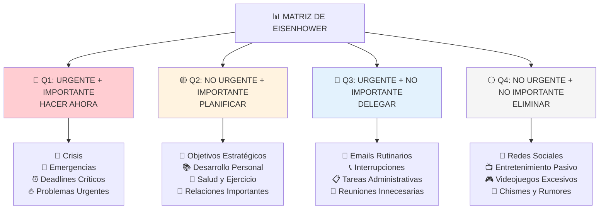

# 🎯 Matriz de Eisenhower - Priorización Estratégica

## 📋 Definición

> [!info] ¿Qué es la Matriz de Eisenhower? La Matriz de Eisenhower es un framework de toma de decisiones que categoriza tareas basándose en dos dimensiones críticas: **urgencia** e **importancia**. Desarrollada por el 34º Presidente de Estados Unidos Dwight D. Eisenhower, esta matriz ayuda a distinguir entre lo que parece urgente y lo que realmente importa para el logro de objetivos a largo plazo.

## 🏛️ Filosofía de Eisenhower

> [!quote] Principio Fundamental _"Lo que es importante rara vez es urgente, y lo que es urgente rara vez es importante"_ - Dwight D. Eisenhower

> [!tip] Mentalidad Estratégica vs. Reactiva
> 
> - **Reactiva**: Responder constantemente a lo urgente
> - **Estratégica**: Invertir tiempo en lo importante antes de que se vuelva urgente
> - **Liderazgo**: Capacidad de mantener perspectiva de largo plazo
> - **Efectividad**: Resultados significativos vs. actividad constante

## 📊 Los Cuatro Cuadrantes



### 🔴 Cuadrante 1: Urgente + Importante (HACER)

> [!warning] Crisis y Emergencias - Minimizar **Características:**
> 
> - Requieren atención inmediata
> - Consecuencias graves si se ignoran
> - Generan estrés y presión
> - No se pueden postergar
> 
> **Ejemplos Típicos:**
> 
> - 🚨 Emergencias médicas o familiares
> - 🔥 Crisis laborales o de negocio
> - ⏰ Deadlines críticos inaplazables
> - 🏥 Problemas de salud urgentes
> - 💻 Fallas técnicas que detienen operaciones
> 
> **Estrategia:** Resolver eficientemente y prevenir futuras ocurrencias

### 🟡 Cuadrante 2: No Urgente + Importante (PLANIFICAR)

> [!tip] El Cuadrante del Éxito - Maximizar **Características:**
> 
> - Fundamental para objetivos a largo plazo
> - Fácil de postergar sin consecuencias inmediatas
> - Genera los mayores retornos de inversión
> - Reduce actividades de Cuadrante 1
> 
> **Ejemplos Estratégicos:**
> 
> - 🎯 Planificación estratégica y definición de objetivos
> - 📚 Educación continua y desarrollo de habilidades
> - 💪 Ejercicio regular y cuidado de la salud
> - 👥 Cultivo de relaciones importantes
> - 💰 Planificación financiera e inversiones
> - 🛠️ Mejora de procesos y sistemas
> - 🧘‍♀️ Desarrollo personal y bienestar mental
> 
> **Meta:** 65-70% del tiempo en este cuadrante

### 🔵 Cuadrante 3: Urgente + No Importante (DELEGAR)

> [!info] Ilusión de Productividad - Delegar/Minimizar **Características:**
> 
> - Parece urgente pero no contribuye a objetivos principales
> - Interrumpe trabajo importante
> - Muchas veces beneficia a otros más que a ti
> - Puede ser manejado por terceros
> 
> **Ejemplos Comunes:**
> 
> - 📧 Emails no críticos pero "urgentes"
> - 📞 Llamadas de ventas o interrupciones
> - 📋 Tareas administrativas rutinarias
> - 🤝 Reuniones donde tu aporte es mínimo
> - 📱 Notificaciones de redes sociales
> - 📄 Reportes que otros pueden preparar
> 
> **Estrategias:** Delegar, automatizar, o establecer límites

### ⚪ Cuadrante 4: No Urgente + No Importante (ELIMINAR)

> [!warning] Ladrones de Tiempo - Eliminar Completamente **Características:**
> 
> - No agregan valor real a tu vida
> - Actividades de escape o procrastinación
> - Consumo pasivo sin propósito
> - Hábitos destructivos disfrazados
> 
> **Ejemplos de Eliminación:**
> 
> - 📱 Scroll infinito en redes sociales
> - 📺 TV sin propósito específico
> - 🎮 Gaming excesivo sin límites
> - 💬 Chismes y conversaciones tóxicas
> - 🛒 Compras compulsivas online
> - 📰 Consumo excesivo de noticias negativas
> 
> **Objetivo:** Reducir a <10% del tiempo total

## 🎯 Proceso de Categorización Avanzado

### 🔍 Preguntas de Evaluación

> [!tip] Framework de Decisión Rápida **Para determinar IMPORTANCIA:**
> 
> - ¿Contribuye directamente a mis objetivos principales?
> - ¿Las consecuencias de NO hacerlo son significativas a largo plazo?
> - ¿Solo yo puedo hacer esto específicamente?
> - ¿Alineado con mis valores y prioridades fundamentales?
> 
> **Para determinar URGENCIA:**
> 
> - ¿Debe hacerse hoy o esta semana?
> - ¿Hay un deadline específico y no negociable?
> - ¿Las consecuencias de retrasar son inmediatas?
> - ¿Otros dependen de esto para continuar?

### 📊 Sistema de Puntuación Cuantitativo

> [!info] Método de Scoring 1-10 **Escala de Importancia (1-10):**
> 
> - 1-3: Mínima importancia para objetivos
> - 4-6: Importancia moderada, contribución indirecta
> - 7-8: Alta importancia, impacto significativo
> - 9-10: Crítica para éxito, imposible delegar
> 
> **Escala de Urgencia (1-10):**
> 
> - 1-3: Sin deadline, puede esperar semanas/meses
> - 4-6: Deadline flexible, preferible completar pronto
> - 7-8: Deadline firme, necesario esta semana
> - 9-10: Deadline crítico, debe hacerse hoy
> 
> **Matriz de Decisión:**
> 
> - Q1: Urgencia 7+ AND Importancia 7+
> - Q2: Urgencia 1-6 AND Importancia 7+
> - Q3: Urgencia 7+ AND Importancia 1-6
> - Q4: Urgencia 1-6 AND Importancia 1-6

## 🔄 Implementación Práctica

### 📅 Aplicación Diaria

> [!tip] Rutina Matutina de Priorización (15 minutos)
> 
> 1. **Lista todas las tareas** del día (brain dump)
> 2. **Categoriza cada una** según cuadrante
> 3. **Ordena por prioridad** dentro de cada cuadrante
> 4. **Asigna tiempo estimado** para cada tarea
> 5. **Bloquea tiempo** en calendario para Q2 especialmente
> 
> **Template Diario:**
> 
> ```
> 🔴 Q1 - HACER HOY:
> - [ ] [Tarea urgente importante] - 45min
> - [ ] [Crisis específica] - 30min
> 
> 🟡 Q2 - PLANIFICAR/PROGRAMAR:
> - [ ] [Objetivo estratégico] - 90min
> - [ ] [Desarrollo personal] - 60min
> 
> 🔵 Q3 - DELEGAR/MINIMIZAR:
> - [ ] [Tarea administrativa] → Delegar a X
> - [ ] [Email rutinario] → Batch 15min
> 
> ⚪ Q4 - ELIMINAR:
> - Identificar y eliminar actividades sin valor
> ```

### 📊 Revisión Semanal Estratégica

> [!info] Análisis de Patrones (30 minutos) **Preguntas de Reflexión:**
> 
> - ¿Qué % de tiempo invertí en cada cuadrante?
> - ¿Qué tareas Q1 podrían haberse previsto?
> - ¿Qué actividades Q2 postergo consistentemente?
> - ¿Cuáles actividades Q3/Q4 puedo eliminar permanentemente?
> 
> **Métricas de Seguimiento:**
> 
> - **Q1**: <25% (ideal: 15-20%)
> - **Q2**: >65% (ideal: 65-70%)
> - **Q3**: <15% (ideal: 10-15%)
> - **Q4**: <10% (ideal: 5-10%)

## 🧠 Psicología de la Procrastinación

### 🎭 Sesgos Cognitivos Comunes

> [!warning] Trampas Mentales en Priorización **Urgency Bias** 🔥
> 
> - Tendencia a priorizar tareas urgentes sobre importantes
> - Dopamina inmediata vs. recompensas a largo plazo
> - Sensación de "productividad" al completar urgentes
> 
> **Planning Fallacy** ⏰
> 
> - Subestimar tiempo para tareas importantes Q2
> - Sobreestimar tiempo disponible futuro
> - Postponer Q2 por parecer "menos presionante"
> 
> **Instant Gratification** 🍭
> 
> - Preferir actividades Q4 (fáciles/placenteras)
> - Evitar esfuerzo cognitivo de tareas Q2
> - Buscar distracciones cuando hay resistencia

### 🛠️ Estrategias Anti-Procrastinación

> [!tip] Técnicas Psicológicas Probadas **Para Cuadrante 2 (Importantes No Urgentes):**
> 
> - **Temptation Bundling**: Combinar Q2 con actividades placenteras
> - **Implementation Intentions**: "Si X, entonces haré Y"
> - **2-Minute Rule**: Si toma <2 min, hacer inmediatamente
> - **Timeboxing**: Límites temporales específicos para Q2
> 
> **Para Resistir Cuadrante 4:**
> 
> - **Environmental Design**: Eliminar triggers de distracción
> - **Replacement Habits**: Sustituir Q4 con Q2 alternatives
> - **Social Accountability**: Comprometerse públicamente con Q2
> - **Reward Systems**: Incentivos por completar tareas importantes

## 🎨 Variaciones y Adaptaciones

### 🏢 Matriz Eisenhower Empresarial

> [!info] Adaptación para Líderes y Equipos **Q1 - Crisis Organizacionales:**
> 
> - Fallas de sistemas críticos
> - Pérdida de clientes importantes
> - Crisis de PR o comunicación
> - Problemas regulatorios urgentes
> 
> **Q2 - Crecimiento Estratégico:**
> 
> - Desarrollo de nuevo productos/servicios
> - Entrenamiento y desarrollo de equipo
> - Mejora de procesos operativos
> - Construcción de relaciones estratégicas
> - Planificación financiera a largo plazo
> 
> **Q3 - Operaciones Rutinarias:**
> 
> - Reuniones status quo sin valor agregado
> - Reportes que pueden automatizarse
> - Aprobaciones que pueden delegarse
> - Tareas administrativas repetitivas
> 
> **Q4 - Actividades Improductivas:**
> 
> - Reuniones sin agenda clara
> - Micro-management innecesario
> - Perfectionism en tareas menores
> - Actividades de "busy work"

### 👨‍👩‍👧‍👦 Matriz Eisenhower Personal/Familiar

> [!tip] Balance Vida-Trabajo-Familia **Q1 - Emergencias Familiares:**
> 
> - Problemas de salud familiares
> - Crisis educativas de hijos
> - Emergencias financieras
> - Problemas relacionales críticos
> 
> **Q2 - Desarrollo Personal/Familiar:**
> 
> - Tiempo de calidad con familia
> - Ejercicio y cuidado personal
> - Educación financiera
> - Desarrollo de hobbies significativos
> - Planificación de futuro familiar
> 
> **Q3 - Obligaciones Sociales:**
> 
> - Eventos sociales poco importantes
> - Compromisos que otros pueden manejar
> - Actividades de cortesía excesivas
> 
> **Q4 - Distracciones Domésticas:**
> 
> - TV/entretenimiento sin propósito
> - Redes sociales excesivas
> - Compras compulsivas
> - Preocupaciones sin acción

## 🛠️ Herramientas y Aplicaciones

### 📱 Apps Especializadas

> [!tip] Tecnología para Eisenhower Matrix **Apps Dedicadas:**
> 
> - **Eisenhower Matrix App**: Interfaz visual simple
> - **Priority Matrix**: Colaboración en equipo
> - **Covey Quadrants**: Basado en Stephen Covey
> - **Focus Matrix**: Integración con calendario
> 
> **Adaptaciones en Apps Generales:**
> 
> - **Todoist**: Labels con colores por cuadrante
> - **Notion**: Templates personalizados con filtros
> - **Trello**: Boards separados por cuadrante
> - **Asana**: Custom fields para urgencia/importancia

### 🎨 Templates y Frameworks

> [!info] Plantillas Reutilizables **Template Semanal de Planificación:**
> 
> ```
> SEMANA: [Fecha]
> OBJETIVOS PRINCIPALES: [3 objetivos Q2]
> 
> 🔴 Q1 - CRISIS A RESOLVER:
> Lunes: [  ] ________________
> Martes: [  ] ________________
> ...
> 
> 🟡 Q2 - INVERSIÓN ESTRATÉGICA (70% tiempo):
> - [  ] Objetivo 1: _______ [3h]
> - [  ] Objetivo 2: _______ [2h]
> - [  ] Desarrollo personal: _______ [1h]
> 
> 🔵 Q3 - DELEGAR/BATCH:
> - [  ] Emails: 30min diarios
> - [  ] Admin: _______ → Delegar a _____
> 
> ⚪ Q4 - ELIMINAR ESTA SEMANA:
> - [ ] Actividad X - STOP
> - [ ] Hábito Y - REEMPLAZAR con _____
> ```

## 📈 Integración con Otros Sistemas

### 🔄 Sinergias con Metodologías Populares

> [!info] Compatibilidad Sistémica **Getting Things Done (GTD) + Eisenhower:**
> 
> - Inbox capture → Categorización por cuadrante
> - Next Actions filtradas por importancia/urgencia
> - Weekly Review incluye análisis de cuadrantes
> - Contexts optimizados según tipo de cuadrante
> 
> **Time Blocking + Eisenhower:**
> 
> - Q2 tasks get prime time slots
> - Q1 gets emergency time blocks
> - Q3 gets batched time windows
> - Q4 gets eliminated from calendar
> 
> **OKRs + Eisenhower:**
> 
> - Objectives primarily live in Q2
> - Key Results measurement in Q2
> - Urgent tactical work stays in Q1
> - Non-OKR activities evaluated for Q3/Q4

### 🎯 Aplicación en Diferentes Contextos

> [!tip] Adaptaciones Específicas **Para Estudiantes:**
> 
> - Q1: Exámenes inminentes, deadlines de proyectos
> - Q2: Estudio regular, desarrollo de habilidades
> - Q3: Actividades extracurriculares menos importantes
> - Q4: Distracciones académicas, redes sociales
> 
> **Para Emprendedores:**
> 
> - Q1: Crisis de cash flow, problemas de clientes
> - Q2: Desarrollo de producto, team building
> - Q3: Networking que otros pueden hacer
> - Q4: Perfectionism en detalles menores
> 
> **Para Creativos:**
> 
> - Q1: Deadlines de clientes, crisis técnicas
> - Q2: Desarrollo de portfolio, aprendizaje de skills
> - Q3: Administración que puede delegarse
> - Q4: Consumo pasivo sin propósito

## ⚠️ Limitaciones y Consideraciones

### 🚧 Desafíos Comunes

> [!warning] Limitaciones del Framework **Subjetividad en Categorización** 🎭
> 
> - Lo que es "importante" varía por persona/contexto
> - Sesgo personal puede clasificar mal las tareas
> - Necesidad de calibración regular con mentores/coaches
> 
> **Dinamismo de Prioridades** 🔄
> 
> - Importancia/urgencia cambia con el tiempo
> - Contexto externo puede reclasificar tareas
> - Necesidad de re-evaluación constante
> 
> **Resistencia Psicológica a Q2** 🧠
> 
> - Tareas importantes sin urgencia son difíciles
> - Gratificación retardada vs. satisfacción inmediata
> - Requiere disciplina y sistemas de apoyo

### 🛠️ Estrategias de Mitigación

> [!tip] Soluciones a Limitaciones **Para Subjetividad:**
> 
> - Definir criterios objetivos de importancia
> - Revisión regular con mentores o colegas
> - Tracking de resultados por categorización
> 
> **Para Dinamismo:**
> 
> - Revisión diaria rápida (5 min)
> - Alertas de contexto para re-evaluación
> - Flexibilidad estructurada en el sistema
> 
> **Para Resistencia Q2:**
> 
> - Gamificación de tareas importantes
> - Accountability partners para Q2
> - Recompensas intrínsecas bien diseñadas

## 🎓 Desarrollo de Habilidades

### 🧠 Competencias Clave a Desarrollar

> [!info] Skills para Maestría en Priorización **Pensamiento Estratégico** 🎯
> 
> - Visión a largo plazo clara
> - Capacidad de ver conexiones sistémicas
> - Comprensión de trade-offs e impactos
> 
> **Autoconocimiento** 🪞
> 
> - Claridad en valores personales
> - Comprensión de fortalezas/debilidades
> - Awareness de sesgos cognitivos propios
> 
> **Disciplina Ejecutiva** 💪
> 
> - Capacidad de decir "no" efectivamente
> - Perseverancia en tareas Q2
> - Resistencia a distracciones Q4
> 
> **Flexibilidad Cognitiva** 🧘‍♀️
> 
> - Adaptación a cambios de contexto
> - Re-priorización rápida y efectiva
> - Balance entre estructura y agilidad

### 📚 Recursos de Desarrollo

> [!tip] Camino de Aprendizaje Recomendado **Libros Fundamentales:**
> 
> - "Los 7 Hábitos de la Gente Altamente Efectiva" - Stephen Covey
> - "First Things First" - Covey, Merrill & Merrill
> - "Essentialism" - Greg McKeown
> - "The Power of Moments" - Chip & Dan Heath
> 
> **Cursos y Entrenamiento:**
> 
> - Franklin Covey Leadership Programs
> - Time Management cursos online
> - Decision Making workshops
> - Strategic Thinking development programs

---

## 📎 Referencias

> [!quote] Enlaces a Otras Notas
> 
> - [[Gestión del Tiempo]] - Framework temporal para implementar prioridades
> - [[Time Blocking]] - Asignación de tiempo según cuadrantes
> - [[Método 9 - Metodología GTD (Getting Things Done)]] - Captura y organización de tareas por importancia
> - [[Toma de Decisiones]] - Criterios objetivos para categorización
> - [[Productividad en la Vida Real]] - Integración con sistemas de eficiencia
> - [[Objetivos SMART]] - Definición de importancia basada en metas
> - [[Gestión de la Energía Personal]] - Alineación de cuadrantes con niveles de energía

## 📚 Notas Recomendadas

> [!info] Lecturas Complementarias
> 
> - [[El Arte de Decir No]] - Técnicas para rechazar actividades Q3/Q4
> - [[Planificación Estratégica]] - Definición de importancia a largo plazo
> - [[Análisis Costo-Beneficio]] - Evaluación cuantitativa de prioridades
> - [[Delegación Efectiva]] - Estrategias para manejar cuadrante 3
> - [[Eliminación de Distracciones]] - Técnicas para reducir cuadrante 4
> - [[Sistemas de Revisión]] - Procesos de evaluación y ajuste de prioridades
> - [[Clarificación de Valores]] - Definición de criterios de importancia personal
> - [[Pensamiento Estratégico]] - Desarrollo de perspectiva de largo plazo

---

_Tags: #matriz-eisenhower #priorización #toma-de-decisiones #gestión-del-tiempo #productividad #estrategia #planificación #delegación #eliminación #objetivos #importancia #urgencia #cuadrantes #eficiencia #efectividad_