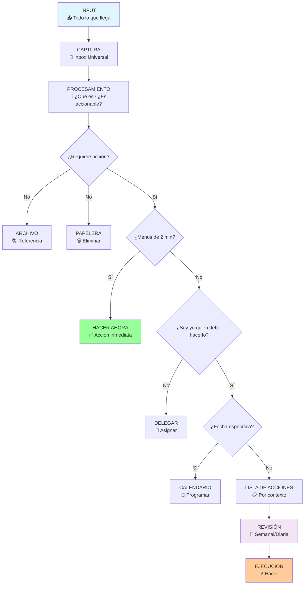

# Sistemas de Productividad 🔧

> [!quote] "Un sistema de productividad no es solo sobre hacer más cosas, es sobre hacer las cosas correctas de manera consistente." - David Allen

## ¿Qué es un Sistema de Productividad? 🎯

> [!info] **Definición** Un sistema de productividad es un marco organizacional coherente y reproducible que integra métodos, herramientas y procesos para capturar, organizar, procesar y ejecutar tareas de manera eficiente. Es la infraestructura personal que permite transformar el caos de la información y responsabilidades en flujos de trabajo estructurados y resultados consistentes.

> [!tip] **Componentes Fundamentales** ✨
> 
> - **Captura universal**: Sistema confiable para registrar toda la información entrante
> - **Procesamiento regular**: Metodología para convertir inputs en acciones claras
> - **Organización contextual**: Estructura que agrupa elementos por contexto de ejecución
> - **Revisión sistemática**: Proceso regular de actualización y mantenimiento
> - **Ejecución enfocada**: Metodología para decidir qué hacer momento a momento

## La Anatomía de un Sistema de Productividad Efectivo



## Los 7 Sistemas de Productividad Más Efectivos

> [!warning] **1. Getting Things Done (GTD) - David Allen** 🧠
> 
> ### Filosofía Central:
> 
> "Tu mente es para tener ideas, no para almacenarlas"
> 
> ### Los 5 Pasos del GTD:
> 
> 1. **Capturar**: Todo en un sistema confiable
> 2. **Clarificar**: ¿Qué es y qué significa?
> 3. **Organizar**: Poner en el lugar correcto
> 4. **Reflexionar**: Revisar opciones regularmente
> 5. **Involucrar**: Actuar con confianza
> 
> ### Listas Principales:
> 
> - **Inbox**: Captura temporal
> - **Próximas Acciones**: Por contexto (@casa, @oficina, @llamadas)
> - **Proyectos**: Resultados que requieren múltiples acciones
> - **En Espera**: Delegado o pendiente de otros
> - **Algún Día/Tal Vez**: Ideas para el futuro
> - **Agenda**: Temas para discutir con personas específicas
> 
> ### Revisión Semanal:
> 
> - Revisar y actualizar todas las listas
> - Procesar inboxes hasta vacío
> - Revisar calendario de la semana siguiente
> - Actualizar lista de proyectos

> [!tip] **2. PARA Method - Tiago Forte** 📚
> 
> ### Significado del Acrónimo:
> 
> - **P**rojects (Proyectos actuales)
> - **A**reas (Áreas de responsabilidad continua)
> - **R**esources (Recursos e intereses)
> - **A**rchive (Archivo de elementos inactivos)
> 
> ### Estructura Jerárquica:
> 
> |Nivel|Horizonte Temporal|Ejemplos|
> |---|---|---|
> |**Projects**|1-3 meses|Lanzar producto, Completar curso|
> |**Areas**|Continuo|Finanzas, Salud, Carrera|
> |**Resources**|Indefinido|Recetas, Inspiración, Aprendizaje|
> |**Archive**|Completado|Proyectos terminados, referencias viejas|
> 
> ### Principios Clave:
> 
> - **Accionabilidad**: Organizar por nivel de acción requerida
> - **Progresividad**: Información que se mueve entre niveles
> - **Contextualidad**: Agrupación por similitud de uso

> [!info] **3. Bullet Journal Method (BuJo) - Ryder Carroll** 📓
> 
> ### Componentes Básicos:
> 
> #### **Símbolos de Registro Rápido:**
> 
> - **• Tarea**
> - **○ Evento**
> - **- Nota**
> - **! Importante**
> - **★ Inspiración**
> - **× Completado**
> - **> Migrado**
> - **< Programado**
> 
> #### **Módulos Principales:**
> 
> 1. **Índice**: Tabla de contenidos navegable
> 2. **Future Log**: Planificación de 6-12 meses
> 3. **Monthly Log**: Vista mensual de calendario y tareas
> 4. **Daily Log**: Registro diario de actividades
> 5. **Collections**: Páginas temáticas especializadas
> 
> ### Proceso de Migración:
> 
> ```mermaid
> flowchart LR
>     A[Final del Día] --> B[Revisar Tareas Pendientes]
>     B --> C{¿Sigue siendo relevante?}
>     C -->|Sí| D[Migrar al día siguiente >]
>     C -->|No| E[Eliminar]
>     D --> F[Marcar como migrado]
>     
>     G[Final del Mes] --> H[Revisar Tareas no Completadas]
>     H --> I{¿Sigue siendo importante?}
>     I -->|Sí| J[Migrar al mes siguiente]
>     I -->|No| K[Archivar o eliminar]
>     
>     style D fill:#99ff99
>     style J fill:#99ff99
>     style E fill:#ff9999
>     style K fill:#ff9999
> ```

> [!warning] **4. Zettelkasten - Niklas Luhmann** 🗂️
> 
> ### Principios Fundamentales:
> 
> - **Atomicidad**: Una idea por nota
> - **Autonomía**: Cada nota es autónoma y comprensible
> - **Conectividad**: Enlaces entre ideas relacionadas
> - **Emergencia**: Patrones surgen de las conexiones
> 
> ### Estructura de Numeración:
> 
> - **1**: Primera nota principal
> - **1a**: Primera ramificación de la nota 1
> - **1a1**: Sub-ramificación de 1a
> - **1b**: Segunda ramificación de la nota 1
> 
> ### Flujo de Trabajo:
> 
> 1. **Captura** ideas en formato atómico
> 2. **Conecta** con notas existentes
> 3. **Desarrolla** cadenas de pensamiento
> 4. **Emerge** patrones y estructuras
> 
> ### Tipos de Enlaces:
> 
> - **Enlaces directos**: Referencias específicas entre notas
> - **Enlaces por proximidad**: Notas numericamente cercanas
> - **Enlaces temáticos**: Tags y categorías
> - **Enlaces emergentes**: Patrones que surgen del uso

> [!tip] **5. Time Blocking - Cal Newport** ⏰
> 
> ### Filosofía Central:
> 
> "Lo que se programa, se hace. Lo que no se programa, se espera que se haga."
> 
> ### Tipos de Bloques:
> 
> |Tipo de Bloque|Duración|Propósito|Ejemplo|
> |---|---|---|---|
> |**Deep Work**|90-180 min|Trabajo cognitivo intenso|Escribir, programar, analizar|
> |**Shallow Work**|30-60 min|Tareas administrativas|Email, llamadas, planificación|
> |**Buffer Time**|15-30 min|Transiciones y imprevistos|Entre reuniones, preparación|
> |**Batch Processing**|45-90 min|Tareas similares agrupadas|Todas las llamadas, todos los emails|
> 
> ### Reglas de Implementación:
> 
> 1. **Planifica la noche anterior** o primera hora del día
> 2. **Asigna tiempo específico** a cada actividad
> 3. **Incluye buffers** para imprevistos (20% del tiempo)
> 4. **Protege el deep work** como sagrado
> 5. **Revisa y ajusta** semanalmente
> 
> ### Plantilla de Bloque Diario:
> 
> ```
> 6:00-7:00   🌅 Rutina matutina
> 7:00-8:00   📚 Deep Work - Escritura
> 8:00-8:15   ☕ Buffer/Transición  
> 8:15-9:00   📧 Email y comunicación
> 9:00-10:30  🧠 Deep Work - Análisis proyecto X
> 10:30-10:45 🚶 Descanso activo
> 10:45-11:30 📞 Llamadas programadas
> ```

> [!info] **6. Objectives and Key Results (OKRs)** 🎯
> 
> ### Estructura de OKRs:
> 
> **Objetivo**: Meta cualitativa, inspiradora y memorable **Key Results**: 3-5 métricas específicas y medibles
> 
> ### Ejemplo de OKR:
> 
> **Objetivo**: Mejorar significativamente mi condición física **Key Results**:
> 
> - KR1: Correr 5km en menos de 25 minutos
> - KR2: Entrenar fuerza 3 veces por semana durante 3 meses
> - KR3: Reducir grasa corporal del 20% al 15%
> 
> ### Ciclos de OKRs:
> 
> - **Trimestrales**: Revisión cada 3 meses
> - **Check-ins semanales**: Progreso y ajustes
> - **Scoring**: 0.0-1.0, donde 0.7 es éxito
> 
> ### Características de Buenos OKRs:
> 
> - **Aspiracionales**: Requieren esfuerzo significativo
> - **Específicos**: Claramente definidos
> - **Medibles**: Con métricas concretas
> - **Limitados en tiempo**: Con fecha límite clara

> [!warning] **7. BASB (Building a Second Brain) - Tiago Forte** 🧠
> 
> ### El Método CODE:
> 
> - **C**apture (Capturar información resonante)
> - **O**rganize (Organizar para acción)
> - **D**istill (Destilar para el futuro yo)
> - **E**xpress (Expresar tu trabajo)
> 
> ### Progressive Summarization:
> 
> 1. **Nivel 0**: Contenido original
> 2. **Nivel 1**: Guardar articulo/nota
> 3. **Nivel 2**: Resaltar pasajes importantes
> 4. **Nivel 3**: Resaltar lo más importante en negrita
> 5. **Nivel 4**: Crear resumen ejecutivo
> 6. **Nivel 5**: Comentarios y conclusiones personales
> 
> ### Flujo de Trabajo:
> 
> ```mermaid
> flowchart LR
>     A[Consumir Contenido] --> B[Capturar lo Resonante]
>     B --> C[Organizar en PARA]
>     C --> D[Procesar Progresivamente]
>     D --> E[Crear Nuevo Contenido]
>     E --> F[Compartir y Obtener Feedback]
>     F --> A
>     
>     style E fill:#99ff99
>     style F fill:#ffcc99
> ```

## Comparación de Sistemas: Cuándo Usar Cada Uno

> [!tip] **Matriz de Selección de Sistemas** 🔄
> 
> |Sistema|Mejor Para|Complejidad|Flexibilidad|Curva de Aprendizaje|
> |---|---|---|---|---|
> |**GTD**|Sobrecarga informacional alta|Alta|Media|Empinada|
> |**PARA**|Gestión de conocimiento|Media|Alta|Moderada|
> |**BuJo**|Creativos, flexibilidad total|Baja|Muy Alta|Suave|
> |**Zettelkasten**|Investigadores, escritores|Media|Media|Moderada|
> |**Time Blocking**|Profesionales con horarios densos|Baja|Baja|Suave|
> |**OKRs**|Objetivos de mediano/largo plazo|Baja|Media|Suave|
> |**BASB**|Creadores de contenido|Media|Alta|Moderada|

## Diseñando Tu Sistema Personal Híbrido

> [!info] **Proceso de Diseño de Sistema** 🎨
> 
> ### Fase 1: Análisis Personal
> 
> #### **Auditoría de Trabajo Actual:**
> 
> 1. **Tracking de tiempo** durante una semana completa
> 2. **Identificación de fuentes** de tareas e información
> 3. **Mapeo de contextos** de trabajo (@casa, @oficina, @móvil)
> 4. **Análisis de picos** de energía y productividad
> 
> #### **Preguntas de Autoconocimiento:**
> 
> - ¿Soy más visual o textual?
> - ¿Prefiero estructura rígida o flexibilidad?
> - ¿Trabajo mejor con deadlines o sin presión temporal?
> - ¿Necesito gamificación para mantener motivación?
> 
> ### Fase 2: Selección de Componentes
> 
> #### **Componentes por Función:**
> 
> |Función|Opciones|Herramienta Recomendada|
> |---|---|---|
> |**Captura**|GTD Inbox, BuJo Daily Log|App de notas rápidas + físico|
> |**Planificación**|Time Blocking, OKRs|Calendario digital|
> |**Organización**|PARA, GTD Lists|Notion, Obsidian|
> |**Conocimiento**|Zettelkasten, BASB|Obsidian, Roam|
> |**Revisión**|GTD Weekly, BuJo Migration|Template personalizado|
> 
> ### Fase 3: Implementación Gradual
> 
> ```mermaid
> graph TD
>     A[Semana 1-2<br/>🔥 Solo Captura] --> B[Semana 3-4<br/>📋 Añadir Organización]
>     B --> C[Semana 5-6<br/>🔄 Añadir Revisión]
>     C --> D[Semana 7-8<br/>⚡ Optimizar Ejecución]
>     D --> E[Mes 3<br/>🎯 Añadir Objetivos]
>     E --> F[Mes 6<br/>🧠 Gestión de Conocimiento]
>     
>     style A fill:#ff9999
>     style B fill:#ffcc99
>     style C fill:#99ccff
>     style D fill:#99ff99
>     style E fill:#ccffcc
>     style F fill:#e6ccff
> ```

## Herramientas Digitales por Categoría

> [!warning] **Ecosistema de Herramientas** 🛠️
> 
> ### **Captura Universal:**
> 
> - **Drafts (iOS)**: Texto rápido con acciones automatizadas
> - **Google Keep**: Notas rápidas con recordatorios
> - **Voice Memos**: Captura de audio para ideas
> - **Pocket**: Guardado de artículos y enlaces
> 
> ### **Organización y Gestión:**
> 
> - **Notion**: All-in-one con bases de datos relacionales
> - **Obsidian**: Red de conocimiento con enlaces bidireccionales
> - **Todoist**: GTD nativo con proyectos y contextos
> - **Things 3**: Diseño elegante para metodología GTD
> 
> ### **Planificación Temporal:**
> 
> - **Calendar Blocking**: Google Calendar, Outlook
> - **Time Tracking**: RescueTime, Toggl
> - **Pomodoro**: Forest, Be Focused
> - **Deep Work**: Freedom, Cold Turkey
> 
> ### **Conocimiento y Aprendizaje:**
> 
> - **Readwise**: Sincronización de highlights de libros/artículos
> - **Anki**: Repetición espaciada para memorización
> - **Roam Research**: Pensamiento asociativo y connections
> - **Logseq**: Alternativa open source a Roam

## Automatizaciones para Sistemas de Productividad

> [!tip] **Automatizaciones Clave** 🤖
> 
> ### **Nivel 1: Triggers Básicos**
> 
> - **Email a tarea**: Emails importantes → Lista de acciones
> - **Calendario a revisión**: Evento termina → Capturar resultados
> - **Recordatorios basados en ubicación**: Llegar a casa → Revisar tareas @casa
> - **Templates**: Nuevos proyectos → Estructura automática
> 
> ### **Nivel 2: Flujos Intermedios**
> 
> - **Revisión semanal automatizada**: Viernes → Generar reporte de progreso
> - **Procesamiento de inbox**: Nuevos elementos → Clasificación inicial
> - **Sync entre dispositivos**: Cambios en cualquier lugar → Actualización universal
> - **Backup automático**: Diariamente → Copia de seguridad del sistema
> 
> ### **Nivel 3: IA y Machine Learning**
> 
> - **Priorización inteligente**: Patrones históricos → Sugerencias de prioridades
> - **Estimación de tiempo**: Tareas similares → Predicción de duración
> - **Detección de patrones**: Análisis de productividad → Insights personalizados
> - **Asistente contextual**: Ubicación/tiempo → Sugerencias relevantes

## Mantenimiento y Evolución del Sistema

> [!info] **Ciclos de Mantenimiento** 🔧
> 
> ### **Mantenimiento Diario (5-10 min):**
> 
> - Procesar inbox hasta vacío
> - Revisar calendario del día siguiente
> - Capturar elementos pendientes
> - Actualizar progreso en tareas activas
> 
> ### **Mantenimiento Semanal (30-45 min):**
> 
> - Revisión completa de todas las listas
> - Actualización de proyectos activos
> - Planificación de la semana siguiente
> - Identificación de cuellos de botella
> 
> ### **Mantenimiento Mensual (60-90 min):**
> 
> - Análisis de métricas de productividad
> - Ajuste de categorías y contextos
> - Evaluación de herramientas y procesos
> - Actualización de objetivos de mediano plazo
> 
> ### **Mantenimiento Trimestral (2-3 horas):**
> 
> - Revisión completa del sistema
> - Análisis de efectividad por componente
> - Implementación de mejoras significativas
> - Reajuste de metas y prioridades

## Errores Comunes al Implementar Sistemas

> [!warning] **Trampas Frecuentes** ⚠️
> 
> ### **1. Complejidad Excesiva**
> 
> - **Síntoma**: Pasar más tiempo gestionando el sistema que trabajando
> - **Solución**: Aplicar principio de simplicidad, eliminar elementos no esenciales
> - **Regla**: Si no has usado algo en 2 semanas, probablemente no lo necesitas
> 
> ### **2. Rigidez Extrema**
> 
> - **Síntoma**: Ansiedad cuando el sistema no se sigue perfectamente
> - **Solución**: Construir flexibilidad y buffers en el sistema
> - **Regla**: El sistema debe adaptarse a tu vida, no al revés
> 
> ### **3. Síndrome de la Herramienta Brillante**
> 
> - **Síntoma**: Cambiar constantemente de aplicaciones y métodos
> - **Solución**: Comprometerse con un stack básico por al menos 3 meses
> - **Regla**: La perfección es enemiga de la consistencia
> 
> ### **4. Falta de Revisión Regular**
> 
> - **Síntoma**: El sistema se desactualiza y pierde efectividad
> - **Solución**: Calendaricer revisiones obligatorias no negociables
> - **Regla**: Un sistema sin mantenimiento es un sistema muerto
> 
> ### **5. All-or-Nothing Thinking**
> 
> - **Síntoma**: Abandonar todo el sistema por un mal día
> - **Solución**: Diseñar niveles mínimos viables de funcionalidad
> - **Regla**: Algo es siempre mejor que nada

## Métricas de Efectividad del Sistema

> [!tip] **KPIs de Productividad Personal** 📈
> 
> ### **Métricas Cuantitativas:**
> 
> |Métrica|Fórmula|Objetivo|
> |---|---|---|
> |**Tasa de Captura**|Elementos procesados / Elementos capturados|>95%|
> |**Tiempo hasta Acción**|Promedio días desde captura hasta inicio|<3 días|
> |**Ratio Completitud**|Tareas completadas / Tareas planificadas|70-80%|
> |**Tiempo en Deep Work**|Horas deep work / Total horas trabajo|>50%|
> |**Eficiencia de Revisión**|Tiempo revisión / Total elementos revisados|<2 min/item|
> 
> ### **Métricas Cualitativas:**
> 
> - **Nivel de estrés** por gestión de tareas (escala 1-10)
> - **Confianza en el sistema** (¿confías en que nada se pierde?)
> - **Facilidad de uso** (¿es intuitivo usar el sistema?)
> - **Flexibilidad percibida** (¿se adapta a diferentes situaciones?)
> - **Satisfacción general** con el nivel de productividad

## Técnica de Estudio: Método SISTEMA

> [!tip] **Método SISTEMA para Recordar Componentes** 🧠
> 
> **S** - **Setup** inicial con herramientas adecuadas **I** - **Intake** de información y tareas (captura) **S** - **Sort** organizando por contexto y prioridad **T** - **Track** progreso y métricas regularmente **E** - **Execute** tareas según el sistema establecido **M** - **Maintain** con revisiones periódicas **A** - **Adapt** ajustando según feedback y resultados
> 
> ### Los 7 Hábitos de Sistemas Efectivos:
> 
> 1. **Captura todo** en sistema confiable
> 2. **Procesa regularmente** sin acumular
> 3. **Organiza por contexto** de ejecución
> 4. **Revisa sistemáticamente** para mantener actualizado
> 5. **Ejecuta según energía** y contexto disponible
> 6. **Mide y ajusta** basado en resultados
> 7. **Mantiene simplicidad** eliminando lo innecesario
> 
> ### Mnemotécnica Visual:
> 
> Imagina un **sistema solar** donde cada planeta representa un componente. El sol central es tu **propósito/valores** que mantiene todo en órbita. Los planetas más cercanos son los componentes que usas diariamente (captura, ejecución), mientras que los más lejanos son revisiones menos frecuentes pero igual de importantes para la estabilidad del sistema.

## Casos de Éxito en Sistemas de Productividad

> [!info] **Caso 1: Tim Ferriss - The 4-Hour Workweek** ⚡
> 
> **Su Sistema Híbrido:**
> 
> - **80/20 Analysis**: Identificar el 20% que genera 80% de resultados
> - **Batch Processing**: Agrupar tareas similares
> - **Elimination**: Decir no sistemáticamente a lo no esencial
> - **Automation**: Automatizar lo repetitivo
> - **Delegation**: Delegar lo que otros pueden hacer mejor
> 
> **Resultados:**
> 
> - Reducción de horas de trabajo sin reducción de ingresos
> - Mayor enfoque en actividades de alto impacto
> - Creación de múltiples fuentes de ingreso pasivo

> [!warning] **Caso 2: Cal Newport - Deep Work Practice** 🧠
> 
> **Su Enfoque:**
> 
> - **Filosofía monástica**: Eliminación radical de distracciones
> - **Time blocking rigoroso**: Cada minuto planificado
> - **Batching comunicación**: Email solo 2-3 veces al día
> - **Shutdown ritual**: Cierre definitivo del trabajo cada día
> 
> **Resultados:**
> 
> - Profesor universitario + autor bestseller + blogger
> - Publicación de papers de alto impacto
> - Libros influyentes sobre productividad y enfoque

## Tendencias Futuras en Sistemas de Productividad

> [!tip] **Evolución de los Sistemas** 🔮
> 
> ### **Inteligencia Artificial Integrada:**
> 
> - **Asistentes contextuales** que entienden patrones personales
> - **Priorización automática** basada en objetivos y deadlines
> - **Sugerencias predictivas** de planificación
> - **Análisis de productividad** con insights personalizados
> 
> ### **Biometric Integration:**
> 
> - **Monitoring de energía** para optimizar scheduling
> - **Detección de estados mentales** para sugerir tipo de trabajo
> - **Alertas de fatiga** para prevenir burnout
> - **Personalización según ritmos circadianos**
> 
> ### **Realidad Aumentada y Espacial:**
> 
> - **Interfaces espaciales** para organización 3D de información
> - **Contexto basado en ubicación** para tareas geo-específicas
> - **Colaboración inmersiva** en espacios virtuales
> - **Visualización de datos** de productividad en el espacio

## Referencias y Conexiones

> [!quote] **Referencias a Otras Notas**
> 
> - [[Método 9 - Metodología GTD (Getting Things Done)]] - Profundización en el sistema de David Allen
> - [[Bullet Journal Method (BuJo)]] - Detalles del sistema analógico de productividad
> - [[Time Blocking]] - Técnica específica de planificación temporal
> - [[Objetivos SMART]] - Definición clara de metas dentro del sistema
> - [[Deep Work]] - Enfoque en trabajo cognitivo intenso
> - [[Procrastinación]] - Superación de obstáculos de ejecución
> - [[Gestión del Tiempo]] - Principios temporales aplicados a sistemas
> - [[Técnicas de Enfoque]] - Métodos para mantener concentración
> - [[Eliminación de Distracciones]] - Creación de entornos propicios
> - [[Automatizaciones Personales]] - Optimización de procesos repetitivos
> - [[Apps de Productividad]] - Herramientas digitales específicas
> - [[Tracking de Hábitos]] - Seguimiento de comportamientos consistentes
> - [[Sistemas de Revisión]] - Mantenimiento regular de procesos

## Notas Recomendadas para Profundizar

> [!info] **Prerrequisitos y Complementos** 📋
> 
> ### **Fundamentos Necesarios:**
> 
> - [[Autoconocimiento]] - Entender patrones personales de trabajo
> - [[Clarificación de Valores]] - Alinear sistema con propósito personal
> - [[Gestión del Tiempo]] - Principios temporales básicos
> - [[Toma de Decisiones]] - Proceso para elegir entre opciones
> 
> ### **Habilidades Complementarias:**
> 
> - [[Análisis de Tiempo]] - Auditoría de cómo se invierte el tiempo
> - [[Seguimiento de Picos de Energía]] - Optimización según biorhythms
> - [[Técnicas de Concentración]] - Mantener focus durante ejecución
> - [[Gestión del Estrés]] - Manejar presión de múltiples responsabilidades
> - [[Mindfulness]] - Conciencia presente para usar el sistema efectivamente
> 
> ### **Metodologías Específicas:**
> 
> - [[Matriz de Eisenhower]] - Priorización por urgencia e importancia
> - [[Análisis Costo-Beneficio]] - Evaluación de valor de actividades
> - [[Delegación Efectiva]] - Liberar tiempo para actividades de alto valor
> - [[Comunicación Efectiva]] - Coordinación eficiente con otros
> - [[Gestión de Proyectos]] - Aplicación de sistemas a proyectos complejos
> 
> ### **Aplicación Avanzada:**
> 
> - [[Automatización de Flujos de Trabajo]] - Optimización con tecnología
> - [[Productividad Digital]] - Maximizar herramientas tecnológicas
> - [[Gamificación Personal]] - Motivación a través de elementos de juego
> - [[Biohacking Personal]] - Optimización biológica para rendimiento
> - [[Minimalismo Digital]] - Reducción de distracciones tecnológicas
> - [[Organización en la Nube]] - Sistemas distribuidos y sincronizados

---

**Tags:** #productividad #sistemas #gtd #para #bullet-journal #zettelkasten #time-blocking #okrs #basb #metodologías #organización #planificación #automatización #herramientas #flujo-de-trabajo #captura #procesamiento #revisión #ejecución #conocimiento #gestión-información #hábitos #eficiencia #efectividad #personal-knowledge-management #second-brain