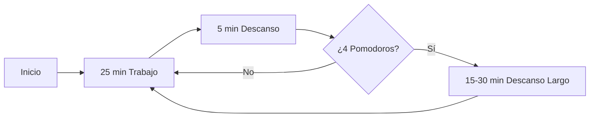
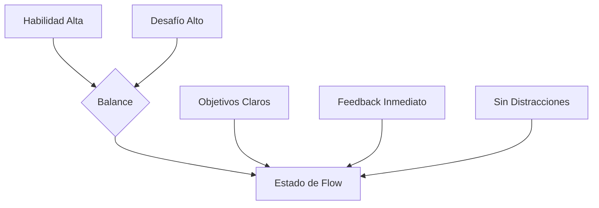
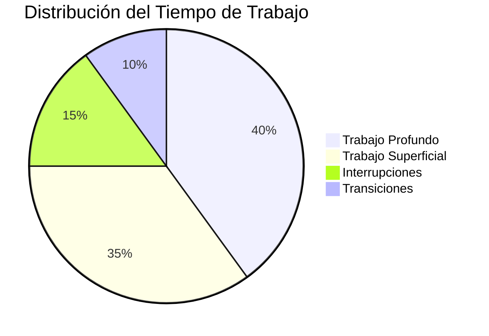

# Técnicas de Concentración 🧠⚡

> [!quote] "La concentración es la clave que abre todas las puertas del conocimiento y la productividad" - Anónimo

## Fundamentos de la Concentración 📚

> [!info] Definición La concentración es la capacidad de dirigir y mantener la atención de manera sostenida hacia una tarea específica, filtrando las distracciones tanto internas como externas.

### Tipos de Atención

> [!tip] Clasificación de la Atención
> 
> - **Atención Sostenida**: Mantener el foco durante períodos largos
> - **Atención Selectiva**: Filtrar información relevante vs irrelevante
> - **Atención Dividida**: Gestionar múltiples tareas simultáneamente
> - **Atención Ejecutiva**: Control consciente de los procesos atencionales

## Técnicas Principales 🎯

### 1. Técnica Pomodoro 🍅

> [!tip] Implementación
> 
> - **25 minutos** de trabajo concentrado
> - **5 minutos** de descanso
> - Cada 4 pomodoros: descanso largo de **15-30 minutos**
> - Registrar interrupciones sin atenderlas inmediatamente

### 2. Técnica de los Dos Minutos ⏱️

> [!info] Principio Si una tarea toma menos de 2 minutos, hazla inmediatamente. Si toma más, program­ala o delégala.

### 3. Bloqueo de Tiempo (Time Blocking) 📅

> [!tip] Estrategia
> 
> - Asignar bloques específicos de tiempo a tareas concretas
> - Agrupar tareas similares (batch processing)
> - Incluir buffers entre actividades
> - Respetar religiosamente los bloques programados

### 4. Técnica 52-17 💪

> [!info] Investigación Basada en estudios de DeskTime: los empleados más productivos trabajan **52 minutos** y descansan **17 minutos**.

## Estrategias Avanzadas 🚀

### Gestión de Distracciones

> [!warning] Principales Distractores
> 
> - **Tecnológicos**: Notificaciones, redes sociales, emails
> - **Ambientales**: Ruido, interrupciones, desorden
> - **Internos**: Pensamientos intrusivos, preocupaciones, fatiga
> - **Multitarea**: Cambio constante entre actividades

> [!tip] Soluciones Prácticas
> 
> - Modo avión o Do Not Disturb
> - Espacio de trabajo organizado y limpio
> - Lista de "parking" para pensamientos intrusivos
> - Single-tasking como regla fundamental

### Técnicas de Respiración para la Concentración 🫁

> [!info] Respiración 4-7-8
> 
> 1. Inhala por la nariz durante **4 segundos**
> 2. Mantén la respiración por **7 segundos**
> 3. Exhala por la boca durante **8 segundos**
> 4. Repite 3-4 ciclos antes de iniciar trabajo concentrado

### Estado de Flow 🌊

> [!tip] Condiciones para el Flow
> 
> - **Objetivos claros** y retroalimentación inmediata
> - **Balance** entre desafío y habilidad
> - **Eliminación** de distracciones
> - **Concentración total** en la actividad presente

## Herramientas y Recursos 🛠️

### Aplicaciones Recomendadas

> [!tip] Tecnología para la Concentración
> 
> - **Forest/Be Focused**: Apps de Pomodoro
> - **Freedom/Cold Turkey**: Bloqueadores de distracciones
> - **Brain.fm/Noisli**: Sonidos para concentración
> - **RescueTime**: Seguimiento de tiempo automático

### Configuración del Entorno

> [!info] Espacio Óptimo
> 
> - **Iluminación**: Natural preferentemente, evitar reflejos
> - **Temperatura**: 20-22°C para máximo rendimiento
> - **Sonido**: Silencio o ruido blanco/música instrumental
> - **Ergonomía**: Silla y mesa adecuadas para evitar fatiga

## Factores Fisiológicos 🧬

### Cronobiología y Concentración

> [!info] Ritmos Circadianos
> 
> - **Peak matutino** (9:00-11:00): Tareas que requieren máxima concentración
> - **Valle post-almuerzo** (13:00-15:00): Tareas rutinarias o descanso
> - **Second wind** (17:00-19:00): Revisión y tareas creativas

### Nutrición para el Cerebro 🧠

> [!tip] Alimentos que Mejoran la Concentración
> 
> - **Omega-3**: Pescado, nueces, semillas de chía
> - **Antioxidantes**: Arándanos, chocolate negro, té verde
> - **Proteínas**: Huevos, legumbres, quinoa
> - **Hidratación**: 2-3 litros de agua diarios

> [!warning] Evitar
> 
> - Azúcares refinados (causan picos y caídas de energía)
> - Exceso de cafeína (puede generar ansiedad)
> - Comidas pesadas antes de sesiones de concentración

## Medición y Seguimiento 📊

### Métricas de Concentración

> [!info] Indicadores Clave
> 
> - **Tiempo en estado de flow**: Minutos/horas sin interrupciones
> - **Número de distracciones**: Registro diario
> - **Productividad por sesión**: Tareas completadas vs tiempo invertido
> - **Calidad del output**: Evaluación subjetiva del trabajo realizado

## Troubleshooting 🔧

### Problemas Comunes y Soluciones

> [!warning] Fatiga Mental **Síntomas**: Pérdida progresiva de concentración, errores frecuentes **Solución**: Descansos regulares, ejercicio físico, técnicas de recuperación

> [!warning] Procrastinación **Síntomas**: Evitación de tareas importantes, búsqueda de distracciones **Solución**: Técnica de los 2 minutos, reward system, accountability partner

> [!warning] Sobrecarga Cognitiva **Síntomas**: Sensación de abrumamiento, dificultad para priorizar **Solución**: Brain dump, matriz de Eisenhower, single-tasking estricto

## Referencias y Conexiones 🔗

> [!quote] Enlaces a Otras Notas
> 
> - [[Método 1 - Pomodoro]] - Profundización en la técnica base
> - [[Deep Work]] - Filosofía del trabajo profundo y concentrado
> - [[Mindfulness]] - Prácticas de atención plena para mejorar el foco
> - [[Hábitos de Estudio]] - Rutinas que facilitan la concentración
> - [[Gestión del Tiempo]] - Estrategias sin dependencia tecnológica
> - [[Hábitos y Rutinas Saludables]] - Bases fisiológicas de la concentración
> - [[Productividad Digital]] - Herramientas tecnológicas para el foco
> - [[Organización Física del Espacio]] - Ambiente óptimo para concentrarse

## Recursos Adicionales 📖

> [!info] Lecturas Recomendadas
> 
> - "Deep Work" - Cal Newport
> - "The Power of Now" - Eckhart Tolle
> - "Peak Performance" - Brad Stulberg & Steve Magness
> - "The Organized Mind" - Daniel J. Levitin

---

#concentración #productividad #técnicas-de-estudio #atención #focus #deep-work #pomodoro #mindfulness #gestión-del-tiempo #optimización-cognitiva