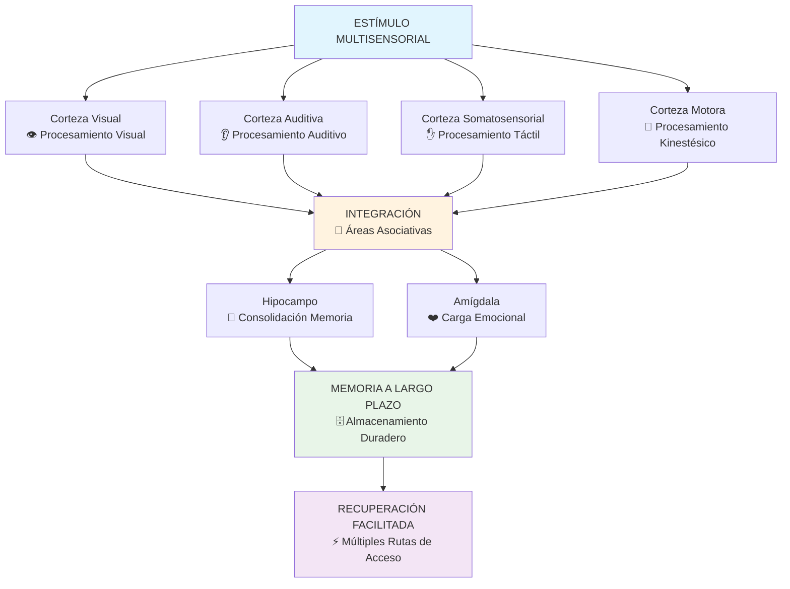

# Aprendizaje Multisensorial 🧠

> [!quote] "Dime y lo olvido, enséñame y lo recuerdo, involúcrame y lo aprendo." - Benjamin Franklin

## ¿Qué es el Aprendizaje Multisensorial? 🎯

> [!info] **Definición** El aprendizaje multisensorial es un enfoque educativo que involucra múltiples sentidos simultáneamente para facilitar la adquisición, procesamiento y retención de información. Se basa en el principio de que cuando el cerebro recibe información a través de varios canales sensoriales, se crean más conexiones neuronales, lo que resulta en un aprendizaje más profundo, duradero y efectivo.

> [!tip] **Principio Fundamental** ✨ Nuestro cerebro está diseñado para procesar información de manera multisensorial. Cuando integramos vista, oído, tacto, movimiento y otros sentidos en el proceso de aprendizaje, activamos múltiples redes neuronales que se refuerzan mutuamente, creando una "autopista de aprendizaje" más robusta y eficiente.

## La Neurociencia del Aprendizaje Multisensorial



## Los 7 Canales Sensoriales del Aprendizaje

> [!warning] **1. Canal Visual** 👁️
> 
> ### Características del Procesamiento:
> 
> - **Velocidad**: Procesa información 60,000 veces más rápido que el texto
> - **Memoria**: Retiene el 65% de información visual después de 3 días
> - **Patrones**: Excelente para reconocer formas, colores y relaciones espaciales
> 
> ### Técnicas de Activación:
> 
> - **Mapas mentales** con colores y símbolos
> - **Diagramas de flujo** para procesos complejos
> - **Infografías** que resumen conceptos clave
> - **Código de colores** para categorizar información
> - **Esquemas visuales** que muestran relaciones
> 
> ### Herramientas Recomendadas:
> 
> |Herramienta|Propósito|Ventaja|
> |---|---|---|
> |**MindMeister**|Mapas mentales digitales|Colaboración en tiempo real|
> |**Canva**|Infografías y presentaciones|Templates profesionales|
> |**Excalidraw**|Diagramas a mano alzada|Naturalidad y flexibilidad|
> |**Miro**|Pizarras visuales colaborativas|Brainstorming visual|

> [!tip] **2. Canal Auditivo** 👂
> 
> ### Fortalezas del Procesamiento:
> 
> - **Secuencial**: Excelente para información temporal y narrativa
> - **Emocional**: Conecta fuertemente con el sistema límbico
> - **Social**: Facilita el aprendizaje colaborativo y discusión
> 
> ### Técnicas de Activación:
> 
> - **Lectura en voz alta** para activar procesamiento dual
> - **Grabaciones propias** explicando conceptos
> - **Música de fondo** apropiada para concentración
> - **Debates y discusiones** estructuradas
> - **Podcasts educativos** sobre temas de interés
> - **Rimas y ritmos** para memorización
> 
> ### Estrategias Específicas:
> 
> ```mermaid
> mindmap
>   root((Aprendizaje Auditivo))
>     Técnicas de Memorización
>       Acrósticos musicales
>       Rimas pedagógicas
>       Repetición rítmica
>     Tecnología
>       Apps de texto-a-voz
>       Grabadoras digitales
>       Software de síntesis de voz
>     Ambiente
>       Música barroca (60-70 BPM)
>       Sonidos de naturaleza
>       Silencio estratégico
> ```

> [!info] **3. Canal Kinestésico-Táctil** ✋
> 
> ### Principios del Aprendizaje Táctil:
> 
> - **Learning by Doing**: La experiencia directa genera comprensión profunda
> - **Memoria Muscular**: Las habilidades motoras se consolidan diferente
> - **Conexión Emocional**: El tacto activa respuestas emocionales fuertes
> 
> ### Técnicas de Implementación:
> 
> - **Manipulables físicos**: Bloques, fichas, materiales concretos
> - **Escritura a mano**: Activación de áreas motoras del cerebro
> - **Experimentos hands-on**: Laboratorios y práctica directa
> - **Role-playing**: Representación física de conceptos
> - **Construcción de modelos**: Crear representaciones 3D
> 
> ### Beneficios Neurológicos:
> 
> - Activación de la **corteza motora primaria**
> - Fortalecimiento de conexiones **cerebelo-corteza**
> - Mejora de la **memoria procedural**
> - Integración **sensorio-motora** más robusta

> [!warning] **4. Canal Olfativo** 👃
> 
> ### Neurociencia del Olfato:
> 
> - **Conexión directa**: Único sentido conectado directamente al sistema límbico
> - **Memoria autobiográfica**: Poderoso disparador de recuerdos episódicos
> - **Procesamiento inconsciente**: Influye en estado de ánimo y concentración
> 
> ### Aplicaciones en Aprendizaje:
> 
> - **Aromaterapia educativa**: Aceites esenciales específicos para concentración
>     - **Romero**: Mejora memoria y concentración
>     - **Lavanda**: Reduce ansiedad y estrés
>     - **Menta**: Aumenta alerta y energía
>     - **Limón**: Mejora estado de ánimo y focus
> - **Asociaciones olfativas**: Usar mismo aroma durante estudio y examen
> - **Ambientes diferenciados**: Aromas específicos para diferentes materias

> [!tip] **5. Canal Gustativo** 👅
> 
> ### Conexiones Neurológicas:
> 
> - **Sistema límbico**: Conexión directa con emociones y memoria
> - **Neurotransmisores**: Ciertos sabores estimulan dopamina y serotonina
> - **Atención sostenida**: Sabores específicos pueden mantener alerta
> 
> ### Estrategias Prácticas:
> 
> - **Snacks cognitivos**: Alimentos que mejoran función cerebral
>     - **Nueces**: Omega-3 para memoria
>     - **Chocolate negro**: Flavonoides para concentración
>     - **Arándanos**: Antioxidantes para función cognitiva
> - **Hidratación funcional**: Tés e infusiones con propiedades específicas
> - **Asociaciones gustativas**: Sabor específico durante estudio de cada materia

> [!info] **6. Canal Propioceptivo** 🤸‍♂️
> 
> ### Definición:
> 
> Conciencia de la posición y movimiento del cuerpo en el espacio
> 
> ### Aplicaciones Educativas:
> 
> - **Caminar mientras estudia**: Mejora circulación cerebral y creatividad
> - **Posiciones de estudio**: Diferentes posturas para diferentes tipos de trabajo
> - **Ejercicios de balance**: Integración de hemisferios cerebrales
> - **Movimientos rítmicos**: Facilitan memorización y comprensión
> 
> ### Técnicas Específicas:
> 
> - **Standing desk**: Alternancia entre sentado y parado
> - **Stability ball**: Activación de core y atención sostenida
> - **Fidget tools**: Objetos para mantener actividad motora fina
> - **Brain gym**: Ejercicios específicos para integración cerebral

> [!warning] **7. Canal Vestibular** 🌀
> 
> ### Función en el Aprendizaje:
> 
> - **Equilibrio cognitivo**: Balance físico mejora balance mental
> - **Atención sostenida**: Sistema vestibular saludable mejora concentración
> - **Integración sensorial**: Coordina información de todos los sentidos
> 
> ### Actividades de Estimulación:
> 
> - **Movimientos rotatorios**: Giros controlados para activación
> - **Cambios de plano**: Movimientos en diferentes direcciones
> - **Actividades de balance**: Yoga, tai chi, equilibrio en una pierna
> - **Columpio terapéutico**: Movimiento rítmico para integración

## Estilos de Aprendizaje vs Enfoque Multisensorial

> [!tip] **Superando el Mito de los Estilos de Aprendizaje** 🔄
> 
> ### La Falacia de los Estilos Únicos:
> 
> |Creencia Tradicional|Realidad Neurocientífica|
> |---|---|
> |"Soy aprendiz visual"|Todos procesamos mejor con múltiples sentidos|
> |"Solo aprendo escuchando"|El cerebro integra naturalmente información multisensorial|
> |"Necesito mover para aprender"|El movimiento beneficia a todos, no solo a algunos|
> |"Tengo un solo estilo"|Todos tenemos preferencias, pero capacidad multisensorial|
> 
> ### Ventajas del Enfoque Multisensorial:
> 
> - **Redundancia beneficiosa**: Múltiples rutas para la misma información
> - **Compensación automática**: Si un canal falla, otros compensan
> - **Engagement completo**: Mayor activación cerebral y atención
> - **Transferencia mejorada**: Mejor aplicación en contextos diversos

## Técnicas Multisensoriales por Tipo de Contenido

> [!info] **Aprendizaje de Idiomas** 🌍
> 
> ### Estrategia Integrada VARK-T:
> 
> - **Visual**: Flashcards con imágenes, subtítulos, mapas conceptuales
> - **Auditivo**: Conversaciones, podcasts, música en el idioma objetivo
> - **Kinestésico**: Gestos para vocabulario, escritura manual, dramatización
> - **Táctil**: Texturas asociadas a palabras, objetos reales para vocabulario
> 
> ### Secuencia de Aprendizaje Multisensorial:
> 
> ```mermaid
> flowchart LR
>     A[Ver la Palabra<br/>👁️ Visual] --> B[Escuchar Pronunciación<br/>👂 Auditivo]
>     B --> C[Repetir en Voz Alta<br/>🗣️ Motor-Auditivo]
>     C --> D[Escribir la Palabra<br/>✍️ Kinestésico]
>     D --> E[Asociar con Imagen<br/>🖼️ Visual-Semántico]
>     E --> F[Usar en Contexto<br/>💬 Pragmático]
>     F --> G[Revisar Multisensorial<br/>🔄 Integración]
>     
>     style G fill:#99ff99
> ```

> [!warning] **Matemáticas y Ciencias** 🔢
> 
> ### Enfoque Concreto → Abstracto:
> 
> #### **Nivel 1: Manipulativo Concreto**
> 
> - **Bloques matemáticos**: Para conceptos de número y operaciones
> - **Experimentos físicos**: Para principios científicos
> - **Modelos 3D**: Para geometría y estructuras moleculares
> 
> #### **Nivel 2: Representacional**
> 
> - **Diagramas y gráficos**: Visualización de relaciones
> - **Simulaciones digitales**: Experimentos virtuales
> - **Mapas conceptuales**: Conexiones entre ideas
> 
> #### **Nivel 3: Abstracto**
> 
> - **Símbolos y fórmulas**: Representación matemática pura
> - **Teorías y principios**: Conceptos generalizables
> - **Aplicaciones complejas**: Resolución de problemas avanzados
> 
> ### Técnicas Específicas:
> 
> - **Singing Math**: Canciones para memorizar fórmulas
> - **Body Math**: Usar el cuerpo para representar conceptos
> - **Color Coding**: Códigos de color para diferentes operaciones
> - **Story Problems**: Narrativas que contextualizan problemas

> [!tip] **Historia y Ciencias Sociales** 📚
> 
> ### Estrategia de Inmersión Temporal:
> 
> - **Líneas de tiempo táctiles**: Construir físicamente cronologías
> - **Dramatización histórica**: Role-playing de eventos importantes
> - **Música de época**: Sonidos y música del período estudiado
> - **Artefactos réplicas**: Objetos para conexión táctil con el pasado
> - **Mapas interactivos**: Exploración geográfica multisensorial
> 
> ### Técnicas de Memorización Histórica:
> 
> - **Method of Loci**: Asociar eventos con lugares familiares
> - **Storytelling multisensorial**: Narrativas que involucran todos los sentidos
> - **Timeline walking**: Caminar una línea temporal física
> - **Historical cooking**: Preparar comidas de diferentes épocas

## Tecnología para Aprendizaje Multisensorial

> [!info] **Realidad Virtual y Aumentada** 🥽
> 
> ### Aplicaciones Educativas:
> 
> - **Google Earth VR**: Exploración geográfica inmersiva
> - **Anatomía en 3D**: Exploración del cuerpo humano
> - **Simulaciones históricas**: Caminar por ciudades antiguas
> - **Laboratorios virtuales**: Experimentos seguros y repetibles
> 
> ### Beneficios Multisensoriales:
> 
> - **Presencia**: Sensación de "estar ahí" mejora retención
> - **Interactividad**: Manipulación directa de objetos virtuales
> - **Seguridad**: Exploración sin riesgos físicos
> - **Repetibilidad**: Experiencias idénticas para todos los estudiantes

> [!warning] **Inteligencia Artificial Multisensorial** 🤖
> 
> ### Tendencias Emergentes:
> 
> - **Tutores AI adaptativos**: Ajuste automático a preferencias sensoriales
> - **Síntesis de voz emocional**: Narración con matices emocionales
> - **Generación de contenido multisensorial**: Creación automática de experiencias
> - **Análisis de engagement**: Monitoreo de respuestas multisensoriales
> 
> ### Herramientas Actuales:
> 
> - **Voice Dream Reader**: Lectura con síntesis de voz avanzada
> - **Seeing AI**: Descripción audible del mundo visual
> - **SoundScape**: Navegación auditiva del espacio
> - **Be My Eyes**: Asistencia visual mediante IA

## Diseño de Ambientes Multisensoriales

> [!tip] **Optimización del Espacio Físico** 🏠
> 
> ### Elementos Visuales:
> 
> - **Iluminación natural**: Luz natural mejora concentración y bienestar
> - **Paleta de colores**:
>     - **Azul**: Calma y concentración
>     - **Verde**: Equilibrio y frescura
>     - **Amarillo**: Energía y creatividad
> - **Organización visual**: Espacios despejados reducen sobrecarga cognitiva
> 
> ### Elementos Auditivos:
> 
> - **Control de ruido**: Paneles absorbentes para reducir distracciones
> - **Música funcional**: Soundscapes específicos para diferentes actividades
> - **Zonas de silencio**: Espacios para trabajo que requiere concentración profunda
> 
> ### Elementos Táctiles:
> 
> - **Texturas variadas**: Superficies diferentes para estimulación táctil
> - **Temperatura controlada**: 18-22°C óptimo para aprendizaje
> - **Ergonomía**: Mobiliario que respeta la anatomía y movimiento natural
> 
> ### Configuración por Zonas:
> 
> ```mermaid
> graph TD
>     A[ESPACIO MULTISENSORIAL] --> B[Zona de Concentración<br/>🔍 Silencio + Luz focalizada]
>     A --> C[Zona Colaborativa<br/>👥 Sonido ambiente + Flexibilidad]
>     A --> D[Zona Creativa<br/>🎨 Estímulos diversos + Movimiento]
>     A --> E[Zona de Descanso<br/>😌 Confort + Relajación]
>     
>     style B fill:#e1f5fe
>     style C fill:#f3e5f5
>     style D fill:#fff3e0
>     style E fill:#e8f5e8
> ```

## Técnicas de Memorización Multisensorial

> [!warning] **Método de Loci Multisensorial** 🏛️
> 
> ### Versión Tradicional vs Multisensorial:
> 
> |Elemento|Tradicional|Multisensorial|
> |---|---|---|
> |**Lugares**|Solo visualización|Vista + sonidos + olores + texturas|
> |**Información**|Imágenes mentales|Experiencias sensoriales completas|
> |**Recorrido**|Mental estático|Físico cuando es posible|
> |**Asociaciones**|Lógicas únicamente|Emocionales + sensoriales + lógicas|
> 
> ### Implementación Paso a Paso:
> 
> 1. **Seleccionar ruta física familiar** (casa, escuela, barrio)
> 2. **Identificar puntos específicos** con características sensoriales únicas
> 3. **Asociar información con experiencias multisensoriales** en cada punto
> 4. **Practicar recorrido físico** mientras se repasa mentalmente
> 5. **Crear historias multisensoriales** que conecten los puntos

> [!tip] **Sistema de Codificación Multisensorial** 🎨
> 
> ### Códigos por Tipo de Información:
> 
> #### **Información Factual:**
> 
> - **Color**: Diferentes colores para diferentes categorías
> - **Sonido**: Ritmos específicos para diferentes tipos de datos
> - **Movimiento**: Gestos únicos para conceptos importantes
> - **Ubicación**: Lugares físicos para diferentes temas
> 
> #### **Información Conceptual:**
> 
> - **Metáforas sensoriales**: Conceptos abstractos como experiencias concretas
> - **Sinestesia artificial**: Asociar conceptos con múltiples sentidos
> - **Narrativas inmersivas**: Historias que involucran todos los sentidos
> 
> ### Ejemplo - Aprender el Sistema Periódico:
> 
> - **Visual**: Colores por familias de elementos
> - **Auditivo**: Sonidos únicos para cada elemento
> - **Kinestésico**: Movimientos que representan propiedades
> - **Táctil**: Texturas que representan estados de la materia
> - **Espacial**: Ubicación física representa posición en la tabla

## Evaluación en Entornos Multisensoriales

> [!info] **Métodos de Evaluación Adaptativos** 📊
> 
> ### Formatos Múltiples:
> 
> - **Presentaciones orales**: Para procesadores auditivos fuertes
> - **Proyectos visuales**: Infografías, mapas mentales, presentaciones
> - **Demostraciones prácticas**: Para aprendizaje kinestésico
> - **Portfolios multimedio**: Combinación de formatos diversos
> 
> ### Herramientas de Evaluación:
> 
> |Herramienta|Sentidos Involucrados|Aplicación|
> |---|---|---|
> |**Flipgrid**|Visual + Auditivo|Presentaciones en video|
> |**Scratch**|Visual + Kinestésico|Programación visual|
> |**Padlet**|Visual + Textual|Colaboración visual|
> |**VoiceThread**|Auditivo + Visual|Discusiones multimedia|
> 
> ### Rúbricas Multisensoriales:
> 
> - **Criterios diferenciados**: Evaluación según fortalezas sensoriales
> - **Múltiples evidencias**: Diferentes tipos de demostración de conocimiento
> - **Autoevaluación sensorial**: Reflexión sobre propio proceso multisensorial

## Neuroplasticidad y Aprendizaje Multisensorial

> [!warning] **Ventana de Oportunidad** 🧠
> 
> ### Períodos Críticos:
> 
> - **0-3 años**: Máxima plasticidad multisensorial
> - **3-7 años**: Integración sensorial fundamental
> - **7-25 años**: Refinamiento y especialización
> - **25+ años**: Plasticidad continua pero más enfocada
> 
> ### Factores que Mejoran Plasticidad:
> 
> - **Novedad**: Experiencias nuevas estimulan crecimiento neuronal
> - **Desafío**: Dificultad apropiada promueve adaptación
> - **Repetición espaciada**: Consolidación de conexiones multisensoriales
> - **Emociones positivas**: Neurotransmisores facilitan plasticidad
> 
> ### Ejercicios de Neuroplasticidad:
> 
> ```mermaid
> mindmap
>   root((Ejercicios Neuroplasticidad))
>     Integración Hemisférica
>       Escritura con mano no dominante
>       Ejercicios cruzados
>       Música mientras se estudia
>     Nuevas Conexiones
>       Aprender instrumento musical
>       Idiomas extranjeros
>       Actividades artísticas
>     Desafío Cognitivo
>       Juegos de estrategia
>       Puzzles multisensoriales
>       Improvisación creativa
> ```

## Aplicaciones Específicas por Edad

> [!tip] **Primera Infancia (0-6 años)** 👶
> 
> ### Estrategias Fundamentales:
> 
> - **Exploración libre**: Permitir manipulación de objetos diversos
> - **Canciones de aprendizaje**: Combinar melodía, ritmo y movimiento
> - **Cuentos interactivos**: Narrativas con elementos sensoriales
> - **Juego sensorial**: Actividades que involucran múltiples sentidos
> 
> ### Actividades Específicas:
> 
> - **Cajas sensoriales**: Diferentes texturas, temperaturas, sonidos
> - **Pintura con dedos**: Experiencia táctil y visual combinada
> - **Cocina educativa**: Medidas, ciencia y experiencia sensorial
> - **Jardinería infantil**: Conexión con naturaleza multisensorial

> [!info] **Infancia (6-12 años)** 🧒
> 
> ### Desarrollo de Habilidades Integradas:
> 
> - **Proyectos STEAM**: Ciencia, tecnología, ingeniería, arte y matemáticas
> - **Aprendizaje basado en juegos**: Gamificación multisensorial
> - **Experimentos hands-on**: Ciencia a través de la experiencia
> - **Arte integrado**: Expresión creativa en todas las materias
> 
> ### Herramientas Recomendadas:
> 
> - **Bloques de construcción educativos**: LEGO Education, K'NEX
> - **Instrumentos musicales simples**: Para integración rítmica
> - **Microscopios y lupas**: Exploración visual detallada
> - **Kits de ciencia**: Experimentos seguros y educativos

> [!warning] **Adolescencia (12-18 años)** 👦👧
> 
> ### Adaptación a Cambios Cerebrales:
> 
> - **Proyectos colaborativos**: Aprovechamiento de desarrollo social
> - **Tecnología integrada**: Uso consciente de herramientas digitales
> - **Aprendizaje basado en problemas**: Conexión con intereses personales
> - **Expresión creativa**: Múltiples formas de demostrar conocimiento
> 
> ### Consideraciones Especiales:
> 
> - **Ritmos circadianos**: Horarios que respetan patrones naturales
> - **Identidad en desarrollo**: Opciones para explorar diferentes enfoques
> - **Presión social**: Ambientes seguros para experimentación
> - **Pensamiento abstracto**: Puentes entre concreto y abstracto

> [!tip] **Adultos (18+ años)** 👨👩
> 
> ### Aprendizaje Multisensorial Profesional:
> 
> - **Simulaciones de trabajo**: Práctica en entornos realistas
> - **Mentoring multisensorial**: Observación, práctica y feedback
> - **Conferences inmersivas**: Experiencias de aprendizaje completas
> - **Microlearning sensorial**: Pequeñas dosis con máximo impacto
> 
> ### Estrategias para Neuroplasticidad Adulta:
> 
> - **Cross-training sensorial**: Usar sentidos no habituales
> - **Ambientes de aprendizaje variados**: Cambios de contexto regulares
> - **Asociaciones emocionales**: Conectar aprendizaje con experiencias positivas
> - **Práctica distribuida**: Espaciamiento para consolidación

## Técnica de Estudio: Método SENSES

> [!tip] **Método SENSES para Aprendizaje Multisensorial** 🌈
> 
> **S** - **See** (Ver): Incorporar elementos visuales - diagramas, colores, imágenes **E** - **Engage** (Involucrar): Participación activa física y mental **N** - **Note** (Anotar): Escritura a mano para procesamiento kinestésico **S** - **Sound** (Sonido): Elementos auditivos - lectura en voz alta, música **E** - **Experience** (Experimentar): Conexión táctil y manipulativa **S** - **Synthesize** (Sintetizar): Integrar todos los sentidos en comprensión unificada
> 
> ### Implementación por Fases:
> 
> 1. **Preparación Multisensorial (5 min)**
>     - Organizar espacio con elementos visuales
>     - Preparar música/sonidos apropiados
>     - Tener materiales manipulativos disponibles
> 2. **Inmersión Sensorial (20-30 min)**
>     - Ver: Revisar material visual (diagramas, videos, imágenes)
>     - Escuchar: Audio del contenido o explicación en voz alta
>     - Tocar: Manipular objetos relacionados o escribir notas
> 3. **Procesamiento Activo (15-20 min)**
>     - Crear mapa mental multisensorial
>     - Explicar en voz alta mientras se mueve
>     - Asociar conceptos con experiencias sensoriales
> 4. **Síntesis Integrativa (10 min)**
>     - Crear resumen que involucre múltiples sentidos
>     - Establecer conexiones entre diferentes modalidades
>     - Planificar repaso multisensorial
> 
> ### Mnemotécnica Visual:
> 
> Imagina un **jardín de los sentidos** donde cada planta representa un sentido. Para que el jardín florezca (aprendizaje efectivo), necesitas regar todas las plantas (activar todos los sentidos) regularmente. El jardinero experto (estudiante multisensorial) sabe que cada planta necesita atención específica, pero el ecosistema funciona mejor cuando todas prosperan juntas.

## Casos de Estudio en Aprendizaje Multisensorial

> [!info] **Caso 1: Método Montessori** 🌱
> 
> **Principios Multisensoriales:**
> 
> - **Materiales autocorrectivos**: Feedback inmediato a través de múltiples sentidos
> - **Progresión de concreto a abstracto**: Manipulación física antes de conceptos
> - **Ambiente preparado**: Espacios diseñados para exploración sensorial
> - **Períodos sensibles**: Aprovechamiento de ventanas de desarrollo
> 
> **Resultados Documentados:**
> 
> - Mayor retención de conceptos matemáticos y científicos
> - Desarrollo superior de habilidades motoras finas
> - Mejor integración sensorial y regulación emocional
> - Creatividad y pensamiento divergente más desarrollados

> [!warning] **Caso 2: Programa Orton-Gillingham** 📖
> 
> **Enfoque para Dislexia:**
> 
> - **VAKT**: Visual-Auditivo-Kinestésico-Táctil simultáneo
> - **Secuenciación estructurada**: Progresión lógica y multisensorial
> - **Enseñanza explícita**: Cada elemento enseñado conscientemente
> - **Práctica multisensorial**: Repetición a través de múltiples canales
> 
> **Técnicas Específicas:**
> 
> - **Trazado aéreo**: Escribir letras en el aire mientras se pronuncian
> - **Texturas de letras**: Tocar letras de lija mientras se aprenden
> - **Códigos de color**: Diferentes colores para vocales y consonantes
> - **Patrones rítmicos**: Golpear sílabas mientras se leen palabras
> 
> **Efectividad Comprobada:**
> 
> - Mejora significativa en decodificación de palabras
> - Aumento en velocidad y fluidez de lectura
> - Reducción de errores de ortografía
> - Mayor confianza y autoestima en tareas de lectoescritura

## Desafíos y Limitaciones del Aprendizaje Multisensorial

> [!warning] **Sobrecarga Sensorial** ⚠️
> 
> ### Signos de Sobrecarga:
> 
> - **Fatiga prematura**: Cansancio excesivo durante sesiones de aprendizaje
> - **Disminución de atención**: Distractibilidad aumentada
> - **Irritabilidad**: Respuestas emocionales exageradas
> - **Evitación**: Resistencia a actividades multisensoriales
> 
> ### Estrategias de Prevención:
> 
> - **Introducción gradual**: Añadir sentidos progresivamente
> - **Descansos sensoriales**: Períodos de estimulación mínima
> - **Personalización**: Adaptar según tolerancia individual
> - **Monitoreo constante**: Observar señales de saturación
> 
> ### Protocolo de Ajuste:
> 
> ```mermaid
> flowchart TD
>     A[Detectar Sobrecarga] --> B{Identificar Causa}
>     B --> C[Demasiados Estímulos]
>     B --> D[Estímulos Inapropiados]
>     B --> E[Duración Excesiva]
>     
>     C --> F[Reducir Número de Sentidos]
>     D --> G[Cambiar Tipo de Estímulos]
>     E --> H[Acortar Sesiones]
>     
>     F --> I[Reevaluar y Ajustar]
>     G --> I
>     H --> I
>     
>     I --> J[Retomar Gradualmente]
>     
>     style A fill:#ff9999
>     style I fill:#99ff99
>     style J fill:#99ccff
> ```

> [!info] **Diferencias Individuales** 👥
> 
> ### Factores de Variabilidad:
> 
> - **Procesamiento sensorial**: Hiper/hiposensibilidades específicas
> - **Preferencias culturales**: Normas culturales sobre estimulación sensorial
> - **Experiencias previas**: Historia de asociaciones sensoriales
> - **Condiciones neurológicas**: Autismo, TDAH, procesamiento sensorial
> 
> ### Estrategias de Personalización:
> 
> - **Perfil sensorial individual**: Evaluación inicial de preferencias y sensibilidades
> - **Opciones múltiples**: Diferentes modalidades para el mismo contenido
> - **Autorregulación**: Enseñar a identificar y comunicar necesidades
> - **Flexibilidad**: Sistemas adaptativos que respondan a feedback

## Investigación Actual y Futuras Direcciones

> [!tip] **Tendencias de Investigación** 🔬
> 
> ### Áreas de Investigación Activa:
> 
> - **Neuroimaging multisensorial**: fMRI y EEG durante aprendizaje integrado
> - **Realidad virtual educativa**: Inmersión completa controlada
> - **Interfaces cerebro-computadora**: Interacción directa neuronal
> - **Medicina personalizada educativa**: Adaptación basada en genética y neurobiología
> 
> ### Hallazgos Recientes (2020-2024):
> 
> - **Sincronización neural**: Múltiples sentidos crean patrones de activación sincronizados
> - **Transferencia mejorada**: Aprendizaje multisensorial mejora generalización
> - **Memoria episódica**: Integración sensorial fortalece memoria autobiográfica
> - **Creatividad emergente**: Combinación sensorial estimula pensamiento divergente

## Implementación Práctica en Diferentes Contextos

> [!warning] **Educación Formal** 🏫
> 
> ### Estrategias para Docentes:
> 
> - **Lesson design multisensorial**: Planificación que incluya múltiples canales
> - **Assessment diversificado**: Evaluaciones que permitan diferentes expresiones
> - **Classroom management sensorial**: Gestión del ambiente físico y estimular
> - **Professional development**: Formación continua en técnicas multisensoriales
> 
> ### Implementación por Materias:
> 
> |Materia|Estrategias Específicas|Herramientas|
> |---|---|---|
> |**Matemáticas**|Manipulativos + visualización + ritmo|Bloques, apps interactivas, canciones|
> |**Ciencias**|Experimentos + simulaciones + discusión|Laboratorios, VR, debates|
> |**Lengua**|Lectura + escritura + dramatización|Textos táctiles, teatro, podcasts|
> |**Historia**|Timeline físico + roleplay + multimedia|Artefactos, disfraces, documentales|
> |**Arte**|Multimedia + experimentación + reflexión|Diversos materiales, crítica grupal|

> [!info] **Educación en Línea** 💻
> 
> ### Desafíos Únicos:
> 
> - **Limitaciones técnicas**: Dependencia de dispositivos del estudiante
> - **Falta de tactilidad**: Dificultad para experiencias hands-on
> - **Distracción del entorno**: Menos control sobre ambiente sensorial
> - **Fatiga de pantalla**: Sobrecarga visual prolongada
> 
> ### Soluciones Innovadoras:
> 
> - **Kits de materiales enviados**: Elementos físicos para manipulación
> - **Realidad aumentada**: Superposición digital sobre mundo físico
> - **Sincronización de actividades**: Estudiantes realizan acciones simultáneas
> - **Breakout rooms sensoriales**: Grupos pequeños para actividades específicas
> 
> ### Herramientas Recomendadas:
> 
> - **Nearpod**: Lecciones interactivas con múltiples modalidades
> - **Flipgrid**: Videos que combinan visual y auditivo
> - **Padlet**: Colaboración visual y multimedia
> - **Mentimeter**: Participación en tiempo real multisensorial

## Referencias y Conexiones

> [!quote] **Referencias a Otras Notas**
> 
> - [[Neurociencia del Aprendizaje]] - Fundamentos neurocientíficos del procesamiento multisensorial
> - [[Técnicas de Visualización]] - Métodos específicos para el canal visual
> - [[Aprendizaje con Música]] - Integración del canal auditivo-musical
> - [[Técnicas de Concentración]] - Mantener focus en experiencias multisensoriales
> - [[Metacognición]] - Conciencia sobre procesos multisensoriales propios
> - [[Aprendizaje Colaborativo]] - Componente social del aprendizaje multisensorial
> - [[Design Thinking]] - Enfoque multisensorial para resolución creativa
> - [[Gamificación Colaborativa]] - Elementos de juego multisensoriales
> - [[Habilidades Sociales]] - Comunicación e interacción multisensorial
> - [[Inteligencia Emocional]] - Procesamiento emocional a través de múltiples sentidos
> - [[Creatividad y Pensamiento Divergente]] - Estimulación multisensorial para creatividad
> - [[Mindfulness]] - Conciencia sensorial plena en el aprendizaje

## Notas Recomendadas para Profundizar

> [!info] **Prerrequisitos y Complementos** 📋
> 
> ### **Fundamentos Necesarios:**
> 
> - [[Neurociencia del Aprendizaje]] - Base científica del procesamiento cerebral
> - [[Metacognición]] - Conciencia de procesos de aprendizaje personal
> - [[Hábitos de Estudio]] - Rutinas que incorporen enfoques multisensoriales
> - [[Técnicas de Concentración]] - Mantenimiento de atención en experiencias ricas
> 
> ### **Métodos Específicos:**
> 
> - [[Sistema Cornell de Notas]] - Incorporar elementos multisensoriales en toma de notas
> - [[Técnicas de Visualización]] - Desarrollo del canal visual
> - [[Método 5 - Mapas Mentales]] - Representación visual-espacial de información
> - [[Método 2 - Feynman]] - Explicación multisensorial para comprensión profunda
> - [[Método 3 - Repetición Espaciada]] - Distribución temporal con variación sensorial
> 
> ### **Habilidades Complementarias:**
> 
> - [[Comunicación Intercultural]] - Consideración de diferencias sensoriales culturales
> - [[Facilitación de Grupos]] - Guiar experiencias multisensoriales grupales
> - [[Pensamiento Crítico]] - Análisis de información proveniente de múltiples fuentes sensoriales
> - [[Competencias Interpersonales]] - Interacción efectiva en contextos multisensoriales
> 
> ### **Aplicación Avanzada:**
> 
> - [[Aprendizaje Basado en Experiencias]] - Inmersión completa multisensorial
> - [[Aprendizaje Experimental]] - Metodología científica con componente sensorial
> - [[Mentoría y Coaching de Aprendizaje]] - Guiar desarrollo multisensorial en otros
> - [[Redes de Aprendizaje]] - Comunidades que comparten experiencias multisensoriales
> - [[Evaluación del Aprendizaje]] - Métodos de assessment multisensoriales

---

**Tags:** #aprendizaje-multisensorial #neurociencia #canales-sensoriales #visual #auditivo #kinestésico #táctil #olfativo #gustativo #propioceptivo #vestibular #integración-sensorial #neuroplasticidad #estilos-aprendizaje #técnicas-estudio #memoria #tecnología-educativa #realidad-virtual #inteligencia-artificial #ambiente-aprendizaje #evaluación #diferencias-individuales #educación-inclusiva #método-montessori #orton-gillingham #vakt #sobrecarga-sensorial