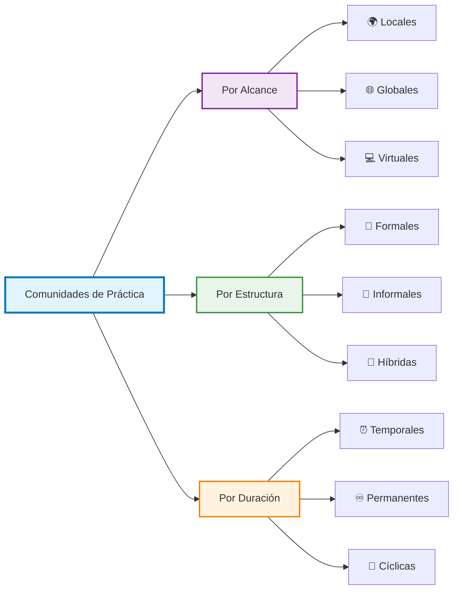
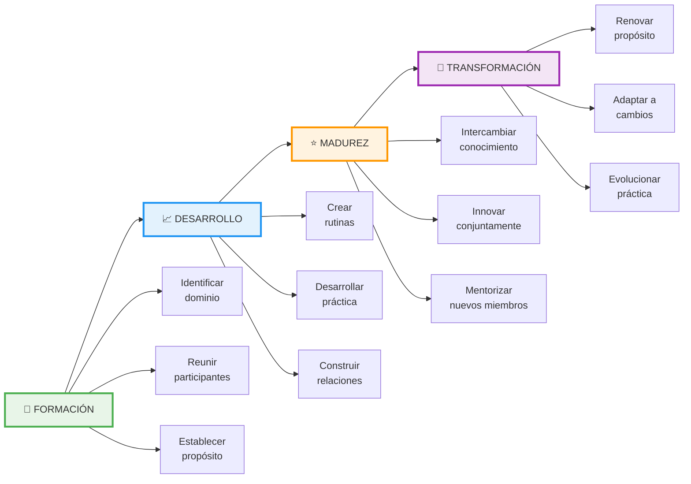
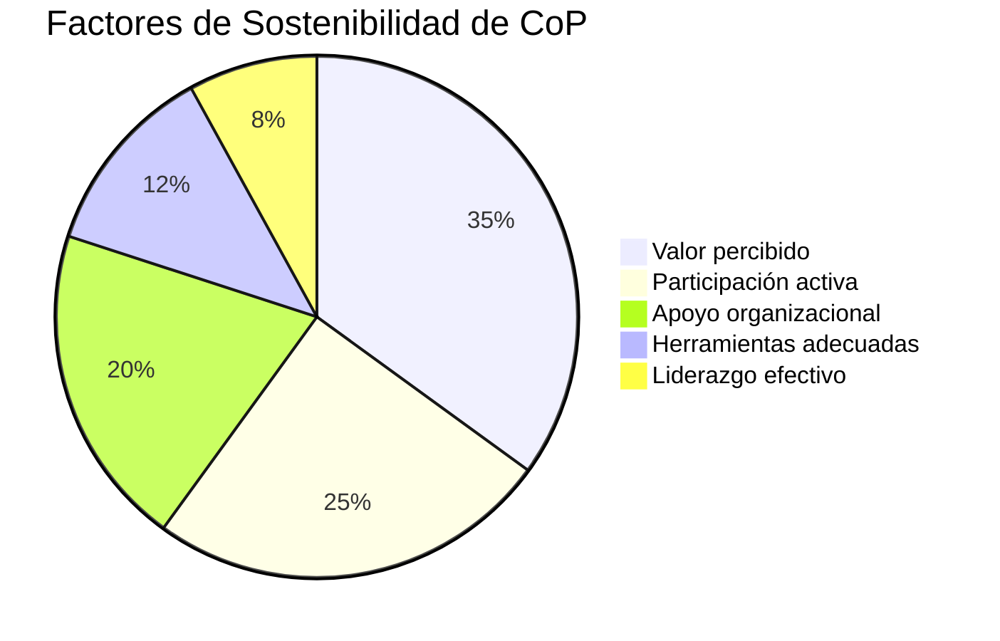

# Comunidades de Práctica 🤝

>[!quote] "Aprendemos mejor cuando aprendemos juntos, cuando compartimos nuestras experiencias y construimos conocimiento de forma colaborativa." - Étienne Wenger

## Definición y Fundamentos

>[!info] **¿Qué son las Comunidades de Práctica?**
>
> Las **Comunidades de Práctica** (CoP) son grupos de personas que comparten una preocupación, un conjunto de problemas o una pasión por un tema específico, y que profundizan su conocimiento y experiencia en esta área mediante una interacción continua.

### 🔑 Componentes Esenciales

>[!tip] **Los Tres Pilares de una CoP**
>
> |Componente|Descripción|Ejemplo|
> |---|---|---|
> |**🎯 Dominio**|El área temática específica que une a la comunidad|Desarrollo de software, medicina, educación|
> |**👥 Comunidad**|El grupo de personas que interactúa regularmente|Equipo de desarrolladores, médicos especialistas|
> |**📚 Práctica**|El repertorio compartido de recursos, experiencias y herramientas|Metodologías, casos de estudio, técnicas|

## Características Principales

>[!warning] **Diferencias con Otros Grupos**
>
> - **No son equipos de trabajo**: Se enfocan en el aprendizaje, no en entregar un producto
> - **No son redes profesionales**: Tienen un dominio específico y práctica compartida
> - **No son comunidades de interés**: Requieren participación activa en la práctica

### 📊 Tipos de Comunidades de Práctica

## Beneficios del Aprendizaje Colaborativo

>[!tip] **🌟 Ventajas Clave**
>
> ### Para los Individuos
> 
> - **Desarrollo acelerado de competencias** 📈
> - **Acceso a conocimiento tácito** 🧠
> - **Construcción de redes profesionales** 🔗
> - **Reducción del aislamiento profesional** 🤝
> 
> ### Para las Organizaciones
> 
> - **Transferencia efectiva de conocimiento** 🔄
> - **Innovación y resolución de problemas** 💡
> - **Retención del talento** 👨‍💼
> - **Mejora de la productividad** ⚡

## Proceso de Desarrollo

>[!info] **🔄 Etapas de Evolución de una CoP**

## Herramientas y Tecnologías

>[!tip] **🛠️ Plataformas Digitales para CoP**
>
> ### Comunicación y Colaboración
> 
> |Herramienta|Propósito|Ventajas|
> |---|---|---|
> |**Slack/Discord**|Comunicación instantánea|Canales temáticos, integración|
> |**Microsoft Teams**|Colaboración empresarial|Video, documentos compartidos|
> |**Zoom/Meet**|Reuniones virtuales|Grabación, breakout rooms|
> 
> ### Gestión del Conocimiento
> 
> - **🗃️ Wikis y bases de conocimiento**
> - **📁 Repositorios compartidos (GitHub, SharePoint)**
> - **🎥 Plataformas de video (YouTube, Vimeo)**
> - **📝 Blogs y foros especializados**

## Estrategias de Implementación

>[!warning] **⚠️ Factores Críticos de Éxito**
>
> ### Liderazgo y Facilitación
> 
> - **Identificar campeones naturales** 🏆
> - **Proporcionar recursos necesarios** 💰
> - **Crear tiempo protegido para participación** ⏰
> - **Reconocer y celebrar contribuciones** 🎉
> 
> ### Sostenibilidad

## Técnica de Estudio: Método EPIC

>[!tip] **🎯 Técnica EPIC para Comunidades de Práctica**
>
**E**xperiencia - Comparte casos reales y experiencias vividas **P**ráctica - Aplica inmediatamente lo aprendido **I**nteracción - Participa activamente en discusiones **C**onexión - Relaciona nuevos conocimientos con experiencias previas

### Mnemotecnia para Recordar EPIC:

_"**E**n **P**ráctica, **I**ntercambiamos **C**onocimiento"_

## Medición y Evaluación

>[!info] **📊 Métricas de Éxito**
>
>### Cuantitativas
>
>- Número de miembros activos
>- Frecuencia de participación
>- Contenido generado
>- Tiempo de respuesta a consultas
>
>### Cualitativas
>
>- Impacto en el trabajo diario
>- Satisfacción de los miembros
>- Innovaciones generadas

## Referencias y Enlaces

>[!quote] **Conexiones con otras notas:**
>
>- [[Aprendizaje Colaborativo]] - Fundamentos teóricos del aprendizaje en grupo
>- [[Redes de Aprendizaje]] - Estructuras más amplias de intercambio de conocimiento
>- [[Mentoría y Coaching de Aprendizaje]] - Relaciones 1:1 dentro de las CoP
>- [[Facilitación de Grupos]] - Habilidades necesarias para liderar CoP

## Notas Recomendadas (Prerrequisitos)

>[!success] **📚 Lectura previa recomendada:**
>
>- [[Habilidades Sociales]] - Base para la interacción efectiva
>- [[Comunicación Efectiva]] - Herramientas para el intercambio de ideas
>- [[Inteligencia Emocional]] - Manejo de relaciones interpersonales

---

#aprendizaje #colaboración #conocimiento #comunidades #práctica #desarrollo-profesional #networking #gestión-conocimiento