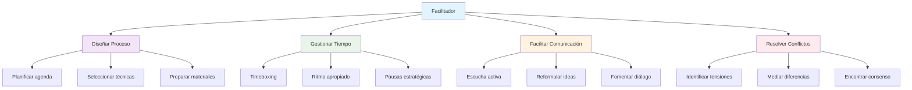

# Facilitación de Grupos

>[!quote] _"Un facilitador no dirige el grupo hacia donde él quiere ir, sino que ayuda al grupo a descubrir hacia dónde quiere ir y cómo llegar allí."_ – **Roger Schwarz**

> [!info] **¿Qué es la Facilitación de Grupos?** 🎯  
> La facilitación de grupos es el arte y la ciencia de guiar procesos para que los participantes alcancen sus objetivos de manera **efectiva, colaborativa e inclusiva**.  
> El facilitador actúa como un catalizador **neutral**, potenciando la inteligencia colectiva sin imponer su agenda personal.

---

## Principios Fundamentales

> [!tip] **Los 4 Pilares de la Facilitación Efectiva**
> 
> - **🎭 Neutralidad** → Mantenerse imparcial respecto al contenido mientras se guía el proceso.
>     
> - **🗣️ Participación** → Garantizar que todas las voces sean escuchadas y valoradas.
>     
> - **🎯 Enfoque** → Mantener al grupo centrado en objetivos claros y alcanzables.
>     
> - **⚡ Dinamismo** → Adaptar métodos y técnicas según las necesidades emergentes.
>     

---

## Roles y Responsabilidades del Facilitador

---

## Técnicas y Herramientas Esenciales

> [!warning] **Técnicas según la Fase del Proceso** ⚙️  
> **🟢 Inicio y Energización**
> 
> |Técnica|Duración|Propósito|Tamaño Grupo|
> |---|---|---|---|
> |**Check-in Rápido**|5-10 min|Conectar emocionalmente|3-12|
> |**Rompehielos**|10-15 min|Generar confianza|5-30|
> |**Establecer Normas**|15-20 min|Crear marco de trabajo|Cualquiera|
> 
> **💡 Generación de Ideas**
> 
> - **🧠 Brainstorming** → Generación libre sin críticas.
>     
> - **🔄 Brainwriting 6-3-5** → 6 personas, 3 ideas, 5 minutos por ronda.
>     
> - **🎯 Técnica Nominal** → Ideas individuales → agrupación → votación.
>     
> - **🌟 Pensamiento Lateral** → Provocaciones y asociaciones aleatorias.
>     
> 
> **🏆 Toma de Decisiones**
> 
> - **👍 Dot Voting** → Votación con puntos de colores.
>     
> - **⚖️ Matriz de Decisión** → Criterios ponderados vs opciones.
>     
> - **🎲 Técnica Delphi** → Consulta iterativa a expertos.
>     
> - **🤝 Método del Consenso** → Acuerdo que todos pueden apoyar.
>     

---

## Gestión de Dinámicas Grupales

> [!tip] **Manejo de Personalidades Desafiantes** 🎭  
> **El Dominante**
> 
> - ✅ Establecer turnos estructurados, usar timeboxing.
>     
> - 🗨️ _"Gracias por tu aporte, escuchemos otras perspectivas."_
>     
> 
> **El Silencioso**
> 
> - ✅ Invitación directa pero amable, trabajos en parejas.
>     
> - 🗨️ _"¿Qué piensas sobre esto, [nombre]?"_
>     
> 
> **El Escéptico**
> 
> - ✅ Validar preocupaciones, pedir fundamentos.
>     
> - 🗨️ _"Entiendo tu preocupación, ¿qué necesitarías para sentirte más cómodo?"_
>     
> 
> **El Desviado**
> 
> - ✅ Usar _parking lot_ para registrar ideas, reconducir.
>     
> - 🗨️ _"Interesante punto, lo anotamos para después y volvamos a..."_
>     

---

## Fases del Proceso de Facilitación

```mermaid
graph LR
    subgraph PREPARACIÓN
        A1[📌 Definir objetivos]
        A2[🗂 Diseñar agenda]
        A3[📦 Preparar materiales]
    end
    
    subgraph APERTURA
        B1[👋 Bienvenida]
        B2[📜 Establecer normas]
        B3[🔍 Explicar proceso]
    end
    
    subgraph DESARROLLO
        C1[⚙️ Facilitar actividades]
        C2[⏱ Gestionar tiempo]
        C3[🤝 Resolver conflictos]
    end
    
    subgraph CIERRE
        D1[📝 Síntesis de acuerdos]
        D2[➡️ Definir próximos pasos]
        D3[📊 Evaluación del proceso]
    end

    A1 --> A2 --> A3 --> B1 --> B2 --> B3 --> C1 --> C2 --> C3 --> D1 --> D2 --> D3

    style PREPARACIÓN fill:#E3F2FD,stroke:#1565C0,stroke-width:2px
    style APERTURA fill:#E8F5E9,stroke:#2E7D32,stroke-width:2px
    style DESARROLLO fill:#FFF3E0,stroke:#EF6C00,stroke-width:2px
    style CIERRE fill:#FCE4EC,stroke:#AD1457,stroke-width:2px

```

---

> [!info] **Herramientas Digitales para Facilitación Virtual** 💻
> 
> - **Miro/Mural** → Pizarras colaborativas digitales.
>     
> - **Mentimeter** → Encuestas y nubes de palabras en tiempo real.
>     
> - **Breakout Rooms** → Trabajo en grupos pequeños (Zoom/Teams).
>     
> - **Jamboard** → Notas adhesivas digitales de Google.
>     
> - **Kahoot** → Gamificación de la participación.
>     

---

> [!tip] **Técnica de Estudio: Método FACILITA** 🧠  
> **F**oco en objetivos claros.  
> **A**mbiente seguro y de confianza.  
> **C**omunicación efectiva e inclusiva.  
> **I**nteracciones dinámicas y participativas.  
> **L**iderazgo compartido y empoderador.  
> **I**nclusión de todas las voces.  
> **T**iempo gestionado estratégicamente.  
> **A**cuerdos claros y seguimiento.

---

> [!warning] **Indicadores de Éxito** 📊
> 
> - **Participación** → % de miembros que contribuyeron activamente.
>     
> - **Satisfacción** → Encuesta post-sesión (escala 1-10).
>     
> - **Resultados** → Objetivos alcanzados vs planificados.
>     
> - **Eficiencia** → Tiempo invertido vs valor generado.
>     
> - **Compromiso** → Nivel de adherencia a acuerdos posteriores.
>     

---

> [!quote] **Enlaces a Otras Notas**
> 
> - [[Liderazgo Situacional]]
>     
> - [[Comunicación Efectiva]]
>     
> - [[Gestión de Conflictos]]
>     
> - [[Pensamiento Crítico]]
>     
> - [[Inteligencia Emocional]]
>     
> - [[Team Building]]
>     

---

> [!info] **Prerrequisitos y Complementos** 📚  
> **Prerrequisitos**
> 
> - [[Habilidades Sociales]]
>     
> - [[Técnicas de Comunicación]]
>     
> - [[Competencias Interpersonales]]
>     
> 
> **Para Profundizar**
> 
> - [[Aprendizaje Colaborativo]]
>     
> - [[Mentoría y Coaching de Aprendizaje]]
>     
> - [[Cultura Organizacional]]
>     
> - [[Diversidad e Inclusión]]
>     

---

**Tags**: #facilitación #liderazgo #comunicación #grupos #metodologías #aprendizaje-colaborativo #soft-skills #gestión-equipos #dinámicas-grupales

---
