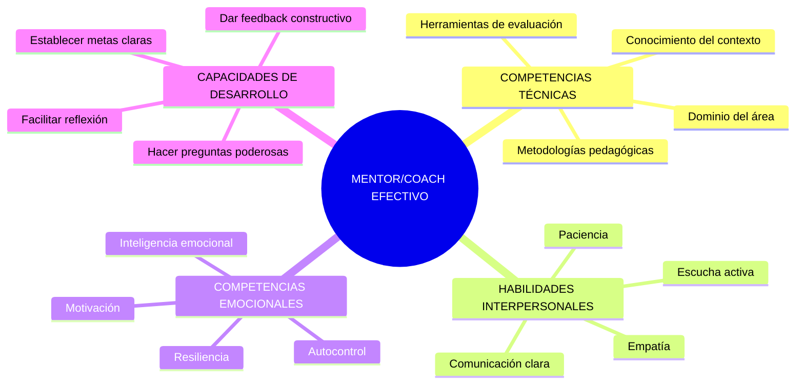
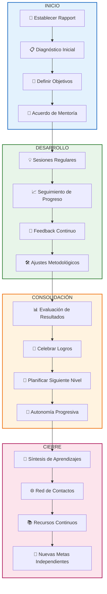

# Mentoría y Coaching de Aprendizaje

> [!quote] _"El mejor maestro no es el que da respuestas, sino el que hace las preguntas correctas para que el estudiante descubra su propio camino."_ – **John Whitmore**

> [!info] **¿Qué es la Mentoría y Coaching de Aprendizaje?** 🎯  
> La mentoría y coaching de aprendizaje es un proceso **colaborativo y personalizado** donde un mentor/coach experimentado guía a un aprendiz para desarrollar sus competencias, potenciar sus fortalezas y alcanzar sus objetivos académicos y profesionales.  
> Se basa en el **crecimiento mutuo**, la confianza y el desarrollo de la autonomía del aprendiz.

---

## Diferencias Clave: Mentoría vs Coaching

> [!tip] **Mentoría vs Coaching: Enfoque Diferenciado**
> 
> **🧭 MENTORÍA**
> 
> - **Enfoque** → Transferencia de experiencia y conocimiento.
> - **Relación** → Mentor senior - Mentorizado junior.
> - **Dirección** → Basada en la experiencia del mentor.
> - **Duración** → Relaciones a largo plazo (meses/años).
> - **Objetivo** → Desarrollo profesional y personal integral.
> 
> **⚡ COACHING**
> 
> - **Enfoque** → Facilitación del autodescubrimiento.
> - **Relación** → Coach - Coachee (igualdad de poder).
> - **Dirección** → Basada en las metas del coachee.
> - **Duración** → Sesiones estructuradas (semanas/meses).
> - **Objetivo** → Mejora del rendimiento específico.

---

## Competencias del Mentor/Coach Efectivo

---

## Modelos y Metodologías

> [!warning] **Modelos de Coaching más Utilizados** ⚙️  
> **🎯 Modelo GROW**
> 
> |Fase|Significado|Preguntas Clave|Enfoque|
> |---|---|---|---|
> |**G**OAL|Meta|¿Qué quieres lograr?|Definir objetivos claros|
> |**R**EALITY|Realidad|¿Cuál es la situación actual?|Análisis del presente|
> |**O**PTIONS|Opciones|¿Qué alternativas tienes?|Explorar posibilidades|
> |**W**AY|Camino|¿Cuáles son tus próximos pasos?|Plan de acción|
> 
> **🔄 Modelo OSKAR**
> 
> - **O**utcome → ¿Qué resultado buscas?
> - **S**caling → En escala 1-10, ¿dónde estás?
> - **K**now-how → ¿Qué recursos tienes disponibles?
> - **A**ffirm & Action → ¿Qué acciones tomarás?
> - **R**eview → ¿Cómo evaluarás el progreso?
> 
> **🌟 Modelo CLEAR**
> 
> - **C**ontracting → Establecer el acuerdo de trabajo.
> - **L**istening → Escucha profunda y empática.
> - **E**xploring → Explorar opciones y perspectivas.
> - **A**ction → Planificar acciones concretas.
> - **R**eview → Revisar progreso y aprendizajes.

---

## Proceso de Mentoría/Coaching

---

## Técnicas y Herramientas Específicas

> [!tip] **Herramientas del Coach/Mentor Eficaz** 🎭  
> **Preguntas Poderosas**
> 
> - 🤔 _"¿Qué te dice tu intuición sobre esto?"_
> - 🎯 _"¿Qué sería diferente si tuvieras éxito total?"_
> - 🚧 _"¿Qué obstáculos anticipas y cómo los superarías?"_
> - 💡 _"¿De qué otra manera podrías enfocar esto?"_
> 
> **Técnicas de Feedback**
> 
> - **🎯 Modelo SBI** → Situación, Comportamiento, Impacto.
> - **🥪 Técnica del Sándwich** → Positivo + Mejora + Positivo.
> - **🔄 Feedback 360°** → Perspectiva integral de múltiples fuentes.
> - **📊 SMART Feedback** → Específico, Medible, Accionable, Relevante, Temporal.
> 
> **Herramientas de Reflexión**
> 
> - **📖 Diario de Aprendizaje** → Registro sistemático de insights.
> - **🗺 Mapa de Competencias** → Visualización de fortalezas y áreas de mejora.
> - **⚖️ Rueda de la Vida** → Balance en diferentes áreas vitales.
> - **🎭 Role Playing** → Práctica en entornos seguros.

---

## Estilos de Mentoría según el Contexto

> [!warning] **Adaptación del Estilo según Necesidades** ⚙️  
> **🎓 Mentoría Académica**
> 
> - **Enfoque** → Desarrollo de competencias de estudio y investigación.
> - **Metodología** → Acompañamiento en proyectos, revisión de trabajos.
> - **Herramientas** → Mapas conceptuales, técnicas de estudio, gestión del tiempo.
> 
> **💼 Mentoría Profesional**
> 
> - **Enfoque** → Desarrollo de carrera y competencias laborales.
> - **Metodología** → Networking, simulación de entrevistas, planificación de carrera.
> - **Herramientas** → Assessment centers, planes de desarrollo, networking.
> 
> **🌱 Mentoría Personal**
> 
> - **Enfoque** → Crecimiento integral y bienestar.
> - **Metodología** → Coaching de vida, desarrollo de habilidades blandas.
> - **Herramientas** → Técnicas de mindfulness, gestión emocional, establecimiento de límites.

---

## Desafíos Comunes y Estrategias

> [!info] **Obstáculos Frecuentes y Soluciones** 💻
> 
> **🚫 Resistencia al Cambio**
> 
> - **Estrategia** → Comenzar con pequeños cambios, celebrar progresos.
> - **Herramienta** → Técnica de los pequeños pasos (Kaizen).
> 
> **⏰ Falta de Tiempo**
> 
> - **Estrategia** → Sesiones breves pero frecuentes, microaprendizaje.
> - **Herramienta** → Time blocking, técnica Pomodoro para sesiones.
> 
> **🎯 Objetivos Poco Claros**
> 
> - **Estrategia** → Usar metodología SMART, revisar metas regularmente.
> - **Herramienta** → Canvas de objetivos, mapas de ruta visual.
> 
> **🔄 Falta de Compromiso**
> 
> - **Estrategia** → Co-crear acuerdos, establecer accountability partners.
> - **Herramienta** → Contratos de aprendizaje, seguimiento gamificado.

---

> [!tip] **Técnica de Estudio: Método MENTOR** 🧠  
> **M**otivar y conectar emocionalmente.  
> **E**scuchar activamente las necesidades.  
> **N**avegar juntos hacia las metas.  
> **T**ransmitir conocimiento relevante.  
> **O**rientar con preguntas poderosas.  
> **R**eflexionar sobre el progreso y aprendizajes.

---

## Medición y Evaluación del Impacto

> [!warning] **Indicadores de Éxito en Mentoría/Coaching** 📊
> 
> **📈 Indicadores Cuantitativos**
> 
> - **Progreso Académico** → Mejora en calificaciones, tiempo de estudio eficiente.
> - **Desarrollo de Competencias** → Pre/post evaluaciones de habilidades.
> - **Cumplimiento de Metas** → % de objetivos alcanzados vs planificados.
> 
> **🎯 Indicadores Cualitativos**
> 
> - **Autoconciencia** → Mayor claridad sobre fortalezas y áreas de mejora.
> - **Confianza** → Aumento en la autoeficacia percibida.
> - **Autonomía** → Capacidad de autorregulación y toma de decisiones.
> - **Satisfacción** → Nivel de satisfacción con el proceso de mentoría.

---

> [!quote] **Enlaces a Otras Notas**
> 
> - [[Facilitación de Grupos]]
> - [[Liderazgo Situacional]]
> - [[Comunicación Efectiva]]
> - [[Inteligencia Emocional]]
> - [[Feedback y Coaching]]
> - [[Desarrollo de Equipos]]

---

> [!info] **Prerrequisitos y Complementos** 📚  
> **Prerrequisitos**
> 
> - [[Habilidades Sociales]]
> - [[Técnicas de Comunicación]]
> - [[Competencias Interpersonales]]
> - [[Pensamiento Crítico]]
> 
> **Para Profundizar**
> 
> - [[Aprendizaje Colaborativo]]
> - [[Evaluación del Aprendizaje]]
> - [[Autoevaluación de Competencias]]
> - [[Redes de Aprendizaje]]
> - [[Gestión de Conflictos]]

---

**Tags**: #mentoría #coaching #desarrollo-personal #aprendizaje #liderazgo #competencias #crecimiento-profesional #habilidades-blandas #educación #acompañamiento

---