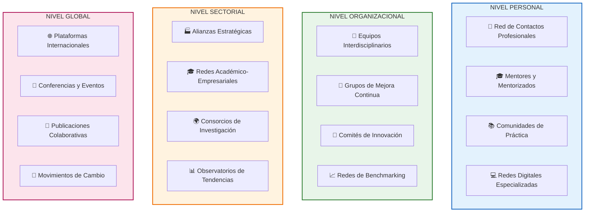
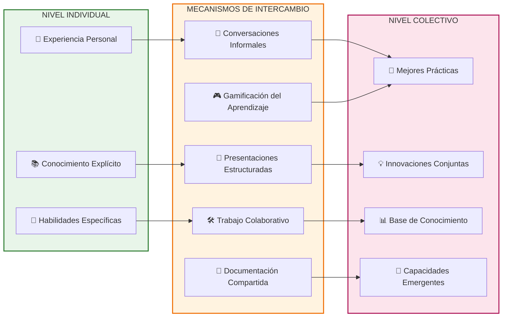

# Redes de Aprendizaje

> [!quote] _"El conocimiento compartido es conocimiento multiplicado. Una red de aprendizaje transforma la sabiduría individual en inteligencia colectiva."_ – **George Siemens**

> [!info] **¿Qué son las Redes de Aprendizaje?** 🌐  
> Las redes de aprendizaje son **ecosistemas colaborativos** donde individuos y organizaciones se conectan para compartir conocimiento, experiencias y recursos con el objetivo de generar aprendizaje mutuo y continuo.  
> Se basan en la premisa de que el **aprendizaje es un proceso social** que se potencia a través de las conexiones y relaciones significativas.

---

## Características de las Redes de Aprendizaje Efectivas

> [!tip] **Los 6 Pilares de una Red de Aprendizaje Sólida**
> 
> - **🤝 Reciprocidad** → Intercambio equitativo de valor entre todos los miembros.
> - **🎯 Propósito Compartido** → Objetivos comunes que unifican la red.
> - **🌊 Diversidad** → Variedad de perspectivas, experiencias y conocimientos.
> - **💡 Apertura** → Transparencia en el intercambio de información y recursos.
> - **🔄 Dinamismo** → Capacidad de evolución y adaptación continua.
> - **⚡ Conectividad** → Facilidad para establecer y mantener conexiones.

---

## Tipos y Niveles de Redes de Aprendizaje

---

## Construcción Estratégica de Redes

> [!warning] **Estrategias para Desarrollar Redes Efectivas** ⚙️  
> **🎯 Mapeo de Stakeholders**
> 
> |Categoría|Descripción|Estrategia de Conexión|Valor Potencial|
> |---|---|---|---|
> |**Expertos Técnicos**|Profesionales con conocimiento especializado|Participar en eventos especializados|Alto conocimiento específico|
> |**Conectores**|Personas con redes amplias|Solicitar presentaciones mutuas|Acceso a nuevos contactos|
> |**Innovadores**|Early adopters y visionarios|Colaborar en proyectos experimentales|Tendencias y oportunidades|
> |**Facilitadores**|Catalizadores de procesos grupales|Participar en workshops|Mejora de habilidades relacionales|
> 
> **🌱 Estrategias de Cultivo**
> 
> - **📅 Interacción Regular** → Mantener contacto consistente y sistemático.
> - **🎁 Valor Primero** → Ofrecer ayuda antes de solicitar apoyo.
> - **🎯 Relevancia** → Compartir contenido e información pertinente.
> - **🤝 Autenticidad** → Construir relaciones genuinas, no transaccionales.
> - **🔄 Seguimiento** → Completar compromisos adquiridos en intercambios.

---

## Plataformas y Herramientas Digitales

> [!info] **Ecosistema Digital para Redes de Aprendizaje** 💻
> 
> **🌐 Plataformas Profesionales**
> 
> - **LinkedIn** → Red profesional global, grupos especializados.
> - **ResearchGate** → Comunidad académica e investigación científica.
> - **GitHub** → Colaboración en desarrollo y proyectos técnicos.
> - **Medium** → Publicación y descubrimiento de contenido especializado.
> 
> **📚 Comunidades de Conocimiento**
> 
> - **Reddit** → Subreddits especializados por temas de interés.
> - **Stack Overflow** → Resolución colaborativa de problemas técnicos.
> - **Quora** → Preguntas y respuestas de expertos globales.
> - **Discord/Slack** → Comunicación en tiempo real por comunidades.
> 
> **🎓 Plataformas Educativas**
> 
> - **Coursera/edX** → Cursos con componentes colaborativos.
> - **MasterClass** → Acceso a expertos de clase mundial.
> - **Udemy** → Comunidades de aprendices por disciplinas.
> - **Khan Academy** → Aprendizaje colaborativo estructurado.

---

## Dinámicas de Intercambio de Conocimiento

---

## Rol del Facilitador de Redes

> [!tip] **Competencias del Network Builder** 🎭  
> **🔍 Identificación de Oportunidades**
> 
> - 🎯 _Detectar necesidades complementarias entre miembros._
> - 🌉 _Visualizar conexiones potenciales no evidentes._
> - 💎 _Reconocer valor oculto en interacciones aparentemente simples._
> 
> **🤝 Facilitación de Conexiones**
> 
> - 📱 _Realizar presentaciones estratégicas y contextualizadas._
> - 🎪 _Diseñar eventos que propicien encuentros significativos._
> - 🔄 _Crear estructuras para el intercambio regular de conocimiento._
> 
> **⚡ Mantenimiento de la Red**
> 
> - 📊 _Monitorear la salud y vitalidad de las conexiones._
> - 🎯 _Re-activar vínculos dormidos o deteriorados._
> - 🌱 _Nutrir el crecimiento orgánico de la red._

---

## Métricas y Evaluación de Redes

> [!warning] **Indicadores de Salud de una Red de Aprendizaje** 📊
> 
> **🔢 Métricas Cuantitativas**
> 
> - **Densidad de Red** → Número de conexiones reales vs. conexiones posibles.
> - **Frecuencia de Interacción** → Promedio de intercambios por período de tiempo.
> - **Diversidad de Actores** → Variedad de perfiles y sectores representados.
> - **Alcance Geográfico** → Distribución espacial de los miembros.
> 
> **💫 Métricas Cualitativas**
> 
> - **Calidad del Intercambio** → Profundidad y relevancia de las interacciones.
> - **Impacto en el Aprendizaje** → Transferencia efectiva de conocimiento.
> - **Satisfacción de Miembros** → Percepción de valor recibido vs. aportado.
> - **Innovación Emergente** → Nuevas ideas generadas por colaboración.

---

## Desafíos y Estrategias de Superación

> [!info] **Obstáculos Comunes y Soluciones** 💡
> 
> **⏰ Escasez de Tiempo**
> 
> - **Estrategia** → Micro-intercambios de 15 minutos, asincronía estratégica.
> - **Herramienta** → Calendly para optimizar agendas, mensajes de voz.
> 
> **🌍 Distancia Geográfica**
> 
> - **Estrategia** → Aprovechamiento de tecnología, eventos híbridos.
> - **Herramienta** → Zoom, Spatial.io para inmersión virtual.
> 
> **🤐 Resistencia a Compartir**
> 
> - **Estrategia** → Crear ambiente de confianza, reciprocidad evidente.
> - **Herramienta** → Acuerdos de confidencialidad, reconocimiento público.
> 
> **📈 Sobrecarga de Información**
> 
> - **Estrategia** → Curaduría inteligente, filtros personalizados.
> - **Herramienta** → Algoritmos de recomendación, tags inteligentes.

---

> [!tip] **Técnica de Estudio: Método REDES** 🧠  
> **R**econocer oportunidades de conexión valiosas.  
> **E**stablecer relaciones auténticas y duraderas.  
> **D**iversificar el ecosistema de contactos estratégicos.  
> **E**xplotar sinergias mediante colaboración activa.  
> **S**ostener y nutrir las conexiones a largo plazo.

---

> [!quote] **Enlaces a Otras Notas**
> 
> - [[Comunidades de Práctica]]
> - [[Aprendizaje Colaborativo]]
> - [[Mentoría y Coaching de Aprendizaje]]
> - [[Facilitación de Grupos]]
> - [[Comunicación Intercultural]]
> - [[Liderazgo Situacional]]

---

> [!info] **Prerrequisitos y Complementos** 📚  
> **Prerrequisitos**
> 
> - [[Habilidades Sociales]]
> - [[Competencias Interpersonales]]
> - [[Técnicas de Comunicación]]
> - [[Pensamiento Crítico]]
> 
> **Para Profundizar**
> 
> - [[Aprendizaje entre Pares]]
> - [[Cultura Organizacional]]
> - [[Diversidad e Inclusión]]
> - [[Influencia sin Autoridad]]

---

**Tags**: #redes-aprendizaje #networking #colaboración #conocimiento-compartido #comunidades #aprendizaje-social #ecosistema-digital #capital-social #inteligencia-colectiva

---