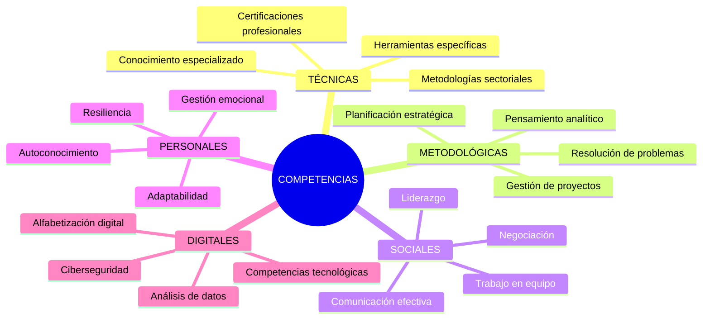
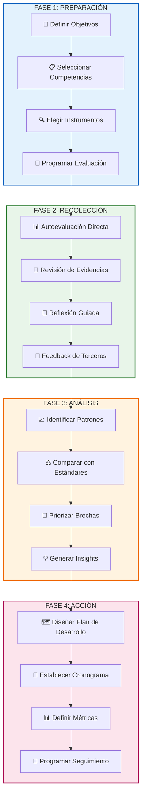

# Autoevaluación de Competencias

> [!quote] _"El verdadero viaje del descubrimiento no consiste en buscar nuevos paisajes, sino en tener nuevos ojos para mirarse a uno mismo."_ – **Marcel Proust**

> [!info] **¿Qué es la Autoevaluación de Competencias?** 🎯  
> La autoevaluación de competencias es un **proceso reflexivo y sistemático** mediante el cual una persona analiza, evalúa y documenta sus conocimientos, habilidades, actitudes y experiencias para identificar fortalezas, áreas de mejora y oportunidades de desarrollo.  
> Es la base fundamental para el **crecimiento profesional consciente** y la planificación estratégica de carrera.

---

## Dimensiones de las Competencias

> [!tip] **El Modelo Iceberg de Competencias**
> 
> - **🏔️ VISIBLE (20%)** → Lo que otros pueden observar directamente.
>     - **Conocimientos** → Información técnica y conceptual adquirida.
>     - **Habilidades** → Capacidades prácticas y destrezas aplicadas.
> - **🌊 OCULTO (80%)** → Los fundamentos profundos del desempeño.
>     - **Actitudes** → Disposición mental hacia personas, situaciones y conceptos.
>     - **Valores** → Principios fundamentales que guían decisiones y comportamientos.
>     - **Motivaciones** → Impulsos internos que dirigen la energía y persistencia.
>     - **Rasgos** → Características de personalidad y temperamento natural.

---

## Tipos de Competencias a Evaluar

---

## Herramientas y Métodos de Autoevaluación

> [!warning] **Instrumentos de Evaluación Sistemática** ⚙️  
> **📊 Escalas de Competencia**
> 
> |Nivel|Descriptor|Características|Indicadores de Evidencia|
> |---|---|---|---|
> |**1 - Novato**|Conocimiento limitado|Requiere supervisión constante|Comete errores frecuentes, necesita guía|
> |**2 - Principiante**|Comprensión básica|Puede realizar tareas simples|Aplica reglas básicas con apoyo ocasional|
> |**3 - Competente**|Dominio funcional|Trabaja de forma independiente|Resuelve problemas rutinarios efectivamente|
> |**4 - Experto**|Alto nivel de maestría|Innova y mejora procesos|Mentoriza a otros, crea nuevas soluciones|
> |**5 - Maestro**|Reconocimiento sectorial|Lidera transformaciones|Establece estándares, influye en la disciplina|
> 
> **🎯 Matrices de Competencias**
> 
> - **Matriz RACI** → Responsible, Accountable, Consulted, Informed por competencia.
> - **Gap Analysis** → Competencia actual vs. competencia requerida.
> - **Matriz de Impacto** → Importancia de la competencia vs. nivel de dominio.
> - **Mapa de Calor** → Visualización cromática de fortalezas y debilidades.

---

## Proceso Estructurado de Autoevaluación

---

## Técnicas de Reflexión Profunda

> [!info] **Metodologías para la Introspección Efectiva** 💻
> 
> **🪞 Técnica del Espejo**
> 
> - **Proceso** → Describir situaciones sin juicios, luego analizar patrones.
> - **Preguntas clave** → ¿Qué hice? ¿Cómo reaccioné? ¿Qué senti?
> - **Resultado** → Mayor autoconciencia sobre comportamientos automáticos.
> 
> **📖 Diario de Competencias**
> 
> - **Estructura** → Situación → Competencia aplicada → Resultado → Aprendizaje.
> - **Frecuencia** → Registro semanal de experiencias significativas.
> - **Beneficio** → Identificación de patrones de crecimiento y estancamiento.
> 
> **🎭 Análisis de Roles**
> 
> - **Método** → Mapear diferentes roles profesionales y personales.
> - **Evaluación** → Competencias requeridas vs. competencias demostradas por rol.
> - **Insights** → Transferibilidad de competencias entre contextos.

---

## Modelo de Competencias Integrales

> [!tip] **Framework 4C+D para Evaluación Holística** 🎭  
> **💭 COGNITIVAS (Pensar)**
> 
> - 🧠 _Pensamiento crítico y analítico._
> - 💡 _Creatividad e innovación._
> - 🔍 _Resolución de problemas complejos._
> - 📊 _Síntesis e interpretación de datos._
> 
> **🤝 COLABORATIVAS (Relacionar)**
> 
> - 💬 _Comunicación clara y persuasiva._
> - 👥 _Trabajo en equipo efectivo._
> - 🌍 _Competencia intercultural._
> - 🤲 _Liderazgo e influencia positiva._
> 
> **🎯 CONDUCTUALES (Actuar)**
> 
> - ⚡ _Orientación a resultados._
> - 🔄 _Adaptabilidad y flexibilidad._
> - 💪 _Persistencia y resiliencia._
> - ⏰ _Gestión efectiva del tiempo._
> 
> **❤️ CARACTERIOLÓGICAS (Ser)**
> 
> - 🎯 _Integridad y ética profesional._
> - 🌱 _Crecimiento y aprendizaje continuo._
> - ⚖️ _Equilibrio y bienestar personal._
> - 🦋 _Conciencia emocional y autorregulación._
> 
> **📱 DIGITALES (Navegar)**
> 
> - 💻 _Fluidez tecnológica y adaptación digital._
> - 🔒 _Seguridad y privacidad en entornos digitales._
> - 📊 _Análisis e interpretación de datos digitales._
> - 🌐 _Colaboración en espacios virtuales._

---

## Sesgos Cognitivos en la Autoevaluación

> [!warning] **Trampas Mentales Comunes y Estrategias de Mitigación** 📊
> 
> **🔍 Sesgos de Percepción**
> 
> - **Efecto Dunning-Kruger** → Sobreestimar competencias en áreas de bajo dominio.
>     - _Antídoto_: Buscar feedback externo, compararse con expertos reconocidos.
> - **Síndrome del Impostor** → Subestimar competencias reales demostradas.
>     - _Antídoto_: Documentar logros, solicitar reconocimiento de terceros.
> 
> **⏰ Sesgos Temporales**
> 
> - **Sesgo de Recencia** → Sobrevalorar experiencias recientes vs. históricas.
>     - _Antídoto_: Revisión sistemática de evidencias en diferentes períodos.
> - **Efecto Halo** → Generalizar una fortaleza a todas las competencias.
>     - _Antídoto_: Evaluación granular por competencia específica.

---

## Portafolio de Evidencias

> [!info] **Documentación Estratégica de Competencias** 💡
> 
> **📁 Tipos de Evidencia**
> 
> - **Productos** → Trabajos, proyectos, creaciones tangibles realizadas.
> - **Procesos** → Videos, grabaciones de presentaciones, facilitación de reuniones.
> - **Testimonios** → Cartas de recomendación, feedback de clientes/colegas.
> - **Certificaciones** → Diplomas, cursos completados, acreditaciones profesionales.
> 
> **🗂️ Organización del Portafolio**
> 
> - **Por Competencia** → Agrupación de evidencias según habilidades específicas.
> - **Por Cronología** → Documentación del crecimiento temporal de capacidades.
> - **Por Contexto** → Clasificación según ámbitos (profesional, académico, personal).
> - **Por Impacto** → Priorización según relevancia y resultados generados.

---

> [!tip] **Técnica de Estudio: Método EVALÚA** 🧠  
> **E**xaminar objetivamente fortalezas y debilidades actuales.  
> **V**alorar evidencias concretas de desempeño demostrado.  
> **A**nalizar brechas entre competencias actuales y requeridas.  
> **L**istar prioridades de desarrollo basadas en impacto.  
> **Ú**bicar recursos y oportunidades de crecimiento.  
> **A**ctualizar regularmente la evaluación y plan de acción.

---

## Herramientas Digitales para Autoevaluación

> [!warning] **Plataformas y Recursos Tecnológicos** ⚙️
> 
> **🔧 Herramientas de Assessment**
> 
> - **StrengthsFinder** → Identificación de talentos naturales dominantes.
> - **16Personalities** → Evaluación de tipo de personalidad (MBTI).
> - **DISC Assessment** → Análisis de estilos de comportamiento y comunicación.
> - **Emotional Intelligence 2.0** → Medición de inteligencia emocional.
> 
> **📊 Plataformas de Tracking**
> 
> - **LinkedIn Skills** → Validación social de competencias profesionales.
> - **Coursera Certificates** → Documentación de aprendizaje continuo.
> - **GitHub Portfolio** → Demostración de competencias técnicas y proyectos.
> - **Personal SWOT** → Apps para análisis sistemático de fortalezas/debilidades.

---

> [!quote] **Enlaces a Otras Notas**
> 
> - [[Evaluación del Aprendizaje]]
> - [[Evaluación 360°]]
> - [[Autoconocimiento]]
> - [[Definición de Propósito]]
> - [[Planificación Estratégica Personal]]
> - [[Mentoría y Coaching de Aprendizaje]]

---

> [!info] **Prerrequisitos y Complementos** 📚  
> **Prerrequisitos**
> 
> - [[Autoconocimiento]]
> - [[Pensamiento Crítico]]
> - [[Metacognición]]
> - [[Clarificación de Valores]]
> 
> **Para Profundizar**
> 
> - [[Objetivos SMART]]
> - [[Construcción de Confianza]]
> - [[Motivación Académica]]
> - [[Sistemas de Revisión]]
> - [[Feedback y Coaching]]

---

**Tags**: #autoevaluación #competencias #desarrollo-personal #autoconocimiento #crecimiento-profesional #assessment #reflexión #metacognición #portafolio-evidencias

---