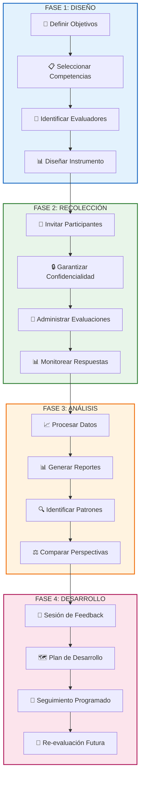
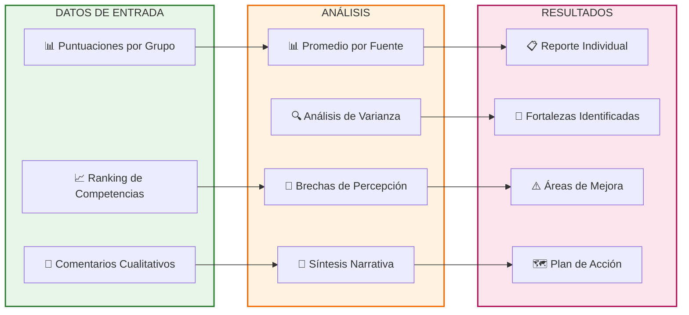

# Evaluación 360°

> [!quote] _"La única forma de ver el elefante completo es caminando alrededor de él. Lo mismo sucede con nuestro desempeño: necesitamos múltiples perspectivas para obtener la imagen completa."_ – **Marshall Goldsmith**

> [!info] **¿Qué es la Evaluación 360°?** 🎯  
> La evaluación 360° es un **sistema integral de feedback** que recopila perspectivas sobre el desempeño, competencias y comportamientos de una persona desde múltiples fuentes: superiores, pares, subordinados, clientes y autoevaluación.  
> Su objetivo es proporcionar una **visión holística y objetiva** que elimine puntos ciegos y facilite el desarrollo profesional basado en percepción real vs. autopercepción.

---

## El Círculo Completo de Perspectivas

> [!tip] **Los 5 Anillos de la Evaluación 360°**
> 
> - **👤 AUTOEVALUACIÓN (Centro)** → Percepción personal del propio desempeño.
>     - _Valor_: Baseline de autoconciencia y expectativas internas.
> - **👔 SUPERVISORES (Superior)** → Evaluación de líderes directos o gerentes.
>     - _Valor_: Perspectiva estratégica y alineación con objetivos organizacionales.
> - **🤝 PARES (Horizontal)** → Feedback de colegas del mismo nivel jerárquico.
>     - _Valor_: Colaboración, trabajo en equipo y competencias interpersonales.
> - **👥 SUBORDINADOS (Inferior)** → Evaluación de equipos o colaboradores directos.
>     - _Valor_: Efectividad de liderazgo, comunicación y desarrollo de talento.
> - **🌟 CLIENTES/STAKEHOLDERS (Externo)** → Perspectiva de beneficiarios finales.
>     - _Valor_: Impacto real, satisfacción y creación de valor percibido.

---

## Metodología de Implementación

---

## Competencias Típicamente Evaluadas

> [!warning] **Áreas Clave de Evaluación 360°** ⚙️  
> **🧠 COMPETENCIAS DE LIDERAZGO**
> 
> |Competencia|Evaluadores Clave|Indicadores Específicos|Peso Típico|
> |---|---|---|---|
> |**Visión Estratégica**|Supervisores + Pares|Comunicación de dirección, pensamiento a largo plazo|25%|
> |**Desarrollo de Talento**|Subordinados + RH|Mentoring, coaching, oportunidades de crecimiento|30%|
> |**Toma de Decisiones**|Todos los grupos|Calidad de decisiones, velocidad, consideración de impacto|20%|
> |**Gestión del Cambio**|Pares + Subordinados|Adaptabilidad, comunicación de cambios, resistencia|25%|
> 
> **🤝 COMPETENCIAS INTERPERSONALES**
> 
> - **Comunicación Efectiva** → Claridad, escucha activa, adaptación al público.
> - **Trabajo en Equipo** → Colaboración, apoyo mutuo, construcción de consenso.
> - **Gestión de Conflictos** → Mediación, negociación, resolución constructiva.
> - **Influencia y Persuasión** → Capacidad de generar adhesión sin autoridad formal.
> 
> **⚡ COMPETENCIAS TÉCNICAS**
> 
> - **Expertise Funcional** → Dominio del área de especialización técnica.
> - **Orientación a Resultados** → Cumplimiento de objetivos, calidad del trabajo.
> - **Innovación** → Generación de ideas, mejora continua, creatividad aplicada.
> - **Gestión de Recursos** → Optimización de tiempo, presupuesto, materiales.

---

## Análisis e Interpretación de Resultados

---

## Interpretación de Brechas de Percepción

> [!info] **Patrones Comunes y Sus Significados** 💻
> 
> **📈 AUTO > OTROS (Sobrevaloración)**
> 
> - **Interpretación** → Posible falta de autoconciencia o feedback insuficiente.
> - **Riesgo** → Arrogancia percibida, resistencia al desarrollo.
> - **Acción** → Aumentar receptividad al feedback, buscar mentoring.
> 
> **📉 AUTO < OTROS (Subvaloración)**
> 
> - **Interpretación** → Síndrome del impostor o excesiva autocrítica.
> - **Oportunidad** → Mayor confianza, reconocimiento de fortalezas.
> - **Acción** → Coaching de confianza, documentar logros.
> 
> **🎯 AUTO = OTROS (Alineación)**
> 
> - **Interpretación** → Alta autoconciencia y calibración efectiva.
> - **Fortaleza** → Base sólida para desarrollo dirigido.
> - **Mantenimiento** → Continuar con feedback regular.

---

## Buenas Prácticas y Consideraciones Éticas

> [!tip] **Principios para una Evaluación 360° Efectiva** 🎭  
> **🔒 CONFIDENCIALIDAD Y ANONIMATO**
> 
> - 🛡️ _Proteger identidad de evaluadores para honestidad máxima._
> - 📊 _Reportar solo promedios grupales, nunca respuestas individuales._
> - 🤐 _Establecer acuerdos claros sobre uso y distribución de resultados._
> 
> **⚖️ EQUIDAD Y REPRESENTATIVIDAD**
> 
> - 👥 _Mínimo 3-5 evaluadores por categoría para validez estadística._
> - 🌈 _Diversidad en género, edad, experiencia y perspectivas._
> - ⏱️ _Tiempo suficiente para interacciones significativas (mínimo 6 meses)._
> 
> **🎯 ORIENTACIÓN AL DESARROLLO**
> 
> - 📈 _Enfoque en crecimiento, no en evaluación punitiva._
> - 💡 _Combinación de feedback correctivo y de refuerzo._
> - 🔄 _Seguimiento y apoyo post-evaluación garantizados._

---

## Desafíos y Estrategias de Mitigación

> [!warning] **Obstáculos Comunes y Soluciones Probadas** 📊
> 
> **😰 Resistencia Cultural**
> 
> - **Manifestación** → Miedo a represalias, cultura de no-feedback.
> - **Estrategia** → Comunicación transparente, casos de éxito, liderazgo ejemplar.
> - **Herramientas** → Sesiones informativas, testimonios, garantías escritas.
> 
> **📊 Sesgo de Evaluadores**
> 
> - **Manifestación** → Halo effect, recency bias, leniency bias.
> - **Estrategia** → Entrenamiento de evaluadores, instrumentos balanceados.
> - **Herramientas** → Escalas calibradas, ejemplos concretos, preguntas invertidas.
> 
> **🎭 Gaming del Sistema**
> 
> - **Manifestación** → Selección estratégica de evaluadores, lobby informal.
> - **Estrategia** → Selección aleatoria parcial, validación cruzada.
> - **Herramientas** → Algoritmos de selección, auditorías de proceso.

---

## Tecnologías y Plataformas

> [!info] **Herramientas Digitales para Evaluación 360°** 💡
> 
> **🏢 Plataformas Empresariales**
> 
> - **Cornerstone OnDemand** → Suite integral de gestión de talento.
> - **Success Factors** → Evaluación 360° integrada con SAP.
> - **BambooHR** → Solución accesible para empresas medianas.
> - **15Five** → Feedback continuo y evaluación periódica.
> 
> **🔧 Herramientas Especializadas**
> 
> - **Center for Creative Leadership** → Instrumentos validados científicamente.
> - **Zenger Folkman** → Evaluaciones específicas de liderazgo.
> - **Development Dimensions International** → Assessment personalizable.
> - **Korn Ferry** → 360° vinculado a competencias organizacionales.
> 
> **🆓 Alternativas Accesibles**
> 
> - **Google Forms** → Creación de instrumentos simples y funcionales.
> - **SurveyMonkey** → Diseño de encuestas con análisis básico.
> - **Typeform** → Interfaz amigable para mejor experiencia de usuario.
> - **Microsoft Forms** → Integración con ecosistema Office 365.

---

## Modelo de Reporte y Comunicación

> [!tip] **Técnica de Estudio: Método 360-VER** 🧠  
> **3**60 grados → Perspectiva completa desde todos los ángulos posibles.  
> **V**alorar → Apreciar fortalezas identificadas por múltiples fuentes.  
> **E**xaminar → Analizar patrones y brechas de percepción objetivamente.  
> **R**esponder → Desarrollar plan de acción específico y medible.

---

## ROI y Métricas de Efectividad

> [!warning] **Indicadores de Éxito del Proceso 360°** ⚙️
> 
> **📊 Métricas de Proceso**
> 
> - **Tasa de Participación** → % de evaluadores invitados que completan.
> - **Calidad de Respuestas** → Completitud y profundidad de comentarios.
> - **Tiempo de Respuesta** → Velocidad de finalización del proceso.
> 
> **🎯 Métricas de Impacto**
> 
> - **Planes de Desarrollo** → % de evaluados que crean planes específicos.
> - **Cambios Comportamentales** → Evidencia de mejora en competencias clave.
> - **Retención de Talento** → Correlación con engagement y permanencia.
> - **Performance Organizacional** → Impacto en resultados de equipos/áreas.

---

> [!quote] **Enlaces a Otras Notas**
> 
> - [[Autoevaluación de Competencias]]
> - [[Feedback y Coaching]]
> - [[Evaluación del Aprendizaje]]
> - [[Liderazgo Situacional]]
> - [[Desarrollo de Equipos]]
> - [[Gestión de Conflictos]]

---

> [!info] **Prerrequisitos y Complementos** 📚  
> **Prerrequisitos**
> 
> - [[Inteligencia Emocional]]
> - [[Comunicación Efectiva]]
> - [[Construcción de Confianza]]
> - [[Competencias Interpersonales]]
> 
> **Para Profundizar**
> 
> - [[Mentoría y Coaching de Aprendizaje]]
> - [[Cultura Organizacional]]
> - [[Influencia sin Autoridad]]
> - [[Gestión del Estrés]]
> - [[Autoconocimiento]]

---

**Tags**: #evaluación-360 #feedback #desarrollo-profesional #liderazgo #competencias #assessment #gestión-talento #autoconciencia #perspectiva-múltiple

---