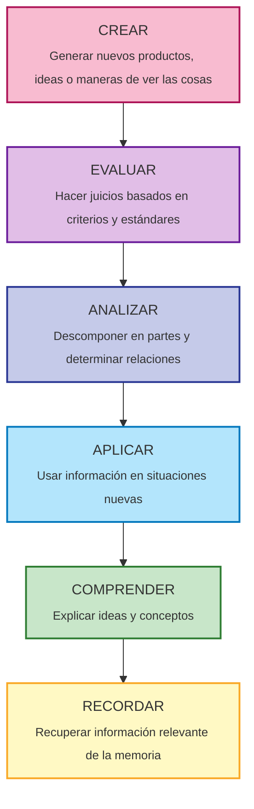
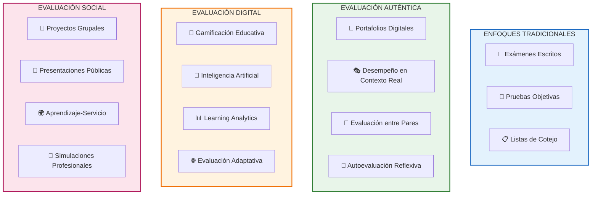
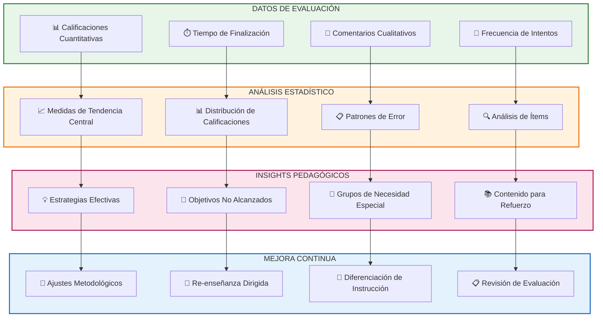

# Evaluación del Aprendizaje

> [!quote] _"La evaluación no es el final del aprendizaje, es el combustible que lo alimenta. Cuando se hace correctamente, la evaluación se convierte en el motor del crecimiento."_ – **Dylan Wiliam**

> [!info] **¿Qué es la Evaluación del Aprendizaje?** 🎯  
> La evaluación del aprendizaje es un **proceso sistemático y continuo** de recopilación, análisis e interpretación de evidencias sobre el progreso, logros y necesidades de aprendizaje de los estudiantes.  
> Va más allá de la calificación: busca **mejorar la enseñanza, orientar el aprendizaje** y proporcionar retroalimentación valiosa para todos los actores del proceso educativo.

---

## Propósitos y Funciones de la Evaluación

> [!tip] **Las 4 Dimensiones de la Evaluación Educativa**
> 
> - **📊 DIAGNÓSTICA (Punto de Partida)** → Identificar conocimientos previos y necesidades.
>     - _Timing_: Inicio de curso/unidad, antes de nueva instrucción.
>     - _Propósito_: Adaptar enseñanza, formar grupos, personalizar aprendizaje.
> - **🔄 FORMATIVA (Durante el Proceso)** → Monitorear progreso y ajustar estrategias.
>     - _Timing_: Continua durante el proceso de enseñanza-aprendizaje.
>     - _Propósito_: Feedback inmediato, corrección de errores, motivación.
> - **🎯 SUMATIVA (Resultado Final)** → Determinar logro de objetivos de aprendizaje.
>     - _Timing_: Final de unidad, semestre, curso o programa completo.
>     - _Propósito_: Certificación, promoción, acreditación, ranking.
> - **🔮 PREDICTIVA (Proyección Futura)** → Estimar rendimiento en contextos posteriores.
>     - _Timing_: Transiciones educativas, selección, admisiones.
>     - _Propósito_: Orientación vocacional, selección académica/profesional.

---

## Taxonomías y Niveles de Aprendizaje

> [!warning] **Alineación entre Objetivos, Metodología y Evaluación** ⚙️  
> **🎯 NIVEL RECORDAR**
> 
> |Verbos Clave|Estrategias de Evaluación|Ejemplos de Instrumentos|Limitaciones|
> |---|---|---|---|
> |Listar, definir, identificar|Pruebas objetivas, cuestionarios|Multiple choice, completar espacios|Solo mide memorización|
> 
> **💡 NIVEL COMPRENDER**
> 
> |Verbos Clave|Estrategias de Evaluación|Ejemplos de Instrumentos|Valor Agregado|
> |---|---|---|---|
> |Explicar, resumir, interpretar|Mapas conceptuales, paráfrasis|Ensayos cortos, diagramas|Evidencia comprensión real|
> 
> **⚡ NIVEL APLICAR**
> 
> |Verbos Clave|Estrategias de Evaluación|Ejemplos de Instrumentos|Contexto|
> |---|---|---|---|
> |Resolver, demostrar, usar|Casos prácticos, simulaciones|Problemas contextualizados, proyectos|Transferencia de conocimiento|
> 
> **🔍 NIVEL ANALIZAR**
> 
> |Verbos Clave|Estrategias de Evaluación|Ejemplos de Instrumentos|Complejidad|
> |---|---|---|---|
> |Comparar, contrastar, examinar|Estudios de caso, debates|Ensayos analíticos, matrices comparativas|Pensamiento crítico|
> 
> **⚖️ NIVEL EVALUAR**
> 
> |Verbos Clave|Estrategias de Evaluación|Ejemplos de Instrumentos|Criterio|
> |---|---|---|---|
> |Juzgar, criticar, valorar|Rúbricas, peer review|Evaluación de proyectos, críticas fundamentadas|Juicio informado|
> 
> **🚀 NIVEL CREAR**
> 
> |Verbos Clave|Estrategias de Evaluación|Ejemplos de Instrumentos|Innovación|
> |---|---|---|---|
> |Diseñar, construir, planificar|Portafolios, proyectos finales|Investigaciones originales, prototipos|Síntesis creativa|

---

## Metodologías de Evaluación Innovadoras

---

## Diseño de Instrumentos de Evaluación

> [!info] **Construcción de Rúbricas Efectivas** 💻
> 
> **📏 ESTRUCTURA DE RÚBRICA HOLÍSTICA**
> 
> - **Criterios** → Aspectos específicos que se van a evaluar.
> - **Niveles de Desempeño** → Escalas cualitativas (Excelente, Bueno, Regular, Insuficiente).
> - **Descriptores** → Explicaciones detalladas de cada nivel por criterio.
> - **Puntuación** → Valores numéricos asociados (opcional pero recomendado).
> 
> **🎯 EJEMPLO: RÚBRICA PARA ENSAYO ARGUMENTATIVO**
> 
> |Criterio|Excelente (4)|Bueno (3)|Regular (2)|Insuficiente (1)|
> |---|---|---|---|---|
> |**Tesis**|Clara, específica, defendible|Clara y específica|Presente pero vaga|Ausente o confusa|
> |**Argumentos**|Convincentes, bien desarrollados|Sólidos, adecuados|Superficiales|Débiles o irrelevantes|
> |**Evidencia**|Abundante y relevante|Suficiente y apropiada|Limitada|Inadecuada o ausente|
> |**Organización**|Lógica y fluida|Clara y coherente|Predecible|Confusa o ausente|
> |**Escritura**|Precisa y elegante|Clara y correcta|Aceptable con errores menores|Difícil de seguir|

---

## Feedback Efectivo y Mejora Continua

> [!tip] **Principios del Feedback que Transforma** 🎭  
> **⏰ OPORTUNIDAD (Timing)**
> 
> - 🚀 _Inmediato cuando es posible, especialmente para habilidades procedimentales._
> - 🎯 _Programado regularmente para procesos complejos y proyectos largos._
> - 🔄 _Justo antes de oportunidades para aplicar mejoras sugeridas._
> 
> **🎯 ESPECIFICIDAD (Precisión)**
> 
> - ✅ _"Tu introducción captura la atención pero podría beneficiarse de una estadística impactante."_
> - ❌ _"Tu introducción está bien pero podría mejorar."_
> - 💡 _Referencia específica a criterios de evaluación establecidos._
> 
> **⚖️ EQUILIBRIO (Balance)**
> 
> - 🌟 _Reconocer fortalezas específicas demostradas._
> - 🔧 _Identificar 1-3 áreas prioritarias para mejora._
> - 🗺️ _Proporcionar pasos concretos para avanzar._
> 
> **🎪 ORIENTACIÓN A LA ACCIÓN (Practicidad)**
> 
> - 📋 _Sugerir estrategias específicas y realizables._
> - 🎯 _Conectar feedback con objetivos de aprendizaje._
> - 🔄 _Incluir oportunidades para revisar y mejorar._

---

## Evaluación Formativa Continua

> [!warning] **Técnicas de Monitoreo en Tiempo Real** ⚙️  
> **🚦 TÉCNICAS DE SEMÁFORO**
> 
> - **Verde** → "Lo entiendo completamente y puedo explicárselo a otros."
> - **Amarillo** → "Lo entiendo parcialmente, tengo algunas dudas."
> - **Rojo** → "No lo entiendo, necesito ayuda adicional."
> 
> **🎫 TICKETS DE SALIDA (Exit Tickets)**
> 
> - **¿Qué aprendiste hoy?** → Síntesis personal del contenido clave.
> - **¿Qué te resultó más confuso?** → Identificación de obstáculos.
> - **¿Qué pregunta tienes?** → Guía para la próxima sesión.
> 
> **📊 SONDEOS RÁPIDOS DIGITALES**
> 
> - **Kahoot** → Gamificación de preguntas de comprensión.
> - **Mentimeter** → Nubes de palabras y escalas de confianza.
> - **Poll Everywhere** → Preguntas abiertas y múltiple opción en tiempo real.
> 
> **🤝 EVALUACIÓN ENTRE PARES**
> 
> - **Think-Pair-Share** → Reflexión individual → discusión → compartir.
> - **Peer Review** → Evaluación mutua usando criterios específicos.
> - **Gallery Walk** → Exhibición y feedback sobre trabajos de compañeros.

---

## Análisis de Datos e Interpretación

---

## Consideraciones Éticas y de Equidad

> [!info] **Principios de Evaluación Justa e Inclusiva** 💡
> 
> **🌈 DIVERSIDAD Y ACCESIBILIDAD**
> 
> - **Múltiples Formatos** → Opciones para diferentes estilos de aprendizaje y capacidades.
> - **Adaptaciones Razonables** → Tiempo extendido, lectores, tecnología asistiva.
> - **Sensibilidad Cultural** → Contenido y ejemplos que respeten la diversidad.
> 
> **⚖️ TRANSPARENCIA Y JUSTICIA**
> 
> - **Criterios Claros** → Rúbricas y expectativas comunicadas previamente.
> - **Consistencia** → Mismos estándares aplicados a todos los estudiantes.
> - **Oportunidades Múltiples** → Varias chances para demostrar aprendizaje.
> 
> **🔒 PRIVACIDAD Y CONFIDENCIALIDAD**
> 
> - **Protección de Datos** → Manejo seguro de información de evaluación.
> - **Retroalimentación Privada** → Comunicación individual de resultados.
> - **Consentimiento Informado** → Claridad sobre uso de datos de evaluación.

---

## Tecnología y Herramientas Digitales

> [!warning] **Plataformas de Evaluación Digital** 📊
> 
> **🎓 SISTEMAS DE GESTIÓN DE APRENDIZAJE (LMS)**
> 
> - **Moodle** → Open source, altamente personalizable, evaluación integrada.
> - **Canvas** → Interfaz intuitiva, SpeedGrader para feedback rápido.
> - **Google Classroom** → Simplicidad, integración con Google Workspace.
> - **Blackboard** → Robusto para instituciones grandes, analytics avanzado.
> 
> **⚡ HERRAMIENTAS ESPECIALIZADAS**
> 
> - **Kahoot/Quizizz** → Gamificación de evaluación formativa en tiempo real.
> - **Flipgrid** → Videos de respuesta para evaluación auténtica de expresión oral.
> - **Padlet** → Muros colaborativos para evaluación de participación y creatividad.
> - **Turnitin** → Detección de plagio y feedback automatizado de escritura.
> 
> **🤖 EVALUACIÓN ADAPTATIVA E IA**
> 
> - **ALEKS** → Evaluación adaptativa en matemáticas y ciencias.
> - **DreamBox** → Personalización automática basada en respuestas del estudiante.
> - **Gradescope** → Calificación asistida por IA para respuestas abiertas.

---

> [!tip] **Técnica de Estudio: Método EVALUAR** 🧠  
> **E**stablecer objetivos de aprendizaje claros y medibles.  
> **V**ariar instrumentos según propósito y nivel taxonómico.  
> **A**nalizar datos para identificar patrones y necesidades.  
> **L**ograr feedback oportuno, específico y orientado a la acción.  
> **U**sar resultados para ajustar enseñanza y aprendizaje.  
> **A**plicar principios de equidad, transparencia y ética.  
> **R**eflexionar y mejorar continuamente el proceso evaluativo.

---

> [!quote] **Enlaces a Otras Notas**
> 
> - [[Evaluación 360°]]
> - [[Autoevaluación de Competencias]]
> - [[Evaluación Formativa vs Sumativa]]
> - [[Feedback y Coaching]]
> - [[Metacognición]]
> - [[Aprendizaje Colaborativo]]

---

> [!info] **Prerrequisitos y Complementos** 📚  
> **Prerrequisitos**
> 
> - [[Objetivos SMART]]
> - [[Pensamiento Crítico]]
> - [[Metacognición]]
> - [[Técnicas de Comunicación]]
> 
> **Para Profundizar**
> 
> - [[Gamificación Colaborativa]]
> - [[Sistema Cornell de Notas]]
> - [[Neurociencia del Aprendizaje]]
> - [[Mentoría y Coaching de Aprendizaje]]
> - [[Hábitos de Estudio]]

---

**Tags**: #evaluación #aprendizaje #feedback #assessment #taxonomía-bloom #rúbricas #evaluación-formativa #evaluación-sumativa #herramientas-digitales #análisis-datos

---