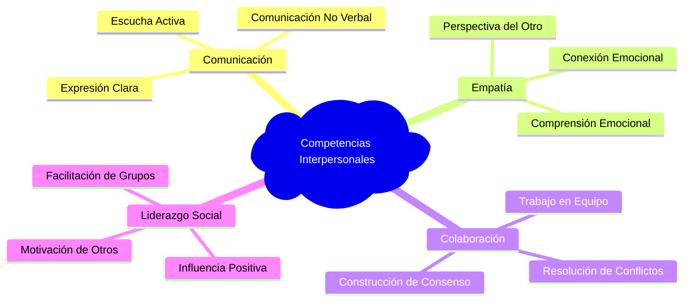
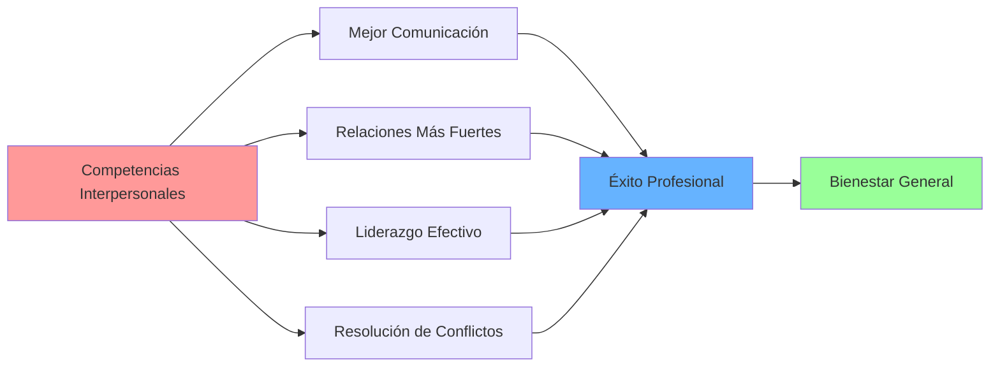

# Competencias Interpersonales 🤝

>[!quote] "La habilidad más importante en la vida es saber llevarse bien con otras personas. Todo lo demás es secundario." - John D. Rockefeller

## Definición y Fundamentos

> [!info] **¿Qué son las Competencias Interpersonales?** Las competencias interpersonales son el conjunto de habilidades sociales, emocionales y comunicativas que nos permiten relacionarnos efectivamente con otras personas. Estas competencias incluyen la capacidad de:
> 
> - **Comunicar ideas de forma clara y empática** 💬
> - **Construir y mantener relaciones positivas** 🌟
> - **Resolver conflictos de manera constructiva** ⚖️
> - **Trabajar colaborativamente en equipos** 👥
> - **Influir y liderar sin autoridad formal** 🎯



## Componentes Clave de las Competencias Interpersonales

> [!tip] **Las 5 Dimensiones Esenciales**
> 
> ### 1. **Comunicación Efectiva** 🗣️
> 
> - **Claridad en el mensaje**: Expresar ideas de forma comprensible
> - **Escucha activa**: Prestar atención completa al interlocutor
> - **Adaptación del estilo**: Ajustar la comunicación al contexto y audiencia
> - **Feedback constructivo**: Dar y recibir retroalimentación de manera efectiva
> 
> ### 2. **Inteligencia Emocional** 🧠❤️
> 
> - **Autoconciencia emocional**: Reconocer nuestras propias emociones
> - **Autorregulación**: Gestionar nuestras reacciones emocionales
> - **Empatía**: Comprender y conectar con las emociones de otros
> - **Habilidades sociales**: Aplicar la IE en interacciones sociales
> 
> ### 3. **Construcción de Relaciones** 🌐
> 
> - **Rapport**: Crear conexión y confianza con otros
> - **Networking genuino**: Desarrollar redes profesionales auténticas
> - **Mantenimiento de relaciones**: Cultivar vínculos a largo plazo
> - **Diversidad e inclusión**: Valorar y trabajar con personas diferentes
> 
> ### 4. **Resolución de Conflictos** ⚡
> 
> - **Identificación temprana**: Detectar tensiones antes de que escalen
> - **Mediación**: Facilitar soluciones entre partes en conflicto
> - **Negociación win-win**: Buscar soluciones que beneficien a todos
> - **Gestión de emociones**: Mantener la calma en situaciones tensas
> 
> ### 5. **Liderazgo e Influencia** 🎖️
> 
> - **Influencia sin autoridad**: Motivar sin poder formal
> - **Coaching y mentoría**: Desarrollar a otros a través de la relación
> - **Facilitación**: Guiar grupos hacia objetivos comunes
> - **Inspiración**: Motivar a otros hacia una visión compartida

## Desarrollo de Competencias Interpersonales

> [!warning] **Desafíos Comunes en el Desarrollo**
> 
> |Desafío|Impacto|Estrategia de Superación|
> |---|---|---|
> |**Miedo al rechazo** 😰|Evita iniciativas sociales|Práctica gradual en entornos seguros|
> |**Comunicación poco clara** 🤔|Malentendidos y conflictos|Técnicas de comunicación asertiva|
> |**Falta de empatía** 💔|Relaciones superficiales|Desarrollo de escucha activa|
> |**Dificultad para conflictos** 😤|Evitación o escalamiento|Entrenamiento en mediación|
> |**Resistencia al feedback** 🛡️|Estancamiento personal|Mentalidad de crecimiento|

> [!tip] **Estrategias de Desarrollo Efectivas**
> 
> ### **Método CARE para Relaciones Interpersonales** 🎯
> 
> ```mermaid
> flowchart TD
>    C[Connect - Conectar] --> A[Acknowledge - Reconocer]
>    A --> R[Respond - Responder]
>    R --> E[Evaluate - Evaluar]
>    E --> C
>    
>    style C fill:#e1f5fe
>    style A fill:#f3e5f5
>    style R fill:#e8f5e8
>    style E fill:#fff3e0
> ```
> 
> - **C - Connect**: Establece conexión genuina desde el primer contacto
> - **A - Acknowledge**: Reconoce y valida las perspectivas de otros
> - **R - Respond**: Responde de manera apropiada y empática
> - **E - Evaluate**: Evalúa y ajusta tu enfoque basado en los resultados

### Técnicas de Práctica y Mejora

> [!info] **Plan de Desarrollo de 30 Días**
> 
> #### **Semana 1-2: Fundamentos de Comunicación** 📚
> 
> - Practicar escucha activa 15 minutos diarios
> - Hacer 3 preguntas abiertas por conversación
> - Observar y mejorar lenguaje corporal
> - Ejercitar la paráfrasis para confirmar comprensión
> 
> #### **Semana 3: Inteligencia Emocional** 🧘‍♀️
> 
> - Registro diario de emociones y triggers
> - Practicar técnicas de autorregulación
> - Ejercicios de empatía: "ponerse en los zapatos del otro"
> - Mindfulness en interacciones sociales
> 
> #### **Semana 4: Aplicación Práctica** 🚀
> 
> - Iniciar 2 conversaciones significativas por día
> - Practicar dar feedback constructivo
> - Facilitar una pequeña reunión o discusión
> - Reflexionar y ajustar estrategias basadas en resultados

## Mnemotecnia para Competencias Interpersonales

> [!tip] **Técnica Mnemotécnica: "SOCIAL POWER"** 🧠✨
> 
> **S** - **S**onríe genuinamente y mantén contacto visual **O** - **O**bserva el lenguaje corporal y señales no verbales **C** - **C**onecta emocionalmente con empatía **I** - **I**nteresa genuinamente por la otra persona **A** - **A**dáptate al estilo de comunicación del otro **L** - **L**ibera juicios y mantén mente abierta
> 
> **P** - **P**regunta más, habla menos **O** - **O**frece valor en cada interacción **W** - **W**in-Win: busca soluciones beneficiosas para todos **E** - **E**scucha con todo tu ser, no solo con los oídos **R** - **R**esponde con propósito y consideración

## Aplicaciones Prácticas

> [!warning] **Contextos de Aplicación Críticos**
> 
> ### **En el Ámbito Profesional** 💼
> 
> - Reuniones de equipo y presentaciones
> - Negociaciones y resolución de conflictos laborales
> - Networking y construcción de relaciones profesionales
> - Liderazgo de proyectos y gestión de equipos
> 
> ### **En el Desarrollo Personal** 🌱
> 
> - Relaciones familiares y de amistad
> - Comunidades y grupos sociales
> - Situaciones de aprendizaje y mentoría
> - Participación en organizaciones voluntarias



## Referencias y Conexiones

> [!quote] **Enlaces a Otras Notas**
> 
> - [[Inteligencia Emocional]] - Base fundamental para las competencias interpersonales
> - [[Técnicas de Comunicación]] - Herramientas específicas de comunicación efectiva
> - [[Habilidades Sociales]] - Conjunto amplio de habilidades para interacción social
> - [[Gestión de Conflictos]] - Estrategias específicas para manejar desacuerdos
> - [[Pensamiento Crítico]] - Habilidad complementaria para análisis de situaciones sociales
> - [[Liderazgo Situacional]] - Aplicación de competencias interpersonales en liderazgo

> [!info] **Notas Recomendadas para Profundizar**
> 
> ### **Prerrequisitos** 📋
> 
> - [[Autoconocimiento]] - Conocerse a uno mismo antes de relacionarse con otros
> - [[Clarificación de Valores]] - Tener claridad sobre principios personales
> - [[Construcción de Confianza]] - Base para todas las relaciones interpersonales
> - [[Mindfulness]] - Presencia consciente en las interacciones
> 
> ### **Complementarias** 🔗
> 
> - [[Comunicación Intercultural]] - Competencias para contextos diversos
> - [[Feedback y Coaching]] - Habilidades específicas de desarrollo de otros
> - [[Influencia sin Autoridad]] - Técnicas de persuasión ética
> - [[Team Building]] - Aplicación en construcción de equipos
> - [[Facilitación de Grupos]] - Habilidades para guiar grupos efectivamente

---

**Tags:** #competencias-sociales #comunicación-efectiva #inteligencia-emocional #liderazgo-personal #desarrollo-interpersonal #habilidades-blandas #trabajo-en-equipo #networking #resolución-conflictos #empatía