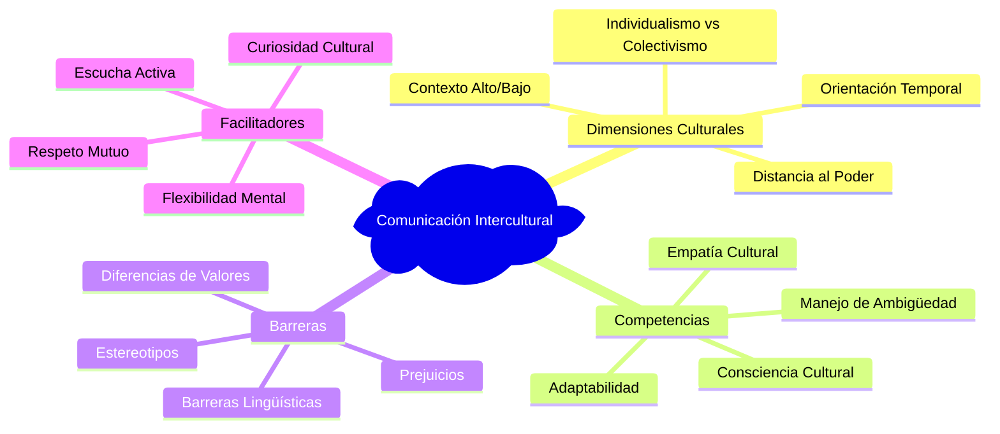
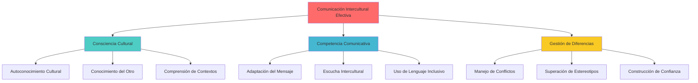
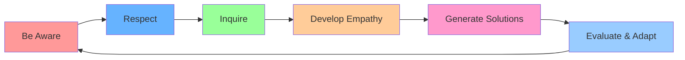

# Comunicación Intercultural 🌍

>[!quote] _"La diversidad cultural es tan necesaria para el género humano como la biodiversidad lo es para la naturaleza."_ - Claude Lévi-Strauss

## Definición y Fundamentos

> [!info] **¿Qué es la Comunicación Intercultural?** La comunicación intercultural es el proceso de intercambio de información, ideas y sentimientos entre personas de diferentes orígenes culturales. Implica:
> 
> - **Comprensión de diferencias culturales** 🎭
> - **Adaptación del estilo comunicativo** 🔄
> - **Superación de barreras culturales** 🚧
> - **Desarrollo de sensibilidad intercultural** 💝
> - **Construcción de puentes entre culturas** 🌉

## Marco Teórico: Dimensiones Culturales de Hofstede

> [!tip] **Las 6 Dimensiones Culturales Clave** 📊
> 
> ### 1. **Distancia al Poder** 👑
> 
> - **Alta distancia**: Jerarquías marcadas, respeto automático a la autoridad
> - **Baja distancia**: Relaciones más igualitarias, cuestionar autoridad es aceptable
> 
> ### 2. **Individualismo vs Colectivismo** 👤👥
> 
> - **Individualista**: Autonomía personal, decisiones independientes
> - **Colectivista**: Bienestar grupal, decisiones consensuadas
> 
> ### 3. **Masculinidad vs Feminidad** ⚖️
> 
> - **Masculino**: Competitividad, logros, asertividad
> - **Femenino**: Cooperación, calidad de vida, relaciones
> 
> ### 4. **Evitación de la Incertidumbre** 🎯
> 
> - **Alta evitación**: Necesidad de reglas claras, resistencia al cambio
> - **Baja evitación**: Tolerancia a la ambigüedad, flexibilidad
> 
> ### 5. **Orientación Temporal** ⏰
> 
> - **Corto plazo**: Tradición, resultados inmediatos
> - **Largo plazo**: Adaptabilidad, perseverancia
> 
> ### 6. **Indulgencia vs Restricción** 🎉
> 
> - **Indulgente**: Libertad para satisfacer deseos naturales
> - **Restrictivo**: Regulación social estricta de comportamientos

## Barreras en la Comunicación Intercultural

> [!warning] **Principales Obstáculos y Sus Soluciones**
> 
> |Barrera|Descripción|Impacto|Estrategia de Superación|
> |---|---|---|---|
> |**Etnocentrismo** 🎯|Juzgar otras culturas desde la propia|Prejuicios y malentendidos|Desarrollar perspectiva relativista|
> |**Estereotipos** 🏷️|Generalizaciones sobre grupos culturales|Comunicación superficial|Conocimiento individualizado|
> |**Diferencias de Valores** ⚖️|Prioridades y principios distintos|Conflictos de expectativas|Diálogo sobre valores subyacentes|
> |**Barreras Lingüísticas** 🗣️|Limitaciones en idioma común|Mensajes mal interpretados|Comunicación multimodal|
> |**Comunicación No Verbal** 👐|Gestos y expresiones culturalmente específicos|Señales contradictorias|Educación en códigos no verbales|
> |**Ritmo y Tiempo** ⏱️|Conceptos diferentes de puntualidad|Malentendidos logísticos|Clarificación de expectativas temporales|

## Competencias Interculturales Esenciales

> [!tip] **Desarrollo de Habilidades Interculturales**
> 
> ### **1. Consciencia Cultural** 🧠
> 
> - **Autoconocimiento**: Reconocer nuestras propias lentes culturales
> - **Conocimiento del otro**: Aprender sobre otras culturas sin generalizar
> - **Metacognición cultural**: Reflexionar sobre procesos de percepción cultural
> 
> ### **2. Sensibilidad Intercultural** 💝
> 
> - **Empatía cultural**: Capacidad de ver desde perspectivas diferentes
> - **Suspensión de juicios**: Evitar evaluaciones prematuras
> - **Curiosidad genuina**: Interés auténtico por otras formas de vida
> 
> ### **3. Adaptabilidad Comunicativa** 🔄
> 
> - **Flexibilidad de estilo**: Ajustar comunicación según contexto cultural
> - **Tolerancia a la ambigüedad**: Comodidad con situaciones inciertas
> - **Code-switching**: Alternar entre códigos culturales apropiados
> 
> ### **4. Gestión de Diferencias** ⚡
> 
> - **Mediación intercultural**: Facilitar entendimiento entre culturas
> - **Resolución de malentendidos**: Clarificar diferencias culturales
> - **Construcción de puentes**: Encontrar puntos de conexión común

## Estrategias Prácticas de Comunicación

> [!info] **Técnicas para Comunicación Intercultural Efectiva**
> 
> ### **Antes de la Interacción** 📋
> 
> - Investigar contexto cultural del interlocutor
> - Preparar múltiples formas de explicar conceptos clave
> - Revisar propios sesgos y expectativas culturales
> - Establecer intención de aprendizaje mutuo
> 
> ### **Durante la Comunicación** 💬
> 
> - Usar lenguaje simple y claro, evitar jerga
> - Verificar comprensión frecuentemente
> - Observar señales no verbales de confusión
> - Mostrar paciencia con ritmos diferentes
> - Hacer preguntas abiertas sobre perspectivas
> 
> ### **Después del Intercambio** 📝
> 
> - Reflexionar sobre lo aprendido culturalmente
> - Identificar momentos de malentendido
> - Ajustar estrategias para futuras interacciones
> - Buscar feedback sobre efectividad comunicativa

## Modelo BRIDGE para Comunicación Intercultural

> [!tip] **Técnica Mnemotécnica: "BRIDGE"** 🌉
> 
> **B** - **B**e aware of cultural differences (Sé consciente de diferencias culturales) **R** - **R**espect diverse perspectives (Respeta perspectivas diversas) **I** - **I**nquire with genuine curiosity (Indaga con curiosidad genuina) **D** - **D**evelop cultural empathy (Desarrolla empatía cultural) **G** - **G**enerate inclusive solutions (Genera soluciones inclusivas) **E** - **E**valuate and adapt continuously (Evalúa y adáptate continuamente)

## Contextos de Aplicación

> [!warning] **Situaciones Críticas de Comunicación Intercultural**
> 
> ### **Entorno Empresarial** 🏢
> 
> - **Equipos multiculturales**: Gestión de diversidad en equipos globales
> - **Negociaciones internacionales**: Estilos de negociación culturalmente apropiados
> - **Servicio al cliente global**: Adaptación a expectativas culturales diversas
> - **Fusiones y adquisiciones**: Integración de culturas organizacionales
> 
> ### **Ámbito Educativo** 📚
> 
> - **Aulas multiculturales**: Pedagogía inclusiva e intercultural
> - **Programas de intercambio**: Preparación para inmersión cultural
> - **Investigación colaborativa**: Metodologías culturalmente sensibles
> 
> ### **Contexto Social y Comunitario** 🏘️
> 
> - **Integración de migrantes**: Facilitación de adaptación cultural
> - **Organizaciones interculturales**: Liderazgo en contextos diversos
> - **Conflictos interétnicos**: Mediación y construcción de paz

## Plan de Desarrollo de Competencia Intercultural

> [!info] **Programa de 6 Semanas** 🗓️
> 
> #### **Semana 1-2: Autoconocimiento Cultural** 🪞
> 
> - Identificar valores culturales personales
> - Reconocer sesgos y estereotipos propios
> - Reflexionar sobre experiencias interculturales pasadas
> - Práctica: Diario de reflexión cultural diaria
> 
> #### **Semana 3-4: Conocimiento del Otro** 🌍
> 
> - Estudiar culturas específicas de interés
> - Consumir media de diferentes culturas
> - Entrevistas a personas de otras culturas
> - Práctica: Conversaciones interculturales semanales
> 
> #### **Semana 5-6: Aplicación Práctica** 🚀
> 
> - Participar en eventos interculturales
> - Facilitar diálogos entre culturas diferentes
> - Aplicar técnicas BRIDGE en situaciones reales
> - Práctica: Proyecto intercultural colaborativo

## Tecnología y Comunicación Intercultural

> [!tip] **Herramientas Digitales para Comunicación Global** 💻
> 
> ### **Plataformas de Comunicación**
> 
> - **Aplicaciones de traducción en tiempo real**
> - **Herramientas de videoconferencia con funciones culturales**
> - **Redes sociales profesionales globales**
> - **Plataformas de intercambio cultural virtual**
> 
> ### **Recursos de Aprendizaje**
> 
> - **Cursos online sobre culturas específicas**
> - **Simuladores de situaciones interculturales**
> - **Apps de protocolo cultural y etiqueta**
> - **Bases de datos de diferencias culturales empresariales**

## Referencias y Conexiones

> [!quote] **Enlaces a Otras Notas**
> 
> - [[Competencias Interpersonales]] - Base fundamental para interacción entre culturas
> - [[Técnicas de Comunicación]] - Herramientas comunicativas aplicables interculturalmente
> - [[Inteligencia Emocional]] - Gestión emocional en contextos culturales diversos
> - [[Diversidad e Inclusión]] - Marco organizacional para la comunicación intercultural
> - [[Gestión de Conflictos]] - Resolución de tensiones culturales
> - [[Pensamiento Crítico]] - Análisis de situaciones culturales complejas

> [!info] **Notas Recomendadas para Profundizar**
> 
> ### **Prerrequisitos** 📋
> 
> - [[Autoconocimiento]] - Comprensión de la propia identidad cultural
> - [[Clarificación de Valores]] - Reconocimiento de valores culturalmente influenciados
> - [[Mindfulness]] - Presencia consciente en interacciones culturales
> - [[Habilidades Sociales]] - Base para comunicación efectiva general
> 
> ### **Complementarias** 🔗
> 
> - [[Comunicación Efectiva]] - Principios generales de comunicación
> - [[Liderazgo Situacional]] - Adaptación de liderazgo a contextos culturales
> - [[Facilitación de Grupos]] - Manejo de grupos multiculturales
> - [[Influencia sin Autoridad]] - Persuasión en contextos culturales diversos
> - [[Team Building]] - Construcción de equipos interculturales
> - [[Feedback y Coaching]] - Desarrollo intercultural de personas

---

**Tags:** #comunicación-intercultural #diversidad-cultural #competencias-globales #multiculturalismo #comunicación-efectiva #sensibilidad-cultural #equipos-globales #inclusión #adaptabilidad #empatía-cultural #hofstede #comunicación-no-verbal