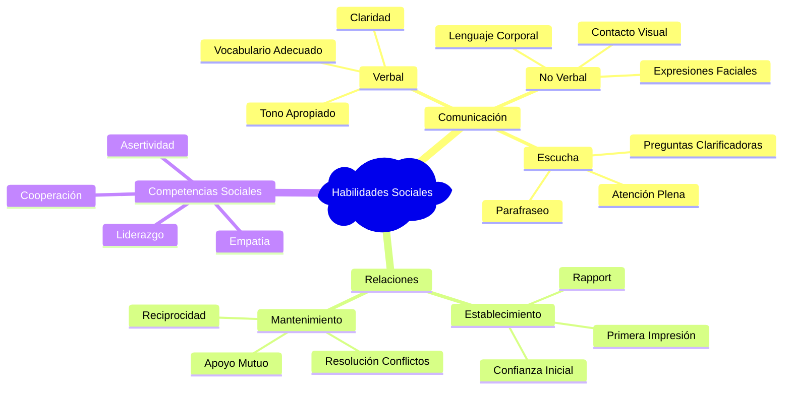
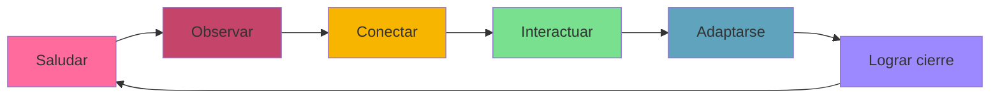

# Habilidades Sociales 🤝

>[!quote] _"Las habilidades sociales no son un lujo, son una necesidad. Son la moneda de cambio en el mundo de las relaciones humanas."_ - Daniel Goleman

## Definición y Fundamentos

> [!info] **¿Qué son las Habilidades Sociales?** Las habilidades sociales son un conjunto de capacidades que nos permiten interactuar de manera efectiva y satisfactoria con otras personas. Incluyen:
> 
> - **Comunicación verbal y no verbal efectiva** 💬
> - **Capacidad de establecer y mantener relaciones** 🤝
> - **Habilidad para leer señales sociales** 👀
> - **Competencia para manejar situaciones sociales diversas** 🎭
> - **Capacidad de influir positivamente en otros** ✨
> - **Habilidad para trabajar colaborativamente** 👥



## Taxonomía de Habilidades Sociales

> [!tip] **Las 7 Categorías Fundamentales** 🎯
> 
> ### 1. **Habilidades de Comunicación** 🗣️
> 
> - **Expresión clara**: Comunicar ideas de forma comprensible
> - **Escucha activa**: Prestar atención completa al interlocutor
> - **Comunicación asertiva**: Expresar opiniones respetando a otros
> - **Feedback constructivo**: Dar y recibir críticas positivamente
> 
> ### 2. **Habilidades de Iniciación Social** 🌟
> 
> - **Presentación personal**: Causar buena primera impresión
> - **Iniciar conversaciones**: Romper el hielo apropiadamente
> - **Unirse a grupos**: Integrarse en situaciones sociales existentes
> - **Hacer invitaciones**: Proponer actividades sociales
> 
> ### 3. **Habilidades de Cooperación** 🤲
> 
> - **Trabajo en equipo**: Colaborar efectivamente con otros
> - **Compartir recursos**: Distribución equitativa y generosa
> - **Seguir instrucciones**: Acatar directrices grupales
> - **Ayudar a otros**: Ofrecer asistencia proactivamente
> 
> ### 4. **Habilidades de Autocontrol** 🧘‍♀️
> 
> - **Manejo de emociones**: Regular respuestas emocionales
> - **Control de impulsos**: Pensar antes de actuar
> - **Tolerancia a la frustración**: Manejar contratiempos
> - **Seguir reglas sociales**: Respetar normas implícitas y explícitas
> 
> ### 5. **Habilidades de Empatía** ❤️
> 
> - **Perspectiva del otro**: Ver situaciones desde otros puntos de vista
> - **Reconocimiento emocional**: Identificar emociones ajenas
> - **Respuesta empática**: Reaccionar apropiadamente a emociones
> - **Apoyo emocional**: Brindar consuelo y comprensión
> 
> ### 6. **Habilidades de Resolución de Problemas** 🔧
> 
> - **Identificación de problemas**: Reconocer tensiones sociales
> - **Búsqueda de soluciones**: Generar alternativas creativas
> - **Toma de decisiones grupales**: Facilitar consensos
> - **Mediación**: Ayudar a resolver conflictos entre otros
> 
> ### 7. **Habilidades de Liderazgo Social** 👑
> 
> - **Influencia positiva**: Motivar comportamientos constructivos
> - **Organización grupal**: Coordinar actividades colectivas
> - **Delegación**: Asignar responsabilidades apropiadamente
> - **Inspiración**: Motivar a otros hacia objetivos comunes

## Desarrollo de Habilidades Sociales por Etapas

> [!warning] **Niveles de Competencia Social**
> 
> ```mermaid
> flowchart TD
>    A[Nivel 1: Básico] --> B[Nivel 2: Intermedio]
>    B --> C[Nivel 3: Avanzado]
>    C --> D[Nivel 4: Experto]
>    
>    A1[Comunicación simple<br/>Seguir normas básicas<br/>Interacciones superficiales] --> A
>    B1[Relaciones estables<br/>Manejo de conflictos<br/>Comunicación asertiva] --> B
>    C1[Liderazgo grupal<br/>Influencia positiva<br/>Mediación compleja] --> C
>    D1[Mentoring social<br/>Transformación cultural<br/>Impacto sistémico] --> D
>    
>    style A fill:#ffcccb
>    style B fill:#ffd700
>    style C fill:#90ee90
>    style D fill:#87ceeb
> ```
> 
> |Nivel|Características|Habilidades Clave|Contextos Típicos|
> |---|---|---|---|
> |**Básico** 🌱|Interacciones simples y directas|Cortesía, seguir turnos, escucha básica|Presentaciones, saludos, conversaciones casuales|
> |**Intermedio** 🌿|Relaciones más profundas y estables|Asertividad, empatía, resolución básica de conflictos|Amistad, trabajo en equipo, relaciones familiares|
> |**Avanzado** 🌳|Liderazgo e influencia social|Facilitación, coaching, negociación|Liderazgo de equipos, mentoring, gestión|
> |**Experto** 🏆|Transformación social y cultural|Cambio sistémico, inspiración masiva, legado social|Liderazgo organizacional, movimientos sociales|

## Barreras Comunes y Estrategias de Superación

> [!warning] **Obstáculos Frecuentes en el Desarrollo Social**
> 
> ### **Barreras Internas** 🚧
> 
> |Barrera|Manifestación|Estrategia de Superación|
> |---|---|---|
> |**Ansiedad Social** 😰|Evitación de situaciones sociales|Exposición gradual y técnicas de relajación|
> |**Baja Autoestima** 😔|Sentirse inferior en interacciones|Desarrollo de autoconocimiento y logros pequeños|
> |**Perfeccionismo** 🎯|Miedo al rechazo o al error|Aceptar imperfecciones y aprender de errores|
> |**Timidez Excesiva** 🙈|Dificultad para iniciar interacciones|Práctica en entornos seguros y scripts sociales|
> 
> ### **Barreras Externas** 🌪️
> 
> |Barrera|Manifestación|Estrategia de Superación|
> |---|---|---|
> |**Diferencias Culturales** 🌍|Malentendidos por normas distintas|Educación intercultural y curiosidad genuina|
> |**Entornos Hostiles** ⚡|Contextos que desalientan la socialización|Buscar espacios más receptivos y apoyo|
> |**Falta de Modelos** 👤|Ausencia de ejemplos positivos|Mentoring y observación de referentes sociales|
> |**Tecnología Excesiva** 📱|Preferencia por interacción digital|Equilibrio digital y práctica presencial|

## Técnicas de Desarrollo Práctico

> [!tip] **Método SOCIAL para Mejorar Habilidades Sociales** 🎯
> 
> **S** - **S**aludar apropiadamente y hacer contacto visual **O** - **O**bservar señales no verbales y contexto **C** - **C**onectar a través de intereses comunes **I** - **I**nteractuar con preguntas abiertas y escucha **A** - **A**daptarse al estilo y ritmo del otro **L** - **L**ograre una despedida positiva y seguimiento



> [!info] **Ejercicios Prácticos de Desarrollo** 💪
> 
> ### **Semana 1-2: Fundamentos de Comunicación** 📚
> 
> - **Práctica diaria de contacto visual** (5 minutos/día)
> - **Ejercicio de escucha activa** (parafrasear en conversaciones)
> - **Registro de tonos de voz** y ajustes según contexto
> - **Práctica de preguntas abiertas** (mínimo 3 por conversación)
> 
> ### **Semana 3-4: Iniciación y Mantenimiento** 🚀
> 
> - **Iniciar 2 conversaciones nuevas diariamente**
> - **Practicar presentaciones personales** en diferentes contextos
> - **Ejercicios de rapport**: encontrar puntos en común
> - **Seguimiento de relaciones**: contactar personas del pasado
> 
> ### **Semana 5-6: Situaciones Complejas** 🎭
> 
> - **Práctica de asertividad**: expresar desacuerdos respetuosamente
> - **Mediación en conflictos menores** entre conocidos
> - **Liderazgo de actividades grupales** pequeñas
> - **Ejercicios de influencia positiva** y motivación

## Habilidades Sociales en Diferentes Contextos

> [!info] **Aplicación Contextual de Habilidades** 🎯
> 
> ### **Contexto Profesional** 💼
> 
> - **Networking estratégico**: Construcción de redes profesionales
> - **Presentaciones públicas**: Comunicación efectiva a audiencias
> - **Trabajo en equipo**: Colaboración y sinergia grupal
> - **Liderazgo**: Influencia y motivación de equipos
> - **Negociación**: Búsqueda de acuerdos win-win
> - **Gestión de conflictos**: Mediación en tensiones laborales
> 
> ### **Contexto Personal** 💕
> 
> - **Relaciones de pareja**: Comunicación íntima y apoyo mutuo
> - **Amistad**: Construcción y mantenimiento de vínculos cercanos
> - **Familia**: Manejo de dinámicas familiares complejas
> - **Crianza**: Desarrollo de habilidades sociales en hijos
> - **Comunidad**: Participación activa en entornos sociales
> 
> ### **Contexto Académico** 📚
> 
> - **Participación en clase**: Contribución efectiva a discusiones
> - **Trabajo grupal**: Colaboración en proyectos académicos
> - **Presentaciones**: Comunicación de ideas a pares y profesores
> - **Tutorías**: Apoyo académico entre estudiantes
> - **Actividades extracurriculares**: Liderazgo estudiantil

## Evaluación y Autoevaluación de Habilidades Sociales

> [!tip] **Herramientas de Autoevaluación** 📊
> 
> ### **Escala de Competencia Social (1-5 puntos)**
> 
> |Habilidad|Nivel Actual|Meta|Estrategias|
> |---|---|---|---|
> |**Comunicación verbal** 🗣️|___/5|___/5|_______________|
> |**Escucha activa** 👂|___/5|___/5|_______________|
> |**Empatía** ❤️|___/5|___/5|_______________|
> |**Asertividad** 💪|___/5|___/5|_______________|
> |**Resolución de conflictos** ⚖️|___/5|___/5|_______________|
> |**Liderazgo** 👑|___/5|___/5|_______________|
> |**Trabajo en equipo** 👥|___/5|___/5|_______________|
> |**Adaptabilidad social** 🔄|___/5|___/5|_______________|
> 
> ### **Indicadores de Progreso** 📈
> 
> - **Frecuencia de interacciones sociales positivas**
> - **Calidad de relaciones establecidas y mantenidas**
> - **Capacidad de manejar situaciones sociales desafiantes**
> - **Feedback positivo de otros sobre habilidades sociales**
> - **Nivel de comodidad en diversos contextos sociales**

## Habilidades Sociales Digitales

> [!warning] **Adaptación a la Era Digital** 💻
> 
> ### **Competencias para Interacción Virtual** 🌐
> 
> - **Comunicación por videoconferencia**: Presencia y engagement virtual
> - **Etiqueta digital**: Normas apropiadas para diferentes plataformas
> - **Construcción de relaciones online**: Networking y colaboración digital
> - **Gestión de presencia digital**: Imagen profesional en redes sociales
> - **Comunicación multicultural digital**: Sensibilidad en contextos globales
> 
> ### **Equilibrio Digital-Presencial** ⚖️
> 
> - **Límites saludables**: Cuándo elegir interacción presencial vs digital
> - **Complementariedad**: Usar tecnología para potenciar relaciones
> - **Detox social digital**: Períodos de desconexión para conexión real
> - **Habilidades híbridas**: Competencias para entornos mixtos

## Técnicas de Memorización para Habilidades Sociales

> [!tip] **Mnemotecnia: "PERSONAS"** 🧠
> 
> **P** - **P**reguntar con curiosidad genuina sobre otros **E** - **E**scuchar más de lo que hablas (70/30) **R** - **R**econocer y validar emociones ajenas **S** - **S**onreír genuinamente y mantener contacto visual **O** - **O**frecer ayuda y apoyo cuando sea apropiado **N** - **N**ombrar a las personas y recordar detalles importantes **A** - **A**daptarte al estilo de comunicación del otro **S** - **S**eguir el contacto y mantener las relaciones

## Referencias y Conexiones

> [!quote] **Enlaces a Otras Notas**
> 
> - [[Competencias Interpersonales]] - Aplicación específica de habilidades sociales
> - [[Inteligencia Emocional]] - Base emocional para relaciones sociales efectivas
> - [[Técnicas de Comunicación]] - Herramientas específicas de comunicación
> - [[Comunicación Intercultural]] - Habilidades sociales en contextos diversos
> - [[Gestión de Conflictos]] - Aplicación de habilidades sociales en tensiones
> - [[Pensamiento Crítico]] - Análisis de situaciones sociales complejas

> [!info] **Notas Recomendadas para Profundizar**
> 
> ### **Prerrequisitos** 📋
> 
> - [[Autoconocimiento]] - Base fundamental para relaciones auténticas
> - [[Inteligencia Emocional]] - Gestión emocional propia y ajena
> - [[Construcción de Confianza]] - Elemento esencial en relaciones sociales
> - [[Mindfulness]] - Presencia consciente en interacciones
> - [[Clarificación de Valores]] - Coherencia entre valores y comportamiento social
> 
> ### **Complementarias** 🔗
> 
> - [[Liderazgo Situacional]] - Aplicación de habilidades sociales en liderazgo
> - [[Team Building]] - Construcción de equipos a través de habilidades sociales
> - [[Facilitación de Grupos]] - Guiar grupos usando competencias sociales
> - [[Feedback y Coaching]] - Desarrollo de otros mediante habilidades sociales
> - [[Influencia sin Autoridad]] - Persuasión ética a través de relaciones
> - [[Diversidad e Inclusión]] - Habilidades sociales en contextos diversos
>

---

**Tags:** #habilidades-sociales #comunicación-interpersonal #competencias-sociales #relaciones-humanas #desarrollo-personal #inteligencia-social #trabajo-en-equipo #liderazgo-social #asertividad #empatía #networking #comunicación-efectiva