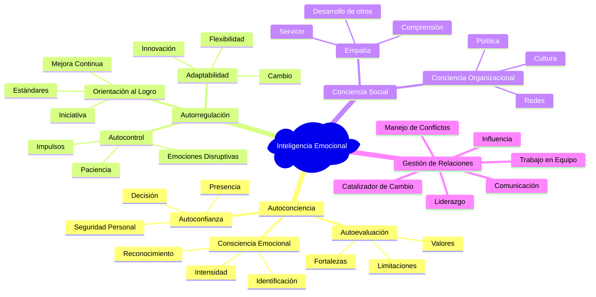
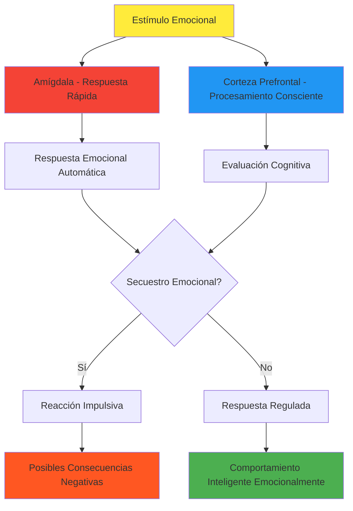

# Inteligencia Emocional 🧠💝

>[!quote] _"No es que no podamos regular nuestras emociones, es que no sabemos que tenemos esa habilidad."_ - Daniel Goleman

## Definición y Fundamentos

> [!info] **¿Qué es la Inteligencia Emocional?** La Inteligencia Emocional (IE) es la capacidad de reconocer, comprender y gestionar nuestras propias emociones, así como reconocer, comprender e influir en las emociones de otros. Comprende:
> 
> - **Autoconciencia emocional** 🪞 - Reconocer nuestras emociones y su impacto
> - **Autorregulación emocional** ⚖️ - Gestionar efectivamente nuestras respuestas emocionales
> - **Motivación intrínseca** 🔥 - Usar emociones para impulsar objetivos
> - **Empatía** ❤️ - Comprender y resonar con emociones ajenas
> - **Habilidades sociales** 🤝 - Aplicar IE en relaciones interpersonales

## Modelo de Competencias de Inteligencia Emocional

> [!tip] **Las 4 Dominios y 18 Competencias de Goleman** 🎯

### **1. Autoconciencia (Self-Awareness)** 🪞

> [!info] **Competencias de Autoconciencia**
> 
> #### **Consciencia Emocional** 💭
> 
> - **Definición**: Reconocer las propias emociones y sus efectos
> - **Indicadores**: Saber qué emociones sientes y por qué, entender vínculos entre sentimientos y pensamientos/acciones
> - **Desarrollo**: Práctica de mindfulness, journaling emocional, feedback 360°
> 
> #### **Autoevaluación Precisa** 📊
> 
> - **Definición**: Conocimiento realista de fortalezas y limitaciones
> - **Indicadores**: Consciencia de fortalezas y debilidades, reflexividad, apertura al feedback
> - **Desarrollo**: Assessments regulares, solicitar feedback honesto, auto-reflexión estructurada
> 
> #### **Autoconfianza** 💪
> 
> - **Definición**: Fuerte sentido de autovalía y capacidades
> - **Indicadores**: Seguridad en uno mismo, presencia, capacidad de expresar opiniones difíciles
> - **Desarrollo**: Celebrar logros, desafíos graduales, desarrollo de competencias

### **2. Autorregulación (Self-Management)** ⚖️

> [!warning] **Competencias de Autorregulación**
> 
> #### **Autocontrol Emocional** 🧘‍♂️
> 
> - **Definición**: Manejar emociones disruptivas e impulsos
> - **Indicadores**: Mantener la calma bajo presión, manejar impulsos, recuperarse de estrés emocional
> - **Desarrollo**: Técnicas de respiración, pausa antes de reaccionar, ejercicio físico regular
> 
> #### **Adaptabilidad** 🔄
> 
> - **Definición**: Flexibilidad para manejar cambios y desafíos
> - **Indicadores**: Comodidad con ambigüedad, flexibilidad ante nuevas ideas, agilidad mental
> - **Desarrollo**: Exponerse a nuevas experiencias, práctica de flexibilidad cognitiva
> 
> #### **Orientación al Logro** 🎯
> 
> - **Definición**: Luchar por mejorar el desempeño para cumplir estándares internos de excelencia
> - **Indicadores**: Impulso por mejorar, optimismo ante contratiempos, compromiso con metas organizacionales
> - **Desarrollo**: Establecer metas desafiantes pero alcanzables, celebrar progreso incremental
> 
> #### **Perspectiva Positiva** ☀️
> 
> - **Definición**: Ver lo bueno en personas, situaciones y eventos
> - **Indicadores**: Optimismo, ver oportunidades en dificultades, sentido del humor
> - **Desarrollo**: Práctica de gratitud, reframing de situaciones negativas, mindset de crecimiento

### **3. Conciencia Social (Social Awareness)** 👥

> [!info] **Competencias de Conciencia Social**
> 
> #### **Empatía** ❤️
> 
> - **Definición**: Entender emociones de otros y mostrar interés genuino
> - **Indicadores**: Atención a señales emocionales, escucha activa, comprensión de perspectivas ajenas
> - **Desarrollo**: Práctica de escucha activa, observación de lenguaje no verbal, perspectiva-taking
> 
> #### **Conciencia Organizacional** 🏢
> 
> - **Definición**: Leer redes organizacionales, políticas y dinámicas sociales
> - **Indicadores**: Entender política organizacional, reconocer redes de influencia, navegar estructuras sociales
> - **Desarrollo**: Mapeo de stakeholders, observación de dinámicas grupales, networking estratégico
> 
> #### **Orientación al Servicio** 🤲
> 
> - **Definición**: Reconocer y satisfacer necesidades de clientes, empleados o stakeholders
> - **Indicadores**: Disponibilidad para ayudar, anticipar necesidades, buscar formas de servir
> - **Desarrollo**: Encuestas de satisfacción, feedback directo, observación de necesidades no expresadas

### **4. Gestión de Relaciones (Relationship Management)** 🌐

> [!tip] **Competencias de Gestión de Relaciones**
> 
> #### **Influencia** 🎭
> 
> - **Definición**: Tener impacto positivo en otros
> - **Indicadores**: Persuasión efectiva, generar entusiasmo, involucrar audiencias
> - **Desarrollo**: Desarrollo de carisma, técnicas de persuasión ética, storytelling
> 
> #### **Coach y Mentor** 🎓
> 
> - **Definición**: Ayudar a otros a desarrollarse
> - **Indicadores**: Feedback constructivo, reconocer fortalezas/necesidades de desarrollo, tiempo invertido en desarrollo de otros
> - **Desarrollo**: Entrenamiento en coaching, práctica de feedback, mentoría formal
> 
> #### **Manejo de Conflictos** ⚖️
> 
> - **Definición**: Resolver desacuerdos y tensiones
> - **Indicadores**: Manejar situaciones tensas, encontrar puntos en común, orquestar resoluciones
> - **Desarrollo**: Mediación, técnicas de negociación, comunicación no violenta
> 
> #### **Liderazgo de Equipos** 👑
> 
> - **Definición**: Inspirar y guiar individuos y grupos
> - **Indicadores**: Generar entusiasmo, crear resonancia emocional, liderar con ejemplo
> - **Desarrollo**: Desarrollo de visión, comunicación inspiracional, inteligencia colectiva

## Neurociencia de las Emociones

> [!warning] **Base Científica de la Inteligencia Emocional** 🧪

> [!info] **Conceptos Neurológicos Clave**
> 
> ### **Sistema Límbico vs Neocortex** 🧠
> 
> - **Amígdala**: Centro de procesamiento emocional, respuestas rápidas de supervivencia
> - **Hipocampo**: Memoria emocional y contextual
> - **Corteza Prefrontal**: Funciones ejecutivas, regulación emocional, toma de decisiones
> 
> ### **Secuestro Emocional (Amygdala Hijack)** 🚨
> 
> - **Definición**: Cuando la amígdala toma control antes que la corteza prefrontal pueda evaluar
> - **Indicadores**: Reacciones intensas e inmediatas, arrepentimiento posterior, pérdida de perspectiva
> - **Prevención**: Técnicas de pausa, respiración consciente, práctica de mindfulness

## Evaluación de Inteligencia Emocional

> [!tip] **Herramientas de Autoevaluación IE** 📊

### **Escala de Competencias Emocionales (1-10 puntos)**

|Dominio|Competencia|Autoevaluación|Meta|Plan de Desarrollo|
|---|---|---|---|---|
|**Autoconciencia** 🪞|Consciencia emocional|___/10|___/10|___________________|
||Autoevaluación precisa|___/10|___/10|___________________|
||Autoconfianza|___/10|___/10|___________________|
|**Autorregulación** ⚖️|Autocontrol emocional|___/10|___/10|___________________|
||Adaptabilidad|___/10|___/10|___________________|
||Orientación al logro|___/10|___/10|___________________|
|**Conciencia Social** 👥|Empatía|___/10|___/10|___________________|
||Conciencia organizacional|___/10|___/10|___________________|
|**Gestión Relaciones** 🌐|Influencia|___/10|___/10|___________________|
||Manejo de conflictos|___/10|___/10|___________________|

> [!warning] **Indicadores de Baja IE**
> 
> - Reacciones emocionales intensas y frecuentes
> - Dificultad para leer el ambiente social
> - Relaciones interpersonales problemáticas
> - Resistencia al cambio y feedback
> - Baja tolerancia a la frustración
> - Dificultad para motivar o influir en otros

## Desarrollo Práctico de la Inteligencia Emocional

> [!tip] **Programa de Desarrollo de 8 Semanas** 📅

### **Semanas 1-2: Autoconciencia Emocional** 🪞

> [!info] **Actividades de Autoconciencia**
> 
> - **Diario emocional diario**: Registrar 3 emociones principales y sus triggers
> - **Body scan emocional**: 2 veces/día, identificar dónde se sienten las emociones
> - **Nomenclatura emocional**: Expandir vocabulario emocional (usar rueda de emociones)
> - **Mindfulness de 10 minutos**: Observación sin juicio de estados internos
> - **Check-ins emocionales**: Pausas cada 2 horas para evaluar estado emocional

### **Semanas 3-4: Autorregulación** ⚖️

> [!warning] **Técnicas de Regulación**
> 
> - **Técnica STOP**: Stop-Take a breath-Observe-Proceed mindfully
> - **Respiración 4-7-8**: Inhalar 4, retener 7, exhalar 8 segundos
> - **Reevaluación cognitiva**: Cambiar perspectiva sobre situaciones estresantes
> - **Exercicio físico regular**: 30 minutos diarios para regulación emocional
> - **Práctica de paciencia**: Ejercicios de tolerancia a la frustración

### **Semanas 5-6: Conciencia Social** 👥

> [!info] **Desarrollo de Empatía**
> 
> - **Observación de lenguaje no verbal**: Identificar emociones en otros sin palabras
> - **Escucha empática**: Conversaciones focalizadas en entender, no responder
> - **Perspectiva-taking**: Ejercicios de ver situaciones desde otros puntos de vista
> - **Preguntas emocionales**: "¿Cómo te sientes con esto?" en conversaciones
> - **Lectura de ambiente**: Evaluar clima emocional de grupos/reuniones

### **Semanas 7-8: Gestión de Relaciones** 🌐

> [!tip] **Aplicación Interpersonal**
> 
> - **Práctica de feedback constructivo**: Dar y recibir feedback emocionalmente inteligente
> - **Resolución de un conflicto pendiente**: Aplicar técnicas de IE
> - **Influencia positiva**: Motivar a alguien usando conexión emocional
> - **Coaching informal**: Ayudar a alguien con sus desafíos emocionales
> - **Celebración de logros grupales**: Crear momentos de conexión emocional positiva

## Técnicas de Memorización y Aplicación

> [!tip] **Mnemotecnia: "EMOCIONES"** 🧠✨

**E** - **E**valuate (Evalúa tus emociones regularmente) **M** - **M**anage (Maneja tus respuestas emocionales) **O** - **O**bserve (Observa las emociones de otros) **C** - **C**onnect (Conecta emocionalmente con otros) **I** - **I**nspire (Inspira emociones positivas) **O** - **O**ptimize (Optimiza el clima emocional) **N** - **N**avigate (Navega conflictos emocionalmente) **E** - **E**mpathize (Demuestra empatía genuina) **S** - **S**upport (Brinda apoyo emocional)

## Inteligencia Emocional en Diferentes Contextos

> [!warning] **Aplicaciones Específicas**

### **Liderazgo Emocionalmente Inteligente** 👑

- **Liderazgo resonante**: Crear sintonía emocional con el equipo
- **Gestión del clima organizacional**: Influir positivamente en el ambiente laboral
- **Toma de decisiones**: Incorporar información emocional en decisiones
- **Comunicación inspiracional**: Conectar emocionalmente con la visión

### **Inteligencia Emocional en Ventas** 💼

- **Lectura del cliente**: Identificar necesidades emocionales no expresadas
- **Construcción de rapport**: Crear conexión emocional genuina
- **Manejo de objeciones**: Responder a resistencias emocionales
- **Cierre empático**: Ayudar al cliente a sentirse bien con la decisión

### **IE en Educación** 📚

- **Ambiente de aprendizaje positivo**: Crear seguridad emocional para aprender
- **Motivación estudiantil**: Conectar emocionalmente con objetivos de aprendizaje
- **Manejo de comportamientos disruptivos**: Regulación emocional en el aula
- **Desarrollo socioemocional**: Enseñar IE a estudiantes

### **Inteligencia Emocional en la Pareja** 💕

- **Comunicación emocional**: Expresar necesidades y sentimientos claramente
- **Resolución de conflictos**: Manejar desacuerdos sin dañar la relación
- **Apoyo emocional**: Brindar soporte durante momentos difíciles
- **Intimidad emocional**: Profundizar conexión a través de vulnerabilidad

## Medición y Seguimiento del Progreso

> [!info] **Indicadores de Progreso en IE** 📈

### **Métricas Cuantitativas**

- **Frecuencia de "secuestros emocionales"** (reducción semanal)
- **Tiempo de recuperación emocional** (minutos para volver a estado neutral)
- **Número de conflictos interpersonales** (reducción mensual)
- **Feedback 360° en competencias emocionales** (mejora trimestral)
- **Autoevaluación en escala IE** (incremento en puntuación)

### **Indicadores Cualitativos**

- **Mejora en relaciones interpersonales**
- **Mayor facilidad para manejar situaciones estresantes**
- **Incremento en capacidad de influencia positiva**
- **Mejor lectura de dinámicas grupales**
- **Mayor satisfacción personal y profesional**

## Referencias y Conexiones

> [!quote] **Enlaces a Otras Notas**
> 
> - [[Habilidades Sociales]] - Aplicación práctica de IE en interacciones sociales
> - [[Competencias Interpersonales]] - Competencias específicas basadas en IE
> - [[Gestión de Conflictos]] - Uso de IE para resolver tensiones
> - [[Mindfulness]] - Herramienta fundamental para desarrollo de autoconciencia
> - [[Liderazgo Situacional]] - Aplicación de IE en contextos de liderazgo
> - [[Comunicación Efectiva]] - IE como base para comunicación de calidad

> [!info] **Notas Recomendadas para Profundizar**

### **Prerrequisitos** 📋

> - [[Autoconocimiento]] - Base fundamental para desarrollar IE
> - [[Mindfulness]] - Herramienta esencial para consciencia emocional
> - [[Gestión del Estrés]] - Regulación emocional bajo presión
> - [[Respiración Consciente]] - Técnica básica de autorregulación
> - [[Construcción de Confianza]] - Autoconfianza como componente de IE

### **Complementarias** 🔗

> - [[Técnicas de Comunicación]] - Comunicación emocionalmente inteligente
> - [[Feedback y Coaching]] - Desarrollo de otros usando IE
> - [[Team Building]] - Construcción de equipos con alta IE colectiva
> - [[Influencia sin Autoridad]] - Persuasión a través de conexión emocional
> - [[Diversidad e Inclusión]] - IE en contextos culturalmente diversos
> - [[Neurociencia del Aprendizaje]] - Base científica del procesamiento emocional
> - [[Facilitación de Grupos]] - Manejo del clima emocional grupal

---

**Tags:** #inteligencia-emocional #autoconciencia #autorregulación #empatía #habilidades-sociales #competencias-emocionales #liderazgo-emocional #neurociencia-emocional #desarrollo-personal #gestión-emocional #comunicación-empática #resolución-conflictos #mindfulness-emocional