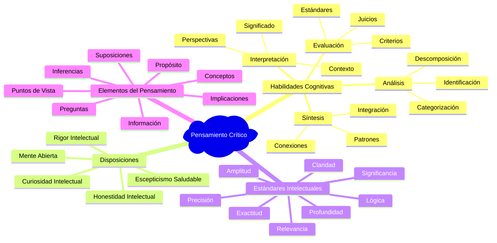
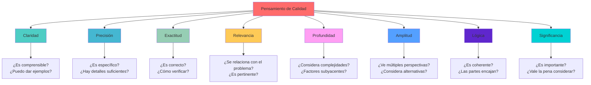

# Pensamiento Crítico 🧠🔍

>[!quote] _"El pensamiento crítico es el arte de analizar y evaluar el pensamiento con el propósito de mejorarlo."_ - Richard Paul y Linda Elder

## Definición y Fundamentos

> [!info] **¿Qué es el Pensamiento Crítico?** El pensamiento crítico es la capacidad intelectual disciplinada de conceptualizar, aplicar, analizar, sintetizar y evaluar información de manera activa y hábil como guía hacia la creencia y la acción. Incluye:
> 
> - **Análisis objetivo de información** 🔍 - Examinar datos sin sesgos previos
> - **Evaluación de argumentos y evidencias** ⚖️ - Juzgar la calidad de razonamientos
> - **Síntesis de ideas complejas** 🧩 - Combinar información de múltiples fuentes
> - **Formulación de juicios fundamentados** 📝 - Llegar a conclusiones basadas en evidencia
> - **Metacognición sobre el propio pensamiento** 🪞 - Reflexionar sobre procesos mentales
> - **Aplicación de estándares intelectuales** 📏 - Usar criterios de calidad en el razonamiento

## Los 8 Elementos del Pensamiento Crítico

> [!tip] **Marco de Referencia de Paul y Elder** 🎯

### **1. Propósito (Purpose)** 🎯

> [!info] **Definiendo el Objetivo**
> 
> - **Qué preguntarse**: "¿Cuál es mi meta? ¿Qué trato de lograr?"
> - **Importancia**: Todo pensamiento tiene un propósito - identifícalo claramente
> - **Aplicación**: Antes de analizar, define exactamente qué quieres conseguir
> - **Ejemplo**: "Mi propósito es evaluar la viabilidad de esta propuesta comercial"

### **2. Pregunta/Problema (Question/Problem)** ❓

> [!warning] **Formulación Clara del Problema**
> 
> - **Qué preguntarse**: "¿Qué pregunta específica intento responder?"
> - **Importancia**: Una pregunta mal formulada lleva a respuestas irrelevantes
> - **Aplicación**: Reformula el problema hasta que sea específico y claro
> - **Ejemplo**: Cambiar "¿Es bueno?" por "¿Esta estrategia aumentará ventas en 6 meses?"

### **3. Información/Datos (Information/Data)** 📊

> [!info] **Evidencia y Fuentes**
> 
> - **Qué preguntarse**: "¿Qué información necesito? ¿Qué datos tengo?"
> - **Importancia**: Las conclusiones solo son tan buenas como la información que las sustenta
> - **Aplicación**: Busca fuentes múltiples, verifica credibilidad, identifica vacíos
> - **Ejemplo**: Datos financieros, estudios de mercado, testimonios de expertos

### **4. Conceptos/Ideas (Concepts/Ideas)** 💡

> [!tip] **Clarificación Conceptual**
> 
> - **Qué preguntarse**: "¿Qué ideas clave debo entender para responder mi pregunta?"
> - **Importancia**: Los conceptos vagos generan pensamiento confuso
> - **Aplicación**: Define términos clave, explora múltiples definiciones
> - **Ejemplo**: ¿Qué significa exactamente "éxito", "calidad" o "eficiencia" en este contexto?

### **5. Suposiciones (Assumptions)** 🤔

> [!warning] **Identificación de Creencias Subyacentes**
> 
> - **Qué preguntarse**: "¿Qué estoy dando por sentado? ¿Qué suposiciones hago?"
> - **Importancia**: Las suposiciones no examinadas pueden invalidar conclusiones
> - **Aplicación**: Cuestiona tus creencias, busca suposiciones ocultas
> - **Ejemplo**: "Asumo que los clientes prefieren precios bajos, pero ¿es cierto siempre?"

### **6. Punto de Vista/Perspectiva (Point of View)** 👁️

> [!info] **Marco de Referencia**
> 
> - **Qué preguntarse**: "¿Desde qué perspectiva estoy viendo esto?"
> - **Importancia**: Todo pensamiento ocurre desde algún punto de vista
> - **Aplicación**: Considera múltiples perspectivas, identifica sesgos
> - **Ejemplo**: Ver un problema desde la perspectiva del cliente, empleado y accionista

### **7. Implicaciones/Consecuencias (Implications)** ⚡

> [!warning] **Análisis de Consecuencias**
> 
> - **Qué preguntarse**: "Si esto es cierto, ¿qué se sigue? ¿Cuáles son las consecuencias?"
> - **Importancia**: Las buenas decisiones consideran consecuencias a largo plazo
> - **Aplicación**: Piensa en efectos directos, indirectos, inmediatos y futuros
> - **Ejemplo**: "Si implementamos esto, ¿cómo afectará a empleados, clientes y competencia?"

### **8. Inferencias/Conclusiones (Inferences)** 📝

> [!tip] **Razonamiento Lógico**
> 
> - **Qué preguntarse**: "¿Qué conclusiones estoy sacando? ¿Están justificadas?"
> - **Importancia**: Las inferencias conectan evidencia con conclusiones
> - **Aplicación**: Verifica que conclusiones se sigan lógicamente de las premisas
> - **Ejemplo**: "Basado en estos datos de ventas, infiero que el producto tiene demanda"

## Estándares Intelectuales Universales

> [!tip] **Los 8 Criterios de Calidad del Pensamiento** 📏

## Barreras del Pensamiento Crítico

> [!warning] **Obstáculos Comunes y Estrategias de Superación** 🚧

### **Sesgos Cognitivos Principales**

|Sesgo|Descripción|Ejemplo|Estrategia de Mitigación|
|---|---|---|---|
|**Sesgo de Confirmación** 🔍|Buscar información que confirme creencias|Solo leer noticias que apoyan nuestras opiniones|Buscar activamente evidencia contradictoria|
|**Pensamiento Grupal** 👥|Conformidad con opinión del grupo|Evitar disentir en reuniones por presión social|Asignar roles de "abogado del diablo"|
|**Sesgo de Anclaje** ⚓|Depender demasiado de primera información|Basar negociación en precio inicial|Considerar múltiples puntos de referencia|
|**Efecto Halo** ✨|Generalizar de una característica positiva|Asumir que persona atractiva es inteligente|Evaluar características independientemente|
|**Sesgo de Disponibilidad** 📺|Sobrestimar probabilidad de eventos recordables|Temer más a terrorismo que accidentes de auto|Buscar estadísticas objetivas|
|**Falacia del Costo Hundido** 💰|Continuar proyecto por inversión previa|Seguir con estrategia fallida por tiempo invertido|Evaluar solo costos y beneficios futuros|

### **Barreras Emocionales**

> [!info] **Obstáculos Emocionales del Pensamiento**
> 
> #### **Ego y Orgullo Intelectual** 🦚
> 
> - **Manifestación**: Resistencia a admitir errores o cambiar de opinión
> - **Impacto**: Pensamiento rígido, pérdida de oportunidades de aprendizaje
> - **Superación**: Cultivar humildad intelectual, celebrar el cambio de perspectiva
> 
> #### **Miedo al Juicio** 😰
> 
> - **Manifestación**: Evitar expresar opiniones controvertidas o hacer preguntas
> - **Impacto**: Superficialidad en análisis, pérdida de insights valiosos
> - **Superación**: Crear ambientes psicológicamente seguros, valorar la curiosidad
> 
> #### **Pereza Mental** 😴
> 
> - **Manifestación**: Preferir respuestas simples a problemas complejos
> - **Impacto**: Análisis superficial, soluciones inadecuadas
> - **Superación**: Desarrollar tolerancia a la ambigüedad, recompensar el esfuerzo mental

## Técnicas y Herramientas de Pensamiento Crítico

> [!tip] **Métodos Prácticos para Análisis Crítico** 🛠️

### **1. Técnica de los 5 Porqués** ❓❓❓❓❓

> [!info] **Análisis de Causas Raíz**
> 
> - **Proceso**: Pregunta "¿Por qué?" sucesivamente hasta llegar a la causa fundamental
> - **Aplicación**: Resolución de problemas, análisis de fallos
> - **Ejemplo**:
> 
> 1. ¿Por qué bajaron las ventas? → Los clientes compran menos
> 2. ¿Por qué compran menos? → No ven valor en el producto
> 3. ¿Por qué no ven valor? → La comunicación no es clara
> 4. ¿Por qué no es clara? → No conocemos bien sus necesidades
> 5. ¿Por qué no las conocemos? → No hacemos suficiente investigación

### **2. Análisis FODA Crítico** 📊

> [!warning] **Evaluación Estratégica Profunda**
> 
> - **Fortalezas**: ¿Qué evidencia respalda que son realmente fortalezas?
> - **Oportunidades**: ¿Son realmente oportunidades o solo esperanzas?
> - **Debilidades**: ¿Estamos siendo honestos sobre nuestras limitaciones?
> - **Amenazas**: ¿Qué tan probable y grave es cada amenaza?

### **3. Técnica del Abogado del Diablo** ⚖️

> [!tip] **Cuestionamiento Sistemático**
> 
> - **Propósito**: Identificar debilidades en argumentos
> - **Proceso**: Asignar rol de oposición sistemática
> - **Aplicación**: Revisión de decisiones importantes, evaluación de estrategias
> - **Preguntas clave**: "¿Qué podría salir mal?", "¿Qué evidencia contradice esto?"

### **4. Mapa de Argumentos** 🗺️

> [!info] **Visualización de Razonamiento**
> 
> - **Componentes**: Premisas, inferencias, conclusiones, contra-argumentos
> - **Beneficios**: Clarifica estructura lógica, identifica saltos en razonamiento
> - **Herramientas**: Diagramas de flujo, mapas conceptuales

### **5. Análisis de Stakeholders Crítico** 👥

> [!warning] **Perspectivas Múltiples**
> 
> - **Proceso**: Identificar todos los afectados por una decisión
> - **Análisis**: Intereses, poder, influencia, perspectivas de cada grupo
> - **Aplicación**: Decisiones complejas con múltiples afectados

## Desarrollo de Habilidades de Pensamiento Crítico

> [!tip] **Programa de Desarrollo de 10 Semanas** 📅

### **Semanas 1-2: Fundamentos y Autoconciencia** 🪞

> [!info] **Construcción de Base**
> 
> - **Evaluación inicial**: Test de habilidades de pensamiento crítico
> - **Identificación de sesgos personales**: Reconocer patrones propios de pensamiento
> - **Práctica de clarificación**: Definir términos ambiguos en conversaciones diarias
> - **Ejercicio**: Analizar 3 decisiones recientes usando los 8 elementos del pensamiento

### **Semanas 3-4: Análisis de Información** 🔍

> [!warning] **Evaluación de Fuentes y Datos**
> 
> - **Criterios de credibilidad**: Aprender a evaluar fuentes de información
> - **Análisis de sesgos en medios**: Identificar tendencias en reportajes
> - **Verificación de hechos**: Usar herramientas de fact-checking
> - **Ejercicio**: Analizar una noticia controvertida desde múltiples fuentes

### **Semanas 5-6: Construcción y Evaluación de Argumentos** ⚖️

> [!tip] **Lógica y Razonamiento**
> 
> - **Identificación de falacias lógicas**: Reconocer errores comunes en argumentación
> - **Construcción de argumentos sólidos**: Premisas válidas, inferencias lógicas
> - **Evaluación de evidencia**: Distinguir entre correlación y causalidad
> - **Ejercicio**: Escribir argumentos a favor y en contra de una posición controvertida

### **Semanas 7-8: Resolución de Problemas Complejos** 🧩

> [!info] **Aplicación Práctica**
> 
> - **Análisis de casos complejos**: Usar metodología estructurada
> - **Técnica de escenarios**: Explorar múltiples futuros posibles
> - **Toma de decisiones bajo incertidumbre**: Manejar información incompleta
> - **Ejercicio**: Resolver un problema organizacional real usando pensamiento crítico

### **Semanas 9-10: Metacognición y Mejora Continua** 🔄

> [!warning] **Reflexión sobre el Propio Pensamiento**
> 
> - **Diario de reflexión**: Documentar procesos de pensamiento
> - **Análisis de errores**: Aprender de decisiones equivocadas
> - **Desarrollo de hábitos**: Integrar pensamiento crítico en rutinas
> - **Ejercicio**: Crear plan personal de mejora continua

## Técnicas de Memorización para Pensamiento Crítico

> [!tip] **Mnemotecnia: "CRITICAL MIND"** 🧠

**C** - **C**larify the purpose and question (Clarifica propósito y pregunta) **R** - **R**ecognize assumptions and biases (Reconoce suposiciones y sesgos)  
**I** - **I**nvestigate information and evidence (Investiga información y evidencia) **T** - **T**hink from multiple perspectives (Piensa desde múltiples perspectivas) **I** - **I**nfer conclusions logically (Infiere conclusiones lógicamente) **C** - **C**onsider implications and consequences (Considera implicaciones y consecuencias) **A** - **A**nalyze arguments systematically (Analiza argumentos sistemáticamente) **L** - **L**ook for logical fallacies (Busca falacias lógicas)

**M** - **M**onitor your own thinking (Monitorea tu propio pensamiento) **I** - **I**ntegrate different viewpoints (Integra diferentes puntos de vista) **N** - **N**avigate complexity with patience (Navega la complejidad con paciencia) **D** - **D** - **D**ecide based on best evidence (Decide basado en la mejor evidencia)

## Aplicaciones del Pensamiento Crítico

> [!warning] **Contextos de Aplicación Esenciales** 🎯

### **Ámbito Profesional** 💼

> [!info] **Aplicaciones Laborales**
> 
> - **Toma de decisiones estratégicas**: Evaluar opciones complejas con múltiples variables
> - **Resolución de problemas organizacionales**: Identificar causas raíz de problemas sistémicos
> - **Evaluación de propuestas**: Analizar viabilidad de proyectos e iniciativas
> - **Gestión de riesgos**: Anticipar y mitigar problemas potenciales
> - **Innovación**: Cuestionar el status quo para encontrar mejores soluciones

### **Vida Personal** 🏠

> [!tip] **Decisiones Personales Críticas**
> 
> - **Decisiones financieras**: Evaluar inversiones, compras importantes, planes de ahorro
> - **Relaciones interpersonales**: Analizar dinámicas, resolver conflictos
> - **Salud y bienestar**: Evaluar información médica, decidir tratamientos
> - **Educación**: Elegir programas de estudio, evaluar fuentes de aprendizaje
> - **Consumo de medios**: Analizar noticias, identificar desinformación

### **Ciudadanía Activa** 🗳️

> [!warning] **Participación Social Informada**
> 
> - **Evaluación de políticas públicas**: Analizar propuestas gubernamentales
> - **Proceso electoral**: Evaluar candidatos y propuestas basándose en evidencia
> - **Temas sociales**: Formar opiniones informadas sobre controversias
> - **Activismo**: Basar acciones en análisis riguroso de problemas

## Evaluación del Progreso en Pensamiento Crítico

> [!info] **Métricas de Desarrollo** 📊

### **Indicadores Cuantitativos**

|Métrica|Método de Medición|Frecuencia|Meta|
|---|---|---|---|
|**Identificación de sesgos**|Test de sesgos cognitivos|Mensual|80% identificación|
|**Calidad de argumentos**|Rubrica de evaluación|Semanal|Nivel "proficiente"|
|**Velocidad de análisis**|Tiempo para analizar casos|Quincenal|Reducción 25%|
|**Diversidad de perspectivas**|Número de viewpoints considerados|Por proyecto|Mínimo 4 perspectivas|

### **Indicadores Cualitativos**

- **Mejora en calidad de decisiones personales y profesionales**
- **Mayor comodidad con ambigüedad e incertidumbre**
- **Incremento en curiosidad intelectual y hacer preguntas**
- **Reducción en aceptación acrítica de información**
- **Mayor habilidad para cambiar de opinión ante nueva evidencia**

## Referencias y Conexiones

> [!quote] **Enlaces a Otras Notas**
> 
> - [[Inteligencia Emocional]] - Balance entre análisis racional y comprensión emocional
> - [[Competencias Interpersonales]] - Aplicación de pensamiento crítico en relaciones
> - [[Toma de Decisiones]] - Metodología para decisiones basadas en análisis crítico
> - [[Comunicación Efectiva]] - Expresar argumentos críticos de forma persuasiva
> - [[Habilidades Sociales]] - Cuestionar ideas manteniendo relaciones positivas
> - [[Metacognición]] - Reflexión sobre procesos de pensamiento propio

> [!info] **Notas Recomendadas para Profundizar**

### **Prerrequisitos** 📋

> - [[Autoconocimiento]] - Reconocer sesgos y limitaciones propias del pensamiento
> - [[Clarificación de Valores]] - Base ética para evaluaciones críticas
> - [[Mindfulness]] - Atención consciente para observar procesos mentales
> - [[Construcción de Confianza]] - Seguridad para cuestionar y ser cuestionado
> - [[Motivación Académica]] - Impulso para el rigor intelectual

### **Complementarias** 🔗

> - [[Análisis Costo-Beneficio]] - Herramienta específica de evaluación crítica
> - [[Gestión de Conflictos]] - Aplicar pensamiento crítico en situaciones tensas
> - [[Liderazgo Situacional]] - Análisis crítico de contextos de liderazgo
> - [[Design Thinking]] - Pensamiento crítico aplicado a innovación
> - [[Evaluación del Aprendizaje]] - Criterios críticos para medir progreso
> - [[Lectura Crítica y Análisis de Textos]] - Aplicación específica a textos
> - [[Procrastinación]] - Superar barreras mentales para análisis riguroso
> - [[Sistema Cornell de Notas]] - Organización de información para análisis crítico

---

**Tags:** #pensamiento-crítico #análisis #evaluación #razonamiento-lógico #toma-decisiones #resolución-problemas #sesgos-cognitivos #argumentación #metacognición #escepticismo-saludable #rigor-intelectual #evaluación-evidencia #múltiples-perspectivas