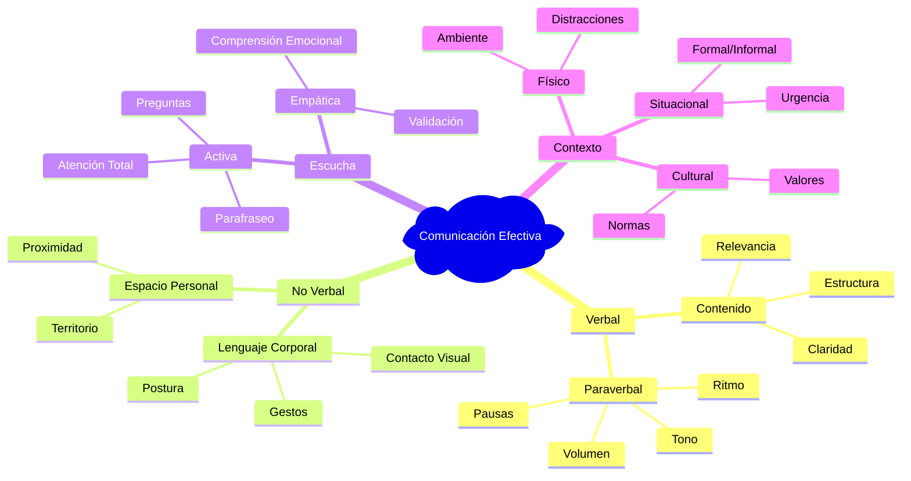

# Técnicas de Comunicación 🗣️

>[!quote] _"La comunicación efectiva no es solo hablar bien, sino conectar genuinamente con otros para crear entendimiento mutuo y construir relaciones sólidas."_

## Definición y Fundamentos

> [!info]+ **¿Qué es la Comunicación Efectiva?** La comunicación efectiva es el proceso de intercambiar información, ideas, emociones y pensamientos de manera clara, comprensible y persuasiva. Incluye:
> 
> - **Transmisión clara de mensajes** 📢 - Expresar ideas de forma comprensible
> - **Escucha activa y empática** 👂 - Entender completamente al interlocutor
> - **Adaptación al contexto y audiencia** 🎯 - Ajustar estilo según la situación
> - **Uso efectivo del lenguaje no verbal** 🤲 - Alinear gestos con palabras
> - **Retroalimentación constructiva** 🔄 - Confirmar comprensión mutua
> - **Manejo de emociones en la comunicación** ❤️ - Integrar inteligencia emocional



## Los 7 Elementos de la Comunicación Efectiva

> [!tip]+ **Marco de Referencia Comunicativo** 🎯

### **1. Emisor (Sender)** 📢

> [!info] **El Origen del Mensaje**
> 
> - **Qué considerar**: "¿Soy la persona adecuada para comunicar esto?"
> - **Importancia**: La credibilidad del emisor afecta la recepción del mensaje
> - **Aplicación**: Establece tu autoridad y credibilidad antes de comunicar
> - **Ejemplo**: "Como gerente de proyectos con 5 años de experiencia..."

### **2. Mensaje (Message)** 📝

> [!warning] **Contenido y Estructura Clara**
> 
> - **Qué considerar**: "¿Mi mensaje es claro, conciso y completo?"
> - **Importancia**: Un mensaje confuso genera malentendidos
> - **Aplicación**: Estructura con introducción, desarrollo y conclusión
> - **Ejemplo**: Usar la técnica PREP (Punto, Razón, Ejemplo, Punto)

### **3. Canal (Channel)** 📡

> [!info] **Medio de Transmisión**
> 
> - **Qué considerar**: "¿Cuál es el mejor medio para este mensaje?"
> - **Importancia**: El canal afecta la efectividad del mensaje
> - **Aplicación**: Email para formal, llamada para urgente, cara a cara para sensible
> - **Ejemplo**: Reunión presencial para feedback de desempeño

### **4. Receptor (Receiver)** 👂

> [!tip] **Audiencia Objetivo**
> 
> - **Qué considerar**: "¿Quién es mi audiencia y qué necesitan saber?"
> - **Importancia**: Adaptar el mensaje a la audiencia aumenta comprensión
> - **Aplicación**: Considera nivel técnico, intereses y contexto del receptor
> - **Ejemplo**: Explicación técnica vs. explicación para directivos

### **5. Retroalimentación (Feedback)** 🔄

> [!warning] **Confirmación de Comprensión**
> 
> - **Qué considerar**: "¿Cómo sé que mi mensaje fue entendido?"
> - **Importancia**: Sin retroalimentación, no hay comunicación efectiva
> - **Aplicación**: Pide confirmación, observa reacciones, hace preguntas
> - **Ejemplo**: "¿Tiene sentido lo que acabo de explicar?"

### **6. Contexto (Context)** 🌍

> [!info] **Ambiente Comunicativo**
> 
> - **Qué considerar**: "¿El entorno favorece o dificulta la comunicación?"
> - **Importancia**: El contexto puede cambiar completamente el mensaje
> - **Aplicación**: Considera momento, lugar, cultura y situación
> - **Ejemplo**: Conversación difícil en lugar privado y momento adecuado

### **7. Ruido (Noise)** 🌪️

> [!warning] **Barreras de Comunicación**
> 
> - **Qué considerar**: "¿Qué podría interferir con mi mensaje?"
> - **Importancia**: Identificar y minimizar interferencias mejora comunicación
> - **Aplicación**: Elimina distracciones físicas, emocionales y semánticas
> - **Ejemplo**: Apagar notificaciones durante reuniones importantes

## Técnicas de Comunicación Verbal

> [!tip]+ **Estrategias de Expresión Oral** 🗣️
> 
> ### **Estructura del Mensaje**
> 
> |Técnica|Descripción|Aplicación|Ejemplo|
> |---|---|---|---|
> |**Pirámide Invertida** 📰|Información más importante primero|Presentaciones, noticias|"Decidimos cancelar el proyecto debido a..."|
> |**Regla del 3** 3️⃣|Agrupar ideas en grupos de tres|Listados, argumentos|"Tenemos 3 opciones: expandir, mantener o reducir"|
> |**PREP Method** 📋|Punto, Razón, Ejemplo, Punto|Argumentaciones rápidas|"Propongo X porque Y, por ejemplo Z, por tanto X"|
> |**Storytelling** 📚|Usar narrativas para conectar|Persuasión, motivación|"Permíteme contarte lo que aprendimos..."|
> |**STAR Method** ⭐|Situación, Tarea, Acción, Resultado|Explicar experiencias|Para entrevistas y reportes|
> 
> ### **Técnicas Vocales**
> 
> - **Volumen**: Ajustar según audiencia y espacio (susurros para confidencial, voz alta para grupos)
> - **Tono**: Variar para transmitir emociones y mantener interés
> - **Ritmo**: Acelerar para emoción, ralentizar para puntos importantes
> - **Pausas**: Usar silencios para énfasis y permitir procesamiento
> - **Entonación**: Subir al final para preguntas, bajar para afirmaciones

## Técnicas de Comunicación No Verbal

> [!warning]+ **Importancia del Lenguaje Corporal** 👁️ El 55% de la comunicación es corporal, 38% vocal y solo 7% verbal según Albert Mehrabian.
> 
> ```mermaid
> pie title Componentes de la Comunicación
>     "Lenguaje Corporal" : 55
>     "Tono de Voz" : 38
>     "Palabras" : 7
> ```
> 
> [!info]+ **Elementos del Lenguaje No Verbal**
> 
> ### **Contacto Visual** 👁️
> 
> - **Regla 50/70**: 50% mientras hablas, 70% mientras escuchas
> - **Triángulo facial**: Alternar entre ojos y boca en conversaciones formales
> - **Evitar**: Mirada fija intimidante o evasiva que denote desinterés
> - **Cultural**: Adaptar según normas culturales (algunas culturas evitan contacto directo)
> 
> ### **Gestos y Postura** 🤲
> 
> - **Gestos abiertos**: Palmas visibles, brazos no cruzados transmiten confianza
> - **Postura erguida**: Comunica autoridad y atención
> - **Movimientos controlados**: Gestos que complementen y refuercen el mensaje verbal
> - **Simetría**: Mantener equilibrio corporal para proyectar estabilidad
> 
> ### **Proxémica (Uso del Espacio)** 📏
> 
> |Zona|Distancia|Uso Apropiado|Ejemplo|
> |---|---|---|---|
> |**Íntima** 👫|0-45cm|Relaciones cercanas|Familia, pareja|
> |**Personal** 🤝|45cm-1.2m|Amigos, colegas cercanos|Conversaciones casuales|
> |**Social** 👔|1.2m-3.6m|Relaciones profesionales|Reuniones, entrevistas|
> |**Pública** 🎤|3.6m+|Presentaciones formales|Conferencias, discursos|
> 
> ### **Expresiones Faciales** 😊
> 
> - **Congruencia**: Alinear expresión con mensaje verbal
> - **Sonrisa genuina**: Activar músculos alrededor de los ojos (sonrisa de Duchenne)
> - **Microexpresiones**: Ser consciente de expresiones involuntarias
> - **Control**: Mantener neutralidad cuando sea necesario

## Técnicas de Escucha Activa

> [!tip]+ **Estrategias para Escuchar Efectivamente** 👂
> 
> ### **Los 5 Niveles de Escucha**
> 
> 1. **Ignorar** ❌: No prestar atención (nivel más bajo)
> 2. **Fingir** 😐: Aparentar que escuchas sin realmente hacerlo
> 3. **Selectiva** 🎯: Solo escuchar lo que te interesa o confirma tus ideas
> 4. **Atenta** 👍: Concentrarse en las palabras del hablante
> 5. **Empática** ❤️: Entender emociones y contexto completo (nivel más alto) [!warning]+ **Barreras Comunes de la Escucha**
> 
> - **Preparar respuesta mientras el otro habla** 🧠: Enfocarse en qué decir siguiente
> - **Juzgar al hablante** ⚖️: Desestimar mensaje por quien lo dice
> - **Filtrado selectivo** 🔍: Solo escuchar información que confirma prejuicios
> - **Distracciones externas** 📱: Ruido, tecnología, interrupciones
> - **Distracciones internas** 💭: Preocupaciones personales, emociones intensas [!info]+ **Técnicas de Retroalimentación**
> - **Parafrasear**: "Si entendí bien, estás diciendo que..."
> - **Reflejar emociones**: "Percibo que te sientes frustrado por..."
> - **Resumir**: "Los puntos principales que mencionaste son..."
> - **Clarificar**: "¿Puedes explicar más sobre el aspecto de...?"
> - **Confirmar comprensión**: "¿Es correcto mi entendimiento de que...?"

## Técnicas para Diferentes Contextos

> [!info]+ **Comunicación Según el Contexto** 🎯
> 
> ### **Comunicación Profesional** 💼
> 
> |Situación|Técnica Principal|Estructura|Tips Específicos|
> |---|---|---|---|
> |**Presentaciones** 🎤|Estructura clara + Visual|Apertura fuerte, 3 puntos clave, cierre memorable|Regla 10-20-30 de Kawasaki|
> |**Reuniones** 👥|Facilitación activa|Agenda, timeboxing, seguimiento|Asignar roles, documentar acuerdos|
> |**Negociaciones** 🤝|Win-Win|Preparación, intereses vs posiciones|BATNA (Best Alternative)|
> |**Conflictos** ⚡|Comunicación asertiva|Técnica DESC|Separar persona de problema|
> |**Feedback** 📋|Específico y constructivo|Situación-Comportamiento-Impacto|Enfoque en comportamientos|
> 
> ### **Comunicación Interpersonal** 👫
> 
> - **Empatía**: Ponerse genuinamente en el lugar del otro
> - **Asertividad**: Expresar opiniones respetando derechos propios y ajenos
> - **Adaptabilidad**: Ajustar estilo comunicativo según personalidad del interlocutor
> - **Validación emocional**: Reconocer y validar sentimientos antes de resolver problemas [!tip]+ **Comunicación en Crisis** 🚨
> - **Mantener calma**: Tu estado emocional influye en los demás
> - **Información clara**: Hechos específicos sin especulaciones
> - **Frecuencia alta**: Comunicar regularmente aunque no haya novedades
> - **Múltiples canales**: Usar varios medios para asegurar llegada del mensaje
> - **Empatía**: Reconocer impacto emocional en las personas

## Herramientas y Frameworks de Comunicación

> [!tip]+ **Framework DESC para Comunicación Asertiva** 📋 **D**escribir: Los hechos objetivos sin interpretaciones
> 
> - "En la reunión de ayer, llegaste 15 minutos tarde..."
> 
> **E**xpresar: Tus sentimientos sobre la situación
> 
> - "Me siento preocupado porque..."
> 
> **S**olicitar: Cambio específico de comportamiento
> 
> - "Te pido que en futuras reuniones..."
> 
> **C**onsecuencias: Resultados positivos del cambio
> 
> - "Esto nos ayudaría a aprovechar mejor el tiempo y..." [!warning]+ **Técnica del Sandwich** 🥪
> 
> ```mermaid
> graph TD
>     A[🍞 Comentario Positivo] --> B[🥩 Feedback Constructivo]
>     B --> C[🍞 Comentario Positivo + Apoyo]
>     
>     A1["Reconoce algo que hace bien"] --> A
>     B1["Específica qué necesita mejorar"] --> B  
>     C1["Refuerza confianza y apoyo"] --> C
>     
>     style A fill:#e8f5e8
>     style B fill:#fff3e0
>     style C fill:#e8f5e8
> ```
> 
> [!info]+ **Modelo SOLER para Escucha Activa** 👂
> 
> - **S**quare shoulders: Orientar cuerpo hacia el hablante
> - **O**pen posture: Postura abierta y receptiva
> - **L**ean in: Inclinarse ligeramente hacia adelante
> - **E**ye contact: Mantener contacto visual apropiado
> - **R**elax: Mantener naturalidad sin rigidez [!tip]+ **Framework LSCPA para Resolución de Conflictos** ⚖️
> - **L**isten: Escuchar activamente todas las perspectivas
> - **S**ummarize: Resumir puntos clave de cada parte
> - **C**larify: Aclarar malentendidos y puntos confusos
> - **P**roblem-solve: Buscar soluciones colaborativas
> - **A**gree: Llegar a acuerdos específicos y medibles

## Desarrollo de Habilidades de Comunicación

> [!tip]+ **Programa de Desarrollo de 8 Semanas** 📅
> 
> ### **Semanas 1-2: Autoconciencia Comunicativa** 🪞
> 
> > [!info] **Evaluación y Fundamentos**
> > 
> > - **Autoevaluación**: Test de estilos de comunicación personal
> > - **Grabación personal**: Analizar propia comunicación en video
> > - **Identificación de fortalezas y debilidades**: Crear perfil comunicativo
> > - **Práctica diaria**: 15 minutos de ejercicios de voz y articulación
> 
> ### **Semanas 3-4: Comunicación Verbal y Paraverbal** 🗣️
> 
> > [!warning] **Desarrollo de Expresión Oral**
> > 
> > - **Técnicas de estructura**: Practicar PREP, pirámide invertida
> > - **Modulación de voz**: Ejercicios de tono, volumen y ritmo
> > - **Storytelling**: Crear y practicar 3 historias personales efectivas
> > - **Presentaciones cortas**: 5 presentaciones de 2 minutos con feedback
> 
> ### **Semanas 5-6: Comunicación No Verbal** 👁️
> 
> > [!info] **Lenguaje Corporal Efectivo**
> > 
> > - **Postura y presencia**: Ejercicios de postura y proyección
> > - **Gestos coordinados**: Sincronizar movimientos con palabras
> > - **Contacto visual**: Practicar técnica 50/70 en conversaciones
> > - **Expresiones faciales**: Control consciente de microexpresiones
> 
> ### **Semanas 7-8: Escucha y Comunicación Bidireccional** 🔄
> 
> > [!tip] **Maestría en Escucha Activa**
> > 
> > - **Técnicas de parafraseo**: Practicar reformulación efectiva
> > - **Manejo de conversaciones difíciles**: Rol playing con feedback
> > - **Comunicación empática**: Ejercicios de perspectiva múltiple
> > - **Integración total**: Aplicar todas las técnicas en situaciones reales

## Técnicas de Memorización para Comunicación

> [!tip]+ **Mnemotecnia: "COMMUNICATE"** 🧠 **C** - **C**larify your purpose (Clarifica tu propósito) **O** - **O**rganize your message (Organiza tu mensaje)  
> **M** - **M**atch your audience (Adáptate a tu audiencia) **M** - **M**ake eye contact (Mantén contacto visual) **U** - **U**se active listening (Usa escucha activa) **N** - **N**onverbal alignment (Alinea comunicación no verbal) **I** - **I**nvite feedback (Invita retroalimentación) **C** - **C**heck understanding (Verifica comprensión) **A** - **A**dapt your approach (Adapta tu enfoque) **T** - **T**ime appropriately (Elige el momento apropiado) **E** - **E**mpathize genuinely (Muestra empatía genuina)

## Referencias y Conexiones

[!quote]+ **Notas Relacionadas**

- [[Habilidades Sociales]] - Fundamentos para interacción social
- [[Inteligencia Emocional]] - Base emocional de la comunicación
- [[Pensamiento Crítico]] - Análisis profundo de mensajes
- [[Competencias Interpersonales]] - Habilidades para relaciones
- [[Comunicación Intercultural]] - Comunicación en contextos diversos

## Notas Recomendadas para Complementar

[!info]+ **Prerrequisitos y Temas Complementarios**

- [[Autoconocimiento]] - Conocer tu estilo de comunicación
- [[Construcción de Confianza]] - Base para comunicación efectiva
- [[Gestión de Conflictos]] - Aplicación práctica de técnicas
- [[Feedback y Coaching]] - Comunicación para desarrollo
- [[Liderazgo Situacional]] - Adaptar comunicación al contexto

---

**Tags:** #comunicacion #habilidades-sociales #desarrollo-personal #inteligencia-emocional #liderazgo #escucha-activa #comunicacion-asertiva #lenguaje-corporal #presentaciones #negociacion
## Aplicaciones de las Técnicas de Comunicación

> [!warning]+ **Contextos de Aplicación Esenciales** 🎯
> 
> ### **Ámbito Académico** 🎓
> 
> > [!info] **Aplicaciones Educativas**
> > 
> > - **Presentaciones académicas**: Defender tesis, exponer proyectos con claridad
> > - **Participación en clase**: Expresar ideas de forma estructurada y respetuosa
> > - **Trabajo en equipo**: Coordinar proyectos grupales y resolver conflictos
> > - **Tutorías**: Comunicar dudas específicas y recibir feedback constructivo
> > - **Entrevistas académicas**: Admisiones, becas, programas de intercambio
> 
> ### **Ámbito Profesional** 💼
> 
> > [!tip] **Comunicación en el Trabajo**
> > 
> > - **Reuniones efectivas**: Liderar, participar y facilitar discusiones productivas
> > - **Presentaciones ejecutivas**: Comunicar resultados y propuestas a directivos
> > - **Negociaciones comerciales**: Alcanzar acuerdos beneficiosos para todas las partes
> > - **Gestión de equipos**: Motivar, delegar y dar feedback a colaboradores
> > - **Comunicación con clientes**: Manejar expectativas y resolver problemas
> > - **Networking profesional**: Construir relaciones estratégicas en la industria
> 
> ### **Relaciones Interpersonales** 👥
> 
> > [!warning] **Comunicación Personal**
> > 
> > - **Relaciones familiares**: Resolver conflictos y fortalecer vínculos
> > - **Amistad**: Mantener conexiones profundas y auténticas
> > - **Relaciones románticas**: Comunicar necesidades y resolver diferencias
> > - **Crianza**: Comunicación efectiva con hijos según su edad
> > - **Mediación**: Ayudar a otros a resolver sus conflictos comunicativos

## Evaluación del Progreso en Comunicación

> [!info]+ **Métricas de Desarrollo** 📊
> 
> ### **Indicadores Cuantitativos**
> 
> |Métrica|Método de Medición|Frecuencia|Meta Objetivo|
> |---|---|---|---|
> |**Claridad del mensaje**|Escala 1-10 en feedback|Semanal|Promedio 8+|
> |**Tiempo de escucha vs habla**|Cronómetro en conversaciones|Diario|Ratio 60:40|
> |**Uso de técnicas específicas**|Lista de verificación|Por interacción|90% aplicación|
> |**Feedback positivo recibido**|Encuestas a interlocutores|Mensual|Incremento 25%|
> |**Resolución exitosa de conflictos**|Seguimiento de casos|Trimestral|80% resolución|
> 
> ### **Indicadores Cualitativos**
> 
> - **Mejora en relaciones personales y profesionales**# Técnicas de Comunicación 🗣️

> _"La comunicación efectiva no es solo hablar bien, sino conectar genuinamente con otros para crear entendimiento mutuo y construir relaciones sólidas."_

## Definición y Fundamentos

> [!info]+ **¿Qué es la Comunicación Efectiva?** La comunicación efectiva es el proceso de intercambiar información, ideas, emociones y pensamientos de manera clara, comprensible y persuasiva. Incluye:
> 
> - **Transmisión clara de mensajes** 📢 - Expresar ideas de forma comprensible
> - **Escucha activa y empática** 👂 - Entender completamente al interlocutor
> - **Adaptación al contexto y audiencia** 🎯 - Ajustar estilo según la situación
> - **Uso efectivo del lenguaje no verbal** 🤲 - Alinear gestos con palabras
> - **Retroalimentación constructiva** 🔄 - Confirmar comprensión mutua
> - **Manejo de emociones en la comunicación** ❤️ - Integrar inteligencia emocional


## Los 7 Elementos de la Comunicación Efectiva

> [!tip]+ **Marco de Referencia Comunicativo** 🎯

### **1. Emisor (Sender)** 📢

> [!info] **El Origen del Mensaje**
> 
> - **Qué considerar**: "¿Soy la persona adecuada para comunicar esto?"
> - **Importancia**: La credibilidad del emisor afecta la recepción del mensaje
> - **Aplicación**: Establece tu autoridad y credibilidad antes de comunicar
> - **Ejemplo**: "Como gerente de proyectos con 5 años de experiencia..."

### **2. Mensaje (Message)** 📝

> [!warning] **Contenido y Estructura Clara**
> 
> - **Qué considerar**: "¿Mi mensaje es claro, conciso y completo?"
> - **Importancia**: Un mensaje confuso genera malentendidos
> - **Aplicación**: Estructura con introducción, desarrollo y conclusión
> - **Ejemplo**: Usar la técnica PREP (Punto, Razón, Ejemplo, Punto)

### **3. Canal (Channel)** 📡

> [!info] **Medio de Transmisión**
> 
> - **Qué considerar**: "¿Cuál es el mejor medio para este mensaje?"
> - **Importancia**: El canal afecta la efectividad del mensaje
> - **Aplicación**: Email para formal, llamada para urgente, cara a cara para sensible
> - **Ejemplo**: Reunión presencial para feedback de desempeño

### **4. Receptor (Receiver)** 👂

> [!tip] **Audiencia Objetivo**
> 
> - **Qué considerar**: "¿Quién es mi audiencia y qué necesitan saber?"
> - **Importancia**: Adaptar el mensaje a la audiencia aumenta comprensión
> - **Aplicación**: Considera nivel técnico, intereses y contexto del receptor
> - **Ejemplo**: Explicación técnica vs. explicación para directivos

### **5. Retroalimentación (Feedback)** 🔄

> [!warning] **Confirmación de Comprensión**
> 
> - **Qué considerar**: "¿Cómo sé que mi mensaje fue entendido?"
> - **Importancia**: Sin retroalimentación, no hay comunicación efectiva
> - **Aplicación**: Pide confirmación, observa reacciones, hace preguntas
> - **Ejemplo**: "¿Tiene sentido lo que acabo de explicar?"

### **6. Contexto (Context)** 🌍

> [!info] **Ambiente Comunicativo**
> 
> - **Qué considerar**: "¿El entorno favorece o dificulta la comunicación?"
> - **Importancia**: El contexto puede cambiar completamente el mensaje
> - **Aplicación**: Considera momento, lugar, cultura y situación
> - **Ejemplo**: Conversación difícil en lugar privado y momento adecuado

### **7. Ruido (Noise)** 🌪️

> [!warning] **Barreras de Comunicación**
> 
> - **Qué considerar**: "¿Qué podría interferir con mi mensaje?"
> - **Importancia**: Identificar y minimizar interferencias mejora comunicación
> - **Aplicación**: Elimina distracciones físicas, emocionales y semánticas
> - **Ejemplo**: Apagar notificaciones durante reuniones importantes

## Técnicas de Comunicación Verbal

> [!tip]+ **Estrategias de Expresión Oral** 🗣️
> 
> ### **Estructura del Mensaje**
> 
> |Técnica|Descripción|Aplicación|Ejemplo|
> |---|---|---|---|
> |**Pirámide Invertida** 📰|Información más importante primero|Presentaciones, noticias|"Decidimos cancelar el proyecto debido a..."|
> |**Regla del 3** 3️⃣|Agrupar ideas en grupos de tres|Listados, argumentos|"Tenemos 3 opciones: expandir, mantener o reducir"|
> |**PREP Method** 📋|Punto, Razón, Ejemplo, Punto|Argumentaciones rápidas|"Propongo X porque Y, por ejemplo Z, por tanto X"|
> |**Storytelling** 📚|Usar narrativas para conectar|Persuasión, motivación|"Permíteme contarte lo que aprendimos..."|
> |**STAR Method** ⭐|Situación, Tarea, Acción, Resultado|Explicar experiencias|Para entrevistas y reportes|
> 
> ### **Técnicas Vocales**
> 
> - **Volumen**: Ajustar según audiencia y espacio (susurros para confidencial, voz alta para grupos)
> - **Tono**: Variar para transmitir emociones y mantener interés
> - **Ritmo**: Acelerar para emoción, ralentizar para puntos importantes
> - **Pausas**: Usar silencios para énfasis y permitir procesamiento
> - **Entonación**: Subir al final para preguntas, bajar para afirmaciones

## Técnicas de Comunicación No Verbal

> [!warning]+ **Importancia del Lenguaje Corporal** 👁️ El 55% de la comunicación es corporal, 38% vocal y solo 7% verbal según Albert Mehrabian.
> 
> ```mermaid
> pie title Componentes de la Comunicación
>     "Lenguaje Corporal" : 55
>     "Tono de Voz" : 38
>     "Palabras" : 7
> ```
> 
> [!info]+ **Elementos del Lenguaje No Verbal**
> 
> ### **Contacto Visual** 👁️
> 
> - **Regla 50/70**: 50% mientras hablas, 70% mientras escuchas
> - **Triángulo facial**: Alternar entre ojos y boca en conversaciones formales
> - **Evitar**: Mirada fija intimidante o evasiva que denote desinterés
> - **Cultural**: Adaptar según normas culturales (algunas culturas evitan contacto directo)
> 
> ### **Gestos y Postura** 🤲
> 
> - **Gestos abiertos**: Palmas visibles, brazos no cruzados transmiten confianza
> - **Postura erguida**: Comunica autoridad y atención
> - **Movimientos controlados**: Gestos que complementen y refuercen el mensaje verbal
> - **Simetría**: Mantener equilibrio corporal para proyectar estabilidad
> 
> ### **Proxémica (Uso del Espacio)** 📏
> 
> |Zona|Distancia|Uso Apropiado|Ejemplo|
> |---|---|---|---|
> |**Íntima** 👫|0-45cm|Relaciones cercanas|Familia, pareja|
> |**Personal** 🤝|45cm-1.2m|Amigos, colegas cercanos|Conversaciones casuales|
> |**Social** 👔|1.2m-3.6m|Relaciones profesionales|Reuniones, entrevistas|
> |**Pública** 🎤|3.6m+|Presentaciones formales|Conferencias, discursos|
> 
> ### **Expresiones Faciales** 😊
> 
> - **Congruencia**: Alinear expresión con mensaje verbal
> - **Sonrisa genuina**: Activar músculos alrededor de los ojos (sonrisa de Duchenne)
> - **Microexpresiones**: Ser consciente de expresiones involuntarias
> - **Control**: Mantener neutralidad cuando sea necesario

## Técnicas de Escucha Activa

> [!tip]+ **Estrategias para Escuchar Efectivamente** 👂
> 
> ### **Los 5 Niveles de Escucha**
> 
> 1. **Ignorar** ❌: No prestar atención (nivel más bajo)
> 2. **Fingir** 😐: Aparentar que escuchas sin realmente hacerlo
> 3. **Selectiva** 🎯: Solo escuchar lo que te interesa o confirma tus ideas
> 4. **Atenta** 👍: Concentrarse en las palabras del hablante
> 5. **Empática** ❤️: Entender emociones y contexto completo (nivel más alto) [!warning]+ **Barreras Comunes de la Escucha**
> 
> - **Preparar respuesta mientras el otro habla** 🧠: Enfocarse en qué decir siguiente
> - **Juzgar al hablante** ⚖️: Desestimar mensaje por quien lo dice
> - **Filtrado selectivo** 🔍: Solo escuchar información que confirma prejuicios
> - **Distracciones externas** 📱: Ruido, tecnología, interrupciones
> - **Distracciones internas** 💭: Preocupaciones personales, emociones intensas [!info]+ **Técnicas de Retroalimentación**
> - **Parafrasear**: "Si entendí bien, estás diciendo que..."
> - **Reflejar emociones**: "Percibo que te sientes frustrado por..."
> - **Resumir**: "Los puntos principales que mencionaste son..."
> - **Clarificar**: "¿Puedes explicar más sobre el aspecto de...?"
> - **Confirmar comprensión**: "¿Es correcto mi entendimiento de que...?"

## Técnicas para Diferentes Contextos

> [!info]+ **Comunicación Según el Contexto** 🎯
> 
> ### **Comunicación Profesional** 💼
> 
> |Situación|Técnica Principal|Estructura|Tips Específicos|
> |---|---|---|---|
> |**Presentaciones** 🎤|Estructura clara + Visual|Apertura fuerte, 3 puntos clave, cierre memorable|Regla 10-20-30 de Kawasaki|
> |**Reuniones** 👥|Facilitación activa|Agenda, timeboxing, seguimiento|Asignar roles, documentar acuerdos|
> |**Negociaciones** 🤝|Win-Win|Preparación, intereses vs posiciones|BATNA (Best Alternative)|
> |**Conflictos** ⚡|Comunicación asertiva|Técnica DESC|Separar persona de problema|
> |**Feedback** 📋|Específico y constructivo|Situación-Comportamiento-Impacto|Enfoque en comportamientos|
> 
> ### **Comunicación Interpersonal** 👫
> 
> - **Empatía**: Ponerse genuinamente en el lugar del otro
> - **Asertividad**: Expresar opiniones respetando derechos propios y ajenos
> - **Adaptabilidad**: Ajustar estilo comunicativo según personalidad del interlocutor
> - **Validación emocional**: Reconocer y validar sentimientos antes de resolver problemas [!tip]+ **Comunicación en Crisis** 🚨
> - **Mantener calma**: Tu estado emocional influye en los demás
> - **Información clara**: Hechos específicos sin especulaciones
> - **Frecuencia alta**: Comunicar regularmente aunque no haya novedades
> - **Múltiples canales**: Usar varios medios para asegurar llegada del mensaje
> - **Empatía**: Reconocer impacto emocional en las personas

## Herramientas y Frameworks de Comunicación

> [!tip]+ **Framework DESC para Comunicación Asertiva** 📋 **D**escribir: Los hechos objetivos sin interpretaciones
> 
> - "En la reunión de ayer, llegaste 15 minutos tarde..."
> 
> **E**xpresar: Tus sentimientos sobre la situación
> 
> - "Me siento preocupado porque..."
> 
> **S**olicitar: Cambio específico de comportamiento
> 
> - "Te pido que en futuras reuniones..."
> 
> **C**onsecuencias: Resultados positivos del cambio
> 
> - "Esto nos ayudaría a aprovechar mejor el tiempo y..." [!warning]+ **Técnica del Sandwich** 🥪
> 
> ```mermaid
> graph TD
>     A[🍞 Comentario Positivo] --> B[🥩 Feedback Constructivo]
>     B --> C[🍞 Comentario Positivo + Apoyo]
>     
>     A1["Reconoce algo que hace bien"] --> A
>     B1["Específica qué necesita mejorar"] --> B  
>     C1["Refuerza confianza y apoyo"] --> C
>     
>     style A fill:#e8f5e8
>     style B fill:#fff3e0
>     style C fill:#e8f5e8
> ```
> 
> [!info]+ **Modelo SOLER para Escucha Activa** 👂
> 
> - **S**quare shoulders: Orientar cuerpo hacia el hablante
> - **O**pen posture: Postura abierta y receptiva
> - **L**ean in: Inclinarse ligeramente hacia adelante
> - **E**ye contact: Mantener contacto visual apropiado
> - **R**elax: Mantener naturalidad sin rigidez [!tip]+ **Framework LSCPA para Resolución de Conflictos** ⚖️
> - **L**isten: Escuchar activamente todas las perspectivas
> - **S**ummarize: Resumir puntos clave de cada parte
> - **C**larify: Aclarar malentendidos y puntos confusos
> - **P**roblem-solve: Buscar soluciones colaborativas
> - **A**gree: Llegar a acuerdos específicos y medibles

## Desarrollo de Habilidades de Comunicación

> [!tip]+ **Programa de Desarrollo de 8 Semanas** 📅
> 
> ### **Semanas 1-2: Autoconciencia Comunicativa** 🪞
> 
> > [!info] **Evaluación y Fundamentos**
> > 
> > - **Autoevaluación**: Test de estilos de comunicación personal
> > - **Grabación personal**: Analizar propia comunicación en video
> > - **Identificación de fortalezas y debilidades**: Crear perfil comunicativo
> > - **Práctica diaria**: 15 minutos de ejercicios de voz y articulación
> 
> ### **Semanas 3-4: Comunicación Verbal y Paraverbal** 🗣️
> 
> > [!warning] **Desarrollo de Expresión Oral**
> > 
> > - **Técnicas de estructura**: Practicar PREP, pirámide invertida
> > - **Modulación de voz**: Ejercicios de tono, volumen y ritmo
> > - **Storytelling**: Crear y practicar 3 historias personales efectivas
> > - **Presentaciones cortas**: 5 presentaciones de 2 minutos con feedback
> 
> ### **Semanas 5-6: Comunicación No Verbal** 👁️
> 
> > [!info] **Lenguaje Corporal Efectivo**
> > 
> > - **Postura y presencia**: Ejercicios de postura y proyección
> > - **Gestos coordinados**: Sincronizar movimientos con palabras
> > - **Contacto visual**: Practicar técnica 50/70 en conversaciones
> > - **Expresiones faciales**: Control consciente de microexpresiones
> 
> ### **Semanas 7-8: Escucha y Comunicación Bidireccional** 🔄
> 
> > [!tip] **Maestría en Escucha Activa**
> > 
> > - **Técnicas de parafraseo**: Practicar reformulación efectiva
> > - **Manejo de conversaciones difíciles**: Rol playing con feedback
> > - **Comunicación empática**: Ejercicios de perspectiva múltiple
> > - **Integración total**: Aplicar todas las técnicas en situaciones reales

## Técnicas de Memorización para Comunicación

> [!tip]+ **Mnemotecnia: "COMMUNICATE"** 🧠 **C** - **C**larify your purpose (Clarifica tu propósito) **O** - **O**rganize your message (Organiza tu mensaje)  
> **M** - **M**atch your audience (Adáptate a tu audiencia) **M** - **M**ake eye contact (Mantén contacto visual) **U** - **U**se active listening (Usa escucha activa) **N** - **N**onverbal alignment (Alinea comunicación no verbal) **I** - **I**nvite feedback (Invita retroalimentación) **C** - **C**heck understanding (Verifica comprensión) **A** - **A**dapt your approach (Adapta tu enfoque) **T** - **T**ime appropriately (Elige el momento apropiado) **E** - **E**mpathize genuinely (Muestra empatía genuina)

## Referencias y Conexiones

[!quote]+ **Notas Relacionadas**

- [[Habilidades Sociales]] - Fundamentos para interacción social
- [[Inteligencia Emocional]] - Base emocional de la comunicación
- [[Pensamiento Crítico]] - Análisis profundo de mensajes
- [[Competencias Interpersonales]] - Habilidades para relaciones
- [[Comunicación Intercultural]] - Comunicación en contextos diversos

## Notas Recomendadas para Complementar

[!info]+ **Prerrequisitos y Temas Complementarios**

- [[Autoconocimiento]] - Conocer tu estilo de comunicación
- [[Construcción de Confianza]] - Base para comunicación efectiva
- [[Gestión de Conflictos]] - Aplicación práctica de técnicas
- [[Feedback y Coaching]] - Comunicación para desarrollo
- [[Liderazgo Situacional]] - Adaptar comunicación al contexto

---

**Tags:** #comunicacion #habilidades-sociales #desarrollo-personal #inteligencia-emocional #liderazgo #escucha-activa #comunicacion-asertiva #lenguaje-corporal #presentaciones #negociacion