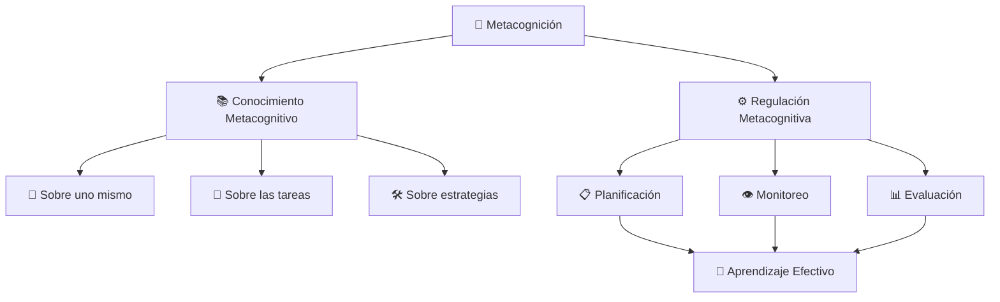
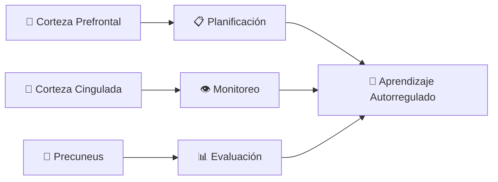

# 🧠 Metacognición - Aprender a Aprender

> [!tip] 💡 **Concepto Clave** La metacognición es la capacidad de "pensar sobre el pensamiento" - la conciencia y comprensión de los propios procesos mentales. Incluye el conocimiento sobre cómo aprendemos, qué estrategias funcionan mejor para nosotros, y la habilidad de autorregular nuestro aprendizaje de manera efectiva.

## 🎯 Definición y Componentes

> [!info] 🔬 **Estructura de la Metacognición**
> 
> **📚 Conocimiento Metacognitivo**
> 
> - Conocimiento sobre uno mismo como aprendiz
> - Conocimiento sobre las tareas de aprendizaje
> - Conocimiento sobre estrategias de aprendizaje
> 
> **⚙️ Regulación Metacognitiva**
> 
> - Planificación del aprendizaje
> - Monitoreo del progreso
> - Evaluación de resultados

## 🏗️ Los Tres Pilares de la Metacognición

### 👤 Conocimiento sobre Uno Mismo

> [!success] 🎯 **Autoconocimiento del Aprendiz**
> 
> **💪 Fortalezas Cognitivas**
> 
> - Identificar estilos de aprendizaje preferidos
> - Reconocer habilidades naturales
> - Conocer momentos de mayor productividad
> 
> **⚠️ Limitaciones y Desafíos**
> 
> - Aceptar áreas de dificultad
> - Reconocer distractores personales
> - Identificar patrones de procrastinación
> 
> **🎨 Preferencias de Aprendizaje**
> 
> - Visual, auditivo, kinestésico
> - Individual vs. grupal
> - Estructurado vs. flexible

### 📝 Conocimiento sobre las Tareas

> [!note] 🎯 **Análisis de Demandas Académicas**
> 
> **📊 Complejidad de la Tarea**
> 
> - Nivel de dificultad requerido
> - Tiempo estimado necesario
> - Recursos y materiales requeridos
> 
> **🎯 Objetivos de Aprendizaje**
> 
> - Qué se espera lograr
> - Criterios de éxito
> - Aplicaciones prácticas
> 
> **🔍 Tipo de Procesamiento**
> 
> - Memorización vs. comprensión
> - Análisis vs. síntesis
> - Aplicación vs. evaluación

### 🛠️ Conocimiento sobre Estrategias

> [!tip] 🔧 **Arsenal de Técnicas de Aprendizaje**
> 
> **📚 Estrategias de Codificación**
> 
> - Técnicas de memoria y mnemotecnias
> - Métodos de organización de información
> - Estrategias de comprensión lectora
> 
> **🔄 Estrategias de Recuperación**
> 
> - Técnicas de repaso efectivo
> - Métodos de autoexamen
> - Estrategias de transferencia
> 
> **⚖️ Cuándo Usar Cada Estrategia**
> 
> - Contextos apropiados para cada técnica
> - Combinaciones efectivas de métodos
> - Adaptación según el material

## 🔄 Proceso de Regulación Metacognitiva

### 📋 Planificación Estratégica

> [!example] 🎯 **Antes del Aprendizaje**
> 
> **🎯 Establecimiento de Objetivos**
> 
> - Definir metas específicas y medibles
> - Establecer criterios de éxito
> - Determinar plazos realistas
> 
> **📊 Análisis de la Tarea**
> 
> - Evaluar la complejidad
> - Identificar requisitos previos
> - Estimar tiempo y recursos necesarios
> 
> **🛠️ Selección de Estrategias**
> 
> - Elegir métodos apropiados
> - Planificar secuencia de actividades
> - Preparar materiales necesarios
> 
> **⏰ Gestión del Tiempo**
> 
> - Crear cronograma de estudio
> - Asignar prioridades
> - Establecer puntos de control

### 👁️ Monitoreo Continuo

> [!warning] 🔍 **Durante el Aprendizaje**
> 
> **📈 Seguimiento del Progreso**
> 
> - Evaluar comprensión en tiempo real
> - Identificar dificultades emergentes
> - Medir velocidad de avance
> 
> **🚨 Detección de Problemas**
> 
> - Reconocer señales de confusión
> - Identificar lagunas de conocimiento
> - Detectar fatiga mental
> 
> **🔧 Ajustes Inmediatos**
> 
> - Cambiar de estrategia si es necesario
> - Buscar clarificaciones
> - Tomar descansos estratégicos
> 
> **❓ Preguntas de Automonitoreo**
> 
> - "¿Estoy entendiendo esto?"
> - "¿Mi estrategia está funcionando?"
> - "¿Necesito ayuda adicional?"

### 📊 Evaluación y Reflexión

> [!success] 📝 **Después del Aprendizaje**
> 
> **🎯 Evaluación de Resultados**
> 
> - Comparar logros con objetivos
> - Medir calidad del aprendizaje
> - Evaluar eficiencia del proceso
> 
> **🤔 Análisis de Estrategias**
> 
> - Identificar qué funcionó bien
> - Reconocer métodos inefectivos
> - Evaluar uso del tiempo
> 
> **📈 Identificación de Mejoras**
> 
> - Áreas para optimizar
> - Estrategias alternativas a probar
> - Ajustes para futuras sesiones
> 
> **💡 Lecciones Aprendidas**
> 
> - Insights sobre el propio aprendizaje
> - Patrones de éxito identificados
> - Errores a evitar en el futuro

## 🎓 Desarrollo de Habilidades Metacognitivas

### 🌱 Estrategias para Principiantes

> [!note] 🚀 **Primeros Pasos**
> 
> **📔 Diario de Aprendizaje**
> 
> - Registrar métodos utilizados diariamente
> - Anotar qué funcionó y qué no
> - Reflexionar sobre el proceso
> 
> **❓ Preguntas Guía**
> 
> - "¿Qué aprendí hoy?"
> - "¿Cómo lo aprendí?"
> - "¿Qué haría diferente?"
> 
> **⏱️ Pausas Reflexivas**
> 
> - Detenerse cada 25-30 minutos
> - Evaluar comprensión actual
> - Ajustar estrategia si es necesario

### 🏃 Técnicas Intermedias

> [!tip] 📈 **Desarrollo Progresivo**
> 
> **🎯 Autoevaluación Estructurada**
> 
> - Crear rúbricas personales
> - Establecer criterios de calidad
> - Evaluarse objetivamente
> 
> **🔄 Experimentación Estratégica**
> 
> - Probar nuevos métodos conscientemente
> - Comparar efectividad de técnicas
> - Adaptar estrategias según contexto
> 
> **👥 Metacognición Social**
> 
> - Discutir estrategias con pares
> - Observar métodos de otros
> - Enseñar para consolidar conocimiento

### 🎖️ Nivel Avanzado

> [!success] 🏆 **Maestría Metacognitiva**
> 
> **🔬 Análisis Metacognitivo Profundo**
> 
> - Identificar patrones complejos
> - Desarrollar modelos personales de aprendizaje
> - Crear sistemas de optimización continua
> 
> **🎨 Creatividad Estratégica**
> 
> - Combinar técnicas de manera innovadora
> - Adaptar métodos a contextos únicos
> - Desarrollar estrategias personalizadas
> 
> **🎓 Mentoría Metacognitiva**
> 
> - Enseñar metacognición a otros
> - Guiar el desarrollo de habilidades reflexivas
> - Contribuir a la investigación educativa

## 🛠️ Herramientas Prácticas

### 📋 Plantillas y Formatos

> [!example] 📝 **Plantilla de Planificación**
> 
> **🎯 Objetivos de la Sesión:**
> 
> - Objetivo principal: ________________
> - Objetivos específicos: ________________
> - Criterios de éxito: ________________
> 
> **📊 Análisis de la Tarea:**
> 
> - Dificultad percibida (1-10): ______
> - Tiempo estimado: ________________
> - Recursos necesarios: ________________
> 
> **🛠️ Estrategias Seleccionadas:**
> 
> - Método principal: ________________
> - Técnicas de apoyo: ________________
> - Plan B si surge dificultad: ________________

> [!tip] 🔍 **Lista de Verificación de Monitoreo**
> 
> **Durante el Estudio (cada 25 min):**
> 
> - ☑️ ¿Estoy comprendiendo el material?
> - ☑️ ¿Mi estrategia está funcionando?
> - ☑️ ¿Estoy manteniendo la concentración?
> - ☑️ ¿Necesito un descanso o cambio de método?
> - ☑️ ¿Estoy cumpliendo con el cronograma?

> [!success] 📊 **Formato de Evaluación Post-Estudio**
> 
> **📈 Resultados Obtenidos:**
> 
> - Objetivos cumplidos: ________________
> - Calidad del aprendizaje (1-10): ______
> - Eficiencia del tiempo (1-10): ______
> 
> **🔧 Análisis de Estrategias:**
> 
> - Más efectiva: ________________
> - Menos efectiva: ________________
> - Nueva estrategia a probar: ________________
> 
> **💡 Reflexiones y Mejoras:**
> 
> - Lección principal: ________________
> - Ajuste para próxima sesión: ________________

### 📱 Aplicaciones y Tecnología

> [!info] 💻 **Herramientas Digitales**
> 
> **📝 Diarios Digitales:**
> 
> - **Day One**: Para reflexiones detalladas
> - **Journey**: Diario multimedia
> - **Notion**: Plantillas personalizables
> 
> **📊 Seguimiento de Progreso:**
> 
> - **Habitica**: Gamificación del aprendizaje
> - **Forest**: Concentración con métricas
> - **RescueTime**: Análisis de uso del tiempo
> 
> **🧠 Entrenamiento Metacognitivo:**
> 
> - **Elevate**: Ejercicios de pensamiento crítico
> - **Peak**: Juegos de metacognición
> - **Lumosity**: Entrenamiento cognitivo

## 🎯 Aplicación por Áreas de Estudio

### 📚 Lectura Comprensiva

> [!note] 📖 **Estrategias Metacognitivas**
> 
> **Antes de Leer:**
> 
> - Establecer propósito de lectura
> - Activar conocimientos previos
> - Seleccionar estrategia de lectura
> 
> **Durante la Lectura:**
> 
> - Monitorear comprensión
> - Hacer conexiones
> - Ajustar velocidad según dificultad
> 
> **После Лекции:**
> 
> - Evaluar comprensión lograda
> - Identificar información clave
> - Planificar revisión si es necesario

### 🧮 Resolución de Problemas Matemáticos

> [!example] 🔢 **Enfoque Metacognitivo**
> 
> **📋 Planificación:**
> 
> - Analizar tipo de problema
> - Identificar información conocida/desconocida
> - Seleccionar estrategia de solución
> 
> **🔍 Monitoreo:**
> 
> - Verificar pasos intermedios
> - Evaluar coherencia de resultados parciales
> - Detectar errores en el proceso
> 
> **✅ Evaluación:**
> 
> - Verificar respuesta final
> - Comprobar razonabilidad del resultado
> - Reflexionar sobre eficiencia del método

### ✍️ Escritura Académica

> [!tip] 📝 **Proceso Metacognitivo**
> 
> **🎯 Pre-escritura:**
> 
> - Clarificar audiencia y propósito
> - Organizar ideas principales
> - Seleccionar estructura y estilo
> 
> **✍️ Durante la Escritura:**
> 
> - Monitorear coherencia y claridad
> - Verificar cumplimiento del propósito
> - Ajustar organización si es necesario
> 
> **📖 Revisión:**
> 
> - Evaluar efectividad del mensaje
> - Identificar áreas de mejora
> - Planificar revisiones futuras

## 🧠 Neurociencia de la Metacognición

> [!info] 🔬 **Base Neurológica**
> 
> **🧠 Áreas Cerebrales Involucradas:**
> 
> - **Corteza Prefrontal**: Control ejecutivo y planificación
> - **Corteza Cingulada Anterior**: Monitoreo de conflictos
> - **Precuneus**: Autorreflexión y autoconciencia
> 
> **🔗 Redes Neuronales:**
> 
> - **Red de Control Ejecutivo**: Regulación cognitiva
> - **Red de Modo por Defecto**: Reflexión y introspección
> - **Red de Atención**: Monitoreo y concentración

## 📈 Beneficios de la Metacognición

### 🎓 Académicos

> [!success] 📚 **Mejoras en el Aprendizaje**
> 
> - **📈 Rendimiento Superior**: 25-40% mejor en evaluaciones
> - **⏰ Eficiencia Mejorada**: Menos tiempo para mejores resultados
> - **🔄 Transferencia**: Aplicación exitosa a nuevos contextos
> - **💪 Autonomía**: Menor dependencia de instrucción externa

### 💼 Profesionales

> [!tip] 🏢 **Competencias Laborales**
> 
> - **🎯 Toma de Decisiones**: Análisis más profundo de opciones
> - **🔄 Adaptabilidad**: Flexibilidad ante cambios
> - **💡 Innovación**: Pensamiento creativo y crítico
> - **👥 Liderazgo**: Mejor autorreflexión y desarrollo de otros

### 🌟 Personales

> [!example] 🌱 **Crecimiento Individual**
> 
> - **🧘 Autoconciencia**: Mayor comprensión personal
> - **💪 Resiliencia**: Mejor manejo de desafíos
> - **🎯 Autorregulación**: Control emocional y conductual
> - **📈 Mejora Continua**: Desarrollo constante de habilidades

## 🚧 Obstáculos y Soluciones

### ⚠️ Barreras Comunes

> [!warning] 🚫 **Desafíos Frecuentes**
> 
> **🏃 Prisa y Presión**
> 
> - Tendencia a saltar la reflexión
> - Priorizar velocidad sobre calidad
> - Estrés que inhibe la metacognición
> 
> **🎭 Sobrecarga Cognitiva**
> 
> - Demasiada información para procesar
> - Múltiples tareas simultáneas
> - Fatiga mental que reduce reflexión
> 
> **🤔 Falta de Conocimiento**
> 
> - Desconocimiento de estrategias
> - Inexperiencia en autorreflexión
> - Ausencia de modelos de referencia

### 💡 Estrategias de Superación

> [!success] ✅ **Soluciones Prácticas**
> 
> **⏰ Gestión del Tiempo**
> 
> - Incorporar reflexión en la planificación
> - Crear rutinas metacognitivas breves
> - Usar recordatorios automáticos
> 
> **🧘 Reducción de Carga Cognitiva**
> 
> - Simplificar procesos inicialmente
> - Usar plantillas y listas de verificación
> - Practicar técnicas de mindfulness
> 
> **📚 Desarrollo Gradual**
> 
> - Comenzar con habilidades básicas
> - Buscar mentoría y modelado
> - Participar en comunidades de aprendizaje

## 🔬 Investigación y Evidencia

> [!quote] 📊 **Estudios Científicos Clave**
> 
> **Flavell (1976) - Padre de la Metacognición** "La metacognición se refiere al conocimiento que uno tiene acerca de los propios procesos y productos cognitivos o cualquier cosa relacionada con ellos."
> 
> **Schraw & Dennison (1994)** Demostró que estudiantes con alta metacognición obtienen mejores resultados académicos independientemente de su capacidad cognitiva inicial.
> 
> **Veenman et al. (2006)** Metaanálisis que confirma que la metacognición contribuye significativamente al aprendizaje, explicando hasta el 40% de la varianza en el rendimiento.

## 🌐 Metacognición en Diferentes Culturas

> [!info] 🌍 **Perspectivas Culturales**
> 
> **🏮 Cultura Asiática**
> 
> - Énfasis en la autorreflexión (filosofía confuciana)
> - Importancia del autocontrol y disciplina
> - Metacognición como virtud social
> 
> **🏛️ Cultura Occidental**
> 
> - Enfoque en la individualidad y autonomía
> - Metacognición como herramienta de eficiencia
> - Conexión con el pensamiento crítico
> 
> **🌿 Culturas Indígenas**
> 
> - Metacognición en contexto comunitario
> - Aprendizaje experiencial y reflexivo
> - Sabiduría ancestral como metaconocimiento

## 🎯 Plan de Desarrollo Metacognitivo

### 📅 Programa de 8 Semanas

> [!note] 🗓️ **Cronograma de Desarrollo**
> 
> **Semana 1-2: Fundamentos**
> 
> - Introducción a conceptos básicos
> - Autodiagnóstico de habilidades actuales
> - Establecimiento de objetivos personales
> 
> **Semana 3-4: Planificación**
> 
> - Desarrollo de habilidades de análisis de tareas
> - Práctica de establecimiento de objetivos
> - Selección consciente de estrategias
> 
> **Semana 5-6: Monitoreo**
> 
> - Técnicas de autoobservación
> - Detección temprana de problemas
> - Ajustes estratégicos en tiempo real
> 
> **Semana 7-8: Evaluación y Integración**
> 
> - Reflexión profunda sobre el aprendizaje
> - Identificación de patrones personales
> - Desarrollo de sistema personal de metacognición

### 📊 Evaluación del Progreso

> [!success] 📈 **Indicadores de Desarrollo**
> 
> **🎯 Nivel Básico**
> 
> - Conciencia de propias fortalezas/debilidades
> - Uso ocasional de estrategias reflexivas
> - Evaluación básica de resultados
> 
> **📈 Nivel Intermedio**
> 
> - Planificación consciente del aprendizaje
> - Monitoreo regular del progreso
> - Ajustes estratégicos basados en reflexión
> 
> **🏆 Nivel Avanzado**
> 
> - Sistema personal de metacognición integrado
> - Transferencia efectiva entre contextos
> - Mentoría a otros en habilidades metacognitivas

---

## 📚 Referencias

> [!quote] 🔗 **Enlaces a Otras Notas**
> 
> - [[Método 4 - Aprendizaje Activo]] - Para aplicación práctica de metacognición
> - [[Método 10 - Aprendizaje Basado en Problemas]] - Para desarrollo metacognitivo grupal
> - [[Técnicas de Concentración]] - Para mejorar el automonitoreo
> - [[Motivación Académica]] - Para autorregulación motivacional
> - [[Hábitos de Estudio]] - Para rutinas metacognitivas
> - [[Mindfulness]] - Para desarrollo de autoconciencia

---

#metacognición #aprender-a-aprender #autorregulación #pensamiento-crítico #autoconciencia #estrategias-aprendizaje #reflexión #monitoreo-cognitivo #planificación-estudio #evaluación-aprendizaje