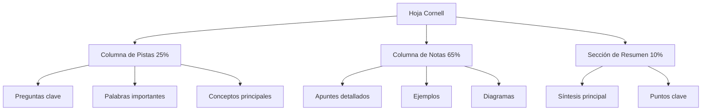

# 📝 Sistema Cornell de Notas

> [!info] 📚 Definición El Sistema Cornell de Notas es un método de toma de apuntes desarrollado por Walter Pauk en la Universidad de Cornell en la década de 1950. Divide la página en tres secciones específicas para optimizar el aprendizaje y la revisión del contenido.

## 🏗️ Estructura del Sistema

> [!tip] 📐 División de la Página El sistema divide cada página en tres secciones principales:
> 
> - **Columna de Notas** (lado derecho, ~65% de la página)
> - **Columna de Pistas** (lado izquierdo, ~25% de la página)
> - **Sección de Resumen** (parte inferior, ~10% de la página)

## 🔄 Proceso de Implementación

> [!warning] ⚠️ Fases del Método El sistema Cornell funciona en **5 fases secuenciales** que deben seguirse para obtener máximos beneficios:

### 📖 Fase 1: Registro

> [!info] ✍️ Durante la Clase o Lectura
> 
> - Toma notas en la **columna de notas** (lado derecho)
> - Registra ideas principales, ejemplos y detalles importantes
> - Usa abreviaciones y símbolos para agilizar el proceso
> - No te preocupes por la organización perfecta en esta fase

### 🔍 Fase 2: Reducción

> [!tip] 🎯 Después de la Clase (24-48 horas)
> 
> - Revisa tus notas en la columna derecha
> - Identifica **palabras clave**, **preguntas** y **conceptos principales**
> - Escribe estas pistas en la **columna izquierda**
> - Crea preguntas que puedan ser respondidas con el contenido de la derecha

### 📝 Fase 3: Recitación

> [!warning] 🗣️ Práctica Activa
> 
> - Cubre la columna de notas con una hoja
> - Lee las pistas de la columna izquierda
> - Intenta **recitar** o explicar el contenido de memoria
> - Verifica tus respuestas destapando la columna derecha

### 💭 Fase 4: Reflexión

> [!info] 🤔 Pensamiento Crítico
> 
> - Conecta las nuevas ideas con conocimientos previos
> - Analiza la **relevancia** y **aplicación** del contenido
> - Genera **opiniones propias** y **conexiones interdisciplinarias**
> - Identifica implicaciones y consecuencias

### 📊 Fase 5: Revisión

> [!tip] 🔄 Consolidación
> 
> - Completa la **sección de resumen** en la parte inferior
> - Revisa regularmente usando las pistas de la columna izquierda
> - Programa **revisiones espaciadas** del material
> - Actualiza y mejora tus resúmenes periódicamente

## ✅ Ventajas del Sistema

> [!info] 🌟 Beneficios Principales **Organización Estructurada**
> 
> - Formato consistente y predecible
> - Fácil localización de información
> - Separación clara entre contenido y síntesis
> 
> **Aprendizaje Activo**
> 
> - Fomenta la **participación activa** durante el estudio
> - Estimula el **pensamiento crítico** y la reflexión
> - Facilita la **autoevaluación** constante
> 
> **Retención Mejorada**
> 
> - Múltiples exposiciones al material
> - Procesamiento profundo de la información
> - Conexiones significativas entre conceptos

## ⚠️ Limitaciones y Consideraciones

> [!warning] 🚫 Desventajas Potenciales **Limitaciones de Formato**
> 
> - Puede ser restrictivo para materias muy visuales
> - No ideal para matemáticas complejas o fórmulas extensas
> - Requiere **práctica** para dominar la técnica
> 
> **Tiempo y Esfuerzo**
> 
> - Proceso más lento que la toma de notas tradicional
> - Requiere **revisión posterior** obligatoria
> - Necesita disciplina para completar todas las fases

## 🔧 Consejos para la Implementación

> [!tip] 💡 Mejores Prácticas **Configuración Física**
> 
> - Usa hojas con **líneas pre-dibujadas** o plantillas
> - Mantén un margen de 6-7 cm en el lado izquierdo
> - Deja 5-6 cm en la parte inferior para el resumen
> 
> **Durante la Toma de Notas**
> 
> - Desarrolla un **sistema de abreviaciones** personal
> - Usa **símbolos** y **flechas** para conectar ideas
> - No intentes escribir cada palabra del profesor
> 
> **En la Fase de Revisión**
> 
> - Programa **sesiones regulares** de revisión
> - Combina con [[Método 3 - Repetición Espaciada]]
> - Usa **colores** para categorizar tipos de información

## 🔗 Referencias

> [!quote] 📚 Notas Relacionadas
> 
> - Carpeta Métodos de Estudio - Contexto general de técnicas de aprendizaje
> - [[Técnicas de Visualización]] - Complementa con métodos visuales
> - [[Método 1 - Pomodoro]] - Gestión del tiempo durante el estudio
> - [[Método 3 - Repetición Espaciada]] - Optimización de la revisión
> - [[Hábitos de Estudio]] - Integración en rutinas de aprendizaje

## 📖 Notas Recomendadas

> [!info] 🔍 Para Profundizar
> 
> - [[Análisis de Tiempo]] - Para optimizar las sesiones de estudio Cornell
> - [[Técnicas de Concentración]] - Maximizar la efectividad durante las fases
> - [[Metacognición]] - Desarrollar conciencia sobre el propio aprendizaje
> - [[Motivación Académica]] - Mantener la disciplina necesaria para el método
> - [[Bullet Journal Method (BuJo)]] - Sistema complementario de organización

---

#estudio #métodos-de-estudio #toma-de-notas #cornell #aprendizaje-activo #organización #productividad-académica