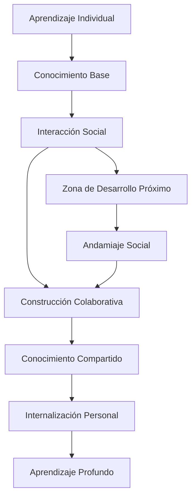
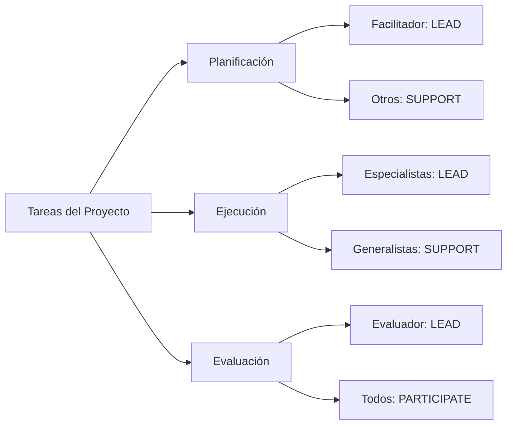
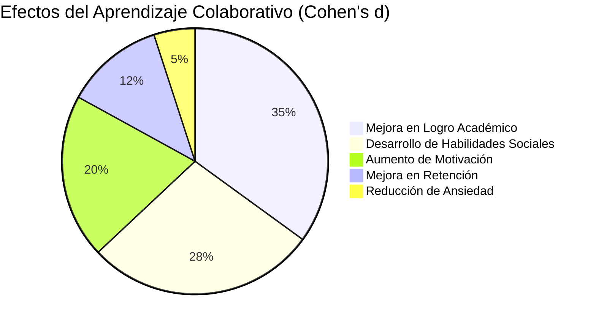

# 🤝 Aprendizaje Colaborativo

> [!tip] 💡 Concepto Clave El aprendizaje colaborativo es una metodología educativa donde los estudiantes trabajan juntos en grupos pequeños para alcanzar objetivos académicos comunes, maximizando tanto su propio aprendizaje como el de sus compañeros a través de la **interdependencia positiva**, la **responsabilidad individual** y la **interacción promotora**.

## 🧠 Fundamentos Teóricos

> [!info] 🔬 Base Conceptual Desarrollado por los hermanos **David y Roger Johnson** junto con **Edythe Holubec**, el aprendizaje colaborativo se sustenta en la **teoría constructivista social** de Vygotsky y el concepto de **Zona de Desarrollo Próximo (ZDP)**, donde el aprendizaje ocurre en la interacción social antes de internalizarse individualmente.

### Principios Fundamentales
>[!Success] Estos son: 
>- **Interdependencia Positiva**: El éxito individual depende del éxito grupal
>- **Responsabilidad Individual**: Cada miembro es accountable por su contribución
>- **Interacción Promotora Cara a Cara**: Facilitación mutua del aprendizaje
>- **Habilidades Sociales**: Desarrollo de competencias interpersonales
>- **Procesamiento Grupal**: Reflexión sobre la efectividad del trabajo en equipo



## 🏗️ Estructura del Aprendizaje Colaborativo

### 🎯 Elementos Esenciales

> [!tip] 🔧 Componentes Críticos
> 
> **1. Interdependencia Positiva**
> 
> - **De objetivos**: Metas comunes que requieren cooperación
> - **De recursos**: Distribución complementaria de materiales
> - **De roles**: Funciones específicas e interdependientes
> - **De tareas**: División del trabajo coherente
> - **De recompensas**: Reconocimiento grupal basado en logro colectivo
> 
> **2. Responsabilidad Individual**
> 
> - Evaluación personal dentro del contexto grupal
> - Contribuciones identificables y medibles
> - Accountability por el aprendizaje propio y ajeno
> - Feedback individualizado sobre performance

### 🔄 Ciclo de Colaboración Efectiva

> [!info] ⚙️ Proceso Estructurado
> 
> ```
> Fase 1: Formación (Forming) - 10%
> ├── Establecimiento de normas grupales
> ├── Definición de roles y responsabilidades
> └── Creación de rapport y confianza
> 
> Fase 2: Conflicto (Storming) - 20%
> ├── Emergencia de diferencias de opinión
> ├── Negociación de enfoques de trabajo
> └── Resolución constructiva de tensiones
> 
> Fase 3: Normalización (Norming) - 30%
> ├── Establecimiento de rutinas de trabajo
> ├── Desarrollo de cohesión grupal
> └── Optimización de procesos colaborativos
> 
> Fase 4: Ejecución (Performing) - 40%
> ├── Trabajo productivo y sinérgico
> ├── Intercambio fluido de ideas y recursos
> └── Logro de objetivos de aprendizaje
> ```

## 👥 Tipología de Grupos Colaborativos

### 🏃‍♂️ Grupos Informales

> [!tip] ⚡ Colaboración Espontánea
> 
> **Características:**
> 
> - **Duración**: Minutos a una clase
> - **Propósito**: Procesamiento inmediato de información
> - **Estructura**: Mínima o inexistente
> - **Evaluación**: Formativa e informal
> 
> **Técnicas Típicas:**
> 
> - **Think-Pair-Share**: Reflexión individual → Discusión en pares → Sharing grupal
> - **Numbered Heads Together**: Numeración de miembros → Discusión → Respuesta aleatoria
> - **Round Robin**: Rotación sistemática de participación
> - **Jigsaw rápido**: Especialización temporal en subtemas

### 🎯 Grupos Formales

> [!info] 📋 Colaboración Estructurada
> 
> **Características:**
> 
> - **Duración**: Una clase a varias semanas
> - **Propósito**: Completar tareas específicas de aprendizaje
> - **Estructura**: Roles definidos y procedimientos claros
> - **Evaluación**: Formativa y sumativa combinadas
> 
> **Modalidades Efectivas:**
> 
> - **Grupos de investigación**: Proyectos de indagación colaborativa
> - **Teams de resolución de problemas**: Casos complejos multidisciplinarios
> - **Círculos de escritura**: Peer review y editing colaborativo
> - **Labs colaborativos**: Experimentación científica grupal

### 🏢 Grupos Base Cooperativos

> [!warning] 🤝 Colaboración a Largo Plazo
> 
> **Características:**
> 
> - **Duración**: Semestre completo o año académico
> - **Propósito**: Apoyo académico y personal continuo
> - **Estructura**: Heterogénea y estable en membresía
> - **Evaluación**: Holística del desarrollo grupal e individual
> 
> **Funciones Principales:**
> 
> - **Academic Support**: Tutoría peer-to-peer constante
> - **Motivational Support**: Encouragement y accountability
> - **Personal Support**: Desarrollo de habilidades sociales
> - **Administrative Support**: Gestión de tareas y plazos

## 🎭 Roles y Responsabilidades

### 🎪 Sistema de Roles Rotativos

> [!tip] 🔄 Distribución Equitativa
> 
> **Roles Académicos:**
> 
> - **Facilitador/Líder**: Guía discusiones y mantiene focus
> - **Registrador/Secretario**: Documenta ideas y decisiones
> - **Investigador**: Busca información adicional necesaria
> - **Sintetizador**: Integra contribuciones en coherencia
> - **Evaluador**: Monitorea calidad y progreso del trabajo
> 
> **Roles Sociales:**
> 
> - **Motivador**: Mantiene energía y enthusiasm positivos
> - **Mediador**: Facilita resolución de conflictos
> - **Timekeeper**: Gestiona tiempo y plazos efectivamente
> - **Comunicador**: Interface con instructor y otros grupos
> - **Monitor de Participación**: Asegura involucramiento equitativo

### 📊 Matriz de Responsabilidades



## 🛠️ Metodologías Colaborativas Específicas

### 🧩 Jigsaw Method

> [!info] 🔍 Especialización Interdependiente
> 
> **Proceso Estructurado:**
> 
> 1. **División del contenido** en subtemas especializados
> 2. **Grupos de expertos** estudian profundamente su área
> 3. **Grupos base** reciben enseñanza de cada experto
> 4. **Evaluación individual** sobre todo el contenido
> 5. **Reflexión grupal** sobre efectividad del proceso
> 
> **Ventajas:**
> 
> - Cada estudiante es **esencial** para el éxito grupal
> - Desarrollo de **expertise** en área específica
> - **Enseñanza peer-to-peer** de alta calidad
> - **Interdependencia** genuina y productiva

### 🏆 Team-Based Learning (TBL)

> [!tip] 🎯 Aprendizaje por Equipos
> 
> **Fases del TBL:**
> 
> ```
> Preparación Individual
> ├── Lecturas asignadas pre-clase
> ├── Study guide con objetivos claros
> └── Self-assessment de preparación
> 
> Readiness Assurance Process
> ├── Individual test (10-15 preguntas)
> ├── Same test en equipo con discusión
> └── Clarificación de conceptos con instructor
> 
> Application Activities
> ├── Problemas complejos significativos
> ├── Same problem para todos los equipos
> └── Simultaneous reporting de soluciones
> ```

> Peer Evaluation ├── Assessment de contribuciones individuales ├── Feedback constructivo entre miembros └── Adjustments para mejorar teamwork ```

### 🔬 Problem-Based Learning Colaborativo

> [!warning] 🧠 Resolución Grupal de Problemas
> 
> **Estructura de Sesión PBL:**
> 
> - **Problema auténtico** presentado sin información previa
> - **Análisis inicial** identificando conocimientos gaps
> - **Distribución de research** entre miembros del equipo
> - **Sharing de findings** y construcción de solución
> - **Presentación** de solución con justificación
> - **Debrief** sobre proceso y aprendizajes obtenidos

### 🎨 Collaborative Creative Projects

> [!info] 💡 Creatividad Sinérgica
> 
> **Metodologías Creativas:**
> 
> - **Design Thinking colaborativo**: Ideación, prototipado, testing grupal
> - **Storytelling colectivo**: Construcción narrativa distribuida
> - **Collective Intelligence**: Agregación de perspectivas diversas
> - **Crowd-sourced solutions**: Soluciones emergentes del grupo
> 
> **Herramientas de Creatividad Grupal:**
> 
> - **Brainwriting**: Escritura silenciosa seguida de sharing
> - **Six Thinking Hats**: Perspectivas sistemáticas de De Bono
> - **SCAMPER colaborativo**: Técnica de innovación grupal
> - **Mind mapping colectivo**: Construcción visual de ideas

## 💻 Tecnología para Aprendizaje Colaborativo

### 🌐 Plataformas Síncronas

> [!tip] ⚡ Colaboración en Tiempo Real
> 
> **Video Conferencing Educativo:**
> 
> - **Zoom/Teams**: Breakout rooms para grupos pequeños
> - **Google Meet**: Integración con Workspace educativo
> - **Discord**: Canales específicos por proyecto/materia
> - **Gather.town**: Espacios virtuales inmersivos
> 
> **Colaboración Documental:**
> 
> - **Google Docs/Sheets**: Edición simultánea con comments
> - **Microsoft 365**: Co-authoring en tiempo real
> - **Notion**: Workspaces colaborativos estructurados
> - **Miro/Mural**: Whiteboards digitales para visual collaboration

### 🔄 Plataformas Asíncronas

> [!info] 📱 Colaboración Flexible
> 
> **Learning Management Systems:**
> 
> - **Canvas/Blackboard**: Grupos con assignments colaborativos
> - **Moodle**: Workshops y peer assessment tools
> - **Schoology**: Social learning networks
> - **Edmodo**: Micro-learning colaborativo
> 
> **Herramientas Especializadas:**
> 
> - **Padlet**: Muros colaborativos de ideas
> - **Flipgrid**: Video discussions asíncronas
> - **VoiceThread**: Conversaciones multimedia
> - **Kialo**: Debates estructurados y argumentación

### 🎮 Gamificación Colaborativa

> [!warning] 🏆 Juegos Educativos Grupales
> 
> **Plataformas de Gaming Educativo:**
> 
> - **Kahoot Teams**: Quizzes colaborativos competitivos
> - **Classcraft**: RPG educativo con guilds
> - **Quizizz**: Challenges grupales asíncronos
> - **Breakout EDU**: Escape rooms educativos digitales
> 
> **Elementos de Gamificación:**
> 
> - **Team leaderboards**: Competencia saludable entre grupos
> - **Collaborative achievements**: Logros que requieren cooperación
> - **Group progression**: Avance conjunto por niveles
> - **Peer recognition systems**: Sistemas de reconocimiento mutuo

## 📊 Evaluación del Aprendizaje Colaborativo

### 🎯 Dimensiones de Assessment

> [!info] 📋 Evaluación Integral
> 
> **Individual Assessment:**
> 
> - **Knowledge mastery**: Evaluación de contenido personal
> - **Skill development**: Crecimiento en competencias específicas
> - **Contribution quality**: Valor agregado al trabajo grupal
> - **Reflection depth**: Metacognición sobre aprendizaje colaborativo
> 
> **Group Assessment:**
> 
> - **Collective output**: Calidad del producto final grupal
> - **Process effectiveness**: Eficiencia del trabajo en equipo
> - **Collaboration quality**: Dynamics y interaction patterns
> - **Goal achievement**: Logro de objetivos establecidos

### 📈 Rubrica de Evaluación Colaborativa

> [!tip] 📊 Criterios Específicos
> 
> |Dimensión|Excelente (4)|Proficiente (3)|Desarrollando (2)|Inicial (1)|
> |---|---|---|---|---|
> |**Participación**|Contribuye consistentemente con ideas valiosas|Participa regularmente con aportes relevantes|Contribuye ocasionalmente|Participación mínima o irrelevante|
> |**Colaboración**|Facilita el trabajo de otros activamente|Coopera efectivamente con el equipo|Trabaja adecuadamente con otros|Dificultades para trabajar en grupo|
> |**Responsabilidad**|Asume liderazgo y accountability completo|Cumple compromisos consistentemente|Cumple la mayoría de responsabilidades|Requiere recordatorios frecuentes|
> |**Comunicación**|Comunica ideas clara y persuasivamente|Se expresa con claridad y respeto|Comunicación básica efectiva|Dificultades de comunicación|

### 🔍 Herramientas de Assessment

> [!warning] 🛠️ Instrumentos de Medición
> 
> **Peer Assessment Tools:**
> 
> - **360-degree feedback**: Evaluación multidireccional
> - **Contribution matrices**: Mapeo de aportes individuales
> - **Teamwork rubrics**: Rúbricas específicas de colaboración
> - **Self-assessment forms**: Autoevaluación reflexiva
> 
> **Process Documentation:**
> 
> - **Team journals**: Registro de progreso y decisiones
> - **Video analysis**: Análisis de interactions grupales
> - **Digital portfolios**: Evidencia de contribuciones individuales
> - **Process maps**: Visualización de workflow colaborativo

## 🧠 Desarrollo de Habilidades Sociales

### 🗣️ Comunicación Efectiva

> [!tip] 💬 Competencias Comunicativas
> 
> **Habilidades Verbales:**
> 
> - **Active listening**: Escucha completa y empática
> - **Clear expression**: Articulación precisa de ideas
> - **Questioning techniques**: Preguntas que facilitan comprensión
> - **Summarizing skills**: Síntesis efectiva de discusiones
> 
> **Habilidades No Verbales:**
> 
> - **Body language awareness**: Consciencia de señales físicas
> - **Eye contact**: Contacto visual apropiado y respetuoso
> - **Spatial positioning**: Uso del espacio para inclusion
> - **Facial expressions**: Expresiones que facilitan diálogo

### 🤝 Resolución de Conflictos

> [!info] ⚖️ Gestión Constructiva de Diferencias
> 
> **Proceso de Mediación:**
> 
> 1. **Identificación** del conflicto sin personalizar
> 2. **Expresión** de perspectivas múltiples
> 3. **Búsqueda** de intereses comunes subyacentes
> 4. **Generación** de opciones win-win
> 5. **Acuerdo** sobre solución mutuamente beneficiosa
> 6. **Follow-up** para asegurar efectividad
> 
> **Técnicas de De-escalation:**
> 
> - **Paraphrasing**: Reformular para demostrar comprensión
> - **Emotional regulation**: Manejo de respuestas emocionales
> - **Focus on issues**: Separar problemas de personas
> - **Collaborative framing**: Re-enmarcar como desafío conjunto

### 🎯 Liderazgo Distribuido

> [!warning] 👑 Leadership Compartido
> 
> **Modelos de Liderazgo Colaborativo:**
> 
> - **Situational leadership**: Adaptación según contexto y necesidades
> - **Servant leadership**: Liderazgo al servicio del grupo
> - **Transformational leadership**: Inspiración hacia objetivos elevados
> - **Shared leadership**: Rotación de roles de liderazgo
> 
> **Competencias de Líder Colaborativo:**
> 
> - **Vision articulation**: Comunicación clara de objetivos
> - **Team building**: Construcción de cohesión grupal
> - **Decision facilitation**: Facilitación de decisiones grupales
> - **Conflict navigation**: Navegación constructiva de diferencias

## 🌍 Aplicaciones Específicas por Contexto

### 🎓 Educación Superior

> [!tip] 🏫 Universidad y Postgrado
> 
> **Modalidades Universitarias:**
> 
> - **Research teams**: Proyectos de investigación colaborativa
> - **Case study groups**: Análisis de casos complejos
> - **Peer tutoring circles**: Tutoría mutua entre estudiantes
> - **Capstone project teams**: Proyectos integradores finales
> - **Study groups**: Grupos de estudio autoorganizados
> 
> **Disciplinas Específicas:**
> 
> - **STEM**: Labs colaborativos, problem-solving teams
> - **Humanidades**: Seminarios de discusión, círculos de escritura
> - **Negocios**: Case competitions, consulting projects
> - **Medicina**: Patient-based learning, clinical teams

### 💼 Educación Profesional

> [!info] 🏢 Desarrollo Corporativo
> 
> **Learning & Development:**
> 
> - **Cross-functional teams**: Proyectos interdepartamentales
> - **Communities of practice**: Comunidades de aprendizaje profesional
> - **Mentoring circles**: Círculos de mentoría grupal
> - **Action learning sets**: Grupos de acción-aprendizaje
> - **Innovation labs**: Laboratorios de innovación colaborativa
> 
> **Competencias Empresariales:**
> 
> - **Project management**: Gestión colaborativa de proyectos
> - **Change management**: Liderazgo de cambio organizacional
> - **Strategic planning**: Planificación estratégica participativa
> - **Quality improvement**: Mejora continua en equipos

### 🌐 Aprendizaje Virtual/Híbrido

> [!warning] 💻 Modalidades Digitales
> 
> **Challenges Específicos:**
> 
> - **Digital fatigue**: Cansancio por interacciones virtuales
> - **Technology barriers**: Limitaciones de acceso o habilidades
> - **Time zone differences**: Coordinación across geografías
> - **Reduced non-verbal cues**: Limitaciones comunicativas digitales
> 
> **Estrategias de Mitigación:**
> 
> - **Structured interaction protocols**: Reglas claras de participación
> - **Asynchronous collaboration**: Herramientas de colaboración flexible
> - **Digital relationship building**: Actividades de team building virtual
> - **Multi-modal communication**: Combinación de texto, audio, video

## 🔬 Investigación y Evidencia

### 📊 Meta-análisis de Efectividad



> [!info] 📈 Hallazgos de Investigación
> 
> **Johnson & Johnson (2019) - Meta-análisis de 305 estudios:**
> 
> - **Effect size promedio**: d = 0.54 (moderado a grande)
> - **Retención**: 28% mejor que aprendizaje individual
> - **Transferencia**: 42% mejor aplicación de conocimientos
> - **Habilidades sociales**: Mejora significativa en 89% de estudios
> 
> **Kyndt et al. (2013) - Systematic Review:**
> 
> - **Aprendizaje profundo**: Incremento del 31% vs. individual
> - **Critical thinking**: Mejora del 23% en razonamiento
> - **Self-efficacy**: Aumento del 19% en confianza académica

### 🧪 Factores de Éxito Identificados

> [!tip] 🎯 Elementos Críticos
> 
> **Variables del Instructor:**
> 
> - **Training en collaborative learning**: Formación específica
> - **Monitoring skills**: Habilidades de seguimiento grupal
> - **Intervention timing**: Momento apropiado de intervención
> - **Assessment alignment**: Evaluación coherente con metodología
> 
> **Variables del Estudiante:**
> 
> - **Prior collaborative experience**: Experiencia previa
> - **Social skills baseline**: Competencias sociales iniciales
> - **Motivation orientation**: Orientación motivacional
> - **Cultural background**: Trasfondo cultural y expectativas
> 
> **Variables del Contexto:**
> 
> - **Group size**: Tamaño óptimo (3-4 miembros)
> - **Task complexity**: Complejidad apropiada de tareas
> - **Time allocation**: Tiempo suficiente para colaboración
> - **Physical/virtual environment**: Espacio facilitador

## 🚀 Implementación Práctica

### 📋 Checklist de Preparación

> [!warning] ✅ Lista de Verificación
> 
> **Antes de Iniciar:**
> 
> - [ ] **Objetivos claros** de aprendizaje definidos
> - [ ] **Criterios de evaluación** comunicados transparentemente
> - [ ] **Roles y responsabilidades** asignados específicamente
> - [ ] **Timeline del proyecto** establecido realísticamente
> - [ ] **Recursos necesarios** identificados y disponibles
> - [ ] **Protocolos de comunicación** acordados grupalmente
> - [ ] **Conflict resolution procedures** establecidos preventivamente
> 
> **Durante la Ejecución:**
> 
> - [ ] **Check-ins regulares** programados y cumplidos
> - [ ] **Progress monitoring** documentado sistemáticamente
> - [ ] **Individual contributions** tracked y reconocidas
> - [ ] **Group dynamics** observadas y ajustadas
> - [ ] **Quality standards** mantenidos consistentemente
> 
> **Al Finalizar:**
> 
> - [ ] **Deliverables** completados según especificaciones
> - [ ] **Individual assessment** realizada comprehensivamente - [ ] **Group reflection** facilitada estructuradamente - [ ] **Lessons learned** documentadas para futuro - [ ] **Relationships** mantenidas post-proyecto

### 🎯 Estrategias de Troubleshooting

> [!info] 🔧 Resolución de Problemas Comunes
> 
> **Free Riders (Polizones):**
> 
> - **Individual accountability** clara y medible
> - **Peer evaluation** sistemática y transparente
> - **Task decomposition** que requiera todos los miembros
> - **Regular check-ins** individuales con instructor
> 
> **Dominating Members:**
> 
> - **Structured turn-taking** en discusiones
> - **Role rotation** obligatoria y regular
> - **Anonymous feedback systems** para equilibrar participación
> - **Task complexity** que requiera expertise diverso
> 
> **Communication Breakdowns:**
> 
> - **Communication protocols** explícitos desde inicio
> - **Multiple communication channels** disponibles
> - **Regular relationship maintenance** activities
> - **Mediation resources** accesibles cuando necesario
> 
> **Quality Control Issues:**
> 
> - **Milestones** intermedios con review obligatorio
> - **Peer review processes** estructurados
> - **Quality rubrics** compartidas y comprendidas
> - **Iteration cycles** built into timeline

## 🌟 Futuro del Aprendizaje Colaborativo

### 🤖 Inteligencia Artificial y Colaboración

> [!tip] 🔮 Tendencias Emergentes
> 
> **AI-Enhanced Collaboration:**
> 
> - **Intelligent group formation**: Algoritmos para optimal team composition
> - **Real-time facilitation**: AI coaches que guían group dynamics
> - **Automated feedback**: Assessment instantáneo de collaborative skills
> - **Predictive analytics**: Identificación temprana de potential issues
> 
> **Immersive Technologies:**
> 
> - **VR collaborative spaces**: Entornos virtuales compartidos
> - **AR overlay information**: Información contextual superpuesta
> - **Haptic feedback**: Experiencias táctiles compartidas - **Brain-computer interfaces**: Colaboración directa mente-a-mente

### 🌍 Global Collaborative Learning

> [!info] 🌐 Escala Planetaria
> 
> **Cross-Cultural Collaboration:**
> 
> - **International project partnerships**: Colaboración entre países
> - **Language exchange programs**: Aprendizaje de idiomas colaborativo
> - **Global problem-solving initiatives**: Challenges planetarios
> - **Cultural competency development**: Habilidades interculturales
> 
> **Distributed Expertise Networks:**
> 
> - **Expert-novice pairing**: Conexión global de expertise - **Crowd-sourced learning**: Aprendizaje distribuido masivo - **Open educational resources**: Recursos colaborativos abiertos - **Blockchain credentialing**: Verificación descentralizada de skills

## 🔗 Referencias

> [!quote] Enlaces a Otras Notas
> 
> - [[Método 4 - Aprendizaje Activo]] - Participación activa en grupos
> - [[Método 10 - Aprendizaje Basado en Problemas]] - PBL colaborativo
> - [[Comunicación Efectiva]] - Experimentación grupal
> - [[Habilidades Sociales]] - Competencias interpersonales
> - [[Gestión de Proyectos]] - Organización de trabajo grupal
> - [[Técnicas de Comunicación]] - Comunicación efectiva en equipos
> - [[Gestión de Conflictos]] - Manejo de diferencias grupales
> - [[Liderazgo Situacional]] - Liderazgo en contextos colaborativos
> - [[Apps de Productividad]] - Herramientas de colaboración digital
> - [[Gestión del Tiempo]] - Coordinación temporal en grupos
> - [[Evaluación del Aprendizaje]] - Assessment colaborativo
> - [[Motivación Académica]] - Motivación en contextos grupales

## 📚 Notas Recomendadas

Para complementar este tema, revisa:

- [[Design Thinking]] - Metodología colaborativa de innovación
- [[Facilitación de Grupos]] - Técnicas de conducción grupal
- [[Inteligencia Emocional]] - Competencias emocionales en equipos
- [[Diversidad e Inclusión]] - Aprovechamiento de diferencias grupales
- [[Redes de Aprendizaje]] - Networks de conocimiento colaborativo
- [[Comunidades de Práctica]] - Aprendizaje en comunidades profesionales
- [[Aprendizaje entre Pares]] - Aprendizaje entre pares estructurado
- [[Team Building]] - Construcción de equipos efectivos
- [[Equipos Virtuales]] - Equipos de trabajo remoto
- [[Comunicación Intercultural]] - Comunicación intercultural
- [[Gamificación Colaborativa]] - Juegos para aprendizaje grupal
- [[Evaluación 360°]] - Evaluación multidireccional en grupos

---

#aprendizaje-colaborativo #trabajo-en-equipo #cooperación #interdependencia-positiva #habilidades-sociales #comunicación #liderazgo-distribuido #assessment-grupal #tecnología-colaborativa #johnson-johnson