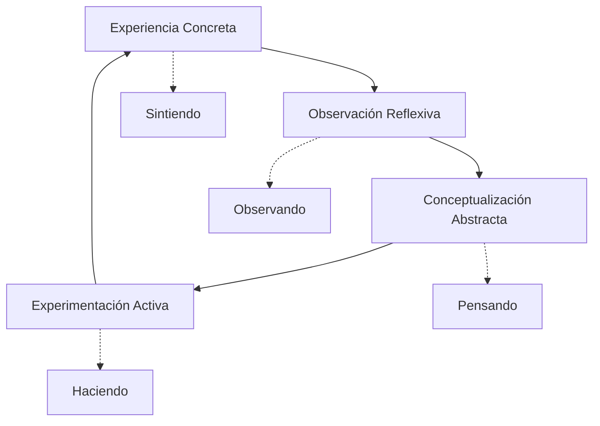

# 🧪 Aprendizaje Experimental

> [!tip] 💡 Concepto Clave El aprendizaje experimental es un enfoque pedagógico que privilegia la **experiencia directa**, la **experimentación activa** y el **descubrimiento personal** sobre la transmisión pasiva de información. Se basa en el principio de que aprendemos mejor haciendo, probando y reflexionando sobre nuestras experiencias.

## 🔬 Fundamentos Teóricos

> [!info] 🧠 Base Conceptual Desarrollado por **David Kolb** en 1984, el aprendizaje experimental se sustenta en la idea de que el conocimiento se construye a través de la **transformación de la experiencia**. Este enfoque integra cognición, emoción y acción en un proceso cíclico continuo.

### Principios Fundamentales

- **Experiencia Directa**: El aprendizaje emerge de la participación activa
- **Reflexión Crítica**: Análisis consciente de la experiencia vivida
- **Conceptualización**: Formación de teorías a partir de observaciones
- **Aplicación Práctica**: Implementación de nuevos conocimientos



## 🔄 Ciclo de Kolb Detallado

### 1. 🎯 Experiencia Concreta (Sintiendo)

> [!tip] 🤲 Participación Directa
> 
> **Características:**
> 
> - Involucramiento total en experiencias nuevas
> - Enfoque en sentimientos y sensaciones inmediatas
> - Apertura a vivencias sin prejuicios preconcebidos
> - Confianza en intuición y emociones
> 
> **Ejemplos Prácticos:**
> 
> - Realizar un experimento científico sin conocer el resultado
> - Participar en simulaciones o role-playing
> - Visitar lugares relacionados con el tema de estudio
> - Interactuar con expertos en el campo

### 2. 🤔 Observación Reflexiva (Observando)

> [!info] 👁️ Análisis Cuidadoso
> 
> **Proceso de Reflexión:**
> 
> - Observar la experiencia desde **múltiples perspectivas**
> - Recopilar datos e información relevante
> - Identificar patrones y conexiones
> - Considerar implicaciones y significados
> 
> **Herramientas de Reflexión:**
> 
> - **Diario de aprendizaje** con preguntas guía
> - **Mapas mentales** de la experiencia
> - **Discusiones grupales** estructuradas
> - **Video-análisis** de la propia actuación

### 3. 🧠 Conceptualización Abstracta (Pensando)

> [!tip] 📚 Construcción Teórica
> 
> **Desarrollo de Marcos Conceptuales:**
> 
> - Integrar observaciones en **teorías coherentes**
> - Conectar con conocimiento previo y literatura
> - Crear modelos explicativos generalizables
> - Formular hipótesis para futuras experiencias
> 
> **Técnicas de Conceptualización:**
> 
> - **Análisis comparativo** con casos similares
> - **Modelado de procesos** y sistemas
> - **Síntesis teórica** de múltiples fuentes
> - **Creación de frameworks** personalizados

### 4. ⚡ Experimentación Activa (Haciendo)

> [!warning] 🚀 Aplicación Práctica
> 
> **Implementación de Aprendizajes:**
> 
> - Probar nuevas ideas en **situaciones reales**
> - Modificar enfoques basándose en teorías desarrolladas
> - Tomar riesgos calculados para validar hipótesis
> - Iterar y mejorar basándose en resultados
> 
> **Modalidades de Experimentación:**
> 
> - **Proyectos piloto** de pequeña escala
> - **Prototipados rápidos** de soluciones
> - **A/B testing** de diferentes enfoques
> - **Implementación gradual** de cambios

## 🎭 Estilos de Aprendizaje según Kolb

### 🌟 Divergente (Sintiendo + Observando)

> [!info] 🎨 Características del Estilo
> 
> **Fortalezas:**
> 
> - **Imaginación** y creatividad excepcionales
> - **Sensibilidad** hacia emociones y valores
> - **Capacidad** de ver situaciones desde múltiples perspectivas
> - **Generación** de ideas alternativas
> 
> **Preferencias de Aprendizaje:**
> 
> - Brainstorming y lluvia de ideas
> - Trabajos grupales y colaboración
> - Casos de estudio con múltiples interpretaciones
> - Actividades que permitan expresión personal
> 
> **Profesiones Típicas:** Artistas, psicólogos, trabajadores sociales, escritores

### 🔍 Asimilador (Observando + Pensando)

> [!tip] 📖 Orientación Teórica
> 
> **Fortalezas:**
> 
> - **Razonamiento inductivo** excepcional
> - **Capacidad** para crear modelos teóricos
> - **Síntesis** de información dispersa
> - **Pensamiento** abstracto y conceptual
> 
> **Preferencias de Aprendizaje:**
> 
> - Lecturas extensas y análisis teórico
> - Conferencias y presentaciones estructuradas
> - Investigación independiente
> - Tiempo para reflexión profunda
> 
> **Profesiones Típicas:** Científicos, académicos, investigadores, planificadores

### ⚡ Convergente (Pensando + Haciendo)

> [!warning] 🎯 Solución de Problemas
> 
> **Fortalezas:**
> 
> - **Razonamiento deductivo** sólido
> - **Solución** práctica de problemas
> - **Toma de decisiones** eficiente
> - **Aplicación** práctica de ideas
> 
> **Preferencias de Aprendizaje:**
> 
> - Laboratorios y experimentos controlados
> - Simulaciones técnicas
> - Casos con una "respuesta correcta"
> - Aplicaciones prácticas inmediatas
> 
> **Profesiones Típicas:** Ingenieros, médicos, tecnólogos, especialistas técnicos

### 🏃‍♂️ Acomodador (Haciendo + Sintiendo)

> [!info] 🌊 Adaptabilidad Práctica
> 
> **Fortalezas:**
> 
> - **Adaptabilidad** a nuevas situaciones
> - **Intuición** para la acción
> - **Liderazgo** y toma de riesgos
> - **Influencia** sobre otros
> 
> **Preferencias de Aprendizaje:**
> 
> - Experiencias de campo
> - Proyectos con plazos ajustados
> - Trabajo en equipo con roles activos
> - Situaciones que requieren adaptación rápida
> 
> **Profesiones Típicas:** Vendedores, gerentes, emprendedores, educadores

## 🛠️ Metodologías y Técnicas Experimentales

### 🎲 Aprendizaje Basado en Problemas (ABP)

> [!tip] 🧩 Resolución Colaborativa
> 
> **Estructura del ABP:**
> 
> 1. **Presentación** del problema real y complejo
> 2. **Análisis inicial** en grupos pequeños
> 3. **Identificación** de conocimientos necesarios
> 4. **Investigación** autodirigida
> 5. **Aplicación** de soluciones propuestas
> 6. **Evaluación** de resultados y proceso
> 
> **Ventajas:**
> 
> - Desarrolla pensamiento crítico
> - Fomenta aprendizaje autodirigido
> - Integra teoría y práctica
> - Mejora habilidades de colaboración

### 🎮 Gamificación del Aprendizaje

> [!info] 🏆 Elementos de Juego
> 
> **Componentes Clave:**
> 
> - **Puntos y niveles** para progresión visible
> - **Badges/medallas** por logros específicos
> - **Tablas de liderazgo** para competencia saludable
> - **Narrativas** que contextualizan el aprendizaje
> - **Desafíos** progresivos y adaptativos
> 
> **Plataformas Recomendadas:**
> 
> - **Kahoot!** para quizzes interactivos
> - **Classcraft** para experiencias RPG
> - **Duolingo** como modelo de progresión
> - **Minecraft Education** para construcción colaborativa

### 🏭 Aprendizaje Basado en Proyectos

> [!tip] 🔨 Construcción de Conocimiento
> 
> **Fases del Proyecto:**
> 
> ```
> Fase 1: Definición del Problema (1 semana)
> ├── Investigación inicial
> ├── Definición de objetivos
> └── Planificación de recursos
> 
> Fase 2: Desarrollo (4-6 semanas)
> ├── Iteraciones de prototipado
> ├── Testing y validación
> └── Refinamiento continuo
> 
> Fase 3: Presentación (1 semana)
> ├── Documentación de proceso
> ├── Presentación pública
> └── Reflexión y evaluación
> ```

### 🌍 Aprendizaje Experiencial Inmersivo

> [!warning] 🚁 Experiencias Totales
> 
> **Modalidades de Inmersión:**
> 
> - **Viajes de estudio** a lugares relevantes
> - **Internships/prácticas** en organizaciones reales
> - **Simulaciones** de alta fidelidad
> - **Realidad Virtual/Aumentada** para contextos inaccesibles
> - **Intercambios culturales** para perspectivas múltiples

## 🔬 Diseño de Experimentos de Aprendizaje

### 📊 Metodología Científica Personal

> [!info] 🔬 Estructura de Investigación
> 
> **1. Formulación de Hipótesis**
> 
> - ¿Qué método de estudio será más efectivo para mí?
> - ¿Cómo afecta el entorno a mi concentración?
> - ¿Cuál es el momento óptimo para diferentes tipos de aprendizaje?
> 
> **2. Diseño Experimental**
> 
> - Variables independientes (método, tiempo, entorno)
> - Variables dependientes (retención, comprensión, satisfacción)
> - Controles y grupos de comparación
> 
> **3. Recolección de Datos**
> 
> - **Métricas cuantitativas**: Tiempo, puntuaciones, frecuencias
> - **Métricas cualitativas**: Journals, autorreportes, observaciones
> 
> **4. Análisis y Conclusiones**
> 
> - Patrones identificados
> - Validación o refutación de hipótesis
> - Ajustes para futuros experimentos

### 📋 Template de Experimento Personal

> [!tip] 📝 Estructura Replicable
> 
> ```markdown
> ## Experimento: [Nombre del Experimento]
> 
> **Fecha:** [DD/MM/YYYY]
> **Duración:** [X semanas/días]
> 
> ### Hipótesis
> Si [variable independiente], entonces [resultado esperado]
> 
> ### Variables
> - **Independiente:** [Lo que cambiaré]
> - **Dependiente:** [Lo que mediré]
> - **Control:** [Lo que mantendré constante]
> 
> ### Metodología
> 1. [Paso 1]
> 2. [Paso 2]
> 3. [Paso 3]
> 
> ### Métricas
> - [Métrica 1]: [Cómo la mediré]
> - [Métrica 2]: [Cómo la mediré]
> 
> ### Resultados
> [Datos recopilados]
> 
> ### Conclusiones
> [Análisis e insights]
> 
> ### Próximos Pasos
> [Experimentos futuros o ajustes]
> ```

## 🎯 Aplicaciones Específicas por Disciplina

### 💻 Programación y Tecnología

> [!tip] ⌨️ Aprendizaje Práctico
> 
> **Metodologías Experimentales:**
> 
> - **Code Katas** diarios con reflexión
> - **Pair Programming** rotativo
> - **Code Reviews** como aprendizaje peer-to-peer
> - **Hackathons** para aplicación intensiva
> - **Open Source Contributions** para contexto real
> 
> **Ciclo de Experimentación:**
> 
> 1. **Problema técnico** identificado
> 2. **Múltiples enfoques** implementados
> 3. **Benchmarking** de performance
> 4. **Documentación** de aprendizajes
> 5. **Sharing** con la comunidad

### 🏢 Negocios y Emprendimiento

> [!info] 💼 Experiencia Empresarial
> 
> **Simulaciones de Negocio:**
> 
> - **Business Model Canvas** iterativo
> - **Lean Startup** con MVPs reales
> - **Customer Development** con entrevistas
> - **Financial Modeling** con datos reales
> - **Market Testing** con productos piloto
> 
> **Métrica de Validación:**
> 
> - Customer Acquisition Cost (CAC)
> - Lifetime Value (LTV)
> - Product-Market Fit indicators
> - Revenue/user metrics

### 🎨 Artes y Creatividad

> [!tip] 🖌️ Proceso Creativo Experimental
> 
> **Técnicas de Exploración:**
> 
> - **Constraints** creativos para forzar innovación
> - **Cross-pollination** entre disciplinas
> - **Rapid prototyping** de ideas
> - **Critique circles** para feedback iterativo
> - **Documentation** del proceso creativo
> 
> **Portfolio como Laboratorio:**
> 
> - Cada proyecto como experimento
> - Variación sistemática de estilos/técnicas
> - Reflexión documentada sobre cada obra
> - Evolución visible del proceso creativo

### 🔬 Ciencias Naturales

> [!warning] ⚗️ Método Científico Aplicado
> 
> **Laboratorio Personal:**
> 
> - **Replicación** de experimentos históricos
> - **Variación** de parámetros sistemática
> - **Observación** detallada y documentada
> - **Hipótesis** alternativas y testing
> - **Peer review** con otros estudiantes
> 
> **Citizen Science:**
> 
> - Participación en proyectos de investigación reales
> - Contribución a bases de datos científicas
> - Colaboración con instituciones académicas

## 🌐 Herramientas Digitales para Aprendizaje Experimental

### 📱 Plataformas de Experimentación

> [!info] 🛠️ Ecosistema Digital
> 
> **Simulation Software:**
> 
> - **PhET Interactive Simulations** (Física, Química, Matemáticas)
> - **GeoGebra** (Matemáticas y geometría interactiva)
> - **Scratch/Snap!** (Programación visual experimental)
> - **Tinkercad** (Diseño 3D y circuitos)
> 
> **Data Collection & Analysis:**
> 
> - **Google Forms + Sheets** for personal data collection
> - **Tableau Public** for data visualization
> - **R/Python** for statistical analysis
> - **Jupyter Notebooks** for documentation

### 🎮 Realidad Virtual y Aumentada

> [!tip] 🥽 Inmersión Tecnológica
> 
> **VR Educational Apps:**
> 
> - **Google Earth VR** (Geografía e historia)
> - **Tilt Brush** (Arte y diseño espacial)
> - **The Body VR** (Anatomía y medicina)
> - **Apollo 11 VR** (Historia y ciencia)
> 
> **AR Learning Tools:**
> 
> - **Pokemon GO** model for location-based learning
> - **Merge Cube** for 3D object manipulation
> - **AR flashcards** for vocabulary and concepts
> - **Monument Valley** approach to spatial reasoning

## 📊 Evaluación del Aprendizaje Experimental

### 🎯 Rubrica de Evaluación

> [!info] 📋 Criterios de Valoración
> 
> **Dimensiones de Evaluación:**
> 
> |Criterio|Novato (1)|Desarrollando (2)|Competente (3)|Experto (4)|
> |---|---|---|---|---|
> |**Experimentación**|Sigue instrucciones|Modifica variables|Diseña experimentos|Innova metodologías|
> |**Reflexión**|Describe experiencias|Identifica patrones|Analiza causas|Sintetiza insights|
> |**Aplicación**|Repite procedimientos|Adapta a contextos|Transfiere conocimiento|Crea nuevos enfoques|
> |**Documentación**|Registra datos básicos|Organiza información|Comunica claramente|Inspira a otros|

### 📈 Métricas de Progreso Personal

```mermaid
radar
    title Perfil de Aprendizaje Experimental
    axis "Experimentación Activa" 0 10
    axis "Observación Reflexiva" 0 10
    axis "Conceptualización Abstracta" 0 10
    axis "Experiencia Concreta" 0 10
    axis "Transferencia de Conocimiento" 0 10
    axis "Innovación Metodológica" 0 10
    
    series "Nivel Actual" 6 8 5 7 6 4
    series "Objetivo" 8 9 8 8 8 7
```

## 🚀 Implementación Práctica

### 📅 Plan de 30 Días para Comenzar

> [!tip] 🗓️ Roadmap de Implementación
> 
> **Semana 1: Establecimiento**
> 
> - Identificar área de interés para experimentación
> - Configurar sistema de documentación (journal, apps)
> - Realizar assessment de estilo de aprendizaje
> - Diseñar primer experimento simple
> 
> **Semana 2: Experimentación Inicial**
> 
> - Ejecutar primer experimento
> - Documentar diariamente observaciones
> - Ajustar metodología según necesidad
> - Conectar con community de práctica
> 
> **Semana 3: Reflexión y Análisis**
> 
> - Analizar datos recopilados
> - Identificar patrones y insights
> - Formular hipótesis para siguientes experimentos
> - Compartir aprendizajes con otros
> 
> **Semana 4: Iteración y Expansión**
> 
> - Diseñar experimento más complejo
> - Incorporar feedback recibido
> - Planificar experimentos a largo plazo
> - Establecer rutina sostenible

### 🏆 Desarrollo de Hábitos Experimentales

> [!warning] ⚡ Mindset de Experimentador
> 
> **Hábitos Diarios:**
> 
> - **Curiosity Questions** (3 preguntas diarias sobre lo observado)
> - **Micro-experiments** (15 minutos de prueba de algo nuevo)
> - **Reflection Journaling** (10 minutos de escritura reflexiva)
> - **Learning Documentation** (captura de 1 insight significativo)
> 
> **Hábitos Semanales:**
> 
> - **Experiment Review** (análisis de experimentos en curso)
> - **Hypothesis Refinement** (ajuste de teorías personales)
> - **Community Sharing** (presentar aprendizajes a otros)
> - **Method Variation** (probar nuevas técnicas experimentales)

## 🔗 Referencias

> [!quote] Enlaces a Otras Notas
> 
> - [[Método 4 - Aprendizaje Activo]] - Técnicas de participación activa
> - [[Neurociencia del Aprendizaje]] - Base científica de la experimentación
> - [[Método 10 - Aprendizaje Basado en Problemas]] - Metodología experimental
> - [[Metacognición]] - Reflexión sobre el propio aprendizaje
> - [[Técnicas de Concentración]] - Focus durante experimentación
> - [[Hábitos de Estudio]] - Rutinas que incluyen experimentación
> - Carpeta Apps Productividad - Herramientas para documentar experimentos
> - [[Aprendizaje Colaborativo]] - Experimentación grupal

## 📚 Notas Recomendadas

Para complementar este tema, revisa:

- [[Design Thinking]] - Metodología experimental para innovación
- [[Documentación de Procesos]] - Registro sistemático de aprendizajes
- [[Redes de Aprendizaje]] - Comunidades experimentales
- [[Gestión del Fracaso]] - Aprender de experimentos fallidos

---

#aprendizaje-experimental #kolb #experiencial #experimentación #reflexión #metodología-científica #aprendizaje-activo #innovación-educativa #metacognición #learning-by-doing