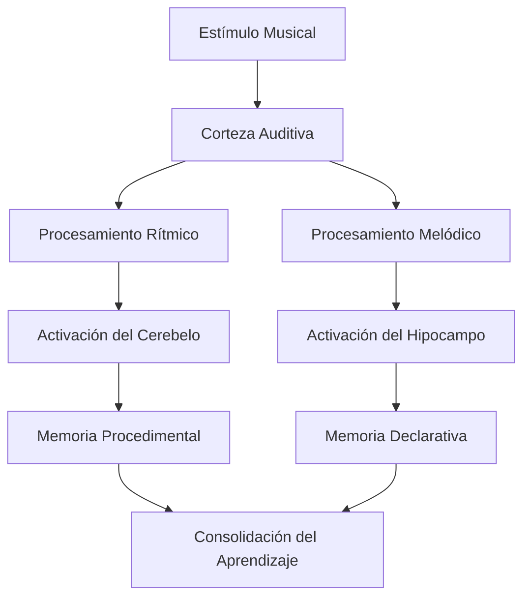
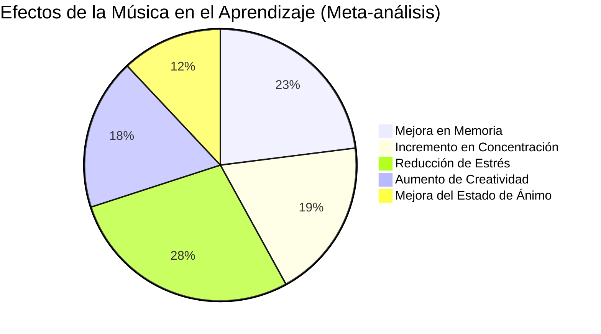

# 🎵 Aprendizaje con Música

> [!tip] 💡 Concepto Clave El aprendizaje con música aprovecha las propiedades neurológicas únicas del procesamiento musical para potenciar la memoria, concentración, creatividad y adquisición de conocimientos a través de ritmos, melodías y estructuras sonoras.

## 🧠 Fundamentos Neurocientíficos

> [!info] 🔬 Base Científica La música activa **múltiples redes neuronales** simultáneamente: áreas auditivas, motoras, emocionales y de memoria. El **efecto Mozart** y estudios posteriores demuestran que ciertos tipos de música pueden mejorar el rendimiento cognitivo hasta un **15-20%**.

### Áreas Cerebrales Activadas
>[!success] Algunas son:
>- **Corteza Auditiva**: Procesamiento de sonidos y patrones
>- **Hipocampo**: Formación y consolidación de memorias
>- **Corteza Prefrontal**: Funciones ejecutivas y atención
>- **Cerebelo**: Coordinación y aprendizaje de secuencias
>- **Sistema Límbico**: Emociones y motivación



## 🎼 Tipos de Música para Diferentes Tipos de Aprendizaje

### 🎹 Música Clásica y Barroca

> [!tip] 🎻 Características Ideales
> 
> **Período Barroco (Bach, Vivaldi, Handel)**
> 
> - **Tempo**: 60-70 BPM (sincronizado con ritmo cardíaco en reposo)
> - **Estructura**: Patrones matemáticos y simétricos
> - **Efecto**: Mejora concentración y procesamiento lógico
> - **Ideal para**: Matemáticas, ciencias, análisis
> 
> **Clásico Temprano (Mozart, Haydn)**
> 
> - **Características**: Claridad estructural, desarrollo temático
> - **Efecto**: Potencia memoria espacial y razonamiento
> - **Ideal para**: Resolución de problemas, creatividad

### 🌊 Música Ambiental y New Age

> [!info] 🎧 Sonidos Envolventes
> 
> **Brian Eno, Max Richter, Ólafur Arnalds**
> 
> - **Tempo**: Variable, generalmente lento
> - **Características**: Texturas, atmósferas, minimalismo
> - **Efecto**: Reduce estrés, facilita concentración profunda
> - **Ideal para**: Lectura, escritura, meditación activa

### 🎮 Música de Videojuegos

> [!tip] 🕹️ Diseño para Concentración
> 
> **Soundtracks Instrumentales**
> 
> - **Característica única**: Diseñada para **no distraer** durante tareas complejas
> - **Ejemplos**: Minecraft, Journey, Ori and the Blind Forest
> - **Efecto**: Mantiene engagement sin competir por atención
> - **Ideal para**: Programación, diseño, trabajo creativo prolongado

### 🎵 Frecuencias Binaurales

> [!warning] 🧠 Tecnología Avanzada
> 
> **40Hz - Concentración Gamma**
> 
> - Mejora procesamiento cognitivo
> - Ideal para resolución de problemas complejos
> 
> **8-13Hz - Ondas Alfa**
> 
> - Estado de relajación alerta
> - Perfecto para aprendizaje receptivo
> 
> **4-8Hz - Ondas Theta**
> 
> - Creatividad y insight
> - Excelente para brainstorming

## 📚 Técnicas Específicas de Aprendizaje Musical

### 🎤 Método de Canciones Mnemotécnicas

> [!tip] 🎶 Creación de Melodías de Estudio
> 
> **Pasos para Crear Canciones de Estudio:**
> 
> 1. **Identificar información clave** a memorizar
> 2. **Elegir melodía familiar** (cumpleaños, villancicos, etc.)
> 3. **Adaptar letra** manteniendo el ritmo original
> 4. **Repetir cantando** hasta automatización
> 5. **Practicar sin música** para verificar retención
> 
> **Ejemplo - Tabla Periódica:**
> 
> ```
> (Melodía: "Twinkle Twinkle Little Star")
> Hidrógeno y Helio son,
> Litio, Berilio, Boro están,
> Carbono, Nitrógeno, Oxígeno,
> Flúor y Neón completan bien...
> ```

### 🥁 Ritmo y Repetición

> [!info] 🎵 Patrones Rítmicos
> 
> **Técnica del Rap Educativo**
> 
> - Transformar conceptos en versos rítmicos
> - Usar rimas para conectar ideas relacionadas
> - Aprovechar la estructura verso-coro para jerarquizar información
> 
> **Clapping Patterns (Palmadas)**
> 
> - Asociar palmadas con sílabas o conceptos
> - Crear secuencias rítmicas para fórmulas o procesos
> - Usar en grupo para reforzar aprendizaje social

### 🎸 Intervalos Musicales de Estudio

> [!tip] ⏰ Técnica Pomodoro Musical
> 
> **Estructura de Sesión (90 minutos)**
> 
> ```
> 1. Preparación (5 min) - Música relajante
> 2. Estudio intenso (25 min) - Clásica/Instrumental
> 3. Descanso activo (5 min) - Música energizante
> 4. Estudio intenso (25 min) - Continuación
> 5. Descanso largo (15 min) - Música de relajación
> 6. Repaso (15 min) - Música suave
> ```

## 🎯 Aplicaciones por Materia

### 🔢 Matemáticas y Ciencias

> [!info] 🧮 Música Lógica-Matemática
> 
> **Bach - El Clave Bien Temperado**
> 
> - Estructuras fractales y patrones geométricos
> - Sincronía con procesos de razonamiento lógico
> 
> **Música Electrónica Minimalista**
> 
> - Steve Reich, Philip Glass
> - Patrones repetitivos que refuerzan secuencias matemáticas
> 
> **Recomendación específica**:
> 
> - Goldberg Variations (Bach) para álgebra
> - Music for 18 Musicians (Reich) para geometría
> - In a Landscape (John Cage) para cálculo

### 📖 Idiomas y Literatura

> [!tip] 🗣️ Inmersión Musical Lingüística
> 
> **Música en el Idioma Objetivo**
> 
> - Canciones folclóricas tradicionales
> - Pop/Rock con letras claras
> - Rap para ritmo y pronunciación
> 
> **Técnicas Específicas:**
> 
> - **Shadowing musical**: Cantar siguiendo la letra
> - **Fill-in-the-blanks**: Completar letras mientras escuchas
> - **Análisis lírico**: Estudiar gramática a través de canciones
> 
> **Playlists por Idioma:**
> 
> - Inglés: Beatles, Bob Dylan, Taylor Swift
> - Francés: Édith Piaf, Stromae, Christine and the Queens
> - Español: Jesse & Joy, Manu Chao, Rosalía

### 🎨 Creatividad y Arte

> [!info] 🎭 Música para Inspiración
> 
> **Jazz Improvisacional**
> 
> - Miles Davis, John Coltrane
> - Estimula pensamiento divergente
> - Perfecto para brainstorming
> 
> **Soundscapes Atmosféricos**
> 
> - Hiroshi Yoshimura, Midori Takada
> - Facilita flujo creativo
> - Ideal para diseño y escritura creativa

## 🎧 Herramientas y Plataformas

### 📱 Apps Especializadas

> [!tip] 🎵 Aplicaciones Recomendadas
> 
> **Brain.fm**
> 
> - Música científicamente diseñada para productividad
> - Algoritmos basados en neurociencia
> - Sesiones específicas por objetivo
> 
> **Focus@Will**
> 
> - Música personalizada según personalidad
> - Tracking de productividad
> - Diferentes canales por tipo de trabajo
> 
> **Noisli**
> 
> - Combinación de música y ruidos ambientales
> - Creación de mezclas personalizadas
> - Timer integrado para técnicas de estudio

### 🎼 Plataformas de Streaming Educativo

> [!info] 🎶 Recursos Musicales
> 
> **Spotify Playlists Educativas**
> 
> - "Deep Focus" - Concentración intensa
> - "Peaceful Piano" - Relajación activa
> - "Lofi Hip Hop" - Estudio casual
> 
> **YouTube Channels**
> 
> - "Study Music Project" - Música de estudio específica
> - "ChilledCow/Lofi Girl" - Streams continuos
> - "Peaceful Relaxation" - Música ambiental

## 🔬 Investigación y Evidencia Científica

### 📊 Estudios Relevantes



> [!info] 📈 Hallazgos Clave
> 
> **Universidad de California (2019)**
> 
> - Música barroca mejora retención un **18%** en estudiantes universitarios
> 
> **Stanford Medicine (2020)**
> 
> - Frecuencias binaurales aumentan ondas gamma **34%** durante estudio
> 
> **Journal of Music Therapy (2021)**
> 
> - Aprendizaje de idiomas con música es **25%** más efectivo
> 
> **MIT (2022)**
> 
> - Ritmos de 60-70 BPM sincronizan ondas cerebrales para aprendizaje óptimo

### ⚠️ Limitaciones y Consideraciones

> [!warning] 🚨 Factores Importantes
> 
> **No Universal**
> 
> - Efectividad varía según **preferencias personales**
> - Algunos individuos rinden mejor en **silencio absoluto**
> - Música con letra puede **interferir** con lectura
> 
> **Tipo de Tarea**
> 
> - Tareas **creativas**: Benefician de música ambiental
> - Tareas **analíticas**: Requieren música estructurada o silencio
> - **Memorización**: Funciona mejor con melodías simples

## 🎼 Creación de Ambiente Sonoro Personalizado

### 🏠 Setup de Estudio Musical

> [!tip] 🔊 Configuración Técnica
> 
> **Equipamiento Básico**
> 
> - **Auriculares de calidad**: Sony WH-1000XM4, Bose QuietComfort
> - **Altavoces de monitor**: Para estudio en casa
> - **Interfaz de audio**: Si grabas tus propias melodías mnemotécnicas
> 
> **Software de Mezcla**
> 
> - **Audacity** (gratuito) - Crear mezclas personalizadas
> - **GarageBand** (Mac) - Composición simple
> - **Ableton Live** (avanzado) - Producción profesional

### 🎚️ Personalización de Playlists

> [!info] 📝 Metodología de Creación
> 
> **Análisis Personal**
> 
> 1. **Identificar preferencias** musicales naturales
> 2. **Testear diferentes géneros** durante estudio
> 3. **Medir productividad** con cada tipo de música
> 4. **Crear rotación** para evitar habituación
> 
> **Estructura de Playlist Ideal (2 horas)**
> 
> ```
> Fase 1: Activación (15 min) - Música energizante moderada
> Fase 2: Concentración (45 min) - Instrumental constante
> Fase 3: Mantenimiento (30 min) - Continuación suave
> Fase 4: Recuperación (15 min) - Relajación activa
> Fase 5: Cierre (15 min) - Música inspiracional
> ```

## 🧘 Integración con Otras Técnicas

### 🎯 Música + Mindfulness

> [!tip] 🧠 Meditación Musical Activa
> 
> **Técnica de Escucha Consciente**
> 
> 1. Elegir pieza instrumental de **8-12 minutos**
> 2. **Enfocar atención** en un instrumento específico
> 3. **Seguir melodías** sin juzgar pensamientos
> 4. **Transicionar** suavemente a material de estudio
> 
> **Beneficios:**
> 
> - Mejora capacidad de atención sostenida
> - Reduce ansiedad pre-estudio
> - Facilita entrada en estado de flujo

### 🎵 Música + Técnica Pomodoro

> [!info] ⏰ Sincronización Temporal
> 
> **Pomodoros Musicales**
> 
> - **25 minutos** = 7-8 canciones instrumentales
> - **5 minutos descanso** = 1-2 canciones energizantes
> - **15 minutos descanso largo** = Playlist de relajación
> - **Señal audio** para transiciones automáticas

## 🎭 Música para Diferentes Estilos de Aprendizaje

### 👁️ Aprendices Visuales

> [!tip] 🎨 Música con Componente Visual
> 
> **Sinestesia Musical**
> 
> - Música que "evoca colores" (Scriabin, Liszt)
> - Visualizadores de música durante estudio
> - Asociar colores con tonalidades para memorización
> 
> **Recomendaciones:**
> 
> - Debussy - "Clair de Lune" (azul, plateado)
> - Vivaldi - "Las Cuatro Estaciones" (colores estacionales)
> - Ludovico Einaudi - Minimalismo visual

### 👂 Aprendices Auditivos

> [!info] 🎧 Procesamiento Sonoro Puro
> 
> **Música Diegética**
> 
> - Grabaciones en vivo con ambiente
> - Música con textura y profundidad espacial
> - Canciones que cuentan historias o narran procesos
> 
> **Técnicas Específicas:**
> 
> - **Repetición musical** de conceptos clave
> - **Variaciones melódicas** para diferentes temas
> - **Asociación tonal** con materias específicas

### 🤲 Aprendices Kinestésicos

> [!tip] 🕺 Música y Movimiento
> 
> **Ritmo Físico**
> 
> - Caminar al ritmo durante lectura
> - Tapping (golpeteo) con los dedos
> - Gesticulación rítmica durante memorización
> 
> **Música Recomendada:**
> 
> - World Music con percusión (África, América Latina)
> - Electronic downtempo con beats marcados
> - Jazz con walking bass lines

## 📈 Medición de Efectividad

### 📊 Métricas de Seguimiento

> [!info] 📈 KPIs de Aprendizaje Musical
> 
> **Cuantitativos**
> 
> - **Tiempo de concentración** sostenida
> - **Velocidad de lectura** con/sin música
> - **Tasa de retención** a 24h y 7 días
> - **Número de errores** en ejercicios
> 
> **Cualitativos**
> 
> - **Nivel de energía** durante estudio
> - **Satisfacción** con la sesión
> - **Facilidad de entrada** en estado de flujo
> - **Creatividad percibida** en resolución de problemas

### 🔄 Optimización Continua

> [!tip] ⚙️ Proceso de Mejora
> 
> **Experimentación Semanal**
> 
> 1. **Lunes-Martes**: Música clásica
> 2. **Miércoles-Jueves**: Ambiental/New Age
> 3. **Viernes**: Música de videojuegos
> 4. **Fin de semana**: Evaluación y ajustes
> 
> **Registro de Datos**
> 
> - App de tracking o simple spreadsheet
> - Correlación música-rendimiento
> - Identificación de patrones personales

## 🔗 Referencias

> [!quote] Enlaces a Otras Notas
> 
> - [[Técnicas de Concentración]] - Enfoque y atención musical
> - [[Neurociencia del Aprendizaje]] - Base científica del procesamiento musical
> - [[Método 1 - Pomodoro]] - Integración con intervalos musicales
> - [[Método 5 - Mapas Mentales]] - Visualización con acompañamiento musical
> - [[Mindfulness]] - Meditación y escucha consciente
> - [[Deep Work]] - Trabajo profundo con música de fondo
> - [[Gestión del Estrés]] - Música para relajación y ansiedad
> - [[Hábitos de Estudio]] - Rutinas con componente musical
> - [[Motivación Académica]] - Música como factor motivacional
> - Carpeta Apps Productividad - Herramientas musicales digitales

## 📚 Notas Recomendadas

Para complementar este tema, revisa:

- [[Aprendizaje Multisensorial]] - Integración de sentidos en el estudio
- [[Ritmos Circadianos]] - Música según horarios biológicos
- [[Método KonMari]] - Ambientación sonora del entorno
- [[Método 8 - Palacio de la Memoria]] - Música como elemento espacial
- [[Técnicas de Relajación]] - Música para reducir tensión
- [[Creatividad y Innovación]] - Música para pensamiento divergente
- [[Gestión de la Energía Personal]] - Música para diferentes niveles energéticos
- [[Biohacking Personal]] - Optimización cognitiva con sonido

---

#aprendizaje-musical #neurociencia #concentración #memoria #música-estudio #técnicas-aprendizaje #productividad-sonora #optimización-cognitiva #ritmo #melodía