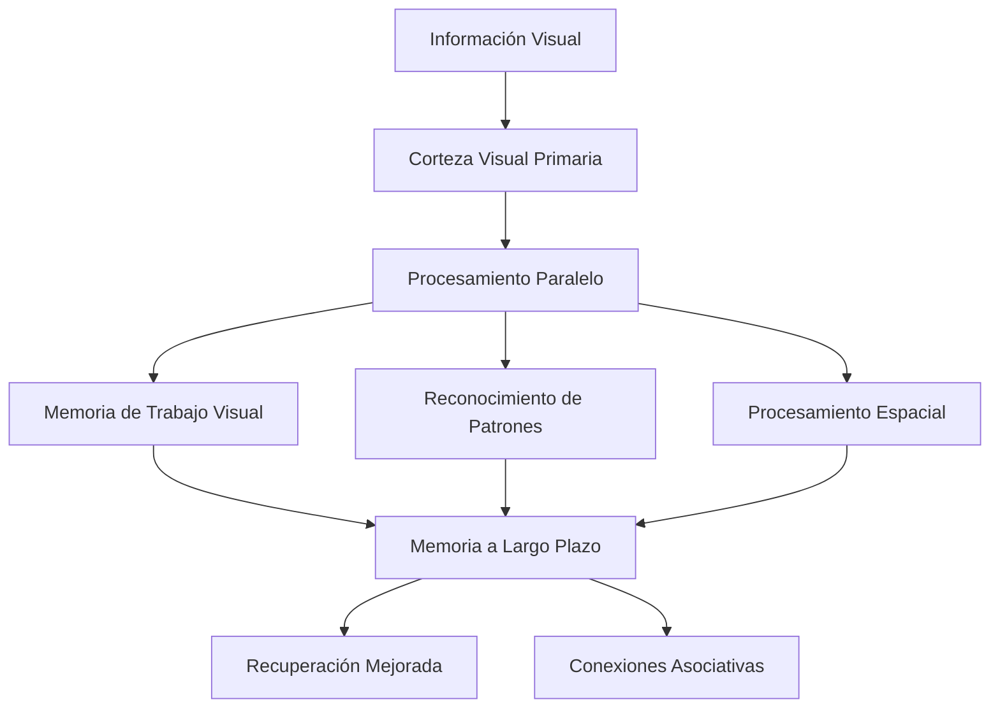

# 🎨 Técnicas de Visualización

> [!info] 👁️ Definición Las técnicas de visualización son estrategias de aprendizaje que utilizan elementos gráficos, diagramas, colores y representaciones espaciales para facilitar la comprensión, memorización y organización de la información. Se basan en el principio de que el cerebro procesa la información visual de manera más eficiente y memorable.

## 🧠 Fundamentos Neurológicos

> [!tip] 🔬 Base Científica **Procesamiento Visual del Cerebro**
> 
> - El 90% de la información que llega al cerebro es **visual**
> - Las imágenes se procesan 60,000 veces más rápido que el texto
> - La **corteza visual** ocupa aproximadamente el 30% del cerebro
> - La memoria visual tiene mayor **durabilidad** que la memoria auditiva

## 🛠️ Principales Técnicas de Visualización

### 🗺️ Mapas Mentales

> [!info] 🌳 Estructura Radial **Características Principales:**
> 
> - **Centro**: Tema principal con imagen o palabra clave
> - **Ramas**: Ideas secundarias que se extienden desde el centro
> - **Sub-ramas**: Detalles y ejemplos específicos
> - **Colores**: Diferenciación por categorías o importancia
> - **Símbolos**: Iconos que representen conceptos específicos

> [!tip] 💡 Mejores Prácticas para Mapas Mentales
> 
> - Usa **una palabra clave** por rama
> - Incorpora **imágenes y símbolos** abundantemente
> - Varía el **grosor de las líneas** según importancia
> - Utiliza **colores consistentes** para temas relacionados
> - Mantén el diseño **orgánico y fluido**

### 📊 Diagramas de Flujo

> [!warning] ⚡ Procesos Secuenciales **Elementos Básicos:**
> 
> - **Óvalos**: Inicio y fin del proceso
> - **Rectángulos**: Acciones o pasos del proceso
> - **Rombos**: Decisiones o puntos de bifurcación
> - **Flechas**: Dirección del flujo de información
> - **Círculos**: Conectores entre diferentes partes

### 🏗️ Diagramas Conceptuales

> [!info] 🔗 Relaciones Jerárquicas **Estructura Característica:**
> 
> - **Conceptos**: Representados en cajas o nodos
> - **Palabras de enlace**: Describen relaciones entre conceptos
> - **Proposiciones**: Unidades semánticas formadas por dos conceptos + enlace
> - **Jerarquía**: Conceptos más generales arriba, específicos abajo
> - **Enlaces cruzados**: Conexiones entre diferentes ramas

### 📈 Organizadores Gráficos

> [!tip] 📋 Estructuras Predefinidas **Tipos Principales:**
> 
> **Diagramas de Venn**
> 
> - Comparación de **similitudes y diferencias**
> - Intersecciones muestran características **comunes**
> - Ideal para análisis **comparativo**
> 
> **Líneas de Tiempo**
> 
> - Secuencia **cronológica** de eventos
> - Visualización de **causa y efecto** temporal
> - Útil para historia, biografías, procesos evolutivos
> 
> **Tablas Comparativas**
> 
> - **Análisis sistemático** de múltiples elementos
> - Criterios de comparación **claramente definidos**
> - Facilita la toma de **decisiones informadas**

## 🎯 Técnicas Avanzadas de Visualización

### 🧩 Mapas Conceptuales Digitales

> [!info] 💻 Herramientas Tecnológicas **Ventajas de las Versiones Digitales:**
> 
> - **Colaboración en tiempo real** con otros estudiantes
> - **Multimedia integrada** (videos, audios, enlaces)
> - **Plantillas prediseñadas** para diferentes materias
> - **Sincronización automática** entre dispositivos
> - **Análisis de patrones** y estadísticas de uso

### 🌈 Código de Colores Sistemático

> [!warning] 🎨 Psicología del Color en el Aprendizaje **Asociaciones Cromáticas Efectivas:**
> 
> - **Rojo**: Información crítica, advertencias, fechas límite
> - **Azul**: Conceptos principales, definiciones importantes
> - **Verde**: Ejemplos positivos, casos de éxito, procedimientos
> - **Amarillo**: Elementos a recordar, datos destacados
> - **Naranja**: Conexiones, relaciones entre conceptos
> - **Morado**: Análisis, reflexiones personales, evaluaciones

### 📐 Técnicas de Sketchnoting

> [!tip] ✏️ Notas Visuales Creativas **Elementos Fundamentales:**
> 
> - **Tipografía variada**: Tamaños y estilos para jerarquizar
> - **Iconografía simple**: Símbolos universalmente reconocibles
> - **Marcos y contenedores**: Delimitar secciones temáticas
> - **Flechas y conectores**: Mostrar flujo de información
> - **Espacios en blanco**: Evitar saturación visual

## 📱 Herramientas y Recursos

> [!info] 🛠️ Software Recomendado **Herramientas Digitales:**
> 
> **Para Mapas Mentales:**
> 
> - MindMeister, XMind, SimpleMind
> - Integración con [[Apps de Productividad]]
> 
> **Para Diagramas:**
> 
> - Lucidchart, Draw.io, Creately
> - Compatible con metodologías de [[Método KonMari]]
> 
> **Para Sketchnoting:**
> 
> - Procreate, Adobe Fresco, GoodNotes
> - Complementa [[Bullet Journal Method (BuJo)]]

## ⚡ Beneficios del Aprendizaje Visual

> [!tip] 🌟 Ventajas Comprobadas **Cognitivas:**
> 
> - **Mejora la retención** hasta un 400% comparado con texto puro
> - **Acelera la comprensión** de conceptos complejos
> - **Facilita la transferencia** de conocimiento entre contextos
> - **Desarrolla el pensamiento crítico** y analítico
> 
> **Metacognitivas:**
> 
> - **Autoconciencia** sobre el propio proceso de aprendizaje
> - **Identificación de lagunas** de conocimiento
> - **Mejora en la planificación** de estudios
> - Conexión efectiva con [[Metacognición]]

## 🎓 Aplicaciones por Disciplina

> [!warning] 📚 Adaptación Específica **Ciencias Exactas:**
> 
> - Diagramas de flujo para **algoritmos matemáticos**
> - Mapas conceptuales para **fórmulas y teoremas**
> - Visualizaciones 3D para **geometría** y **física**
> 
> **Humanidades:**
> 
> - Líneas de tiempo para **eventos históricos**
> - Mapas mentales para **análisis literario**
> - Diagramas de red para **relaciones sociales**
> 
> **Ciencias Sociales:**
> 
> - Organigramas para **estructuras institucionales**
> - Mapas geográficos **temáticos**
> - Diagramas causales para **fenómenos sociales**

## 🔄 Integración con Otros Métodos

> [!info] 🔗 Sinergias Metodológicas Las técnicas de visualización se potencian cuando se combinan con:
> 
> - [[Sistema Cornell de Notas]] - Sección visual en columna de pistas
> - [[Método 5 - Mapas Mentales]] - Desarrollo específico de mapas
> - [[Método 3 - Repetición Espaciada]] - Revisión visual programada
> - [[Método 8 - Palacio de la Memoria]] - Visualización espacial avanzada

## 🚫 Limitaciones y Precauciones

> [!warning] ⚠️ Consideraciones Importantes **Posibles Desventajas:**
> 
> - **Sobrecarga visual** si se abusa de elementos gráficos
> - **Tiempo adicional** requerido para crear visualizaciones
> - **Curva de aprendizaje** para dominar herramientas digitales
> - **Dependencia tecnológica** en versiones digitales
> 
> **Recomendaciones:**
> 
> - Mantener **simplicidad** y **claridad** visual
> - Equilibrar elementos **textuales y gráficos**
> - Practicar regularmente para desarrollar **automatismo**

## 🔗 Referencias

> [!quote] 📚 Notas Relacionadas
> 
> - Carpeta Métodos de Estudio - Marco general de estrategias de aprendizaje
> - [[Sistema Cornell de Notas]] - Integración de elementos visuales
> - [[Método 5 - Mapas Mentales]] - Profundización en mapas mentales
> - [[Neurociencia del Aprendizaje]] - Fundamentos científicos
> - [[Técnicas de Concentración]] - Optimización del enfoque visual

## 📖 Notas Recomendadas

> [!info] 🔍 Para Profundizar
> 
> - Carpeta Apps Productividad - Herramientas digitales para visualización
> - Carpeta Diseño de Espacios - Entorno físico para trabajo visual
> - [[Gestión del Tiempo]] - Planificación de sesiones de visualización
> - [[Hábitos de Estudio]] - Incorporación de técnicas visuales
> - [[Motivación Académica]] - Mantener el interés en métodos visuales
> - [[Deep Work]] - Concentración profunda para creación visual

---

#visualización #aprendizaje-visual #mapas-mentales #diagramas #sketchnoting #organizadores-gráficos #neurociencia #métodos-de-estudio #productividad-académica